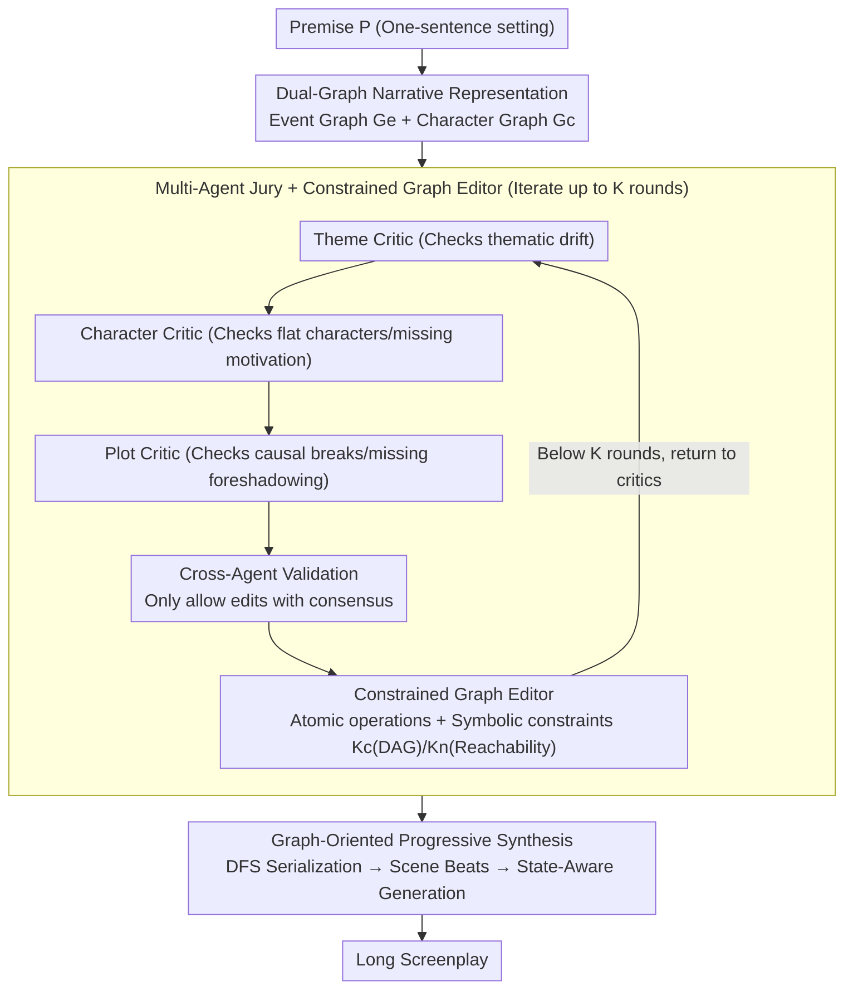

# Planning Beyond Text: Graph-based Reasoning for Complex Narrative Generation

**Conference**: ACL 2026 Findings  
**arXiv**: [2604.21253](https://arxiv.org/abs/21253)  
**Code**: None  
**Area**: LLM Efficiency  
**Keywords**: Narrative Generation, Graph-based Reasoning, Event Graph, Character Graph, Multi-agent Iterative Optimization

## TL;DR
This paper proposes the PLOTTER framework, which signifies the first shift of narrative planning from textual representations to graph structures (Event Graph + Character Graph). Through a multi-agent Evaluate-Plan-Revise iterative loop, narrative defects are diagnosed and repaired on graph topologies, significantly outperforming existing methods in dimensions such as narrativity, characterization, and dramatic tension.

## Background & Motivation

**Background**: While LLMs can generate fluent text, research in long-form narrative generation has followed two main paths: outline-based planning (e.g., hierarchical outline generation in Re3, DOC, DOME) and role-playing-based planning (e.g., multi-agent simulation in HoLLMwood, IBSEN).

**Limitations of Prior Work**: (1) Outline-based methods operate sequentially, causing early logical errors to cascade downstream, while rigid outlines limit the flexibility for complex revisions; (2) Role-playing methods perform well in stylistic diversity and dialogue richness, but coordination relies on unstructured natural language, which is prone to semantic drift and instruction misunderstanding in long contexts; (3) Neither approach maintains global narrative coherence, contextual logical consistency, or smooth character development—often resulting in monotonous scripts with structural breaks.

**Key Challenge**: Narrative planning directly on textual representations is inherently inefficient—lacking explicit modeling of plot dependencies, the system cannot effectively reason about the underlying causal network and character-event evolution, ultimately limiting the ability to generate rigorous narrative structures.

**Goal**: To transform screenplay generation from a sequential planning problem into a dynamic graph generation and refinement problem, achieving causal-level diagnosis and repair through iterative editing on graph topologies.

**Key Insight**: Drawing from classical narratological theories (Barthes' Action Logic Theory, Moretti's Character Network Theory), graph structures are used to explicitly represent the causal skeleton of the narrative and character social dynamics.

**Core Idea**: Narrative planning is performed on graph structures rather than text—addressing causal breaks and character inconsistencies through atomic editing operations on the Event Graph and Character Graph.

## Method

### Overall Architecture

PLOTTER aims to solve the inefficiency of "planning directly on text" in long screenplay generation, where textual outlines fail to capture causality and foreshadowing or model the evolution of character relationships, leading to layered logical failures. The approach moves planning to the graph: a pair of narrative graphs (Event Graph $G_e$ + Character Graph $G_c$) is first generated from a premise $P$. A multi-agent jury iteratively diagnoses defects on the graph topology, which are then repaired by a symbolic-constrained editor through atomic operations for up to $K$ rounds. Finally, the refined graph is deterministically serialized and expanded scene-by-scene into a screenplay. Throughout the pipeline, the "narrative causal skeleton" remains a readable, editable graph object rather than ambiguous natural language.

### Key Designs

**1. Dual-Graph Narrative Representation: Making Causality, Foreshadowing, and Character Evolution Editable Symbolic Objects**

The fundamental flaw of textual outlines is the inability to explicitly capture foreshadowing/suspense between non-adjacent events or characterize how relationships evolve. PLOTTER promotes these long-range dependencies to first-class citizens using two graphs: in the Event Graph $G_e = (V_e, E_e)$, each node is a plot event with descriptions, narrative stages (Exposition-Rising Action-Climax-Resolution, etc.), and time indices, while directed edges carry narrative labels $\rho(e) \in \{\text{Causal}, \text{Foreshadowing}, \text{Suspense}\}$. The Character Graph $G_c = (V_c, E_c)$ encodes multi-dimensional attributes (core personality, internal conflict, external goals, hidden secrets) in nodes, while edges represent evolving relationships (conflict/cooperation/emotion/secrecy). Once "Event A foreshadows Event B" becomes a labeled edge, diagnosis and repair can operate directly on that edge without guessing its location within a long text.

**2. Multi-Agent Jury + Constrained Graph Editor: Anchoring Unreliable LLM Critiques with Deterministic Symbolic Constraints**

Having a graph is insufficient; the key is reliably checking and correcting it. PLOTTER runs three professional critic agents through an Evaluate-Plan-Revise loop: Theme Critic (checks drift) $\rightarrow$ Character Critic (checks motivation/flatness) $\rightarrow$ Plot Critic (checks logic/causality). Each outputs a structured issue list $\mathcal{I}_i$, and cross-agent validation ensures only consensus-supported edits are permitted. Diagnosed issues are mapped to atomic operations (e.g., Add-Plot-Bridge, Revise-Event) by the Constrained Graph Editor. Each operation must pass two symbolic constraints: Causal Rationality $\mathcal{K}_C$ requires the causal subgraph to remain a Directed Acyclic Graph (DAG) (preventing temporal loops), and Narrative Completeness $\mathcal{K}_N$ requires all nodes to be reachable from the start and lead to the end. These checks are purely symbolic and deterministic, ensuring that structure-breaking edits are never executed.

**3. Graph-Oriented Progressive Synthesis: Deterministically Grounding Symbolic Graphs into Coherent Narrative**

The final step transforms the optimized graph into a screenplay. PLOTTER uses deterministic Depth-First Search (DFS) to serialize the Event Graph into a hierarchical event plan $\mathcal{T}_h$ (prioritizing suspense successors and preserving foreshadowing cues), while expanding Character Graph nodes into detailed profiles. Subsequently, it generates all scene beats at once, which are then expanded by a state-aware generator scene-by-scene. Each scene is conditioned on relationship types (suspense/conflict, etc.), character profiles, and a rolling narrative state $M_i$. Deterministic serialization prevents causality from being scrambled, while $M_i$ ensures consistent referencing across the long-form output.

### A Complete Example: Fixing a "Motivation Break"

Suppose in round 2, the Plot Critic identifies that a "Character X suddenly betrays an ally" node lacks causal precursors in the Event Graph—it has no Causal in-edges, a typical causal break. Simultaneously, the Character Critic reports that X's motivation field is empty. After cross-agent validation, the editor proposes "Add-Plot-Bridge" operations (the "Trinity of Action": Why-Who-How bridge): a new node "X accidentally discovers a secret hidden by the ally" is added with Causal edges leading to the betrayal, while X's "Internal Conflict" attribute in the Character Graph is updated. Before submission, $\mathcal{K}_C$ verifies no temporal loops and $\mathcal{K}_N$ verifies connectivity. During synthesis, the serialization places the discovery before the betrayal, and the state memory $M_i$ carries the "secret knowledge" into subsequent scenes, resulting in a motivated betrayal rather than an abrupt turn.

### Loss & Training

Training-free—PLOTTER is a pure inference-time framework utilizing existing LLMs (GPT-4.1, DeepSeek-R1, Qwen3) as backbones. Evaluation is conducted via GPT-4.1 pairwise comparisons and human assessment.

## Key Experimental Results

### Main Results (GPT-4.1 Backbone, Pairwise Win Rate)

| Dimension | vs LLM-Plan-Write | vs Dramatron | vs DOC |
|------|-------------------|-------------|--------|
| Narrative (Script) | 72% | 74% | 92% |
| Thematic (Script) | 100% | 90% | 86% |
| Characterization (Script) | 100% | 76% | 92% |
| Dramatic Engagement (Script) | 96% | 72% | 92% |
| Premise Fidelity (Script) | 40% | 14% | 44% |

### Ablation Study

| Configuration | Effect Description |
|------|---------|
| w/o Character module | Largest drop in character and dramatic dimensions |
| w/o Plot module | Largest drop in narrative dimension |
| w/o Theme module | Noticeable drop in thematic dimension but minor overall impact |
| Single vs. Full | Full win rate >80%, exceeding sum of modules—"1+1>2" synergy (+29% storyline, +34% script) |
| K=3 Iterations (Default) | Distinct-2=0.793, Self-BLEU=0.017, optimal balance point |
| K=5 Iterations | Quality decreases (Distinct-2=0.640), edit success rate drops to 0.83 |

### Key Findings
- PLOTTER crushes all baselines across narrative, thematic, character, and dramatic dimensions (win rates 72-100%)—the only minor weakness is Premise Fidelity.
- Strong synergy exists between the three critic agents—improvements from individual agents are limited, but collective synergy results in a 29-34% jump in win rates.
- Default K=3 iteration is optimal—excessive iteration (K=5) leads to quality degradation and lower edit success.
- Human evaluation aligns highly with LLM evaluation (Cohen’s $\kappa = 0.834$).
- Cost is approximately 1.68 USD per script (K=3) or 0.36 USD in budget mode (K=1), making computational overhead manageable.

## Highlights & Insights
- **The paradigm shift from text to graph for narrative planning** is the core contribution—graph structures allow causal reasoning, foreshadowing, and character dynamics to become editable symbolic objects rather than vague textual hints.
- **Deterministic verification of DAG and connectivity constraints** is elegant—symbolic checks independent of the LLM ensure structural validity, preventing the propagation of unreliable LLM critiques.
- The **"Trinity of Action" repair strategy** (Why-Who-How bridge) case study is compelling—demonstrating that complex narrative breaks require multi-layered causal chain repairs rather than simple surface-level polishing.

## Limitations & Future Work
- **Premise Fidelity** is a weakness—iterative graph refinement may cause the plot to drift from the original premise.
- Highly dependent on the backbone LLM's capabilities—the advantage over Dramatron is smaller on DeepSeek-R1 than on GPT-4.1.
- Evaluation dataset is limited to 50 premises across 9 genres.
- Comparisons with more recent baselines (e.g., StoryWriter) under identical conditions are missing.
- High computational cost (523k tokens/script); large-scale application requires optimization.

## Related Work & Insights
- **vs DOC (Yang et al., 2023)**: DOC uses static hierarchical textual outlines as constraints, while PLOTTER uses dynamic editable graph structures—the flexibility of graphs allows non-linear revisions.
- **vs Dramatron (Mirowski et al., 2023)**: Dramatron relies on role-playing and free-form coordination, lacking a shared symbolic state; PLOTTER’s graph provides a shared, verifiable state.
- **vs R2 (Lin et al., 2025)**: R2 extracts static graphs from source text for generation reference, whereas PLOTTER performs dynamic planning and iterative editing on the graph—the former is passive reference, the latter is active reasoning.

## Rating
- Novelty: ⭐⭐⭐⭐⭐ Graph-based narrative planning + Symbolic constrained editing + Multi-agent synergy is a brand-new paradigm.
- Experimental Thoroughness: ⭐⭐⭐⭐ 3 LLM backbones, 3 baselines, pairwise + human + objective metrics, though data scale is small.
- Writing Quality: ⭐⭐⭐⭐⭐ Vivid case studies, clear method description, and solid theoretical motivation.
- Value: ⭐⭐⭐⭐ Fundamental advancement in long-form narrative methodology; graph-based planning is transferable to other long-range planning tasks.

<!-- RELATED:START -->

## Related Papers

- [\[ACL 2025\] Multi-document Summarization through Multi-document Event Relation Graph Reasoning in LLMs](../../ACL2025/nlp_generation/event_graph_bias_mitigation_summarization.md)
- [\[ICCV 2025\] Beyond Isolated Words: Diffusion Brush for Handwritten Text-Line Generation](../../ICCV2025/nlp_generation/beyond_isolated_words_diffusion_brush_for_handwritten_text-line_generation.md)
- [\[ACL 2026\] Adaptive Planning for Multi-Attribute Controllable Summarization with Monte Carlo Tree Search](adaptive_planning_for_multi-attribute_controllable_summarization_with_monte_carl.md)
- [\[ACL 2026\] FACTS: Table Summarization via Offline Template Generation with Agentic Workflows](facts_table_summarization_via_offline_template_generation_with_agentic_workflows.md)
- [\[ACL 2026\] Losses that Cook: Topological Optimal Transport for Structured Recipe Generation](losses_that_cook_topological_optimal_transport_for_structured_recipe_generation.md)

<!-- RELATED:END -->
