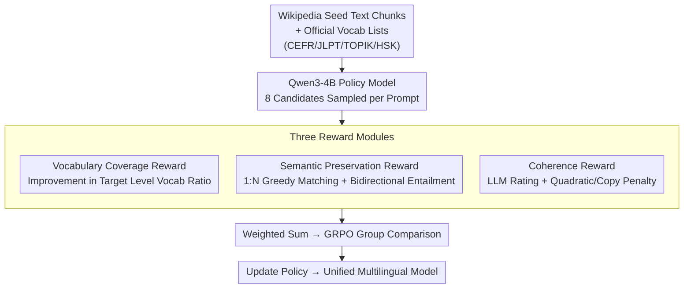

# Right at My Level: A Unified Multilingual Framework for Proficiency-Aware Text Simplification

**Conference**: ACL 2026  
**arXiv**: [2604.05302](https://arxiv.org/abs/2604.05302)  
**Code**: None  
**Area**: Reinforcement Learning  
**Keywords**: Text Simplification, Vocabulary Level Control, Multilingual Reinforcement Learning, GRPO, Language Learning

## TL;DR

The Re-RIGHT framework is proposed to achieve precise text simplification according to learner proficiency levels (CEFR/JLPT/TOPIK/HSK) across English, Japanese, Korean, and Chinese. By employing GRPO training with a three-module reward system (vocabulary coverage, semantic preservation, and coherence), a 4B policy model outperforms large-scale models such as GPT-5.2 and Gemini 2.5.

## Background & Motivation

**Background**: Second Language Acquisition (SLA) theory (Input Hypothesis) suggests that learners benefit most from "comprehensible input" at a level slightly above their current proficiency ($i+1$). Research indicates that learners need to recognize 95-98% of the vocabulary in a text to read fluently. Text simplification aims to control lexical complexity to match the target reader's vocabulary knowledge.

**Limitations of Prior Work**: (1) Even state-of-the-art LLMs (GPT-5.2, Gemini 2.5) fail to reliably generate text matching specific proficiency levels, particularly for simpler levels (e.g., CEFR A1 achieves only 45.1% vocabulary coverage) and non-English languages; (2) Existing RL methods require pre-annotated level-labeled sentence corpora and are largely restricted to English; (3) Constructing personalized parallel corpora is prohibitively expensive.

**Key Challenge**: LLMs lack precise control over specific vocabulary levels—they can write "simple" text but cannot guarantee a specific vocabulary coverage rate. This issue intensifies as the level decreases and the language becomes less mainstream (English A1 average 42.6% vs. Korean TOPIK1 only 29.8%).

**Goal**: Train a unified multilingual policy model to precisely control vocabulary simplification across four languages under their respective proficiency systems without using level-annotated parallel corpora.

**Key Insight**: Utilize official vocabulary level data for each language (CEFR/JLPT/TOPIK/HSK, totaling 43K entries) as evaluation signals rather than training labels, enabling the model to autonomously learn simplification strategies through GRPO.

**Core Idea**: Train a 4B policy model using GRPO. Three reward modules control vocabulary level coverage, semantic preservation, and text coherence, achieving precise cross-lingual and cross-level simplification without parallel corpora.

## Method

### Overall Architecture

Re-RIGHT addresses the problem where "LLMs can write 'simple' text but cannot control specific vocabulary levels" without relying on expensive level-annotated parallel corpora. The strategy treats official vocabulary level tables as **evaluation signals** rather than training labels. In the preparation phase, select Wikipedia articles are collected as training seeds (8,057 articles, 69,220 text blocks) alongside official vocabulary lists for four languages. During training, GRPO optimizes a Qwen3-4B policy model. For each prompt, 8 candidate responses are sampled and scored by three weighted reward modules (Vocabulary Coverage, Semantic Preservation, Coherence). Strategy updates occur after intra-group comparisons. A single unified model covers all four languages and their respective proficiency levels.

### Key Designs

**1. Vocabulary Coverage Reward: Using Delta over Absolute Value to Force Level Reduction**

The core requirement of simplification is that the "target reader recognizes the words." This reward directly measures the proportion of content words in the generated text that fall at or below the target level. Specifically, candidate text undergoes lemmatization, removal of function words/stop words/proper nouns, and then the ratio of content words with level $\ell(w_i) \leq \ell_t$ is calculated: $\text{score}_{vocab} = |\{w_i \in M(C) \mid \ell(w_i) \leq \ell_t\}| / |M(C)|$. Chinese additionally supports character-level decomposition. Crucially, the reward is the **improvement** over the original text: $r_{vocab} = \text{score}_{rollout} - \text{score}_{original}$. This forces the model to focus on "how much I reduced from the original" in GRPO group comparisons, making it easier to learn simplification strategies and avoiding inflated scores from naturally simple segments.

**2. Semantic Preservation Reward: 1:N Greedy Matching + Bidirectional Entailment**

Simplification often involves splitting one complex sentence into several simple ones, causing traditional sentence-by-sentence comparisons to fail. Re-RIGHT bypasses this with a two-stage approach: first, BERTScore is used to perform greedy matching between reference and candidate sentences, allowing 1:N alignment. Second, a multilingual NLI model checks bidirectional entailment for each pair—full points (1.0) if both directions entail, half points (0.5) if unidirectional, and zero otherwise. The final score is the average of all pairs. This ensures high scores even if the structure is reorganized, provided information is retained; conversely, if key information is deleted, bidirectional entailment fails and the reward drops.

**3. Coherence Reward: LLM Scoring + Quadratic Penalty + Copy Penalty**

RL training often suffers from "reward hacking," where models generate repetitive templates or copy the original text. A 14B evaluator model rates the candidate against the reference (0-100) for naturalness. After normalization, a quadratic transformation is applied to increase the penalty for low-quality outputs: $r_{coherence} = \max(1 - (\frac{1-\text{score}}{1-\alpha})^2, 0) - \beta J(S_t(A), S_t(B))$. The quadratic term amplifies penalties for low scores, while the Jaccard similarity penalty $J(\cdot)$ penalizes copying the original text, effectively blocking major reward-hacking pathways.

### Loss & Training

The GRPO algorithm is used, with the total reward defined as the weighted sum of the three modules. The policy model is Qwen3-4B with LoRA, sampling 8 candidates per prompt. The training set consists of curated Wikipedia blocks (max 512 tokens). A single model handles all languages and levels. Evaluation utilizes a different ensemble (averaging gemma-3-27b and Qwen3-32B scores) to avoid self-evaluation bias.

## Key Experimental Results

### Main Results

| Language | Method | Vocab Coverage (Total) | Vocab Coverage (Easy) | Semantic Preservation | Coherence |
| :--- | :--- | :--- | :--- | :--- | :--- |
| EN | Re-RIGHT | 81.6% | 66.9% | 80.8 | 82.9 |
| EN | GPT-5.2 | 71.0% | 52.4% | 76.1 | 84.6 |
| EN | Gemini 2.5 | 77.7% | 59.1% | 72.0 | 82.8 |
| JA | Re-RIGHT | 76.0% | 60.4% | 80.6 | 83.1 |
| JA | Gemini 2.5 | 65.8% | 51.1% | 61.7 | 85.2 |
| ZH | Re-RIGHT | 80.2% | 66.1% | 76.6 | 83.7 |
| ZH | Gemini 2.5 | 64.4% | 48.6% | 66.7 | 85.3 |

### Ablation Study

| Configuration | Key Metrics | Description |
| :--- | :--- | :--- |
| FUDGE (Controlled Decoding) | EN 74.2% | Limited gain due to rule-based discriminator constraints |
| Base Qwen3-4B | EN 72.6% | Baseline for pure prompting methods |
| Reference (Original) | EN 58.3% | Original unsimplified text |

### Key Findings

- The 4B model trained with Re-RIGHT significantly outperforms GPT-5.2 (EN: 81.6% vs. 71.0%) and Gemini 2.5 (ZH: 80.2% vs. 64.4%) in vocabulary coverage, proving that precise control can be acquired via RL.
- Improvements are most significant at simple levels: English Easy rose from 52.4% (GPT-5.2) to 66.9%, and Chinese from 48.6% (Gemini) to 66.1%.
- Re-RIGHT generally exceeds large models in semantic preservation, indicating that RL training enhances both control and overall simplification quality.
- Coherence is slightly lower than GPT-5.2 (a reasonable trade-off) but much better than simple constrained decoding methods.

## Highlights & Insights

- **Precise Simplification Without Parallel Corpora**: Traditional methods require large level-annotated parallel datasets. Re-RIGHT thrives on vocabulary lists and seed text, lowering the barrier for expansion to new languages with official vocabulary systems.
- **1:N Bidirectional Entailment Evaluation**: Elegantly handles sentence splitting—common in simplification—by pairing sentences before checking entailment, proving more robust than traditional sentence-level BERTScore.
- **4B Model > GPT-5.2**: This suggests that precise control is not merely a product of scale but requires targeted RL training. It provides further evidence that "small models + specialized training > large models + general capability" in specific tasks.

## Limitations & Future Work

- The coherence reward depends on a 14B evaluator, making training cost and stability dependent on evaluator quality.
- Currently limited to four languages; expansion to low-resource languages may be hindered by the lack of official vocabulary level data.
- Training and inference are limited to 512 tokens; long-document simplification requires further study.
- Future exploration: Incorporate "reading ease" metrics for fine-grained syntactic simplification and conduct user studies with real L2 learners.

## Related Work & Insights

- **vs. Li et al. (2025b) PPO Method**: They trained English models using PPO but required CEFR-annotated sentence data. Re-RIGHT uses GRPO + vocabulary lists and supports multiple languages.
- **vs. FUDGE Controlled Decoding**: FUDGE checks vocabulary constraints step-by-step during decoding, but its gains are limited (74.2% vs. 81.6%) as decoding-level control cannot alter the model's internal vocabulary preferences.

## Rating

- Novelty: ⭐⭐⭐⭐ Innovative RL framework for multilingual level-precise simplification; clever three-module reward design.
- Experimental Thoroughness: ⭐⭐⭐⭐⭐ Comprehensive evaluation across four languages; convincing comparison with GPT-5.2 and Gemini 2.5.
- Writing Quality: ⭐⭐⭐⭐ Strong motivation, clear methodology, and solid linguistic background.
- Value: ⭐⭐⭐⭐ High practical value for L2 education; the 4B model is amenable to local deployment.

<!-- RELATED:START -->

## Related Papers

- [\[ACL 2025\] ATGen: A Framework for Active Text Generation](../../ACL2025/nlp_generation/atgen_a_framework_for_active_text_generation.md)
- [\[AAAI 2026\] C3TG: Conflict-aware, Composite, and Collaborative Controlled Text Generation](../../AAAI2026/nlp_generation/c3tg_conflict-aware_composite_and_collaborative_controlled_text_generation.md)
- [\[ACL 2026\] XtraGPT: Context-Aware and Controllable Academic Paper Revision via Human-AI Collaboration](xtragpt_context-aware_and_controllable_academic_paper_revision_via_human-ai_coll.md)
- [\[ACL 2025\] Towards Better Open-Ended Text Generation: A Multicriteria Evaluation Framework](../../ACL2025/nlp_generation/towards_better_open-ended_text_generation_a_multicriteria_evaluation_framework.md)
- [\[ACL 2025\] Document-Level Text Generation with Minimum Bayes Risk Decoding using Optimal Transport](../../ACL2025/nlp_generation/doc_level_mbr_optimal_transport.md)

<!-- RELATED:END -->
