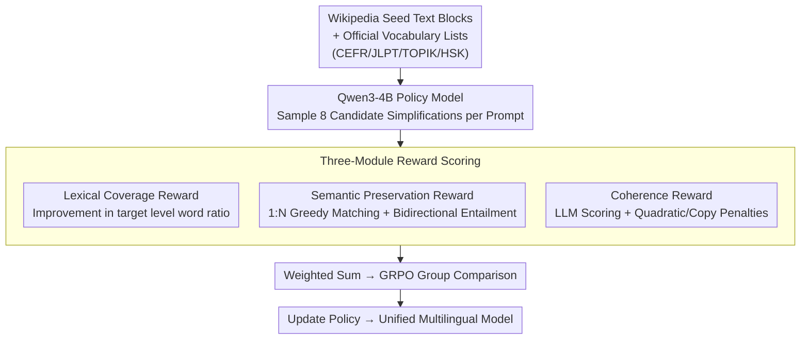

# Right at My Level: A Unified Multilingual Framework for Proficiency-Aware Text Simplification

**Conference**: ACL 2026
**arXiv**: [2604.05302](https://arxiv.org/abs/2604.05302)
**Code**: None
**Area**: Reinforcement Learning
**Keywords**: Text Simplification, Lexical Level Control, Multilingual Reinforcement Learning, GRPO, Language Learning

## TL;DR

The Re-RIGHT framework is proposed, utilizing a 4B policy model trained via GRPO with a three-module reward (lexical coverage + semantic preservation + coherence). It achieves precise text simplification across English, Japanese, Korean, and Chinese according to learner proficiency levels (CEFR/JLPT/TOPIK/HSK), outperforming large models like GPT-5.2 and Gemini 2.5.

## Background & Motivation

**Background**: Second Language Acquisition (SLA) theory (the Input Hypothesis) suggests learners progress best with "comprehensible input" between their current level ($i$) and a slightly higher level ($i+1$). Research indicates learners need to recognize 95-98% of vocabulary to read fluently. Text simplification aims to control lexical complexity to match the target reader's vocabulary knowledge.

**Limitations of Prior Work**: (1) Even state-of-the-art LLMs (GPT-5.2, Gemini 2.5) cannot reliably generate text matching specific proficiency levels, performing particularly poorly at lower levels (e.g., CEFR A1 lexical coverage is only 45.1%) and in non-English languages; (2) Existing RL methods require level-annotated parallel corpora and are mostly limited to English; (3) Constructing personalized parallel corpora is prohibitively expensive.

**Key Challenge**: LLMs lack precise control over specific lexical levels—they can write "simple" text but cannot guarantee vocabulary coverage for a specific level. This problem worsens as the target level decreases or the language becomes less mainstream (English A1 average 42.6% vs. Korean TOPIK1 only 29.8%).

**Goal**: To train a unified multilingual policy model that precisely controls lexical simplification across four languages under their respective proficiency systems without level-annotated parallel corpora.

**Key Insight**: Utilize official vocabulary level data for various languages (CEFR/JLPT/TOPIK/HSK, totaling 43K entries) as evaluation signals rather than training labels, enabling the model to learn simplification strategies autonomously via GRPO training.

**Core Idea**: Use GRPO to train a 4B policy model with three reward modules controlling lexical coverage, semantic preservation, and text coherence, achieving precise cross-lingual and cross-level simplification without parallel corpora.

## Method

### Overall Architecture

Re-RIGHT addresses the issue where "LLMs can write 'simple' text but cannot control specific lexical levels" without using expensive level-annotated parallel corpora for every language and level. The approach treats official vocabulary level lists as **evaluation signals** rather than training labels. In the preparation phase, select Wikipedia articles are collected as training seeds (8,057 articles, 69,220 text blocks) alongside official level lists for four languages (CEFR/JLPT/TOPIK/HSK, 43K entries). During training, a Qwen3-4B policy model is optimized using GRPO. For each prompt, 8 candidate responses are sampled and scored by three weighted reward modules (lexical coverage, semantic preservation, coherence), followed by group comparisons to update the policy. A single unified model covers four languages and all their respective proficiency levels.

### Key Designs

**1. Lexical Coverage Reward: Using Delta Over Absolute Values to Force Level Reduction**

The core requirement of simplification is that "target readers recognize the words." This reward directly measures the proportion of content words in the generated text that are at or below the target level. Specifically, candidate text undergoes lemmatization, removal of functional words/stop words/proper nouns, and then the ratio of content words with level $\leq$ target level $\ell_t$ is calculated: $\text{score}_{vocab} = |\{w_i \in M(C) \mid \ell(w_i) \leq \ell_t\}| / |M(C)|$. Chinese additionally supports character-level decomposition matching. Crucially, the reward is not this absolute value but the **improvement** relative to the original text: $r_{vocab} = \text{score}_{rollout} - \text{score}_{original}$. This forces the model in GRPO group comparisons to focus on "how much I reduced the level compared to the original," making it easier to learn effective strategies than directly rewarding absolute coverage and naturally avoiding inflated scores for already simple text.

**2. Semantic Preservation Reward: 1:N Greedy Matching + Bidirectional Entailment**

Simplification often splits complex sentences into several simple ones, causing traditional sentence-by-sentence comparisons to fail. Re-RIGHT bypasses this with a two-stage method: first, use BERTScore for greedy matching between reference and candidate sentences, allowing 1:N alignment (matching one original sentence to multiple simplified ones). Then, use a multilingual NLI model for bidirectional entailment testing on every pair—1.0 for bidirectional entailment, 0.5 for unidirectional, and 0 otherwise. The final score is the average of all pairs. This ensures high scores if information is retained despite structural changes, while penalizing simplifications that delete critical information.

**3. Coherence Reward: LLM Scoring + Quadratic Penalty + Copy Penalty**

RL training is susceptible to "reward hacking," where models generate repetitive templates or copy the source text to cheat for high scores. This reward uses a 14B evaluation model to score the naturalness of candidate text relative to the reference (0-100). After normalization, a quadratic transformation is applied to increase the penalty for low-quality outputs: $r_{coherence} = \max(1 - (\frac{1-\text{score}}{1-\alpha})^2, 0) - \beta J(S_t(A), S_t(B))$. The quadratic term amplifies penalties for low scores, while the Jaccard similarity penalty $J(\cdot)$ discourages verbatim copying of the source.

### Loss & Training

The GRPO algorithm is used, and the final reward is a weighted sum of the three modules. The policy model is Qwen3-4B + LoRA, with 8 candidates sampled per prompt. The training set consists of Wikipedia seed blocks (max 512 tokens). A single model handles all languages and levels. To avoid self-evaluation bias, evaluation uses models different from training (average of gemma-3-27b and Qwen3-32B).

## Key Experimental Results

### Main Results

| Language | Method | Lexical Coverage (Total) | Lexical Coverage (Easy) | Semantic Preservation | Coherence |
| :--- | :--- | :--- | :--- | :--- | :--- |
| EN | Re-RIGHT | 81.6% | 66.9% | 80.8 | 82.9 |
| EN | GPT-5.2 | 71.0% | 52.4% | 76.1 | 84.6 |
| EN | Gemini 2.5 | 77.7% | 59.1% | 72.0 | 82.8 |
| JA | Re-RIGHT | 76.0% | 60.4% | 80.6 | 83.1 |
| JA | Gemini 2.5 | 65.8% | 51.1% | 61.7 | 85.2 |
| ZH | Re-RIGHT | 80.2% | 66.1% | 76.6 | 83.7 |
| ZH | Gemini 2.5 | 64.4% | 48.6% | 66.7 | 85.3 |

### Ablation Study

| Configuration | Key Metric | Description |
| :--- | :--- | :--- |
| FUDGE (Controlled Decoding) | EN 74.2% | Limited by rule-based discriminator, modest gains |
| Base Qwen3-4B | EN 72.6% | Baseline for pure prompting |
| Reference (Source) | EN 58.3% | Original unsimplified text |

### Key Findings

- After Re-RIGHT training, the 4B model significantly outperforms GPT-5.2 (EN: 81.6% vs. 71.0%) and Gemini 2.5 (ZH: 80.2% vs. 64.4%) in lexical coverage, proving precise control can be acquired through RL.
- Improvements are most significant at simple levels: English Easy improved from 52.4% (GPT-5.2) to 66.9%, and Chinese from 48.6% (Gemini) to 66.1%.
- Re-RIGHT generally outperforms large models in semantic preservation, indicating RL training enhances both control and simplification quality.
- Coherence is slightly lower than GPT-5.2 (a reasonable trade-off) but much better than simple constrained decoding methods.

## Highlights & Insights

- **Precise Level Simplification Without Parallel Corpora**: While traditional methods require large level-annotated parallel sentence pairs, Re-RIGHT only needs vocabulary lists and seed texts, greatly lowering the barrier to entry for new languages. This framework can easily extend to any language with an official lexical level system.
- **1:N Bidirectional Entailment for Semantic Evaluation**: Ingeniously handles sentence splitting caused by simplification—greedy matching followed by bidirectional entailment is more robust than traditional sentence-by-sentence BERTScore.
- **Insights on 4B Model > GPT-5.2**: Precise control is not merely a matter of model scale; it requires targeted RL training. This provides further evidence that "small model + precise training > large model + general capability."

## Limitations & Future Work

- Coherence rewards depend on a 14B evaluation model; training cost and stability are limited by the quality of the evaluator.
- Currently limited to four languages; expansion to low-resource languages may be hindered by the lack of official lexical level data.
- Training and inference are restricted to 512 tokens; long-document simplification requires further research.
- Exploration: Incorporate reading ease metrics for fine-grained syntactic simplification and conduct user studies with real L2 learners to verify educational impact.

## Related Work & Insights

- **vs. Li et al. (2025b) PPO Method**: They used PPO for English simplification but required CEFR-annotated sentence data; Re-RIGHT uses GRPO + vocabulary lists and supports multiple languages.
- **vs. FUDGE Controlled Decoding**: FUDGE checks lexical constraints step-by-step during decoding, but gains are limited (74.2% vs. 81.6%) because decoding-level control cannot alter the model's internal lexical preference.

## Rating

- Novelty: ⭐⭐⭐⭐ RL framework for multilingual level-precise simplification is novel; three-module reward design is clever.
- Experimental Thoroughness: ⭐⭐⭐⭐⭐ Comprehensive evaluation across four languages, convincing comparison with GPT-5.2/Gemini 2.5, and intuitive examples.
- Writing Quality: ⭐⭐⭐⭐ Well-motivated, clear methodology, and solid linguistic background.
- Value: ⭐⭐⭐⭐ High practical value—directly serves L2 education; 4B model allows local deployment.

<!-- RELATED:START -->

## Related Papers

- [\[ACL 2025\] ATGen: A Framework for Active Text Generation](../../ACL2025/nlp_generation/atgen_a_framework_for_active_text_generation.md)
- [\[AAAI 2026\] C3TG: Conflict-aware, Composite, and Collaborative Controlled Text Generation](../../AAAI2026/nlp_generation/c3tg_conflict-aware_composite_and_collaborative_controlled_text_generation.md)
- [\[ACL 2026\] XtraGPT: Context-Aware and Controllable Academic Paper Revision via Human-AI Collaboration](xtragpt_context-aware_and_controllable_academic_paper_revision_via_human-ai_coll.md)
- [\[ACL 2025\] Document-Level Text Generation with Minimum Bayes Risk Decoding using Optimal Transport](../../ACL2025/nlp_generation/doc_level_mbr_optimal_transport.md)
- [\[ACL 2025\] Towards Better Open-Ended Text Generation: A Multicriteria Evaluation Framework](../../ACL2025/nlp_generation/towards_better_open-ended_text_generation_a_multicriteria_evaluation_framework.md)

<!-- RELATED:END -->
