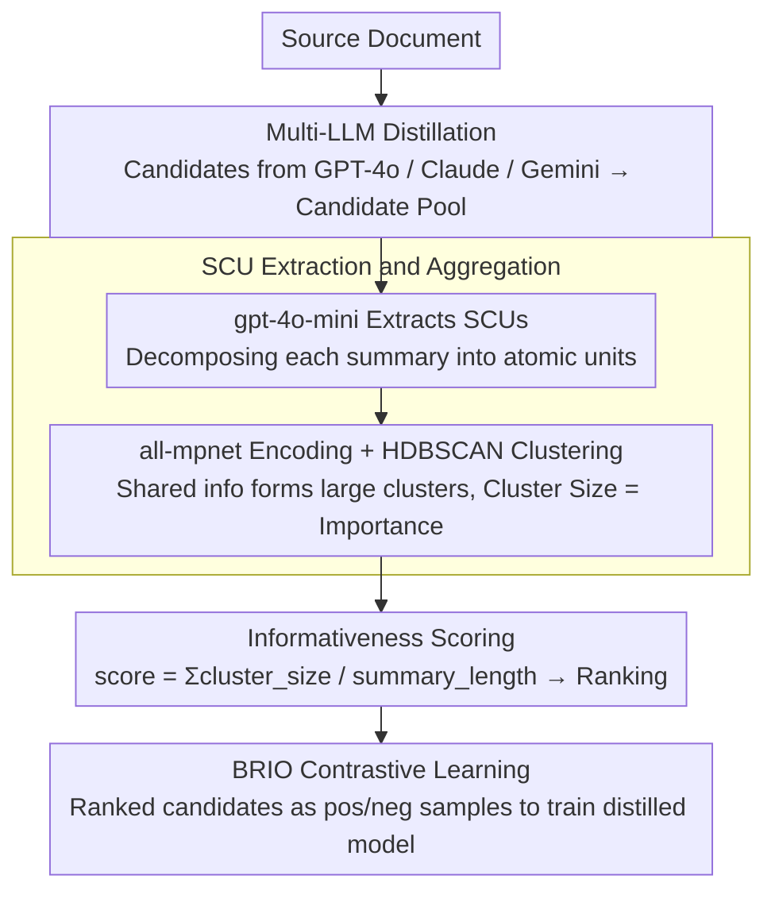

# SCURank: Ranking Multiple Candidate Summaries with Summary Content Units for Enhanced Summarization

**Conference**: ACL 2026 Findings  
**arXiv**: [2604.19185](https://arxiv.org/abs/2604.19185)  
**Code**: [https://github.com/IKMLab/SCURank](https://github.com/IKMLab/SCURank)  
**Area**: Text Summarization / Model Distillation  
**Keywords**: Summary Ranking, Summary Content Units, Contrastive Learning, Multi-LLM Distillation, Informativeness

## TL;DR

Ours proposes SCURank, a ranking framework based on Summary Content Units (SCUs). It ranks candidate summaries by extracting SCUs, estimating information importance through cross-summary clustering, and scoring based on informativeness. This replaces unstable direct LLM ranking and coarse-grained ROUGE ranking. In multi-LLM distillation scenarios, combined with BRIO contrastive learning, it significantly improves the summarization performance of distilled models.

## Background & Motivation

**Background**: LLMs perform excellently in summarization tasks but have high deployment costs. Distilling LLM summarization capabilities into smaller models like BART has become a trend. The BRIO framework uses contrastive learning to train small models to distinguish between good and poor summaries, where the ranking quality of candidate summaries is crucial.

**Limitations of Prior Work**: (1) Direct LLM ranking (e.g., GPTRank) is unstable—research shows LLMs are unreliable and inconsistent in text comparison and ranking; (2) Classical metrics like ROUGE only measure n-gram overlap, lacking discriminative power for high-quality summaries; (3) Distilling from a single LLM introduces model-specific biases, limiting the diversity of generation patterns.

**Key Challenge**: Differences between high-quality summaries lie in information selection and coverage rather than surface lexical overlap. A ranking method is needed that measures informativeness rather than surface matching.

**Goal**: (1) Design a summary ranking method based on information content rather than direct comparison or surface overlap; (2) Validate the effectiveness of distillation from multiple different LLMs.

**Key Insight**: Return to the core goal of summarization—information retention. Utilize SCUs (Summary Content Units) as atomic representations of information and estimate the importance of each SCU through cross-summary clustering.

**Core Idea**: The quality of a summary is determined by the richness and importance of the information content it contains—the more important SCUs appear in a summary, the better that summary is.

## Method

### Overall Architecture

SCURank aims to replace two unreliable candidate ranking methods in summary distillation—direct LLM ranking (unstable) and ROUGE ranking (focuses only on surface n-gram overlap)—with a measure of "informativeness." These candidate summaries themselves originate from multiple different LLMs (multi-LLM distillation) to increase variance in content selection. After obtaining a candidate summary pool for a document, the process follows three steps: first, use gpt-4o-mini to extract short, independent, and unique information units (SCUs) from each candidate; second, encode all SCUs into vectors and cluster them using HDBSCAN, allowing "information shared by multiple summaries" to naturally form large clusters; finally, rank the summaries by summing the importance of their constituent SCUs and dividing by length. The ranked candidates are then fed into BRIO contrastive learning to train the distilled model.

### Key Designs

**1. SCU Extraction and Aggregation: Restricting LLMs to structured extraction and using cluster size as an objective signal for importance**

This step addresses the "LLM direct ranking is unreliable" pain point by restricting the LLM's role to areas where it is reliable. First, an LLM is used to decompose each summary into individual SCUs (e.g., an atomic fact like "Obama won the Nobel Peace Prize in 2009"). This is a structured extraction task with high reliability. Next, all-mpnet-base-v2 encodes the SCUs into vectors for HDBSCAN clustering. HDBSCAN does not require a predefined number of clusters and adapts to the varying amounts of semantic information across different documents. The beauty of clustering is that the more candidate summaries independently mention the same piece of information, the larger the cluster it falls into—thus, cluster size becomes a proxy for "information importance" that does not depend on subjective LLM judgment.

**2. Informativeness Scoring: Providing interpretable and stable ranking criteria using length-normalized sums of cluster sizes**

With the importance of each SCU (i.e., the size of its cluster), the quality of a summary can be quantified by the amount of important information it contains. The score for a summary $s_i$ is defined as $\text{score}(s_i) = \sum_{u \in s_i} |C(u)| \,/\, |s_i|$, which sums the size $|C(u)|$ of the cluster $C(u)$ containing each SCU $u$ in the summary, then divides by the summary length $|s_i|$. This normalization step is critical—without it, longer summaries would be systematically preferred for containing more SCUs. Compared to the surface overlap of ROUGE and the instability of GPTRank, this score directly answers "How much consensus-validated important information does this summary cover?" making it both concrete and reproducible.

**3. Multi-LLM Distillation: Breaking content selection bias of single models with multi-source candidates**

Distilling from only one LLM causes the model to inherit specific content selection preferences and writing styles, limiting diversity. SCURank's solution is to have multiple LLMs (GPT-4o, Claude, Gemini, etc.) generate candidate summaries for the same document. Since different models have different biases in "which information to pick and how to phrase it," the mixed candidate pool naturally provides broader coverage. Once these multi-source candidates are ranked by SCURank and fed into BRIO, they provide richer, less biased training signals to the distilled model, which is reflected in the experimental results as more paraphrasing and less verbatim copying.

### Loss & Training

The BRIO framework is used for contrastive learning: high-ranking summaries serve as positive samples, while low-ranking ones serve as negative samples. BRIO simultaneously trains generation and evaluation capabilities. SCU extraction uses gpt-4o-mini, and encoding uses all-mpnet-base-v2.

## Key Experimental Results

### Main Results

**Summarization Performance Comparison of Distilled Models**

| Ranking Method | ROUGE-1 | ROUGE-2 | ROUGE-L | BERTScore |
| :--- | :--- | :--- | :--- | :--- |
| ROUGE Ranking | Baseline | Baseline | Baseline | Baseline |
| GPTRank | Slight > ROUGE | Slight > ROUGE | Unstable | Unstable |
| **SCURank** | **Optimal** | **Optimal** | **Optimal** | **Optimal** |

### Ablation Study

| Configuration | Effect | Description |
| :--- | :--- | :--- |
| Single LLM Distillation | Baseline | Distilled from only one LLM |
| Multi-LLM + ROUGE Rank | Gain | Diversity helps |
| Multi-LLM + SCURank | **Optimal** | Informativeness rank + diversity |
| HDBSCAN vs K-Means | HDBSCAN better | Advantage of adaptive cluster counts |

### Key Findings

- SCURank consistently outperforms ROUGE and GPTRank across all evaluation metrics and datasets.
- Multi-LLM distillation enhances the abstractive capability of the distilled model (less copying, more paraphrasing).
- LLMs are reliable for SCU extraction (structured output) but unreliable for direct ranking tasks.
- SCURank rankings are more consistent with human judgments of summary quality.
- Length normalization is crucial—without it, longer summaries are systematically favored.

## Highlights & Insights

- Shifting the ranking focus from "surface matching" back to "information retention" is the correct direction for summary evaluation.
- The distinction that LLMs are reliable for structured tasks (SCU extraction) but unreliable for judgment tasks (ranking) provides guidance for the proper use of LLMs in evaluation.
- The adaptive clustering of HDBSCAN is well-suited for the natural grouping of information units.

## Limitations & Future Work

- SCU extraction still relies on LLMs, involving some cost.
- Informativeness does not equal the entirety of summary quality—coherence and readability are not directly modeled.
- Validated only on news summarization datasets.
- Future work could explore combining SCURank with fluency/coherence metrics.

## Related Work & Insights

- **vs GPTRank**: Relies on direct LLM ranking, which is unstable; SCURank uses LLMs only for SCU extraction, while ranking is based on deterministic information statistics.
- **vs ROUGE**: Measures surface n-gram overlap, lacking discriminative power for high-quality summaries; SCURank measures semantic-level information coverage.
- **vs Nawrath et al. (2024)**: Proposed SGU for evaluation; SCURank extends this to ranking and distillation applications.

## Rating

- Novelty: ⭐⭐⭐⭐ SCU for ranking is a natural but effective extension.
- Experimental Thoroughness: ⭐⭐⭐⭐ Multiple datasets, comparison of multiple ranking methods, complete ablation.
- Writing Quality: ⭐⭐⭐⭐ Clear methodology, intuitive flowcharts.
- Value: ⭐⭐⭐⭐ Provides a more reliable ranking solution for summary distillation.

<!-- RELATED:START -->

## Related Papers

- [\[ACL 2025\] Principled Content Selection to Generate Diverse and Personalized Multi-Document Summaries](../../ACL2025/nlp_generation/dpp_diverse_multidoc_summary.md)
- [\[ACL 2026\] FACTS: Table Summarization via Offline Template Generation with Agentic Workflows](facts_table_summarization_via_offline_template_generation_with_agentic_workflows.md)
- [\[ACL 2026\] ThreadSumm: Summarization of Nested Discourse Threads Using Tree of Thoughts](threadsumm_summarization_of_nested_discourse_threads_using_tree_of_thoughts.md)
- [\[ACL 2026\] Adaptive Planning for Multi-Attribute Controllable Summarization with Monte Carlo Tree Search](adaptive_planning_for_multi-attribute_controllable_summarization_with_monte_carl.md)
- [\[ACL 2026\] In-depth Research Impact Summarization through Fine-Grained Temporal Citation Analysis](in-depth_research_impact_summarization_through_fine-grained_temporal_citation_an.md)

<!-- RELATED:END -->
