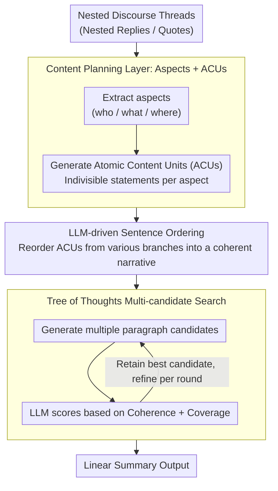

# ThreadSumm: Summarization of Nested Discourse Threads Using Tree of Thoughts

**Conference**: ACL 2026  
**arXiv**: [2604.17648](https://arxiv.org/abs/2604.17648)  
**Code**: None  
**Area**: Interpretability  
**Keywords**: Nested Discourse Thread Summarization, Tree of Thoughts, Atomic Content Units, Multi-stage LLM Pipeline, Coherence and Coverage

## TL;DR

This paper proposes ThreadSumm, a multi-stage LLM pipeline framework that models nested discourse thread summarization as a hierarchical reasoning problem. It first extracts aspects and Atomic Content Units (ACUs) for content planning, constructs thread-aware sequences through sentence ordering, and finally utilizes Tree of Thoughts (ToT) search to generate and score multiple paragraph candidates. The method outperforms baselines on Reddit and StackExchange datasets.

## Background & Motivation

**Background**: The nested thread structures in discussion forums (intertwined replies, quotes, and reposts) make summarization significantly more complex than standard document summarization. Existing LLM summarization methods primarily handle linear documents or relatively structured dialogues.

**Limitations of Prior Work**: (1) The tree/graph structure of nested threads causes off-topic and on-topic replies to interleave, burying key content; (2) existing methods fail to balance diverse perspectives, tending to favor the most frequent topics while ignoring minority but important viewpoints; (3) turn overlaps and interruptions in multi-speaker scenarios prevent simple linear adjacency models from inferring reply relationships.

**Key Challenge**: The graph structure of threads vs. the linear output of summaries—there is a need to maintain coherence while covering diverse topics distributed across different branches.

**Goal**: (1) Address the discourse coverage issue (balanced representation of multiple interleaved topics); (2) address the coherence issue (generating coherent summaries even without a predefined thread order).

**Key Insight**: Decompose summarization into two independent reasoning layers: content planning (aspect extraction + ACU generation) and text realization (sentence ordering + paragraph writing + ToT search).

**Core Idea**: Use structured intermediate representations (aspects + ACUs) to explicitly control coverage, and employ Tree of Thoughts search to find the optimal balance between coherence and coverage.

## Method

### Overall Architecture

ThreadSumm focuses on summarizing discourse threads with deeply nested replies and quotes found in discussion forums. The difficulty lies in the source being a tree/graph structure while the summary must be linear text. Direct LLM input often leads to bias toward popular topics, missing important views in peripheral branches. The framework splits this into two levels of inference: first, "content planning" extracts aspects (who/what/where) and ACUs from the source to fix the "content to be covered" using a structured intermediate representation; second, "text realization" rerenders these ACUs into a coherent sequence, writes paragraphs, and uses Tree of Thoughts to search multiple candidates, scoring them by coherence and coverage to select the best one. This pipeline is training-free, connecting five steps via LLM prompts.

### Key Designs

**1. Content Planning Layer (Aspects + ACUs): Explicitly defining coverage before writing**

To address the issue where direct summarization is dominated by the most prominent topics, ThreadSumm uses few-shot prompting to extract aspects (elements like who/what/where) and generates a set of Atomic Content Units (ACUs)—indivisible semantic statements—for each aspect. The granularity of ACUs is finer than original sentences, creating a "checklist" of content for the summary. This ensures precise coverage control by expanding across aspects and then filling ACUs, forcing a balanced representation of interleaved topics.

**2. LLM-driven Sentence Ordering: Reordering ACUs into a coherent narrative line**

The extracted ACUs form an unordered set, originally scattered across different branches and depths of the nested thread. Heuristics like position or timestamps cannot produce a logical sequence. This step employs zero-shot prompting to let the LLM directly reorder the ACU list to ensure logical flow. Relying on the LLM rather than positional rules allows for global discourse judgment—determining which viewpoint should come first or which responds to a previous one—which is a critical prerequisite for paragraph coherence.

**3. Tree of Thoughts Multi-candidate Search: Searching for the optimal balance**

Single-pass generation often falls into local optima—either being coherent but missing content, or being comprehensive but disjointed. ThreadSumm generates several paragraph candidates based on the ordered ACUs and uses the LLM to score each on two dimensions: coherence (logical flow and transitions) and coverage (inclusion of important information). This iterative process explores the summarization space as a search tree, ensuring the final output balances these competing objectives.

### Loss & Training

This is a training-free pipeline involving no parameter updates. Experiments were conducted using GPT-4, Claude-3, and LLaMA-3-70B on Reddit (250 instances), StackExchange (117 instances), and a Bitcoin forum case study.

## Key Experimental Results

### Main Results

**Reddit Dataset (QAGS Consistency / ROUGE-1)**

| Model-Method | QAGS | ROUGE-1 |
|----------|------|---------|
| Claude-Vanilla | 38.34 | 30.88 |
| Claude-CHRONOS | 45.43 | 26.35 |
| Claude-ThreadSumm | **55.66** | **34.37** |
| GPT-4-Vanilla | 36.46 | 30.54 |
| GPT-4-ThreadSumm | **50.34** | **33.30** |

### Key Findings

- ThreadSumm significantly outperforms all baselines in QAGS (factual consistency), as explicit ACU planning effectively prevents hallucinations.
- Consistent improvements in ROUGE-1 indicate effectively increased coverage.
- ToT iterative refinement markedly improves coherence—multi-candidate search yields higher quality than single-pass generation.
- Consistent trends across different LLMs demonstrate the model-agnostic nature of the framework.

## Highlights & Insights

- ACUs are highly suitable intermediate representations for thread summarization, naturally supporting content aggregation and balanced coverage across branches.
- The application of ToT search in summarization tasks is novel, treating coherence and coverage as dual optimization targets.
- The sentence ordering step is an undervalued but essential component; high-quality ordering is a prerequisite for coherent paragraphs.

## Limitations & Future Work

- Multi-step LLM calls increase latency and operational costs.
- Validated only on English-language discussion forums.
- The Bitcoin forum includes only one instance for a case study, which lacks statistical significance.
- Direct comparison with the latest long-context LLMs is absent.

## Related Work & Insights

- **vs CHRONOS**: While CHRONOS processes threads based on temporal order, ThreadSumm uses LLM reasoning to handle arbitrary thread structures.
- **vs arg-graph**: Unlike argument graphs that structure dialogues, ThreadSumm uses ACUs for a more general decomposition of content.
- **vs mRedditSumm**: Compared to multi-document summarization baselines, ThreadSumm achieves better coherence through ToT search.

## Rating

- Novelty: ⭐⭐⭐⭐ The combination of ACU and ToT search is novel in the context of thread summarization.
- Experimental Thoroughness: ⭐⭐⭐ Testing on 3 models and 3 datasets, though the scale is relatively small.
- Writing Quality: ⭐⭐⭐⭐ Clear research questions and a complete description of the framework.
- Value: ⭐⭐⭐⭐ Provides a practical solution for nested discourse summarization.

<!-- RELATED:START -->

## Related Papers

- [\[ACL 2026\] Adaptive Planning for Multi-Attribute Controllable Summarization with Monte Carlo Tree Search](adaptive_planning_for_multi-attribute_controllable_summarization_with_monte_carl.md)
- [\[ACL 2025\] DTCRS: Dynamic Tree Construction for Recursive Summarization](../../ACL2025/nlp_generation/dtcrs_dynamic_tree_construction_for_recursive_summarization.md)
- [\[ACL 2026\] FACTS: Table Summarization via Offline Template Generation with Agentic Workflows](facts_table_summarization_via_offline_template_generation_with_agentic_workflows.md)
- [\[ACL 2026\] In-depth Research Impact Summarization through Fine-Grained Temporal Citation Analysis](in-depth_research_impact_summarization_through_fine-grained_temporal_citation_an.md)
- [\[ACL 2026\] SCURank: Ranking Multiple Candidate Summaries with Summary Content Units for Enhanced Summarization](scurank_ranking_multiple_candidate_summaries_with_summary_content_units_for_enha.md)

<!-- RELATED:END -->
