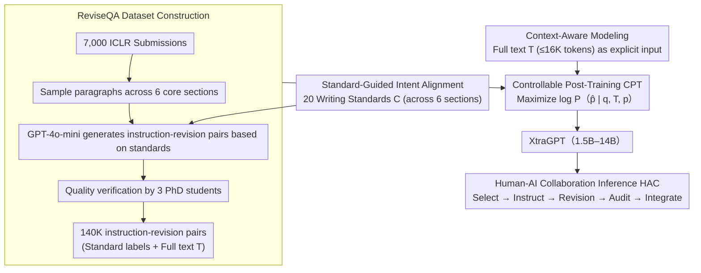

# XtraGPT: Context-Aware and Controllable Academic Paper Revision via Human-AI Collaboration

**Conference**: ACL 2026  
**arXiv**: [2505.11336](https://arxiv.org/abs/2505.11336)  
**Code**: [GitHub](https://github.com/Xtra-Computing/XtraGPT)  
**Area**: Text Generation  
**Keywords**: Paper Revision, Human-AI Collaboration, Context-Awareness, Controllable Generation, Academic Writing

## TL;DR

This paper presents XtraGPT—the first open-source LLM suite (1.5B–14B) specifically for academic paper revision. By fine-tuning on 7,000 top-tier conference papers and 140,000 standard-guided instruction-revision pairs, it achieves context-aware paragraph-level controllable revisions. The 7B version matches GPT-4o-mini, while the 14B version outperforms GPT-4o-mini. Human evaluations show an average increase of 0.65 points in predicted paper scores after revisions.

## Background & Motivation

**Background**: LLMs are increasingly used in academic workflows, but applications are mostly limited to surface-level polishing using general-purpose models like ChatGPT. Existing AI writing tools either generate entire papers from scratch (raising originality and ethical concerns) or focus solely on grammatical corrections.

**Limitations of Prior Work**: (1) Revisions by general LLMs often remain superficial—improving fluency without addressing core argumentative issues (e.g., unclear motivation, vague contributions); (2) Academic writing is inherently iterative, but current LLM workflows treat each prompt as an independent interaction, lacking context tracking across revision rounds; (3) Existing systems lack three key controllabilities: following contextual examples, following user instructions, and following explicit writing standards.

**Key Challenge**: Academic paper revision requires an understanding of the full-text context and adherence to domain-specific writing standards, yet general LLMs lack both full-text comprehension capabilities and the internalization of academic writing norms.

**Goal**: To build a human-AI collaborative paper revision framework where the model acts as an "assistant" providing context-aware, targeted revisions while humans retain creative control.

**Key Insight**: Modeling the revision task as standard-guided conditional generation—given the full text $T$, target paragraph $p$, and user instruction $q$, generate the revised paragraph $\hat{p} = \text{Model}_\theta(p, q, T)$. Revision intents are standardized through 20 writing criteria distilled from top-tier conference review guidelines.

**Core Idea**: Elevating academic paper revision from "general polishing" to "precise structural improvement" through standard-guided intent alignment and context-aware modeling.

## Method

### Overall Architecture

XtraGPT aims to solve the issue where general LLMs only perform "surface-level polishing"—improving sentence flow without addressing core argumentative issues like unclear motivation or vague contributions, while treating prompts as isolated interactions without full-text context. Its post-training framework models "revising a paragraph" as standard-guided conditional generation: given full text $T$, target paragraph $p$, and user instruction $q$, the output is the revised paragraph $\hat{p} = \text{Model}_\theta(p, q, T)$. Three components manage the "direction of revision" (20 writing standards aligning vague intents to specific strategies), "basis for revision" (full text $T$ as explicit input), and "how to learn" (controllable post-training CPT on ReviseQA, maximizing $\log P_\theta(\hat{p}\mid q,T,p)$). During inference, a Human-AI Collaboration (HAC) protocol is followed: the user selects a paragraph and issues instructions, the model provides revisions, and the user audits and integrates them, ensuring creative control remains with the human.

### Key Designs

**1. Standard-Guided Intent Alignment: Translating high-level vague instructions like "strengthen contribution" into executable revision strategies**

Author instructions are often broad (e.g., "make the motivation clearer"), leaving the model unsure of what specific changes to make. XtraGPT distills 20 paragraph-level writing standards $C$ from ICLR review guidelines and expert experience, covering six sections: Title, Abstract, Introduction, Background, Experiments, and Conclusion (e.g., "Consistency between title and content," "Strength and clarity of motivation in the introduction," "Experimental support for main innovations"). Each instruction-revision pair in the training data is explicitly tagged with a standard $c \in C$, allowing the model to learn the association between specific requests and corresponding revision strategies. This set of standards bridges the gap between abstract intent and concrete textual operations, ensuring revisions adhere to academic norms rather than random model generation.

**2. Context-Aware Modeling: maintaining consistency between paragraph revisions and the global narrative**

Revising "motivation in the introduction" requires different considerations than revising "analysis in the experiments"; revisions without full-text context often become detached from the overall paper. XtraGPT includes the complete paper body $T$ (excluding acknowledgments and references, capped at 16,384 tokens) as explicit model input. The training objective $\mathcal{L}_{CPT}(\theta) = -\mathbb{E}[\log P_\theta(\hat{p} \mid q, T, p)]$ forces the model to represent the current paragraph conditioned on global narrative, structure, and terminology. This is the most critical pillar of the framework: ablation studies show that removing context $T$ causes the LC win rate for the conclusion section to plummet from 50% to 11.76%, demonstrating that targeted revision is nearly impossible without the full text.

**3. ReviseQA Dataset Construction: powering large-scale, high-quality standard-guided revision training**

Existing datasets either focus on grammatical correction or end-to-end full-paper generation, lacking resources for "paragraph-level structural revision." Starting from 7,000 ICLR 2024 submissions, XtraGPT samples paragraphs from six core sections of each paper and generates instruction-revision pairs based on the 20 standards. Revisions are produced by GPT-4o-mini (with a hallucination rate of only 1.7%) and verified by three PhD students for quality, resulting in 140,000 high-quality instruction-revision pairs (with 5% reserved for testing). This "full-text context + standard labels + paragraph revision" triadic data enables even small models to internalize academic writing norms.

### Loss & Training

A standard conditional language model loss is used: $\mathcal{L}_{CPT}(\theta) = -\mathbb{E}[\log P_\theta(\hat{p} \mid q, T, p)]$, utilizing full-parameter fine-tuning (which outperformed LoRA). Evaluation utilizes the Length-Controlled Win Rate (LC Win Rate), judged by alpaca_eval_gpt4_turbo_fn to eliminate length bias.

## Key Experimental Results

### Main Results

**Length-Controlled Win Rate (vs XtraGPT-7B as anchor)**

| Model | Title | Abstract | Intro | Background | Exp | Conclusion | Overall |
|------|------|------|------|------|------|------|------|
| QwQ-32B | 46.58 | 85.34 | 81.99 | 83.82 | 82.64 | 95.69 | **80.86** |
| DeepSeek-v3-671B | 56.42 | 65.71 | 68.32 | 74.12 | 72.11 | 64.83 | **67.70** |
| XtraGPT-14B | 55.29 | 59.43 | 50.90 | 59.43 | 57.87 | 52.11 | **55.49** |
| GPT-4o-Mini | 48.80 | 47.43 | 55.73 | 66.07 | 45.67 | 39.03 | **51.75** |
| **XtraGPT-7B (anchor)** | — | — | — | — | — | — | **50.00** |
| Qwen2.5-7B-Instruct | 39.93 | 45.14 | 45.64 | 39.28 | 33.87 | 31.17 | **40.80** |

### Ablation Study

| Configuration | Overall LC Win Rate | Description |
|------|----------------|------|
| XtraGPT-7B (Full CPT) | 50.00 | Anchor |
| w/o Writing Standards | 44.65 | Removed standard guidance |
| Qwen2.5-7B (Base) | 40.80 | No fine-tuning |
| w/o Context $T$ | 34.71 | Removed full-text context |

### Key Findings

- XtraGPT-7B outperforms all open-source models of the same scale and exceeds GPT-4o-mini in the Abstract, Experiments, and Conclusion sections.
- Context $T$ is the most critical component: without it, the LC win rate for the Conclusion section dropped sharply from 50% to 11.76%, and overall to 34.71%.
- Standard guidance makes a significant contribution but is secondary to context (44.65 vs 50.00), proving particularly important in structured sections like the Introduction and Abstract.
- AI-SCIENTIST full-paper evaluation showed: Contribution score +7.89%, Soundness +12.50%, Rigor +6.41%, with the overall score rising from 6.08 to 6.73 (p<0.001).
- Human evaluation showed a revision acceptance rate of 3.23/5.0 and instruction following of 3.78/5.0.

## Highlights & Insights

- The design philosophy of the HAC protocol is noteworthy: humans are responsible for creativity and decision-making, while AI handles execution and improvement, avoiding originality and ethical risks associated with full automation.
- The distillation of 20 writing standards is a valuable resource in itself—potentially serving as a paper self-check list or a reviewer's guide.
- Using AI-SCIENTIST as a paper quality evaluator is a clever experimental design—transforming the subjective "did the paper get better" into quantifiable changes in predicted scores.

## Limitations & Future Work

- ReviseQA is derived solely from ICLR 2024, which may bias it toward ML/AI writing styles; generalization to other disciplines (e.g., NLP, Biomedicine) is unknown.
- Revisions generated by GPT-4o-mini as training targets may introduce the preferences and stylistic biases of that model.
- Currently, only single-round revision evaluation is supported; the cumulative effect of multi-round iterative revisions has not been systematically measured.
- The 16K token context window limits the ability to process extremely long papers.
- The possibility of aligning with human revision histories (e.g., revision records on OpenReview) has not yet been explored.

## Related Work & Insights

- **vs AI Scientist**: AI Scientist pursues fully automated paper generation and reviewing, with questionable originality; XtraGPT explicitly positions itself as an "assistant tool" that retains human leadership.
- **vs STORM/CO-STORM**: STORM generates articles from scratch, facing factual hallucinations and consistency issues; XtraGPT modifies based on human drafts, naturally reducing hallucination risks.
- **vs CycleResearcher**: CycleResearcher uses a generation-review loop for self-improvement but is prone to reward hacking; XtraGPT uses standard-guided data validated by human labels.

## Rating

- Novelty: ⭐⭐⭐⭐ First open-source LLM suite for academic paper revision with a well-designed HAC framework.
- Experimental Thoroughness: ⭐⭐⭐⭐ Includes LC win rate, human evaluation, AI-SCIENTIST full-text evaluation, and ablations.
- Writing Quality: ⭐⭐⭐⭐ Clear framework description and distinct positioning compared to existing work.
- Value: ⭐⭐⭐⭐⭐ Addresses real-world pain points for researchers; high utility with open-source models, datasets, and Overleaf plugins.

<!-- RELATED:START -->

## Related Papers

- [\[ACL 2025\] Context-Aware Hierarchical Merging for Long Document Summarization](../../ACL2025/nlp_generation/context-aware_hierarchical_merging_for_long_document_summarization.md)
- [\[ACL 2026\] Adaptive Planning for Multi-Attribute Controllable Summarization with Monte Carlo Tree Search](adaptive_planning_for_multi-attribute_controllable_summarization_with_monte_carl.md)
- [\[ACL 2026\] Right at My Level: A Unified Multilingual Framework for Proficiency-Aware Text Simplification](right_at_my_level_a_unified_multilingual_framework_for_proficiency-aware_text_si.md)
- [\[ACL 2026\] Children's English Reading Story Generation via Supervised Fine-Tuning of Compact LLMs with Controllable Difficulty and Safety](childrens_english_reading_story_generation_via_supervised_fine-tuning_of_compact.md)
- [\[ACL 2026\] Difficulty-Controllable Cloze Question Distractor Generation](difficulty-controllable_cloze_question_distractor_generation.md)

<!-- RELATED:END -->
