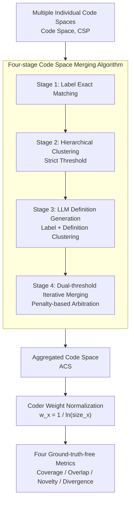

# A Computational Method for Measuring "Open Codes" in Qualitative Analysis

**Conference**: ACL 2026 Findings  
**arXiv**: [2411.12142](https://arxiv.org/abs/2411.12142)  
**Code**: [GitHub](https://github.com/) (Open-source package)  
**Area**: Model Compression  
**Keywords**: Inductive Coding, Qualitative Analysis, LLM-assisted Evaluation, Code Space Aggregation, Team Collaboration Evaluation

## TL;DR

This paper proposes a theory-based computational method to systematically evaluate human and AI performance in inductive qualitative coding through an LLM-enhanced code merging algorithm and four ground-truth-free metrics (Coverage, Overlap, Novelty, and Divergence).

## Background & Motivation

**Background**: Qualitative analysis is a core methodology in social sciences for understanding human data. Within this, inductive coding (open coding) requires researchers to discover patterns and themes directly from data rather than relying on preset frameworks. As generative AI is increasingly used to assist in coding tasks, reliable evaluation methods are urgently needed.

**Limitations of Prior Work**: The evaluation of inductive coding faces fundamental dilemmas: (1) Ground-truth-based metrics (such as inter-rater reliability) contradict the open-ended nature of inductive coding; (2) Clustering/topic consistency metrics focus on internal homogeneity rather than conceptual breadth; (3) Manual evaluation is costly and difficult to scale.

**Key Challenge**: Inductive coding aims to "broadly capture novel insights" rather than "achieve consistency with a standard answer," a characteristic that existing evaluation methods fail to reflect.

**Goal**: To design a set of theory-driven, ground-truth-free computational metrics capable of systematically measuring the quality of contributions from both human and machine coders in inductive coding.

**Key Insight**: Borrowing from team-based coding approaches, the method aggregates results from multiple coders into a shared analysis space, thereby achieving a collective-based relative evaluation.

**Core Idea**: An LLM-enhanced hierarchical clustering algorithm merges the codebooks of multiple coders into an Aggregated Code Space (ACS). Subsequently, four complementary metrics measure each coder's contribution across different dimensions.

## Method

### Overall Architecture

In inductive coding, each coder summarizes a set of codes (Code Space, CSP) from the same batch of data. However, different coders often use different wording for the same concept, preventing direct comparison. This paper first uses a four-stage merging algorithm to aggregate all individual CSPs into a shared Aggregated Code Space (ACS), merging codes that are "semantically identical but worded differently." Subsequently, a normalized weight is calculated for each coder to suppress bias from "output volume." Finally, four complementary metrics are calculated in this unified space to provide a relative evaluation of each coder from the perspectives of coverage breadth, overlap with others, unique contribution, and distributional deviation—all without requiring ground truth.

### Key Designs

**1. Four-stage Code Space Merging Algorithm: Converging "Synonymous but Different" Codes into a Unified Conceptual Space**

The difficulty in inductive coding lies in coders potentially using entirely different labels for the same concept. Simple string matching fails, and a single similarity threshold cannot prevent the erroneous merging of "conceptually similar but distinct" codes. This paper addresses this via a four-stage pipeline: Stage 1 performs naive exact matching; Stage 2 performs hierarchical clustering on labels with a strict threshold; Stage 3 introduces an LLM to generate definitions for each code, clustering based on "Label + Definition" so that semantic judgment moves beyond surface-level words; Stage 4 implements dual-threshold iterative merging with a $penalty$ term.

The dual-threshold and penalty mechanism is key: merges occur automatically above the upper threshold and are rejected below the strict threshold. The "middle ground" is decided by the $penalty$, calculated based on the overlap of code examples and the number of unique examples. This prevents merging distinct concepts while ensuring small codebooks are not disproportionately absorbed by larger ones. Thresholds are selected via interactive validation (strict=0.32, upper=0.55), with similarity measured by cosine distance.

**2. Coder Weight Normalization Mechanism: Reflecting Quality over Quantity**

If a coder produces a massive amount of redundant codes ("flooding"), their presence in the ACS would be artificially inflated. To address this, the paper assigns a weight $w_x = \frac{1}{\ln(size_x)}$ to each coder, where $size_x$ is their code count (clamped at the median of all coders). As the number of codes increases, the weight decreases, diluting the marginal contribution of each code. This ensures the final metrics reflect actual conceptual contribution rather than mere output volume.

**3. Four Ground-truth-free Evaluation Metrics: Combinatorial Diagnostic Power**

Since inductive coding seeks "breadth of insight" rather than "standard answers," traditional inter-rater reliability is inherently inapplicable. The paper defines four complementary metrics on the ACS: **Coverage** measures the proportion of the ACS conceptual breadth covered by a weighted coder; **Overlap** measures concept consistency with others; **Novelty** measures unique contributions (codes discovered by only one coder); and **Divergence** uses Jensen-Shannon divergence to measure how a coder's distribution deviates from the group.

Evaluating any single metric in isolation can lead to misjudgment; their value lies in combined interpretation. High Coverage + High Overlap indicates a reliable coder; High Novelty but extremely low Overlap often suggests hallucinations rather than original insights; abnormally high Divergence indicates a coder has "gone off-track." This multidimensional diagnosis distinguishes failure modes like "over-coding" and "hallucination."

### Loss & Training

This paper does not involve model training. The merging algorithm utilizes cosine distance for semantic similarity, with thresholds determined by interactive validation (strict=0.32, upper=0.55). Open-source local models are used throughout (Gemma3-27B for definition generation, mxbai-embed-large for embeddings), ensuring processing remains local and data private.

## Key Experimental Results

### Main Results

| Configuration | Change in Coverage | Change in Overlap | Change in Novelty | Change in Divergence |
| :--- | :--- | :--- | :--- | :--- |
| Stage 2 vs 1 | +0.09% | -0.09% | +0.05% | +0.37% |
| Stage 3 vs 1 | +3.60% | +5.45% | +0.94% | -4.31% |
| Stage 4 vs 1 | +7.02% | +7.86% | -1.64% | -1.91% |

### Ablation Study

| Configuration | Key Metric | Description |
| :--- | :--- | :--- |
| Cross-LLM Consistency | CoV < 0.1 | Extremely low variation across 10 repeat runs. |
| Model Explanatory Power | $R^2 > 0.91$ | Conditions, models, and coder IDs highly explain metric variance. |
| Flooding Detection | Coverage=78.7%, Novelty=68.1% | Over-coding is effectively identified. |
| Hallucination Detection | Overlap=15.6%, Divergence=75.7% | Hallucinated coding is effectively diagnosed. |

### Key Findings
- The four-stage merging algorithm significantly reduces the number of codes post-merging ($p < 0.001$) while keeping the ranking of top-5 coders stable.
- Three out of four LLMs (Gemma3, QwQ, GPT-4.1) yielded highly similar metrics; only Gemini-2.5-Pro showed significant deviation.
- For "flooding" coders, Coverage remains high but Novelty shows diminishing returns; for "hallucinating" coders, Coverage and Overlap drop sharply.

## Highlights & Insights
- The combined diagnostic ability of the four metrics is powerful: normal coders exhibit a healthy pattern of "Moderate Coverage + Reasonable Overlap + Moderate Novelty + Low Divergence."
- The method is entirely independent of ground truth, making it suitable for genuine exploratory analysis scenarios.
- Stable results are achievable even with small open-source LLMs, ensuring data privacy as all processing can be performed locally.

## Limitations & Future Work
- Currently validated on only one dataset; testing across more domains and languages is required.
- Threshold selection still requires human interactive validation; full automation has not yet been realized.
- In scenarios with very few coders (e.g., only 2), the statistical power of the metrics may be insufficient.
- Future work could extend this to larger-scale multi-round iterative coding workflows.

## Related Work & Insights
- **vs. Ground-truth Metrics**: This method does not require a preset correct answer, aligning better with the exploratory nature of inductive coding.
- **vs. Clustering Consistency Metrics**: It focuses not only on internal consistency but also on cross-coder complementarity and conceptual coverage.
- **vs. Manual Evaluation**: Computational metrics are repeatable and scalable, yet align with the diagnostic direction of manual assessment.

## Rating
- Novelty: ⭐⭐⭐⭐ First systematic computational metrics for inductive coding without grounding in truth.
- Experimental Thoroughness: ⭐⭐⭐⭐ Ablation, robustness, and boundary case detection are well-validated.
- Writing Quality: ⭐⭐⭐⭐ Clear theoretical motivation and rigorous algorithmic description.
- Value: ⭐⭐⭐⭐ Practical significance for qualitative analysis and AI collaboration.

<!-- RELATED:START -->

## Related Papers

- [\[ACL 2025\] Towards a More Generalized Approach in Open Relation Extraction](../../ACL2025/nlp_understanding/generalized_open_relation_extract.md)
- [\[ACL 2026\] DimABSA: Building Multilingual and Multidomain Datasets for Dimensional Aspect-Based Sentiment Analysis](dimabsa_building_multilingual_and_multidomain_datasets_for_dimensional_aspect-ba.md)
- [\[ACL 2026\] MSMO-ABSA: Multi-Scale and Multi-Objective Optimization for Cross-Lingual Aspect-Based Sentiment Analysis](msmo-absa_multi-scale_and_multi-objective_optimization_for_cross-lingual_aspect-.md)
- [\[ACL 2025\] Beyond Prompting: An Efficient Embedding Framework for Open-Domain Question Answering](../../ACL2025/nlp_understanding/embqa_embedding_odqa.md)
- [\[ACL 2025\] Dynamic Order Template Prediction for Generative Aspect-Based Sentiment Analysis](../../ACL2025/nlp_understanding/dot_absa_template.md)

<!-- RELATED:END -->
