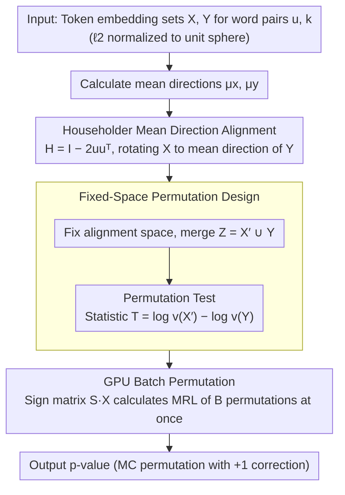

# Accurate and Efficient Statistical Testing for Word Semantic Breadth

**Conference**: ACL 2026  
**arXiv**: [2605.08048](https://arxiv.org/abs/2605.08048)  
**Code**: https://rebrand.ly/WordSemanticBreadth  
**Area**: LLM Efficiency / Word Semantic Analysis  
**Keywords**: Word semantic breadth, permutation test, Householder transformation, contextual embeddings, GPU acceleration

## TL;DR
This paper identifies that directly comparing the semantic breadth of two words using permutation tests in contextual embedding space severely inflates Type-I errors due to differences in mean directions. It proposes using Householder reflections to align mean directions before permutation, reducing Type-I errors by 32.5%, and provides a GPU batch implementation achieving a 23x speedup.

## Background & Motivation
**Background**: Contextual embeddings (e.g., BERT) have become the standard tool for word meaning modeling. Nagata and Tanaka-Ishii (2025) treat the "token embedding cloud of a word across different contexts" as a distribution, using its dispersion as a proxy for "semantic breadth / contextual diversity"—a metric of high value for lexicography in determining the number of sense entries for a word.

**Limitations of Prior Work**: To determine if the difference in semantic breadth between two words is "statistically significant," a naive approach is to merge the token clouds of both words and perform a permutation test. However, the authors point out: **when two words have different mean directions on the unit sphere (i.e., different semantics), naive permutation mixes the two sets of points into different regions, miscounting "directional difference" as "dispersion difference."** This leads to severely inflated Type-I errors (falsely concluding significant breadth differences), violating the principles of significance testing.

**Key Challenge**: In embedding space, "semantic difference" and "breadth difference" are statistically entangled; the permutation test assumes "exchangeability," and this assumption is broken when directional differences are significant.

**Goal**: (i) Calibrate p-values by making the permutation test sensitive only to breadth, not to semantic direction; (ii) Ensure the permutation test is computationally feasible at vocabulary scale (as naive CPU implementations are too slow).

**Key Insight**: The authors noted that if one word's token cloud could be "rotated" to the mean direction of the other word before permutation, the confounding factor of directional difference could be eliminated. This corresponds precisely to the geometric function of a Householder reflection—an orthogonal transformation that preserves norms and relative geometry.

**Core Idea**: First, use a Householder reflection to align the mean directions of the two words, then perform the merged permutation test. Simultaneously, rewrite the entire permutation process as batch matrix multiplications on GPU to enable large-scale vocabulary analysis.

## Method

### Overall Architecture
The input consists of a pair of words: a target word $u$ and a reference word $k$, with their respective token embedding sets $X = \{\mathbf{x}_i\}_{i=1}^n$ and $Y = \{\mathbf{y}_j\}_{j=1}^m$ (both $\ell_2$-normalized to the unit sphere $\mathbb{S}^{d-1}$). The output is a p-value answering whether "$u$ is semantically broader than $k$." The pipeline involves: calculating mean directions $\hat{\mu}_x, \hat{\mu}_y$, applying a Householder reflection to rotate $X$ to the mean direction of $Y$ to eliminate "directional difference" as a confounding factor, and then merging the aligned point sets for a permutation test using the log difference of mean resultant lengths as the test statistic. The entire process is reformulated as batch matrix multiplication on GPU for efficient pairwise comparisons across the vocabulary.

### Key Designs
**1. Householder Mean Direction Alignment: Stripping "Directional Difference" via Orthogonal Reflection**

Naive permutation tests suffer from high Type-I errors because semantically different words have different mean directions on the sphere; permutation mixes points into different regions, wrongly attributing directional differences to dispersion differences. This paper eliminates this interference: by taking the reflection axis $\mathbf{u} = (\hat{\mu}_x - \hat{\mu}_y)/\|\hat{\mu}_x - \hat{\mu}_y\|_2$ and constructing $H = I - 2\mathbf{u}\mathbf{u}^\top$, an orthogonal reflection is created that satisfies $H\hat{\mu}_x = \hat{\mu}_y$ and $H^\top H = I$. This aligns the mean direction of $X$ to $Y$ while preserving the norm, relative distance, and dispersion of each point within the group. The authors prove in Appendix D that the Householder transformation is precisely the transform that maximizes the mean resultant length of the merged set, thereby restoring "exchangeability" to the maximum extent.

A single reflection is used instead of full rotation optimization because its computational cost is only $O(d^2)$ and it is mathematically sufficient to align any two unit vectors; Procrustes alignment is avoided because it requires point-to-point correspondence, which does not exist between token clouds of different sizes.

**2. Fixed-Space Permutation Design: Ensuring Meaningful Permutation in a Constant Space**

After alignment, the merged set $Z = X' \cup Y$ must be fixed, and all permutations must occur within this same aligned space. A natural but incorrect approach would be to re-estimate $H$ and re-align for every permutation—however, the geometric space would then drift with label permutations, meaning the permutation distribution would no longer reflect true variability under $H_0$, rendering the p-value meaningless. By fixing the space, the permutation only shuffles "label assignment" rather than "geometric space." The test statistic used is the log difference of MRL: $T_{obs} = \log v(X') - \log v(Y)$, where $v(X) = 1/g_d(r(X))$ and $r(X) = \|\frac{1}{n}\sum_i \mathbf{x}_i\|_2$ is the mean resultant length (higher indicates concentration, lower indicates dispersion). This design was validated in Appendix E through a sanity check involving splitting a single word into two halves.

**3. GPU Batch Permutation: Achieving 23x Speedup via Matrix Multiplication**

Lexicographical applications require many pairwise comparisons across thousands of words. A naive $O(BNd)$ serial permutation ($B$ permutations, $N$ total samples, $d$ dimensions) is impractical on a CPU. This paper represents each permutation $b$ as a sign vector $\mathbf{s}^{(b)} \in \{+1, -1\}^N$ (where $+1$ indicates group 1 and $-1$ group 2) and stacks $B$ such vectors into a sign matrix $\mathbf{S} \in \{+1,-1\}^{B \times N}$. The mean vectors for each group can then be calculated at once via $\mathbf{M} = \mathbf{S}\mathbf{X} \in \mathbb{R}^{B \times d}$, followed by taking the $\ell_2$ norm of each row to obtain $B$ MRL values. The flow consists almost entirely of dense matrix multiplications and reductions, fully utilizing GPU compute power and achieving a 23x speedup over naive CPU implementations, transforming "significance testing" from a CPU bottleneck into a GPU-friendly batch operation.

### Loss & Training
This work focuses on statistical inference without model training. The core statistic is the **mean resultant length** $r(X) = \|\frac{1}{n}\sum \mathbf{x}_i\|_2 \in [0,1]$ and the corresponding concentration parameter $\kappa = g_d(r)$ (related to the von Mises-Fisher distribution); semantic breadth is proxied by $v(X) = 1/g_d(r(X))$. The p-value is calculated using the standard Monte Carlo permutation formula with +1 correction: $p = \frac{1 + \sum_b \mathbb{I}[T^{(b)} \geq T_{obs}]}{B + 1}$.

## Key Experimental Results

### Main Results: Comparison of Type-I Error and Operational Efficiency

| Method | Type-I Error Rate | Time per Word Pair | Device |
| :--- | :--- | :--- | :--- |
| Naive Permutation (CPU) | High (Inflated) | 1.0× | CPU |
| Householder + GPU Permutation | -32.5% (Relative Decrease) | ~1/23 ≈ 23× Speedup | GPU |

### Ablation Study: Impact of Method Components

| Configuration | Type-I Error Control | True Breadth Detection | Speed |
| :--- | :--- | :--- | :--- |
| Naive Permutation (No Alignment + CPU) | ❌ Severely Inflated | ✅ But with high False Positives | Slow |
| Alignment Only (CPU) | ✅ Type-I -32.5% | ✅ Retained | Slow |
| GPU Batching Only (No Alignment) | ❌ Still Inflated | ✅ | Fast (23×) |
| Full Method (Alignment + GPU) | ✅ | ✅ | Fast (23×) |

### Key Findings
- **Directional difference is the primary cause of inflated Type-I errors**: Type-I errors dropped by 32.5% after Householder alignment, proving that naive permutation failure stems from direction-breadth entanglement rather than insufficient sample size.
- **Alignment does not sacrifice detection of true breadth differences**: Since the Householder reflection is an orthogonal transformation, it preserves all intra-group relative geometric relationships, allowing word pairs with real breadth differences to still be detected.
- **GPU acceleration enables practical application**: The 23x speedup makes pairwise comparisons across thousands of words a task of minutes rather than an impossibility, which is key for integrating the method into actual lexicographical workflows.
- **Fixed-Space design validated by word-splitting experiments**: Appendix E shows that when splitting tokens of the same word, the ideal p-value should be uniformly distributed on $[0,1]$. Naive permutation favored small p-values (false positives); Householder + fixed-space restored a uniform distribution, statistically validating calibration.
- **Small sample size failure mode**: When the number of tokens per word is below approximately 50, MRL estimation noise increases, and the power of the p-value drops sharply—the authors suggest subsampling to a uniform scale (e.g., 200 tokens/word) to stabilize variance.

## Highlights & Insights
- **Clear geometric intuition**: The visualization of "two sets of points on a sphere" in Figure 1 immediately clarifies why naive permutation fails and how Householder fixes it—translating an abstract statistical problem into a visual geometric one.
- **Householder is a superior choice over Procrustes**: The authors astutely observed that Procrustes requires point-to-point matching, which token clouds lack; Householder reflections elegantly bypass this difficulty.
- **Subtlety of the Fixed-Space design**: Many researchers might instinctively re-align for every permutation, but the authors demonstrate that this actually violates $H_0$; this is a significant and easily overlooked trap.
- **Practical significance of GPU-ization**: Many statistical tests are "theoretically sound but practically slow." This paper’s reformulation of permutation tests as dense matrix multiplications can be generalized to other high-dimensional statistical inference tasks, such as bootstrap CI calculations.

## Limitations & Future Work
- **Limitations as acknowledged by authors**: The method is used to decide "which words need finer sense division" but does not directly predict the number of senses; it is suited for prioritizing lexicographical work rather than full automation.
- **Additional limitations**: It assumes that concentration parameters of two words are comparable; for extremely anisotropic embeddings, de-anisotropization might be needed first. Reliability drops significantly with very small sample sizes (< 50 tokens).
- **Future directions**: (i) Extend alignment to more than two words (e.g., ANOVA-style designs), requiring simultaneous alignment of multiple mean directions; (ii) Combine with existing de-anisotropy methods (e.g., whitening) to further purify geometry; (iii) Extend statistics beyond MRL to metrics that directly characterize "multimodality/polysemy," such as the number of components in a spherical GMM.

## Related Work & Insights
- **vs Nagata & Tanaka-Ishii 2025** (contextual diversity): They proposed using dispersion as a proxy for breadth; this paper fills the gap by providing a way to perform statistically significant comparisons between words.
- **vs Zmigrod et al. 2022** (exact permutation tests): Their method is only effective for discrete statistics and cannot handle high-dimensional continuous MRL statistics; this work fills that gap with GPU-accelerated Monte Carlo permutations.
- **vs Procrustes alignment** (Schönemann 1966): Procrustes requires point-to-point pairs, making it unsuitable for token clouds; Householder reflection bypasses this requirement.
- **vs HyperLex** (Vulić 2017): HyperLex measures lexical entailment, which overlaps with but is not equivalent to "breadth"; this method could be combined to distinguish semantic breadth from semantic inclusion.
- **vs Anisotropy studies** (Ethayarajh 2019): They noted BERT's high anisotropy; this suggests that preprocessing like whitening might be necessary to stabilize results, representing a promising direction for future exploration.

## Rating
- Novelty: ⭐⭐⭐⭐ Introducing Householder reflections for semantic breadth testing is an original and elegant solution with clear geometric motivation.
- Experimental Thoroughness: ⭐⭐⭐ Main results (-32.5% Type-I error, 23× speedup) are quantified, though end-to-end validation on large-scale downstream lexicography tasks is missing.
- Writing Quality: ⭐⭐⭐⭐⭐ Figure 1's geometric schematic and formal definitions are well-integrated; the flow from motivation to method and empirical evidence is seamless.
- Value: ⭐⭐⭐⭐ A directly usable tool for lexicography and NLP resource construction; also valuable for other research involving "permutation tests in embedding space" (e.g., concept drift detection).
- Engineering Friendliness: ⭐⭐⭐⭐ Open-source code and GPU implementation lower the barrier to reproduction; clear intuition makes it easy to adapt to adjacent problems.

<!-- RELATED:START -->

## Related Papers

- [\[ACL 2026\] BoundRL: Efficient Structured Text Segmentation through Reinforced Boundary Generation](boundrl_efficient_structured_text_segmentation_through_reinforced_boundary_gener.md)
- [\[ACL 2026\] Semantic Reranking at Inference Time for Hard Examples in Rhetorical Role Labeling](semantic_reranking_at_inference_time_for_hard_examples_in_rhetorical_role_labeli.md)
- [\[ACL 2025\] In the LLM Era, Word Sense Induction Remains Unsolved](../../ACL2025/nlp_understanding/in_the_llm_era_word_sense_induction_remains_unsolved.md)
- [\[ACL 2026\] LLM-Guided Semantic Bootstrapping for Interpretable Text Classification with Tsetlin Machines](llm-guided_semantic_bootstrapping_for_interpretable_text_classification_with_tse.md)
- [\[ACL 2026\] SAM-NER: Semantic Archetype Mediation for Zero-Shot Named Entity Recognition](sam-ner_semantic_archetype_mediation_for_zero-shot_named_entity_recognition.md)

<!-- RELATED:END -->
