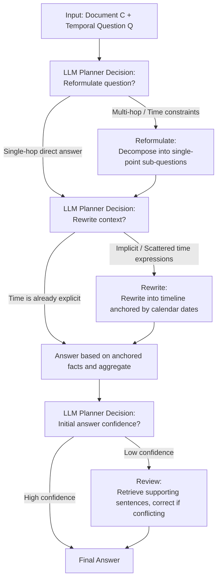

# AdapTime: Enabling Adaptive Temporal Reasoning in Large Language Models

**Conference**: ACL 2026 Findings  
**arXiv**: [2604.24175](https://arxiv.org/abs/2604.24175)  
**Code**: https://github.com/Applied-Machine-Learning-Lab/ACL2026-AdapTime  
**Area**: NLP Understanding / LLM Reasoning  
**Keywords**: Temporal Reasoning, Temporal QA, Adaptive Planning, LLM Planner, Zero-tool

## TL;DR
This paper proposes AdapTime, which abstracts "temporal reasoning" into three reusable atomic actions: reformulate, rewrite, and review. Guided by an LLM Planner, the system adaptively decides which steps to execute and in what order based on the question and context. Without external tools, manual rules, or fine-tuning, it significantly improves LLM performance on temporal QA, pushing TimeQA-Easy to 85.4 EM on DeepSeek-V3.

## Background & Motivation

**Background**: Temporal Question Answering (Temporal QA) requires models to answer time-related questions from documents containing temporal annotations, such as "What position did Terence Cooper hold between March 1966 and October 1969?". Existing solutions generally fall into two categories: those relying on external tools (QAaP uses Python dictionaries for checking/matching; Event-AL uses Python solvers; Step-back uses retrievers) and those relying on human intervention (Time-CoT manual timelines; TG-LLM manual temporal graph corrections; TISER's dependence on TG).

**Limitations of Prior Work**: (1) External tools and manual rules bind methods to specific data or scenarios, requiring rewrites for new benchmarks. (2) Existing pipelines use a **fixed process**, applying the same "extraction-reasoning-verification" sequence to all questions regardless of difficulty. Consequently, simple questions are over-processed (redundant reasoning, introducing errors), while complex questions fail due to insufficient steps.

**Key Challenge**: The variance in complexity of temporal questions is extreme. Simple queries like "Who is the US President?" and multi-hop reasoning like "What position did someone hold during a specific period?" should follow different reasoning paths. However, traditional fixed pipelines force all questions through the same process.

**Goal**: (1) Extract a set of atomic temporal actions that **LLMs can perform independently**, removing dependence on external tools or humans. (2) Enable the LLM to decide which actions to invoke and in what order based on question characteristics, achieving per-instance adaptive reasoning.

**Key Insight**: The authors observe that while existing methods vary in form, they essentially perform one of three tasks: decomposing complex questions, rewriting implicit temporal expressions into structured formats, or fact-checking answers. If these three tasks can be completed via LLM prompting, external tools become redundant.

**Core Idea**: Define three actions—reformulate, rewrite, and review—alongside an LLM Planner. The Planner decides online whether to execute each action based on the question and intermediate states, upgrading "fixed pipelines" to "adaptive planning."

## Method

### Overall Architecture
AdapTime decomposes temporal reasoning into three atomic actions (Reformulate, Rewrite, Review) and one LLM Planner. All four components are implemented via pure prompting on the same backbone without external tools. Given a document $C$ and a temporal question $Q$, the Planner makes a "Yes/No" decision at each potential action point: whether to decompose $Q$ into sub-questions, whether to rewrite $C$ into a time-anchored structured representation, and whether the initial answer confidence is sufficient or requires fact-checking. Selected actions are executed sequentially, sub-answers are aggregated, and a final answer is produced. Simple questions may be answered directly in one step, while difficult ones undergo all three.

> The three actions (Reformulate, Rewrite, Review) are performed entirely through pure LLM prompting, with the Planner gating execution at each action point.

### Key Designs

**1. Three Atomic Temporal Reasoning Actions: Converging core operations into a minimal set for autonomous LLM completion**

Although existing temporal QA methods vary, they essentially focus on "question decomposition, context rewriting, or answer verification." This paper abstracts these into three orthogonal, prompt-based actions. **Reformulate** directs the LLM to decompose questions with complex temporal constraints or multi-hops into $Q=\{q_1,\ldots,q_n\}$, where each $q_i$ is answerable individually. **Rewrite** directs the LLM to convert implicit expressions like "during his presidency" into explicit timelines anchored to calendar dates (code, timeline, or temporal graph), allowing downstream reasoning on anchored facts. **Review** directs the LLM to retrieve original sentences supporting the current answer and correct it if evidence is missing or conflicting.

These actions cover key operations of QAaP, Time-CoT, Event-AL, TG-LLM, and TISER (see Table 1 for comparison) but use pure prompting, eliminating dependencies on Python interpreters, manual timelines, or expert annotations.

**2. LLM Planner Adaptive Planning: Allowing models to determine depth per question**

Fixed pipelines process all questions identically, leading to noise in simple questions and failures in complex ones. AdapTime employs a Planner (sharing the same LLM backbone) to make decisions at each action point: detecting multi-hop $Q$ to trigger Reformulate, detecting vague temporal expressions in $C$ to trigger Rewrite, and assessing initial answer confidence to trigger Review. Each decision is output as natural language ("Yes/No + brief reason"), gating the corresponding action $d_i$ without forcing a complete sequence (see Algorithm 1 for pseudo-code).

This ensures reasoning budgets are spent where needed. Figure 3 shows that the Planner makes task-aware differentiated decisions: Reformulate is frequent on TimeQA (mostly multi-hop), while Rewrite and Review are significantly more frequent on TempReason-L2/L3 (complex timelines, low initial confidence).

**3. Zero-tool Reasoning via Internalized Capabilities: Converting tool calls into pure prompting**

Dependence on external tools limits the generalization of temporal QA. AdapTime internalizes tasks previously delegated: "fact matching" (historically Python-based) is replaced by prompting the LLM to retrieve supporting sentences; "long document compression" (historically retriever-based) is replaced by prompting the LLM to rewrite segments into timelines. This allows the method to transfer zero-shot to new scenarios, such as the open-domain ArchivalQA.

### Example Walkthrough
Consider the question: "What position did Terence Cooper hold between March 1966 and October 1969?" The Planner identifies this as a multi-hop question with time constraints, triggering **Reformulate** into $q_1$="What positions did Cooper hold and their terms?" and $q_2$="Which term covers 1966-03 to 1969-10?". Seeing implicit expressions like "during his tenure" in the document, the Planner triggers **Rewrite** to anchor these to dates (e.g., "Governor: 1966-03 ~ 1969-10"). The sub-answers are aggregated. Finally, if the Planner is uncertain, it triggers **Review** to retrieve the original sentence as evidence. Conversely, a query like "Who is the sitting US President?" would be judged as a direct answer, skipping all three steps.

### Loss & Training
The method is entirely training-free, relying on prompt scheduling. Decoding uses top-k=10, temperature=0.7, batch_size=1, and max_new_tokens=512. Distilling a LLaMA-3-8B supervised Planner from 1,000 high-quality plans generated by DeepSeek-V3 performed worse than the prompt-based Planner (31.0 vs 41.5 EM on TimeQA-Easy), suggesting in-context planning is more robust to distribution shifts than a fine-tuned planner.

## Key Experimental Results

### Main Results
Benchmarks: TimeQA (easy/hard) and TempReason (L2/L3), sampling 1,000 questions each. Backbones: LLaMA-3-8B, Qwen-3-8B, DeepSeek-V3. Metrics: EM and F1.

| Model | Method | TimeQA-Easy EM | TimeQA-Hard EM | TempReason-L2 EM | TempReason-L3 EM | Avg EM |
|------|------|---------------|----------------|------------------|------------------|--------|
| GPT-4 (Closed-source ref) | – | 71.6 | 54.6 | 45.4 | 43.1 | 54.3 |
| TG-LLM (SOTA ref) | – | 66.4 | 63.1 | 42.4 | 35.6 | 51.9 |
| LLaMA-3-8B | ICL | 1.1 | 1.7 | 3.8 | 1.8 | 2.1 |
| LLaMA-3-8B | CoT | 29.7 | 31.6 | 18.5 | 16.5 | 24.1 |
| LLaMA-3-8B | **AdapTime** | **41.5** | **33.3** | **18.7** | 14.5 | **27.0** (+24.9) |
| Qwen-3-8B | CoT | 69.4 | 62.9 | 22.6 | 28.8 | 45.9 |
| Qwen-3-8B | **AdapTime** | **72.7** | **66.5** | **29.1** | 28.8 | **49.3** (+6.4) |
| DeepSeek-V3 | CoT | 85.3 | 75.6 | 44.8 | 47.0 | 63.2 |
| DeepSeek-V3 | Step-back | 84.4 | 76.4 | 45.8 | 48.8 | 63.9 |
| DeepSeek-V3 | Self-refinement | 77.6 | 76.4 | 44.3 | 41.1 | 60.1 |
| DeepSeek-V3 | **AdapTime** | **85.4** | **77.7** | **48.0** | **49.8** | **65.1** (+5.5) |

### Ablation Study (DeepSeek-V3)

| Configuration | TimeQA-Easy EM | TempReason-L3 EM |
|------|---------------|------------------|
| Full AdapTime | 85.4 | 49.8 |
| w/o Reformulate | 85.0 | 48.9 |
| w/o Rewrite | 84.8 | 47.6 |
| w/o Review | 84.8 | 49.0 |
| w/o LLM Planner (Fixed 3-step) | 85.3 | 48.9 |

### Key Findings
- **Rewrite contributes the most**: Adding Rewrite alone boosts ICL from 80.8 to 86.4 EM. Its removal causes the largest performance drop, indicating that "explicitly anchored context" is the most critical factor for LLM temporal reasoning.
- **Planner value is evident on difficult data**: Removing the Planner barely affects TimeQA-Easy (fixed steps work fine), but on complex tasks like TempReason-L2/L3, the Planner provides a consistent 0.5–1 EM gain through flexible step selection.
- **Minimal token overhead**: AdapTime uses 4,873 tokens/instance on average, only 12% more than ICL (4,345), and significantly less than self-refinement (>10,000 tokens). This validates the efficiency of "on-demand" action triggering.
- **Consistent scaling**: AdapTime improves performance across 1B, 8B, and V3 model sizes. LLaMA-3-8B + AdapTime even outperforms GPT-4 on TimeQA, demonstrating it is model-agnostic.

## Highlights & Insights
- **From Tool-Calling to Prompt-Scheduling**: While prior temporal QA methods offloaded reasoning to Python or retrievers, AdapTime proves LLMs can perform these sub-tasks internally. Using an explicit Planner instead of implicit "Chain of Thought" enables controllable adaptation.
- **Prompt-based Planner > Fine-tuned Planner**: Experiments show that distillation reduces generalization. In data-scarce planning tasks, in-context learning is more robust than SFT—a counter-intuitive finding for agentic LLM design.
- **Abstraction of Orthogonal Actions**: Compressing operations from multiple prior works into three actions (Table 1) establishes a high performance upper bound while maintaining simplicity.
- **Orthogonality to RAG**: Section 4.7 shows AdapTime combined with BM25 improves ArchivalQA by 2 EM, suggesting it can serve as a plug-and-play enhancement for RAG pipelines.

## Limitations & Future Work
- **Planner Stability**: Decision reliability depends on the base model; the same question might yield different paths across runs. Stability decreases in smaller models.
- **Action Set Size**: Three actions may be insufficient for ultra-complex reasoning like timezone conversions or relative time calculations, which might require "Calculate" or "Convert" actions.
- **Long Context Overhead**: Token costs still stem primarily from the original context; performance on ultra-long inputs (>32k) is not fully verified.
- **Calibration**: The study lacks an interpretability analysis of Planner errors—understanding when and why the Planner makes incorrect routing decisions remains for future research.

## Related Work & Insights
- **vs QAaP** (Zhu et al. 2023): QAaP converts questions to Python dictionaries. AdapTime replaces the Python interpreter with prompts, enhancing generalization.
- **vs TG-LLM / TISER**: These require manual temporal graph construction or correction. AdapTime's Rewrite action automates these capabilities.
- **vs Step-back / Self-refine**: Unlike fixed iterative flows, AdapTime introduces per-instance routing via a Planner, resulting in finer granularity with lower token budgets.

## Rating
- Novelty: ⭐⭐⭐⭐ Clean redesign of temporal reasoning into 3 atomic actions + Planner scheduling.
- Experimental Thoroughness: ⭐⭐⭐⭐ Wide coverage across 2 benchmarks, 3 backbones, ablation, and open-domain extension.
- Writing Quality: ⭐⭐⭐⭐ Clear comparisons in Table 1 and intuitive pseudo-code.
- Value: ⭐⭐⭐⭐ Training-free and model-agnostic, with low barriers to reproduction and methodological insights for agentic reasoning.

<!-- RELATED:START -->

## Related Papers

- [\[ACL 2026\] The Imperfective Paradox in Large Language Models](the_imperfective_paradox_in_large_language_models.md)
- [\[ACL 2026\] Table Question Answering in the Era of Large Language Models: A Comprehensive Survey](table_question_answering_in_the_era_of_large_language_models_a_comprehensive_sur.md)
- [\[ACL 2026\] It's High Time: A Survey of Temporal Question Answering](it39s_high_time_a_survey_of_temporal_question_answering.md)
- [\[AAAI 2026\] Language Models and Logic Programs for Trustworthy Tax Reasoning](../../AAAI2026/nlp_understanding/language_models_and_logic_programs_for_trustworthy_tax_reasoning.md)
- [\[ACL 2026\] ASTRA: Adaptive Semantic Tree Reasoning Architecture for Complex Table Question Answering](astra_adaptive_semantic_tree_reasoning_architecture_for_complex_table_question_a.md)

<!-- RELATED:END -->
