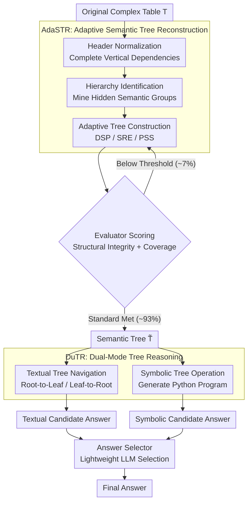

# ASTRA: Adaptive Semantic Tree Reasoning Architecture for Complex Table Question Answering

**Conference**: ACL2026  
**arXiv**: [2604.08999](https://arxiv.org/abs/2604.08999)  
**Code**: https://github.com/zjukg/ASTRA  
**Area**: Table Question Answering / LLM Reasoning  
**Keywords**: Complex Table QA, Semantic Tree, Table Serialization, Symbolic Reasoning, Structured Retrieval  

## TL;DR
ASTRA adaptively reconstructs complex tables into semantic trees and performs dual-mode reasoning via textual tree navigation and symbolic code execution. It achieves accuracies of 91.6%, 81.9%, and 90.1% on AIT-QA, SSTQA, and HiTab, respectively, surpassing strong LLMs and existing structured table methods.

## Background & Motivation
**Background**: LLMs processing table QA typically convert 2D tables into 1D text, such as Markdown, HTML, triplets, relational tables, or tree structures. For simple flat tables, these serialization methods are often sufficient for LLMs to complete various QA tasks.

**Limitations of Prior Work**: Complex tables often feature hierarchical headers, merged cells, irregular sub-tables, and implicit semantic dependencies. This paper identifies four categories of problems in existing methods: structure neglect, representation gaps between 2D and 1D, hallucinations caused by black-box numerical reasoning, and the difficulty of adapting fixed schemas to heterogeneous tables.

**Key Challenge**: While LLMs prefer natural language-like inputs, the critical information in tables resides in their 2D structure and hierarchical relations. Direct conversion to text can scatter the structure, whereas conversion to relational tables or triplets may result in sparsity, redundancy, or loss of hierarchical semantics.

**Goal**: ASTRA aims to build an intermediate representation that preserves explicit hierarchies and semantic contexts while remaining accessible for LLM retrieval and code execution, simultaneously improving accuracy, interpretability, and efficiency in complex TableQA.

**Key Insight**: The authors select a "semantic tree" as the unified representation. Tree nodes and paths preserve header hierarchies, entity-attribute relationships, and cell origins. This structure can be retrieved via natural language or converted into Python dictionaries for programmatic reasoning.

**Core Idea**: First, use AdaSTR to adaptively reconstruct the semantic tree based on table scale and content density. Then, use DuTR to perform parallel textual tree navigation and symbolic execution on the same tree, followed by an answer selector to choose the more credible response.

## Method

### Overall Architecture
ASTRA decomposes complex TableQA into two stages. The first stage is AdaSTR (Adaptive Semantic Tree Reconstruction), which transforms the original table $T$ into a semantic tree $\tilde{T}$. The second stage is DuTR (Dual-Mode Tree Reasoning), which simultaneously runs textual tree navigation and symbolic tree operations on the semantic tree to obtain two candidate answers, with a final selection made by a lightweight LLM.

The core of this workflow is "representation first": instead of forcing an LLM to perform hard reasoning directly on a Markdown table, the table is rewritten into a tree with explicit parent-child relationships, semantic paths, and an executable structure.

### Key Designs

**1. AdaSTR: Complex tables cannot use a one-size-fits-all serialization**

Complex tables contain hierarchical headers, merged cells, and implicit semantic dependencies; direct Markdown conversion flattens these structures. AdaSTR first performs Header Identification & Normalization to merge vertical dependencies into single headers (e.g., completing an isolated "Percent" header as "Yukon-Percent"). Then, it performs Hierarchy Identification, using an LLM to extract hidden semantic groups (e.g., "Regional Statistics") from normalized headers. The critical step is the adaptive tree construction strategy, which switches based on table scale and density: Direct Semantic Parsing (DSP) for medium tables, Selective Reconstruction with Embedding (SRE) for text-dense tables, and Programmatic Structure Synthesis (PSS) for large-scale repetitive tables. This avoids the high cost and hallucination risk of "generating the whole tree in one go" while providing an intermediate representation $\tilde{T}$ that preserves explicit parent-child paths.

**2. Evaluator-Guided Refinement Loop: Reasoning on an incorrectly reconstructed tree is futile**

The representation layer must have quality control. The Evaluator checks the structural integrity and information coverage of the reconstructed tree—verifying if paths align with original coordinates and if cells are correctly mapped. If the score falls below a threshold, specific feedback is sent back to the LLM for iterative correction. This closed loop blocks "construction hallucinations" before reasoning starts. Empirically, this is triggered in only approximately 7% of samples, with most tables being constructed correctly in one round, while maintaining error-correction capabilities for difficult cases.

**3. DuTR: Semantic localization and numerical calculation require different approaches**

Dual reasoning modes run in parallel on the same semantic tree. The textual mode adaptively selects traversal directions based on question type: Leaf-to-Root for aggregation questions to pull context from relevant leaves, and Root-to-Leaf for lookup questions to narrow down targets via global paths. The symbolic mode abstracts the semantic tree into a structural skeleton and generates Python programs for selection, aggregation, and comparison using few-shot examples and a self-correction loop. Textual paths excel at semantic retrieval, while symbolic execution ensures verifiable calculation; the final answer selector picks the most credible result from the two outputs.

### A Complete Example

Consider a regional statistics table with hierarchical headers answering "What is the population percentage of Yukon?": AdaSTR first normalizes the headers, completing the isolated column `Percent` as the semantically rich `Yukon-Percent`, then identifies the hidden group `Regional Statistics`. For a medium-sized table, the DSP strategy parses it into a semantic tree $\tilde{T}$. The Evaluator confirms the coverage is sufficient. In DuTR, for this lookup-style question, the textual mode utilizes Root-to-Leaf navigation to locate the target leaf through `Regional Statistics → Yukon → Percent`. Simultaneously, the symbolic mode abstracts the tree into a skeleton and generates a Python script to retrieve the value. After checking both, the answer selector outputs the final result. The structural information remains explicit and traceable throughout, rather than forcing the LLM to guess from a Markdown block.

### Loss & Training
ASTRA is a training-free method and does not use a model training loss. To ensure fair comparison in experiments, training-free methods like AdaSTR, DuTR, E5, EEDP, GraphOTTER, and ST-Raptor all use DeepSeek-V3-250324 as the backbone. Evaluation is conducted using GPT-5 as a binary judge to determine if the predicted answer is equivalent to the gold answer, followed by Accuracy calculation.

## Key Experimental Results

### Main Results
ASTRA achieves strong results on three complex TableQA datasets, notably outperforming both strong models and intermediate representation baselines on SSTQA and HiTab.

| Method | AIT-QA Acc | SSTQA Acc | HiTab Acc | Description |
|------|------------|-----------|-----------|------|
| DeepSeek-V3 | 78.5 | 63.2 | 82.0 | Strong open-source LLM with standard serialization |
| GPT-4o | 80.6 | 66.4 | 78.6 | Strong closed-source model |
| o3 | 89.1 | 78.2 | 85.3 | Strong reasoning-focused model |
| GraphOTTER | 90.4 | 71.5 | 88.8 | Triplet/Graph-based representation |
| ST-Raptor | 62.7 | 71.1 | 49.0 | Physical tree structure, weaker generalization |
| ASTRA Adaptive Selection | 91.6 | 81.9 | 90.1 | Final method |
| ASTRA Oracle | 93.5 | 86.1 | 94.1 | Upper bound of selecting Textual/Symbolic best |

The complementarity of Textual Reasoning and Symbolic Reasoning is evident: on SSTQA, the textual mode (79.8%) outperforms the symbolic mode (75.3%), while on HiTab, the symbolic mode (89.3%) outperforms the textual mode (82.2%). This confirms that semantic-intensive and numerical-aggregation problems require different reasoning paths.

### Ablation Study
| Module / Configuration | Metric | Result | Description |
|-------------|------|------|------|
| AdaSTR Full | Avg Coverage / Min Coverage | 0.929 / 0.738 | Best coverage |
| w/o Evaluator-Guided | Avg Coverage / Min Coverage | 0.745 / 0.473 | Significant information loss without loop |
| w/o Synthesis Strategies | Avg Coverage / Min Coverage | 0.795 / 0.153 | Static DSP fails on large complex tables |
| Adaptive Tree Navigation | SSTQA Acc | 79.84 | Full textual navigation |
| w/o Embedding Model | SSTQA Acc | 71.34 | Gain of 8.50 points from semantic path guidance |
| Force Root-to-Leaf | SSTQA Acc | 77.23 | Dynamic switching is superior |
| Force Leaf-to-Root | SSTQA Acc | 75.65 | Dynamic switching is superior |
| Symbolic Tree Manipulation | SSTQA Acc | 75.26 | Full symbolic reasoning |
| w/o Code Examples | SSTQA Acc | 70.42 | Examples are critical for code generation |
| Textual Serialization | SSTQA Acc | 63.20 | Baseline text serialization is weak |
| Semantic Tree Direct Prompting | SSTQA Acc | 70.55 | Representation alone adds 7.35 points |

### Key Findings
- The semantic tree representation itself is highly valuable: without complex reasoning, Direct Prompting alone increases accuracy from 63.20 to 70.55.
- Textual and Symbolic modes are complementary rather than redundant. Semantic questions favor textual paths, while numerical aggregations favor code execution.
- ASTRA's online QA latency is significantly lower than ST-Raptor and GraphOTTER. For example, on AIT-QA, the tree/QA time for ASTRA is 29.18/7.80s, compared to 55.73/31.18s for ST-Raptor. ASTRA's "write-once/read-many" architecture amortizes construction costs as queries increase.
- The Evaluator-Guided Loop triggers in only ~7% of cases, indicating that most tables can be reconstructed in a single round while retaining error-correction for difficult samples.

## Highlights & Insights
- Ours addresses the root cause of complex TableQA: the issue is not LLM intelligence, but that input representations destroy table structures. The semantic tree acts as a translation from 2D structure to an intermediate language consumable by both LLMs and programs.
- The three construction modes (DSP/SRE/PSS) are practical, avoiding the costs and hallucinations inherent in forcing LLMs to output entire trees for all table sizes.
- The most insightful aspect is the Textual-Symbolic dual mode: the same structured representation serves both semantic retrieval and verifiable computation, which is more robust than simple prompt engineering.

## Limitations & Future Work
- For extremely simple flat tables, semantic tree reconstruction may introduce unnecessary overhead compared to direct text serialization. ASTRA’s advantage lies primarily in complex hierarchical tables.
- The method relies on text and structural parsing, ignoring visual cues such as background colors, bold text, borders, and layout emphasis, which often carry implicit semantics in real-world reports.
- Evaluation relies on a GPT-5 judge; while better at handling semantic equivalence, it may still introduce bias. Future work could include human audits or task-specific exact matching.
- The Answer Selector is a lightweight LLM; it can still be misled if both textual and symbolic answers are incorrect or only partially correct.

## Related Work & Insights
- **vs. Markdown/HTML Serialization**: Traditional serialization is simple but often loses hierarchies and cell dependencies. ASTRA explicitly preserves these via tree paths.
- **vs. GraphOTTER**: While GraphOTTER's triplet conversion mitigates fixed schema issues, it can fragment cell relationships. ASTRA's tree preserves parent-child structures and semantic context.
- **vs. ST-Raptor**: ST-Raptor demonstrates the utility of tree structures but relies heavily on physical layout and rule-based construction. ASTRA uses LLMs to mine semantic hierarchies, making it better at handling irregular tables.
- **Insight**: Table representation for LLMs should not just aim to be "compressed into text" but should strive to be "both natural language readable and programmatically executable."

## Rating
- Novelty: ⭐⭐⭐⭐ The combination of semantic trees and dual-mode reasoning is comprehensive, and the adaptive construction strategies have high engineering value.
- Experimental Thoroughness: ⭐⭐⭐⭐⭐ Conducted on three complex table datasets with extensive ablation of construction, reasoning, and efficiency.
- Writing Quality: ⭐⭐⭐⭐ Clear structure with well-defined problems and challenges. Some Appendix details remain important for reproducibility.
- Value: ⭐⭐⭐⭐⭐ Direct inspiration for complex TableQA, document intelligence, and LLM tool-augmented reasoning.

<!-- RELATED:START -->

## Related Papers

- [\[ACL 2026\] Table Question Answering in the Era of Large Language Models: A Comprehensive Survey](table_question_answering_in_the_era_of_large_language_models_a_comprehensive_sur.md)
- [\[ACL 2026\] AdapTime: Enabling Adaptive Temporal Reasoning in Large Language Models](adaptime_enabling_adaptive_temporal_reasoning_in_large_language_models.md)
- [\[ACL 2025\] Recursive Question Understanding for Complex Question Answering over Heterogeneous Personal Data](../../ACL2025/nlp_understanding/recursive_question_understanding_for_complex_question_answering_over_heterogeneo.md)
- [\[ACL 2025\] Multi-Hop Reasoning for Question Answering with Hyperbolic Representations](../../ACL2025/nlp_understanding/multi-hop_reasoning_for_question_answering_with_hyperbolic_representations.md)
- [\[ACL 2025\] RISE: Reasoning Enhancement via Iterative Self-Exploration in Multi-hop Question Answering](../../ACL2025/nlp_understanding/rise_reasoning_enhancement_via_iterative_self-exploration_in_multi-hop_question_.md)

<!-- RELATED:END -->
