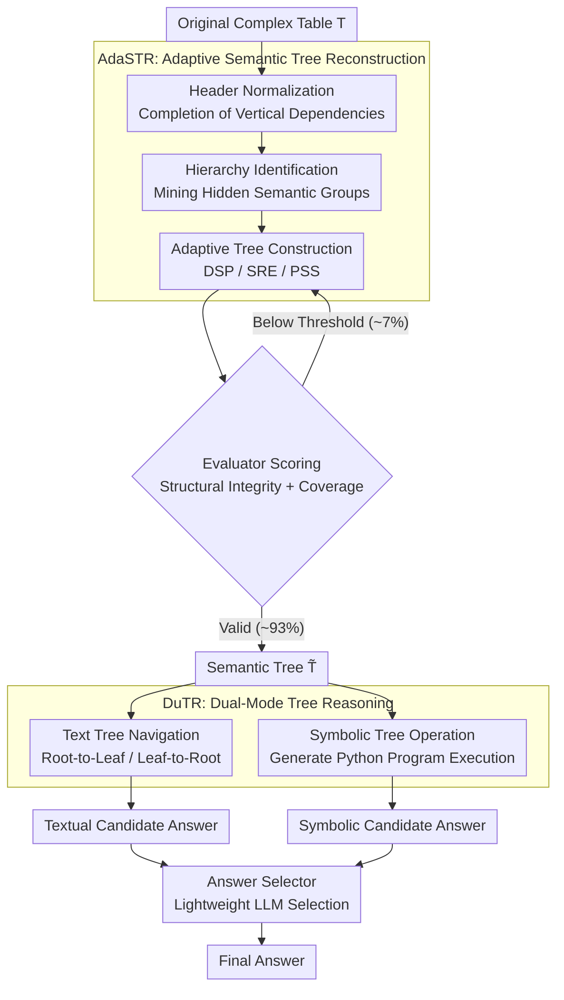

# ASTRA: Adaptive Semantic Tree Reasoning Architecture for Complex Table Question Answering

**Conference**: ACL2026  
**arXiv**: [2604.08999](https://arxiv.org/abs/2604.08999)  
**Code**: https://github.com/zjukg/ASTRA  
**Area**: Table Question Answering / LLM Reasoning  
**Keywords**: Complex Table Question Answering, Semantic Tree, Table Serialization, Symbolic Reasoning, Structured Retrieval  

## TL;DR
ASTRA adaptively reconstructs complex tables into semantic trees and employs a dual-mode reasoning approach consisting of text tree navigation and symbolic code execution. It achieves accuracies of 91.6%, 81.9%, and 90.1% on AIT-QA, SSTQA, and HiTab, respectively, outperforming strong LLMs and existing table structuralization methods.

## Background & Motivation
**Background**: LLMs processing table QA tasks usually transform 2D tables into 1D text formats such as Markdown, HTML, triples, relational tables, or tree structures. For simple flat tables, these serialization methods enable LLMs to complete many QA tasks.

**Limitations of Prior Work**: Complex tables often feature hierarchical headers, merged cells, irregular sub-tables, and implicit semantic dependencies. This paper identifies four main issues: structure neglect, representation gap between 2D and 1D, hallucinations caused by black-box numerical reasoning, and the difficulty of adapting fixed schemas to heterogeneous tables.

**Key Challenge**: LLMs prefer natural language-like inputs, but critical information in tables resides in the 2D structure and hierarchical relationships. Direct text conversion disrupts the structure, while conversion to relational tables or triples may result in sparsity, redundancy, or loss of hierarchical semantics.

**Goal**: ASTRA aims to construct an intermediate representation that preserves explicit hierarchy and semantic context while being accessible for LLM retrieval and code execution, improving accuracy, interpretability, and efficiency in complex TableQA.

**Key Insight**: The authors select "semantic trees" as the unified representation. Tree nodes and paths preserve header hierarchies, entity-attribute relationships, and cell origins, allowing for both natural language retrieval and conversion into Python dictionaries for programmatic reasoning.

**Core Idea**: First, AdaSTR adaptively reconstructs semantic trees based on table scale and content density. Then, DuTR performs parallel text navigation and symbolic execution on the same tree, with an answer selector choosing the more credible result.

## Method

### Overall Architecture
ASTRA decomposes complex TableQA into two stages. The first stage is AdaSTR (Adaptive Semantic Tree Reconstruction), which transforms the original table $T$ into a semantic tree $\tilde{T}$. The second stage is DuTR (Dual-Mode Tree Reasoning), which executes both textual tree navigation and symbolic tree manipulation on the semantic tree to obtain two candidate answers, followed by a final selection using a lightweight LLM. This process emphasizes "representation first": instead of forcing LLMs to perform hard reasoning on Markdown tables, the table is rewritten into a tree with explicit parent-child relationships, semantic paths, and executable structures.

### Key Designs

**1. AdaSTR Adaptive Semantic Tree Reconstruction: No single serialization fits all complex tables**

Complex tables have hierarchical headers, merged cells, and implicit semantic dependencies; direct Markdown conversion collapses these structures. AdaSTR first performs Header Identification & Normalization to merge vertical dependencies into single headers (e.g., completing an isolated "Percent" into "Yukon-Percent"). Then, Hierarchy Identification allows the LLM to extract hidden semantic groups (e.g., "Regional Statistics") from normalized headers. Critically, the tree construction strategy switches adaptively based on table scale and density: direct LLM parsing (DSP) for medium tables, coordinate placeholders with backfilling (SRE) for text-dense tables, and program-generated loops (PSS) for large repetitive tables. This avoids the high cost and hallucination risk of full-tree generation while providing an intermediate representation $\tilde{T}$ with explicit paths and context.

**2. Evaluator-Guided Refinement Loop: Preventing reasoning on incorrect structures**

The representation layer requires quality control. The Evaluator checks the structural integrity and information coverage of the constructed tree—verifying whether paths align with original coordinates and how many cells are correctly mapped. If the composite score falls below a threshold, specific feedback is returned to the LLM for iterative correction. This closed loop blocks "construction hallucinations" before reasoning occurs. Empirically, it is triggered for about 7% of samples, meaning most tables are constructed in one round, while error-correction capability is preserved for difficult cases.

**3. DuTR Dual-Mode Tree Reasoning: Separating semantic localization and numerical computation**

Two reasoning modes run in parallel on the same semantic tree. The textual mode adaptively selects a traversal direction based on the question type: Leaf-to-Root for aggregation questions to pull context upward from relevant leaves, and Root-to-Leaf for lookup questions to navigate downward via global paths. The symbolic mode abstracts the semantic tree into a structural skeleton and uses few-shot prompts to generate Python programs for selection, aggregation, and comparison, utilizing a self-correction loop for runtime errors. Textual paths excel at semantic retrieval, while symbolic execution excels at verifiable computation. The two modes produce candidate answers, and an answer selector chooses the more credible one.

### A Complete Example

Consider a regional statistics table with hierarchical headers and the question, "What is the population percentage of the Yukon region?" AdaSTR first normalizes headers, completing the isolated column `Percent` into the semantically full `Yukon-Percent`, then identifies the hidden group `Regional Statistics`. For this medium-sized table, the DSP strategy parses it into a semantic tree $\tilde{T}$. The Evaluator confirms valid coverage. In DuTR: for this lookup question, the textual mode selects Root-to-Leaf navigation, following `Regional Statistics → Yukon → Percent` to locate the target leaf value. Simultaneously, the symbolic mode abstracts the tree as a skeleton and generates a Python snippet to retrieve the data. Both modes provide candidate answers, and the answer selector yields the final result. The structural information remains explicit and traceable throughout, rather than forcing the LLM to guess from a Markdown block.

### Loss & Training
ASTRA is a training-free method with no model training loss. To ensure a fair comparison, all training-free methods including AdaSTR, DuTR, E5, EEDP, GraphOTTER, and ST-Raptor utilize DeepSeek-V3-250324 as the backbone. Evaluation utilizes GPT-5 as a binary judge to determine if the predicted answer is equivalent to the gold answer and calculates Accuracy.

## Key Experimental Results

### Main Results
ASTRA achieves strong results across three complex table QA datasets, notably outperforming both strong models and intermediate representation baselines on SSTQA and HiTab.

| Method | AIT-QA Acc | SSTQA Acc | HiTab Acc | Description |
|------|------------|-----------|-----------|------|
| DeepSeek-V3 | 78.5 | 63.2 | 82.0 | Strong open-source LLM with text serialization |
| GPT-4o | 80.6 | 66.4 | 78.6 | Strong closed-source model |
| o3 | 89.1 | 78.2 | 85.3 | Strong reasoning-type model |
| GraphOTTER | 90.4 | 71.5 | 88.8 | Triple/Graph intermediate representation |
| ST-Raptor | 62.7 | 71.1 | 49.0 | Physical tree structure, weaker generalization |
| **ASTRA Adaptive Selection** | **91.6** | **81.9** | **90.1** | **Ours** |
| ASTRA Oracle | 93.5 | 86.1 | 94.1 | Upper bound for selecting best candidate |

The complementarity of textual and symbolic reasoning is evident: Textual mode (79.8%) outperforms symbolic mode (75.3%) on SSTQA, while symbolic mode (89.3%) outperforms textual mode (82.2%) on HiTab, confirming that semantic-dense and numerical-aggregation problems require different reasoning paths.

### Ablation Study

| Module / Configuration | Metric | Result | Description |
|-------------|------|------|------|
| AdaSTR Full | Avg Coverage / Min Coverage | 0.929 / 0.738 | Best construction coverage |
| w/o Evaluator-Guided | Avg Coverage / Min Coverage | 0.745 / 0.473 | Significant information loss without feedback |
| w/o Synthesis Strategies | Avg Coverage / Min Coverage | 0.795 / 0.153 | Static DSP struggles with large tables |
| Adaptive Tree Navigation | SSTQA Acc | 79.84 | Full textual navigation |
| w/o Embedding Model | SSTQA Acc | 71.34 | **Gain** of 8.50 points from semantic paths |
| Force Root-to-Leaf | SSTQA Acc | 77.23 | Dynamic switching superior to fixed |
| Force Leaf-to-Root | SSTQA Acc | 75.65 | Dynamic switching superior to fixed |
| Symbolic Tree Manipulation | SSTQA Acc | 75.26 | Full symbolic reasoning |
| w/o Code Examples | SSTQA Acc | 70.42 | Examples critical for program generation |
| Textual Serialization | SSTQA Acc | 63.20 | Baseline text serialization |
| Semantic Tree Direct Prompting | SSTQA Acc | 70.55 | Representation alone adds 7.35 points |

### Key Findings
- The semantic tree representation itself is highly valuable: changing only the representation via Direct Prompting increases accuracy from 63.20 to 70.55.
- Textual and Symbolic modes are complementary rather than redundant. Semantic questions favor textual paths, while numerical aggregations favor code execution.
- ASTRA's online QA latency is significantly lower than ST-Raptor and GraphOTTER. For example, on AIT-QA, ASTRA (tree construction/QA) takes 29.18/7.80s, compared to ST-Raptor's 55.73/31.18s. The write-once/read-many architecture amortizes construction costs over multiple queries.
- The Evaluator-Guided Loop triggers in only ~7% of cases, suggesting most tables are correctly constructed in a single round while maintaining robustness for difficult samples.

## Highlights & Insights
- The paper addresses the root cause of complex TableQA failures: the issue is often the input representation destroying table structure rather than LLM intelligence. Semantic trees translate 2D structures into an intermediate language consumable by both LLMs and code.
- The DSP/SRE/PSS construction modes are highly practical, avoiding the high costs and hallucinations of generating massive trees from scratch.
- The most insightful aspect is the Textual-Symbolic dual mode: using one structured representation for both semantic retrieval and verifiable computation is more robust than pure prompt engineering.

## Limitations & Future Work
- For very simple flat tables, semantic tree reconstruction may introduce unnecessary overhead compared to direct text serialization.
- The method relies on textual and structural analysis, potentially ignoring visual cues like background colors, bolding, and borders that carry implicit semantics in real-world reports.
- Evaluation relies on GPT-5 as a judge. While better for semantic equivalence, it could introduce biases; future work could include human audits or task-specific exact matching.
- The Answer Selector, though a lightweight LLM, may still be misled when both textual and symbolic answers are partially incorrect.

## Related Work & Insights
- **vs Markdown/HTML Serialization**: Traditional serialization is simpler but loses hierarchies and cell dependencies; ASTRA preserves these via tree paths.
- **vs GraphOTTER**: Triples alleviate fixed schema issues but scatter cell relationships; ASTRA's tree maintains parent-child structures and semantic context.
- **vs ST-Raptor**: ST-Raptor uses physical layouts and rules; ASTRA uses LLMs to mine semantic hierarchies, better handling irregular tables.
- **Insight**: Table representations for LLMs should not just simplify structure into text but should aim for formats that are both naturally readable and programmatically executable.

## Rating
- Novelty: ⭐⭐⭐⭐ The combination of semantic trees and dual-mode reasoning is comprehensive; the adaptive construction strategy is of high engineering value.
- Experimental Thoroughness: ⭐⭐⭐⭐⭐ Extensive results across three complex datasets, including ablation of construction/reasoning and efficiency analysis.
- Writing Quality: ⭐⭐⭐⭐ Clear structure with precise problem definitions; however, some appendix details remain critical for reproduction.
- Value: ⭐⭐⭐⭐⭐ Directly inspiring for complex TableQA, document intelligence, and LLM-based tool reasoning.

<!-- RELATED:START -->

## Related Papers

- [\[ACL 2026\] Table Question Answering in the Era of Large Language Models: A Comprehensive Survey](table_question_answering_in_the_era_of_large_language_models_a_comprehensive_sur.md)
- [\[ACL 2026\] AdapTime: Enabling Adaptive Temporal Reasoning in Large Language Models](adaptime_enabling_adaptive_temporal_reasoning_in_large_language_models.md)
- [\[ACL 2025\] Recursive Question Understanding for Complex Question Answering over Heterogeneous Personal Data](../../ACL2025/nlp_understanding/recursive_question_understanding_for_complex_question_answering_over_heterogeneo.md)
- [\[ACL 2025\] Multi-Hop Reasoning for Question Answering with Hyperbolic Representations](../../ACL2025/nlp_understanding/multi-hop_reasoning_for_question_answering_with_hyperbolic_representations.md)
- [\[ACL 2025\] RISE: Reasoning Enhancement via Iterative Self-Exploration in Multi-hop Question Answering](../../ACL2025/nlp_understanding/rise_reasoning_enhancement_via_iterative_self-exploration_in_multi-hop_question_.md)

<!-- RELATED:END -->
