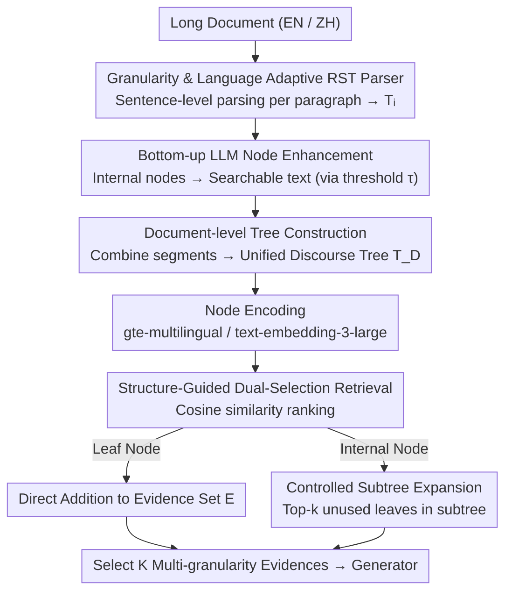

# Beyond Chunking: Discourse-Aware Hierarchical Retrieval for Long Document Question Answering

**Conference**: ACL 2026  
**arXiv**: [2506.06313](https://arxiv.org/abs/2506.06313)  
**Code**: <https://github.com/DreamH1gh/DISRetrieval>  
**Area**: NLP Understanding / Long Document QA / Retrieval-Augmented Generation  
**Keywords**: Long Document Question Answering, Rhetorical Structure Theory (RST), Hierarchical Retrieval, Cross-lingual

## TL;DR
This paper leverages Rhetorical Structure Theory (RST) to parse the discourse organization of long documents, constructing a sentence-level hierarchical tree with intermediate nodes enhanced by LLM summarization. By performing structure-aware multi-granularity retrieval on this tree, the proposed method consistently outperforms fixed-size chunking and RAPTOR-style semantic clustering across four benchmarks: QASPER, QuALITY, NarrativeQA, and MultiFieldQA-zh.

## Background & Motivation

**Background**: The mainstream approach for long document QA involves a "chunk + retrieve + generate" pipeline, either using flat-chunking (e.g., splitting a document into 100-word segments in RAG) or recursive semantic clustering to build document trees (e.g., RAPTOR).

**Limitations of Prior Work**: Fixed-size chunking completely ignores the discourse organization of a document—a single sentence might be split across two chunks, or two contrasting paragraphs might be separated. RAPTOR uses semantic similarity for clustering, which often mixes sentences that are contextually related but lack discourse coherence, losing the original document's hierarchy of "topic-contrast-evidence-conclusion."

**Key Challenge**: The conflict between "organization by similarity" and "organization by discourse." Linguistics suggests that human reading relies on rhetorical relations (e.g., contrast, elaboration, summary) rather than just surface similarity. Existing chunking methods discard these structural signals.

**Goal**: Systematically inject RST discourse structures into the retrieval process to move long document QA away from heuristic chunking, while ensuring cross-lingual support (English and Chinese).

**Key Insight**: RST represents a document as a tree with Elementary Discourse Units (EDUs) as leaves and rhetorical relations as internal nodes. Integrating an RST tree directly into a retriever provides "natural chunks" at multiple granularities: leaves = sentences (fine), intermediate nodes = rhetorical paragraphs (coarse), and the root = document summary.

**Core Idea**: Downgrade RST parsing to the "sentence level + cross-lingual" setting and use LLMs to generate summaries for intermediate nodes. This allows a single discourse tree to support both precise local retrieval (leaves) and coherent global retrieval (intermediate nodes).

## Method

### Overall Architecture
DISRetrieval consists of three stages: (1) **Discourse-Aware Tree Construction**: Performs sentence-level RST parsing for each paragraph to generate intra-paragraph trees $T_i$; uses an LLM to summarize each $T_i$ bottom-up into paragraph semantic units $u_i$; then uses the same RST parser to combine $\{u_i\}$ into a document-level tree $T_{doc}^*$; finally replaces the leaves of $T_{doc}^*$ with the original intra-paragraph trees to obtain a unified discourse tree $T_D$. (2) **Node Encoding**: Encodes every node in $T_D$ (sentences and LLM summaries) using models like gte-multilingual-base or OpenAI text-embedding-3-large. (3) **Structure-Aware Retrieval**: Calculates cosine similarity between the query and all nodes, ranks them, and performs controlled subtree expansion for intermediate nodes while directly selecting leaf nodes.

### Key Designs

**1. Granularity & Language Adaptive RST Parser: Traditional EDU-level parsing is slow and fragmented for long documents.**

Traditional RST methods segment each sentence into several minimal discourse units (EDUs), leading to high computational costs and fragmented semantics in long documents. This work shifts parsing to the sentence level. **Granularity Adaptation**: Converts existing EDU datasets by merging intra-sentence EDUs and inferring inter-sentence relations using the Least Common Ancestor (LCA) of the original EDU tree. **Language Adaptation**: Uses GPT-4o to translate the RST-DT training set to Chinese at the sentence level and merges it with English data to train a unified parser $f_{discourse}$. This enables cross-lingual transfer without native Chinese RST annotations, making it friendly for low-resource languages.

The parser is transition-based: it maintains a stack $\sigma$ and a sentence queue $\beta$, using *shift*, *reduce*, and *pop_root* actions. The scoring model represents nodes $h_v$ (leaves via PLM, internal nodes via child averaging) and uses the concatenation of stack and queue elements to select actions via softmax. Lifting parsing to the sentence level preserves discourse information while significantly improving speed.

**2. Bottom-up LLM Node Enhancement: Pure structural nodes only have labels like Contrast/Elaboration and cannot match queries semantically.**

Internal nodes of a discourse tree only carry rhetorical labels, lacking concrete content for semantic retrieval. This work converts internal nodes into searchable text bottom-up. For each internal node $v$ (with children $v_l, v_r$), a threshold rule is applied: $v^* = f_{LLM}(v_l, v_r)$ if $|v_l|+|v_r| \geq \tau$, otherwise $v^* = f_{merge}(v)$ (direct concatenation). This allows intermediate nodes to carry both the signal ("this is a contrastive argument") and the content ("comparing X and Y"), bridging abstract structure and concrete semantics.

The threshold $\tau$ varies by document type (e.g., 0 for QASPER, 50 for QuALITY/NarrativeQA). Academic papers have high sentence independence (concatenation for fidelity), while narratives have short sentences requiring summary-based compression.

**3. Structure-Guided Dual-Selection Retrieval: Flat retrieval often yields fragments that lack context or contain redundant noise.**

Retrieval aims for both fine-grained evidence and coherent paragraphs. After ranking nodes by similarity $\text{score}(v) = \cos(f_{enc}(q), \mathbf{e}_v)$, a dual-selection strategy is used: (a) if $v$ is an unused leaf, it is added to the evidence set $E$; (b) if $v$ is an internal node, "controlled subtree expansion" is performed—selecting the top-$k$ unused leaves within its subtree. This process continues until $|E| \geq K$. This ensures that both highly relevant sentences and their discourse contexts are selected while avoiding redundancy, mimicking how humans read by focusing on a sentence and then looking back at the paragraph.

### Loss & Training
The sentence-level RST parser is trained with the objective: $$\mathcal{L}(\theta) = -\log p(a^* \mid c) + \frac{\lambda \|\theta\|_2}{2}$$, which combines cross-entropy for each action with L2 regularization, using gold trees from RST-DT as supervision. The generation stage is entirely zero-shot and requires no training.

## Key Experimental Results

### Main Results (Generation Performance F1 / Accuracy)

| Dataset | Context | flatten-chunk | RAPTOR | Bisection | **DISRetrieval** |
|--------|---------|---------------|--------|-----------|------------------|
| QASPER (UnifiedQA-3B) | 400 | 39.03 | 39.53 | 39.70 | **40.74** |
| QASPER (GPT-4.1-mini) | 400 | 44.78 | 43.85 | 45.69 | **46.31** |
| QuALITY (Deepseek-v3) | 400 | 76.56 | 75.22 | 76.94 | **77.71** |
| NarrativeQA (BLEU) | — | 24.24 | 25.05 | 24.71 | **25.39** |
| MultiFieldQA-zh (DS-v3) | 400 | 26.70 | 27.01 | 28.24 | **29.54** |

Ours consistently outperforms baselines across all combinations of context lengths (200/300/400), embedding models (SBERT / OpenAI), and generators.

### Ablation Study (QASPER Retrieval Performance token-level F1)

| Configuration | 200 (OpenAI) | 300 (OpenAI) | 400 (OpenAI) |
|------|--------------|--------------|--------------|
| flatten-chunk | 29.17 | 25.12 | 21.91 |
| RAPTOR | 27.18 | 23.57 | 20.64 |
| Bisection (Without Discourse) | 29.29 | 25.16 | 21.98 |
| **Full DISRetrieval** | **30.27** | **26.00** | **22.79** |

Bisection shares the LLM enhancement and hierarchical retrieval mechanism but replaces the discourse tree with a binary tree. It remains 0.5-1 point lower than Full DISRetrieval, proving the unique value of "discourse structure."

### Key Findings
- **Discourse Structure > Semantic Clustering**: DISRetrieval is consistently stronger than RAPTOR, suggesting rhetorical relations are better for document organization than embedding similarity.
- **Gold Evidence (129 words) > Full Text (4170 words)**: On QASPER, gold evidence yields 50.71% F1 vs. 48.81% for full text, highlighting the importance of precise retrieval over increasing context window.
- **Parser Bottleneck**: Retrieval recall and answer F1 scale monotonically with the amount of training data for the RST parser (0% $\rightarrow$ 100%), indicating that parser accuracy is the primary performance bottleneck.
- **Efficiency**: Processing a 50K-word document takes 103s vs. 338s for RAPTOR (3× speedup). Once pre-processed, the tree can be reused for any number of queries.

## Highlights & Insights
- Integrates decades of linguistic discourse theory into neural retrieval, proving that "structured linguistic knowledge" still holds significant value in the LLM era.
- The nested construction (intra-paragraph $\rightarrow$ summary $\rightarrow$ inter-paragraph) is an elegant engineering solution that allows a single RST parser to generate document-level hierarchies.
- Using LLMs to summarize intermediate nodes bridges the gap between linguistic structure and neural retrieval—structural labels alone are unsearchable, while raw text is unstructured.
- The adaptive threshold $\tau$ provides a practical guideline: use a larger $\tau$ for documents with short, dependent sentences (narratives) and a smaller $\tau$ for documents with long, independent sentences (scientific papers).

## Limitations & Future Work
- The performance is capped by the discourse parser; current training on RST-DT (news) generalizes but could be improved for academic or fictional domains.
- Cross-lingual support was demonstrated for English and Chinese; expanding to other languages requires additional LLM-translated training data.
- The threshold $\tau$ is currently a simple binary rule; dynamic selection based on content complexity could be explored.
- Evaluation still relies on traditional F1/BLEU/ROUGE, which may not fully capture the coherence gains provided by discourse-aware retrieval.

## Related Work & Insights
- **vs. RAPTOR**: While RAPTOR builds trees via recursive embedding clustering (capturing semantic similarity), DISRetrieval uses RST (capturing rhetorical relations). The latter is superior under the same retrieval mechanism, showing "why segments are connected" is more useful than "what segments are connected."
- **vs. Bisection**: This strong ablation maintains all LLM enhancements but removes the discourse logic. Its inferiority to DISRetrieval clearly isolates the contribution of discourse structure.
- **vs. Traditional Chunking**: While fixed windows ignore organization, this work provides a new paradigm: "understand structure first, retrieve second," particularly valuable for structured scenarios like legal documents, research papers, and textbooks.

## Rating
- Novelty: ⭐⭐⭐⭐ First systematic integration of RST into long-doc retrieval with clever cross-lingual and LLM-enhanced node strategies.
- Experimental Thoroughness: ⭐⭐⭐⭐⭐ Extensive testing across 4 datasets, multiple context lengths, and thorough RQ analysis.
- Writing Quality: ⭐⭐⭐⭐ Clear architectural diagrams and well-documented algorithms for node selection and expansion.
- Value: ⭐⭐⭐⭐ Provides a robust discourse-aware path for RAG; highly relevant for applications requiring deep document understanding.

## Related Papers

- [\[ACL 2026\] HCRE: LLM-based Hierarchical Classification for Cross-Document Relation Extraction](hcre_llm-based_hierarchical_classification_for_cross-document_relation_extractio.md)
- [\[ACL 2026\] Knowledge-driven Augmentation and Retrieval for Integrative Temporal Adaptation](knowledge-driven_augmentation_and_retrieval_for_integrative_temporal_adaptation.md)
- [\[ACL 2025\] Beyond Prompting: An Efficient Embedding Framework for Open-Domain Question Answering](../../ACL2025/nlp_understanding/embqa_embedding_odqa.md)
- [\[ACL 2026\] It's High Time: A Survey of Temporal Question Answering](it39s_high_time_a_survey_of_temporal_question_answering.md)
- [\[ACL 2026\] Table Question Answering in the Era of Large Language Models: A Comprehensive Survey](table_question_answering_in_the_era_of_large_language_models_a_comprehensive_sur.md)

<!-- RELATED:END -->

<!-- RELATED:START -->

## Related Papers

- [\[ACL 2026\] HCRE: LLM-based Hierarchical Classification for Cross-Document Relation Extraction](hcre_llm-based_hierarchical_classification_for_cross-document_relation_extractio.md)
- [\[ACL 2026\] It's High Time: A Survey of Temporal Question Answering](it39s_high_time_a_survey_of_temporal_question_answering.md)
- [\[ACL 2026\] ASTRA: Adaptive Semantic Tree Reasoning Architecture for Complex Table Question Answering](astra_adaptive_semantic_tree_reasoning_architecture_for_complex_table_question_a.md)
- [\[ACL 2026\] Knowledge-driven Augmentation and Retrieval for Integrative Temporal Adaptation](knowledge-driven_augmentation_and_retrieval_for_integrative_temporal_adaptation.md)
- [\[ACL 2026\] Table Question Answering in the Era of Large Language Models: A Comprehensive Survey](table_question_answering_in_the_era_of_large_language_models_a_comprehensive_sur.md)

<!-- RELATED:END -->
