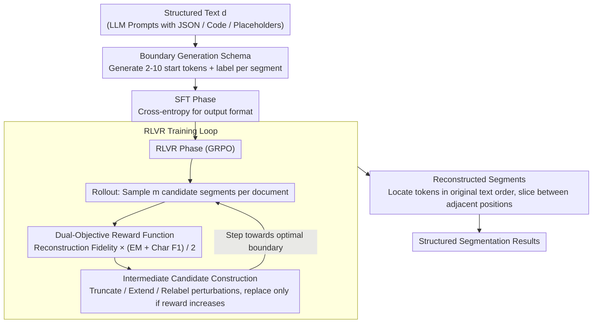

# BoundRL: Efficient Structured Text Segmentation through Reinforced Boundary Generation

**Conference**: ACL 2026 Findings  
**arXiv**: [2510.20151](https://arxiv.org/abs/2510.20151)  
**Code**: None  
**Area**: Text Segmentation / Reinforcement Learning  
**Keywords**: Structured Text Segmentation, Boundary Generation, RLVR, Entropy Collapse, Intermediate Candidates

## TL;DR

BoundRL reframes structured text segmentation as a boundary generation task—generating only the starting tokens for each segment rather than the full text. This reduces output tokens by 90% and eliminates hallucination risks. Combined with a dual-objective reward function and a selective perturbation strategy for RLVR training, it enables a 1.7B small model to outperform the few-shot performance of Claude-4 Sonnet.

## Background & Motivation

**Background**: Text segmentation divides text into semantically coherent units, which is widely utilized in document understanding, QA retrieval, and prompt optimization. Traditional methods segment at the sentence or paragraph level; however, structured text (such as LLM prompts) contains code snippets, JSON formats, and placeholders that do not conform to traditional linguistic structures.

**Limitations of Prior Work**: (1) Sentence/paragraph-level segmentation is unsuitable for structured text; (2) token-level sequence labeling produces overly fragmented results; (3) boundary classification requires per-token classification, incurring high computational costs; (4) current LLM approaches (e.g., generating the full text of each segment) suffer from high inference costs and the risk of hallucinations.

**Key Challenge**: Structured text requires fine-grained token-level segmentation, but methods that generate full segment content scale linearly in inference cost with input length and inevitably introduce hallucinations.

**Goal**: Design an efficient token-level structured text segmentation method that achieves both low inference cost and high segmentation quality.

**Key Insight**: Convert the segmentation problem into boundary generation—generating only the sequence of starting tokens and labels for each segment, then locating these tokens in the original text to reconstruct the full segments.

**Core Idea**: By generating only "location information" (starting tokens) rather than "content information" (full text), the output complexity is reduced from $O(|d|)$ to $O(n)$ (where $n$ is the number of segments). Custom RLVR training is used to overcome the limitations of SFT.

## Method

### Overall Architecture

BoundRL addresses token-level segmentation of structured text (e.g., LLM prompts) without the high inference costs and hallucination risks of full-text rewriting. It reformulates segmentation as **boundary generation**: the model outputs only the starting tokens and the label for each segment. During inference, these starting tokens are located sequentially in the original text to extract the text between adjacent start positions. The training consists of two stages—SFT to teach the output format, and RLVR with a dual-objective reward function to maximize segmentation quality, utilizing intermediate candidates constructed via perturbation to counteract entropy collapse.

### Key Designs

**1. Boundary Generation Output Schema: Generating "Location Markers" instead of Segment Content**

Traditional LLM segmentation requires the model to rewrite the full text segment by segment, which results in output length expanding linearly with input length, high inference costs, and potential hallucinations. BoundRL shifts the output from "content" to "location": for input text $d$, the model generates only a sequence of 2-10 starting tokens $\hat{s}_i$ and a label $\hat{l}_i$ for each segment. Reconstructon involves locating each $\hat{s}_i$ sequentially from left to right; the text between two adjacent start positions forms a segment. Ordering constraints ensure that even if the same start tokens appear multiple times, each occurrence is uniquely assigned to a segment.

This reduces complexity from $O(|d|)$ to $O(n)$, achieving a reduction of approximately 90% in output tokens and eliminating hallucinations as text is extracted directly from the source.

**2. Dual-Objective Reward Function: Balancing Reconstruction and Accuracy**

Cross-entropy in SFT penalizes outputs that correspond to correct boundaries but use different token strings, while being insensitive to minor token mismatches. BoundRL utilizes a continuous reward:

$$r(\hat{T}^L) = \rho_{\text{rec}}(\hat{T}^L) \cdot \frac{\text{EM}(\hat{T}^L) + \text{F1}_{\text{char}}(\hat{T}^L)}{2}$$

Here, $\rho_{\text{rec}}$ measures reconstruction fidelity (percentage of original text recovered), while semantic alignment is measured by Exact Match (EM) and character-level $\text{F1}_{\text{char}}$ against ground truth segments. Crucially, different start token choices for the same boundary receive the same reward, preventing the penalization of correct segmentation with variant phrasing and providing smooth, dense feedback for boundary offsets.

**3. Intermediate Candidate Construction: Using Perturbations to Prevent Entropy Collapse**

Directly using ground truth sequences as references is often too far from the model's current distribution, causing RLVR to stall or collapse. During rollout, BoundRL applies three small perturbations to mid-reward candidates: truncation (removing one word), extension (adding one word), and relabeling. The perturbation with the highest reward is selected as an intermediate candidate, and original candidates are replaced only if the reward genuinely increases. These candidates act as "stepping stones" that bridge the current solution to the optimal one, leveraging the continuous nature of the reward function.

### Loss & Training

The SFT phase uses standard cross-entropy loss for 1 epoch. The RLVR phase employs GRPO (without standard deviation normalization), with 6 input documents per batch, $m=4$ candidates per document, and a temperature of 1.2. Checkpoints are saved every 0.2 epochs, with the best model selected based on validation performance.

## Key Experimental Results

### Main Results

**Synthetic Test Set Results (Qwen3-1.7b)**

| Method | $\rho_{\text{rec}}$ | EM | $\text{F1}_{\text{char}}$ |
|------|-------|-----|---------|
| SFT | 99.9 | 70.6 | 92.2 |
| SFT+RLVR | 99.9 | 75.2 | 93.5 |
| BoundRL | 99.9 | **77.3** | **94.8** |

**Langchain Test Set Results (Qwen3-1.7b)**

| Method | $\rho_{\text{rec}}$ | EM | $\text{F1}_{\text{char}}$ |
|------|-------|-----|---------|
| SFT | 86.9 | 39.1 | 73.5 |
| BoundRL | **90.6** | **47.3** | **76.8** |

### Ablation Study

- BoundRL (Qwen3-1.7b) achieved 47.3% EM on Langchain, surpassing the few-shot prompting performance of Claude-4 Sonnet.
- Intermediate candidate construction yielded consistent improvements across multiple base models compared to standard RLVR.
- RL-PLUS (using reference candidates instead of intermediate ones) performed worse, validating the hypothesis that intermediate candidates are closer to the model's distribution.

### Key Findings

- The boundary generation paradigm reduces output tokens by 90% while maintaining or improving segmentation quality.
- The dual-objective reward function effectively addresses the inherent limitations of SFT for boundary generation tasks.
- The intermediate candidate strategy provides an effective and low-cost solution to the entropy collapse issue in RLVR.
- A 1.7B parameter small model trained with BoundRL can outperform the few-shot performance of Claude-4 Sonnet.

## Highlights & Insights

- The approach of generating location information instead of content is elegant and fundamentally eliminates hallucinations.
- The perturbation strategy for intermediate candidates is sophisticated, leveraging the continuous characteristics of the reward function.
- The experimental design is comprehensive, covering three different scales of base models.
- The creation of the StructSeg dataset (15.3K labels) fills a gap in the evaluation of structured text segmentation.

## Limitations & Future Work

- When starting tokens cannot be located in the original text, the corresponding segment is lost.
- The case study is restricted to LLM prompts and has not been extended to other types of structured text.
- For extremely long documents (e.g., books), the number of segments $n$ may still be large.
- Future work could generalize the boundary generation method to code segmentation, legal document segmentation, and other domains.

## Related Work & Insights

- Compared to traditional sequence labeling and boundary classification, the boundary generation paradigm achieves a superior balance between efficiency and quality.
- The intermediate candidate strategy is aligned with the principles of curriculum learning.
- The work provides a valuable design pattern for applying RLVR to structured output tasks.

## Rating

- Novelty: ⭐⭐⭐⭐⭐ The boundary generation paradigm is a fundamental redefinition of the text segmentation task.
- Experimental Thoroughness: ⭐⭐⭐⭐ Complete across multiple models, baselines, and ablation studies.
- Writing Quality: ⭐⭐⭐⭐ Clear methodological exposition and intuitive diagrams.

<!-- RELATED:START -->

## Related Papers

- [\[ACL 2026\] Reasoning-Based Refinement of Unsupervised Text Clusters with LLMs](reasoning-based_refinement_of_unsupervised_text_clusters_with_llms.md)
- [\[ACL 2026\] Accurate and Efficient Statistical Testing for Word Semantic Breadth](accurate_and_efficient_statistical_testing_for_word_semantic_breadth.md)
- [\[ACL 2026\] Exploring Concreteness Through a Figurative Lens](exploring_concreteness_through_a_figurative_lens.md)
- [\[ACL 2026\] LLM-Guided Semantic Bootstrapping for Interpretable Text Classification with Tsetlin Machines](llm-guided_semantic_bootstrapping_for_interpretable_text_classification_with_tse.md)
- [\[ACL 2026\] Agree, Disagree, Explain: Decomposing Human Label Variation in NLI through the Lens of Explanations](agree_disagree_explain_decomposing_human_label_variation_in_nli_through_the_lens.md)

<!-- RELATED:END -->
