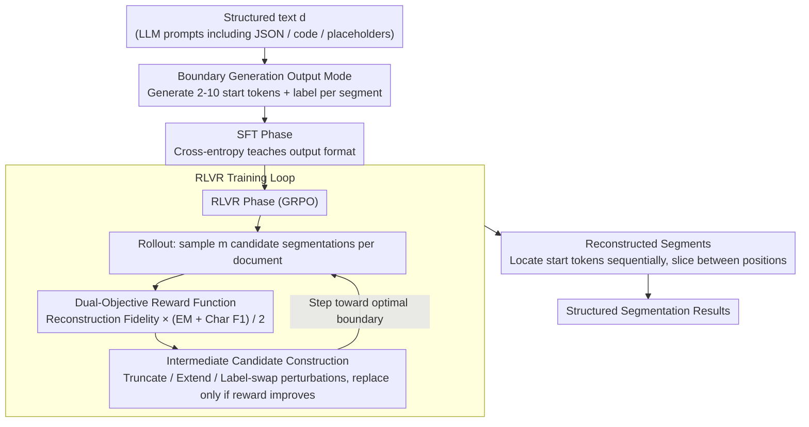

# BoundRL: Efficient Structured Text Segmentation through Reinforced Boundary Generation

**Conference**: ACL 2026 Findings  
**arXiv**: [2510.20151](https://arxiv.org/abs/2510.20151)  
**Code**: None  
**Area**: Text Segmentation/Reinforcement Learning  
**Keywords**: Structured Text Segmentation, Boundary Generation, RLVR, Entropy Collapse, Intermediate Candidate

## TL;DR

BoundRL redefines structured text segmentation as a boundary generation task—generating only the starting tokens of each segment instead of the full text. This reduces output tokens by 90% and eliminates hallucination risks. Combined with RLVR training featuring a dual-objective reward function and selective perturbation strategy, it enables a 1.7B small model to outperform Claude-4 Sonnet in few-shot scenarios.

## Background & Motivation

**Background**: Text segmentation divides text into semantically coherent segments, widely used for document understanding, QA retrieval, and prompt optimization. Traditional methods perform segmentation at the sentence or paragraph level, but structured text (such as LLM prompts) contains code segments, JSON formats, and placeholders that do not conform to traditional sentence-paragraph structures.

**Limitations of Prior Work**: (1) Traditional sentence/paragraph-level segmentation methods are not applicable to structured text; (2) Token-level sequence labeling generates results that are too fragmented; (3) Boundary classification requires classifying every token, leading to excessive computation; (4) Existing LLM methods (e.g., prompting models to generate the full text of each segment) face high inference costs and hallucination risks.

**Key Challenge**: Structured text requires fine-grained token-level segmentation, but methods that generate full segment text exhibit inference costs that grow linearly with input length on long texts and inevitably introduce hallucinations.

**Goal**: Design an efficient token-level structured text segmentation method that simultaneously achieves low inference cost and high segmentation quality.

**Key Insight**: Transform the segmentation problem into boundary generation—only generating the starting token sequence and label for each segment, then locating these tokens in the original text to reconstruct the full segments.

**Core Idea**: By generating only "location information" (starting tokens) rather than "content information" (full text), the output complexity is reduced from $O(|d|)$ to $O(n)$ (where $n$ is the number of segments), while overcoming SFT limitations through customized RLVR training.

## Method

### Overall Architecture

BoundRL aims to solve token-level segmentation of structured text (e.g., LLM prompts) without incurring the high inference costs and hallucination penalties associated with "making the model rewrite every segment verbatim." Its approach reformulates segmentation as **boundary generation**: the model only outputs the starting tokens and labels for each segment. During inference, these starting tokens are located sequentially in the original text, and the text between adjacent starting positions is sliced. Training is divided into two phases—first using SFT to teach the output format, and then using RLVR (Reinforcement Learning from Verifiable Rewards) with a dual-objective reward to boost segmentation quality, employing intermediate candidates constructed via perturbation to counteract entropy collapse.



### Key Designs

**1. Boundary Generation Output Mode: Generating "Location Markers" Instead of Segment Content**

Traditional LLM segmentation requires models to rewrite the full text segment by segment, where output length expands linearly with input, leading to high inference costs on long texts and the risk of generating content not present in the original (hallucinations). BoundRL shifts the output from "content" to "location": for input text $d$, the model generates only a sequence of 2-10 starting tokens $\hat{s}_i$ and a label $\hat{l}_i$ for each segment. During reconstruction, each $\hat{s}_i$ is located chronologically in the original text from left to right; the original text between two adjacent starting positions constitutes a segment. Ordering constraints ensure that even if the same starting token sequence appears multiple times, each occurrence is uniquely assigned to one segment.

This reduces output complexity from $O(|d|)$ to $O(n)$ ($n$ being the number of segments), measured to reduce output tokens by approximately 90%. Moreover, segment text is "clipped" from the original rather than regenerated, fundamentally eliminating hallucinations.

**2. Dual-objective Reward Function: Managing Both "Reconstruction Completeness" and "Segmentation Accuracy"**

Cross-entropy in SFT tends to penalize outputs that correspond to correct boundaries but use different token strings, while under-penalizing subtle token mismatches, making it a poor training signal for boundary generation. BoundRL adopts a continuous reward:

$$r(\hat{T}^L) = \rho_{\text{rec}}(\hat{T}^L) \cdot \frac{\text{EM}(\hat{T}^L) + \text{F1}_{\text{char}}(\hat{T}^L)}{2}$$

where reconstruction fidelity $\rho_{\text{rec}}$ measures how much of the original text can be recovered from the generated segments by character ratio, and the semantic alignment term uses Exact Match (EM) and character-level $\text{F1}_{\text{char}}$ to measure consistency with ground-truth segments. Crucially, different starting token representations for the same boundary receive the same reward, thus no longer penalizing "correct cuts with different wording," while providing smooth and dense feedback for boundary offsets.

**3. Intermediate Candidate Construction: Using Perturbations as "Stepping Stones" to Oppose Entropy Collapse**

Directly using ground-truth sequences as references often places them too far from the model's current distribution, making it difficult for the model to learn and causing RLVR to fall into entropy collapse. During the rollout phase, BoundRL applies three types of small perturbations to candidate segmentations with moderate rewards: truncate segment (remove one word from one end), extend segment (add one word to one end), and replace label. The result with the highest reward is selected as an intermediate candidate, selectively replacing the original candidate only if the reward actually improves (at most $k$ replacements per time). These intermediate candidates are only one step away from the current generation, serving as "stepping stones" between current and optimal solutions, and effectively leveraging the continuous dense reward function.

### A Complete Example

Consider a prompt containing a JSON placeholder: the original text processed by the SFT model generates 3 starting token sequences + labels, such as `("You are", instruction)`, `("```json", schema)`, and `("Return", output_format)`. During reconstruction, these three starting token sequences are located in order within the original text to obtain the boundaries. In the RLVR phase, suppose a candidate segments the second part as `("```json {", schema)` (including an extra `{`), resulting in a moderate reward. The perturbation module tries "truncation" to get `("```json", schema)`, which increases the reward. This is then chosen as an intermediate candidate to replace the original, guiding the model one step closer to the correct boundary—rather than forcing it to align with a distant ground-truth sequence all at once.

### Loss & Training

The SFT phase uses standard cross-entropy loss trained for 1 epoch. The RLVR phase employs GRPO (without standard deviation normalization), with 6 input documents per batch, $m=4$ candidate segmentations sampled per document, and a temperature of 1.2. Checkpoints are saved every 0.2 epochs, with the best model selected based on the validation set.

## Key Experimental Results

### Main Results

**Synthetic Test Set Results (Qwen3-1.7b)**

| Method | $\rho_{\text{rec}}$ | EM | F1_char |
|------|-------|-----|---------|
| SFT | 99.9 | 70.6 | 92.2 |
| SFT+RLVR | 99.9 | 75.2 | 93.5 |
| BoundRL | 99.9 | **77.3** | **94.8** |

**Langchain Test Set Results (Qwen3-1.7b)**

| Method | $\rho_{\text{rec}}$ | EM | F1_char |
|------|-------|-----|---------|
| SFT | 86.9 | 39.1 | 73.5 |
| BoundRL | **90.6** | **47.3** | **76.8** |

### Ablation Study

- BoundRL (Qwen3-1.7b) achieved 47.3% EM on Langchain, surpassing the few-shot prompting performance of Claude-4 Sonnet.
- Intermediate candidate construction yielded consistent improvements over standard RLVR across multiple models.
- RL-PLUS (using reference candidates instead of intermediate candidates) performed slightly worse, validating the hypothesis that intermediate candidates are closer to the model distribution.

### Key Findings

- The boundary generation paradigm reduces output tokens by 90% while maintaining or even improving segmentation quality.
- The dual-objective reward function effectively addresses the inherent limitations of SFT for boundary generation tasks.
- The intermediate candidate strategy provides an effective and low-cost solution to the entropy collapse problem in RLVR.
- A small model with 1.7B parameters trained via BoundRL can outperform the few-shot performance of Claude-4 Sonnet.

## Highlights & Insights

- The approach "generating only location information and not content" is concise and elegant, fundamentally avoiding hallucinations.
- The perturbation strategy for intermediate candidates is cleverly designed, utilizing the continuous characteristics of the reward function.
- The experimental design is comprehensive, covering three base models of different scales.
- The construction of the StructSeg dataset (15.3K annotations) fills a gap in the evaluation of structured text segmentation.

## Limitations & Future Work

- When a starting token sequence cannot be located in the original text, the corresponding segment is discarded.
- Only LLM prompts were used as case studies; the method has not been extended to other structured text types.
- For extremely long documents (e.g., entire books), the number of segments $n$ may still be large.
- Future work could generalize the boundary generation method to domains such as code segmentation and legal document segmentation.

## Related Work & Insights

- Compared to traditional sequence labeling and boundary classification methods, the boundary generation paradigm achieves a better balance between efficiency and quality.
- The intermediate candidate strategy is consistent with the philosophy of curriculum learning.
- provides a valuable design pattern for the application of RLVR in structured output tasks.

## Rating

- Novelty: ⭐⭐⭐⭐⭐ The boundary generation paradigm is a fundamental redefinition of the text segmentation task.
- Experimental Thoroughness: ⭐⭐⭐⭐ Complete multi-model, multi-baseline, and ablation experiments.
- Writing Quality: ⭐⭐⭐⭐ Method is clearly explained with intuitive illustrations.

<!-- RELATED:START -->

<div class="related-papers" markdown="1">

## Related Papers

- [\[ACL 2026\] Reasoning-Based Refinement of Unsupervised Text Clusters with LLMs](reasoning-based_refinement_of_unsupervised_text_clusters_with_llms.md)
- [\[ACL 2026\] Exploring Concreteness Through a Figurative Lens](exploring_concreteness_through_a_figurative_lens.md)
- [\[ACL 2026\] Accurate and Efficient Statistical Testing for Word Semantic Breadth](accurate_and_efficient_statistical_testing_for_word_semantic_breadth.md)
- [\[ACL 2026\] LLM-Guided Semantic Bootstrapping for Interpretable Text Classification with Tsetlin Machines](llm-guided_semantic_bootstrapping_for_interpretable_text_classification_with_tse.md)
- [\[ACL 2026\] Agree, Disagree, Explain: Decomposing Human Label Variation in NLI through the Lens of Explanations](agree_disagree_explain_decomposing_human_label_variation_in_nli_through_the_lens.md)

</div>

<!-- RELATED:END -->
