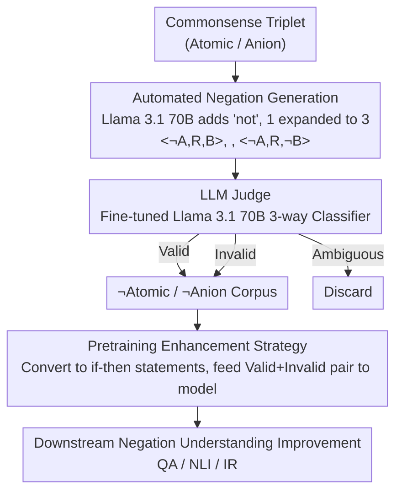

# Commonsense Knowledge with Negation: A Resource to Enhance Negation Understanding

**Conference**: ACL 2026 Findings  
**arXiv**: [2604.19921](https://arxiv.org/abs/2604.19921)  
**Code**: [https://github.com/wang-zijie/commonsense_with_negation](https://github.com/wang-zijie/commonsense_with_negation)  
**Area**: LLM Pretraining  
**Keywords**: Commonsense Knowledge, Negation Understanding, Knowledge Base Enhancement, Negation Reasoning, Pretraining

## TL;DR

Ours proposes an automated method to augment existing commonsense knowledge bases with negation, constructing a negation commonsense corpus of over 2 million triplets ($\neg \text{Atomic}$ and $\neg \text{Anion}$), and demonstrates that pretraining on this corpus enhances the negation understanding capabilities of LLMs.

## Background & Motivation

**Background**: Commonsense knowledge has been extensively studied, leading to the construction of large-scale knowledge bases such as Atomic and ConceptNet, while LLMs have achieved success across various NLU tasks.

**Limitations of Prior Work**: (1) LLMs struggle with natural language understanding tasks involving negation, yet prior research is limited to encoder models like BERT and early LLMs like GPT-3; (2) The intersection of commonsense knowledge and negation remains largely unexplored; (3) Anion, the only commonsense knowledge base involving negation, only negates "if" events through extensive human annotation and fails to consider the negation of "then" events.

**Key Challenge**: Negation appears in approximately 25% of English sentences and is a crucial semantic feature; however, existing commonsense knowledge bases contain almost no negation, leading to inadequate negation understanding in LLMs.

**Goal**: To automatically add negation to existing commonsense knowledge bases, construct a large-scale negation commonsense corpus, and utilize it to improve the negation understanding of LLMs.

**Key Insight**: It is observed that negating the "if" event, the "then" event, or both can sometimes yield new triplets that still align with commonsense, allowing existing corpora to be expanded by up to 3 times.

**Core Idea**: By automatically negating the "if/then" events of commonsense triplets and training a specialized LLM judge to verify validity, a large-scale commonsense knowledge corpus containing negation is constructed. Subsequent pretraining enhances downstream negation understanding.

## Method

### Overall Architecture

Given a commonsense triplet $\langle A, R, B \rangle$, the "if" event ($A$), the "then" event ($B$), or both are negated by adding "not" before the main verb or modifier, generating three new triplets: $\langle \neg A, R, B \rangle$, $\langle A, R, \neg B \rangle$, and $\langle \neg A, R, \neg B \rangle$. Subsequently, an LLM judge is trained to verify whether each new triplet is Valid (consistent with commonsense), Invalid (violates commonsense), or Ambiguous. Finally, the validated corpus is used for LLM pretraining.

### Key Designs

**1. Automated Negation Generation: Expanding KBs 3x by simply adding "not"**

A major pain point for negation commonsense bases like Anion is that they only negate "if" events and require significant human annotation for new "then" events, resulting in high costs and narrow coverage. Ours automates this: Llama 3.1 70B is used to insert "not" before the main verbs or modifiers of the "if" event, the "then" event, or both. One triplet $\langle A, R, B \rangle$ generates three new ones: $\langle \neg A, R, B \rangle$, $\langle A, R, \neg B \rangle$, and $\langle \neg A, R, \neg B \rangle$ (e.g., $\langle \text{PersonX studies hard}, \text{therefore}, \text{PersonX performs well} \rangle$ can be negated to $\langle \text{PersonX does not study hard}, \text{therefore}, \text{PersonX performs well} \rangle$). This automated rewriting requires no human labeling and naturally covers "then" event negations ignored by Anion. Manual evaluation of 200 instances confirmed a syntactic accuracy of 99%.

**2. LLM Judge: Automatically identifying which negated triplets remain commonsense**

Negated triplets are not necessarily valid (e.g., negating a "then" event often leads to direct contradiction); thus, a verifier is needed to separate Valid, Invalid, and Ambiguous cases. The authors first tested SOTA models like GPT-4o and Claude Sonnet 3.5, finding they performed poorly on this task (F1 only 0.52–0.56)—reflecting how unexplored the "negation $\times$ commonsense" intersection is. Consequently, Llama 3.1 70B was trained using supervised fine-tuning (QLoRA 4-bit quantization) as a specialized judge, increasing F1 to 0.63, with Valid precision at 0.70 and Invalid precision at 0.79, sufficient for batch filtering.

**3. Pretraining Enhancement Strategy: Feeding both Valid + Invalid to learn negation semantics**

The ultimate goal is to improve LLM negation understanding. The authors converted validated triplets into natural language if-then statements for pretraining and evaluated them on five downstream benchmarks across QA, NLI, and IR tasks. A key decision was to include **both** Valid and Invalid triplets in the pretraining data rather than only Valid ones. To learn the semantics of negation, the model requires both positive examples where the statement remains true after negation and negative examples where it becomes contradictory; learning from only one side fails to capture how negation alters propositional truth values.

### Loss & Training

The judge was trained using supervised fine-tuning with QLoRA 4-bit quantization on Llama 3.1 8B/70B. The training data consisted of 5,400 triplets (200 per relation per label). During the pretraining phase, commonsense triplets were transformed into natural language if-then statements.

## Key Experimental Results

### Main Results (Judge Validation)

| Model | Overall F1 | Overall Acc | Valid P | Invalid P |
|------|---------|---------|---------|-----------|
| GPT-4o (few-shot) | 0.52 | 0.54 | 0.71 | 0.54 |
| Claude Sonnet 3.5 (few-shot) | 0.56 | 0.56 | 0.83 | 0.51 |
| Llama 3.1 70B (fine-tuned) | 0.63 | 0.64 | 0.70 | 0.79 |

### Corpus Statistics

| Corpus | Total Triplets | Valid | Invalid | Ambiguous |
|--------|-----------|-------|---------|-----------|
| $\neg \text{Atomic}$ | 1,798k | 681k (37.9%) | 463k (25.8%) | 652k (36.3%) |
| $\neg \text{Anion}$ | 285k | 104k (36.4%) | 46k (16.1%) | 135k (47.5%) |

### Key Findings
- Negating the "then" event is more likely to yield Invalid triplets (63.6%), while negating the "if" event while keeping the original "then" event mostly remains Valid (83.7%).
- Triplets where both "if" and "then" events are negated show a more balanced distribution (Valid 48.0%, Invalid 9.1%, Ambiguous 42.9%).
- Even SOTA models like GPT-4o and Claude Sonnet 3.5 demonstrate limited performance in negation commonsense judgment.
- Pretraining on the negation commonsense corpus improves LLM negation understanding across three downstream tasks: QA, NLI, and Information Retrieval.

## Highlights & Insights
- The method is extremely simple yet effective: merely adding "not" expands commonsense knowledge bases by 3x without requiring manual annotation of new "then" events.
- A "generation-evaluation gap" in LLMs was identified: models excel at evaluation but deviate from privacy/commonsense norms during generation, consistent with observations in the CI field.
- Both Valid and Invalid triplets contribute to improving negation understanding, suggesting models need exposure to both positive and negative examples.

## Limitations & Future Work
- The automated verifier's precision is limited (F1 0.63), which may introduce noisy labels.
- Currently only verified in English; negation performance varies significantly across different languages.
- Pretraining effectiveness may depend on the alignment between the base model and data volume.
- Future work could explore more complex forms of negation (e.g., double negation, implicit negation).

## Related Work & Insights
- **vs Anion**: Anion only negates "if" events and requires manual labels for new "then" events; ours automatically negates if/then/both without human intervention.
- **vs COMET**: COMET generates new "then" events; ours retains original events and only adds negation, ensuring better control.
- **vs UNcommonsense**: UNcommonsense focuses on explanations for rare/uncommon scenarios; ours focuses on the impact of negation on commonsense reasoning.

## Rating
- Novelty: ⭐⭐⭐⭐ First to systematically integrate negation into commonsense KBs, with a simple and elegant approach.
- Experimental Thoroughness: ⭐⭐⭐⭐ Evaluated across three tasks and five benchmarks, with thorough training of the judge.
- Writing Quality: ⭐⭐⭐⭐ Clear motivation, intuitive methodology, and detailed analysis.
- Value: ⭐⭐⭐ High resource contribution value, though the current application scope is relatively specific.

<!-- RELATED:START -->

## Related Papers

- [\[ACL 2026\] Filling the Gap: Is Commonsense Knowledge Generation useful for Natural Language Inference?](filling_the_gap_is_commonsense_knowledge_generation_useful_for_natural_language_.md)
- [\[ACL 2026\] Creating ConLangs to Probe the Metalinguistic Grammatical Knowledge of LLMs](creating_conlangs_to_probe_the_metalinguistic_grammatical_knowledge_of_llms.md)
- [\[ACL 2026\] Knowledge-driven Augmentation and Retrieval for Integrative Temporal Adaptation](knowledge-driven_augmentation_and_retrieval_for_integrative_temporal_adaptation.md)
- [\[ACL 2025\] Recursive Question Understanding for Complex Question Answering over Heterogeneous Personal Data](../../ACL2025/nlp_understanding/recursive_question_understanding_for_complex_question_answering_over_heterogeneo.md)
- [\[ACL 2025\] iQUEST: An Iterative Question-Guided Framework for Knowledge Base Question Answering](../../ACL2025/nlp_understanding/iquest_an_iterative_question-guided_framework_for_knowledge_base_question_answer.md)

<!-- RELATED:END -->
