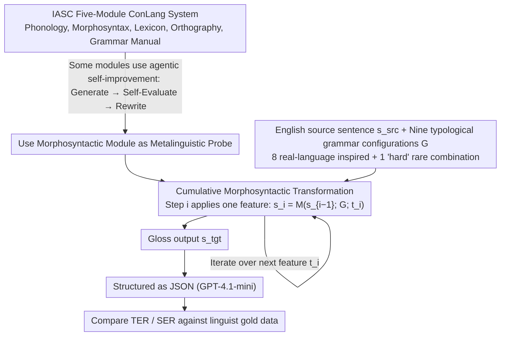

# Creating ConLangs to Probe the Metalinguistic Grammatical Knowledge of LLMs

**Conference**: ACL 2026  
**arXiv**: [2510.07591](https://arxiv.org/abs/2510.07591)  
**Code**: [https://github.com/SakanaAI/IASC](https://github.com/SakanaAI/IASC)  
**Area**: LLM Agent  
**Keywords**: Constructed Languages (ConLangs), Metalinguistic Knowledge, Morphosyntactic Transformation, LLM Probing, Linguistic Typology

## TL;DR

This paper introduces IASC (Interactive Agentic System for ConLangs), a modular constructed language generation system. By requiring LLMs to execute morphosyntactic transformations based on linguistic specifications, the study probes their metalinguistic knowledge. Findings reveal that LLMs handle common linguistic typological patterns significantly better than rare ones, and performance varies drastically across different models.

## Background & Motivation

**Background**: Extensive research focuses on the linguistic capabilities of LLMs, including translation and syntactic labeling. However, these tasks evaluate knowledge of specific languages rather than an understanding of linguistic concepts themselves. Do LLMs truly "understand" abstract linguistic concepts (e.g., word order, case marking, agreement) rather than just memorizing patterns of specific languages from training data?

**Limitations of Prior Work**: (1) Existing evaluations of LLM linguistic abilities often rely on encyclopedic tests (knowing a fact about a language), lacking a systematic probe of metalinguistic reasoning; (2) Natural language tests are susceptible to training data leakage, where LLMs might "remember" answers instead of truly understanding rules.

**Key Challenge**: While LLMs encounter vast amounts of linguistic literature and multilingual data during training, this does not guarantee they can manipulate language structures according to given abstract grammatical rules. For instance, changing the word order of an English sentence from SVO to OVS (an extremely rare word order) is in principle no harder than changing it to SOV, yet LLM performance may differ drastically.

**Goal**: (1) Provide a flexible and engaging tool for constructing artificial languages; (2) Utilize morphosyntactic transformation tasks to systematically probe LLM metalinguistic knowledge across various linguistic typological features.

**Key Insight**: Building a Constructed Language (ConLang) requires LLMs to go beyond translation; they must restructure sentences and add morphological markings based on abstract specifications—directly testing the depth of their understanding of linguistic concepts.

**Core Idea**: Use a modular ConLang construction system as a benchmark. Quantify metalinguistic capabilities by requiring LLMs to transform English sentences according to different morphosyntactic parameters (word order, case systems, tense marking, etc.).

## Method

### Overall Architecture

IASC is a complete ConLang construction pipeline consisting of five modules: Phonology, Morphosyntax, Lexicon, Orthography, and Grammar Manual. However, the study specifically utilizes the Morphosyntax module as a "probe": given an English source sentence and a set of target grammatical specifications, the LLM must restructure the sentence and produce gloss annotations. Crucially, this transformation is not performed in a single step. Instead, each grammatical feature is isolated and applied cumulatively. Nine sets of grammatical configurations, covering common to extremely rare typological combinations, are used to quantify which linguistic phenomena the LLM truly understands versus which ones are merely memorized high-frequency patterns.

### Key Designs

**1. Cumulative Morphosyntactic Transformation: Decomposing "Simultaneous Fulfillment" into Feature-by-Feature Superposition**

Preliminary experiments showed that feeding the entire grammatical specification to the LLM for a single-step transformation yielded poor results—the prompts were too complex for models to track word order, case marking, and tense constraints simultaneously. IASC employs an iterative cumulative transformation: each step applies only one grammatical feature. Based on the previous result $s_{i-1}$, the model uses a prompt $t_i$ focused on a single feature to produce $s_i = M(s_{i-1}; G; t_i)$ (e.g., first changing SVO to the target word order, then adding case markers, then tense markers). The cognitive load per step is minimal, significantly improving adherence to constraints compared to single-step transformations.

**2. Nine Typologically Diverse Grammar Configurations: Using Typological Frequency to Test "True Rule Understanding"**

To distinguish between "understanding abstract rules" and "memorizing high-frequency patterns," the authors designed nine grammar configurations: eight inspired by real languages (Arabic, Fijian, French, Hixkaryana, Mizo, Turkish, Vietnamese, Welsh) and one "hard" configuration stacking extremely rare combinations. Each specifies parameters like word order, case system, agreement, and tense. The evaluation set consists of 45 source sentences × 9 configurations = 405 test samples, with gold data manually annotated by linguists. Since the difficulty of the transformation itself is independent of typological frequency (changing SVO to OVS is theoretically no harder than SOV), systematic performance drops in rare configurations indicate a reliance on training distribution rather than abstract rules.

**3. Agentic Self-Improvement Mechanism: Fixing Initial Bias through Self-Correction**

An LLM's first output may not perfectly align with specifications. Thus, an agentic workflow is introduced for some modules (e.g., Phonology): the model generates an initial output, automatically writes a critique/feedback for it, and then rewrites it based on that feedback. This internalizes the "review-revise" cycle, using the model's own second check to catch violations missed in the first round. Experiments show that this refinement is effective for specific modules but does not benefit all of them equally.

## Key Experimental Results

### Main Results

| Model | 'french' (Common) | 'turkish' (Common) | 'mizo' (Rare) | 'hard' (Extremely Rare) | Overall Performance |
|------|----------------|-----------------|---------------|----------------|---------|
| GPT-4.1 | Low TER | Low TER | Medium TER | Higher TER | Best |
| Claude 3.7 | Low TER | Low TER | Medium-High TER | High TER | Second |
| Gemini 2.5 | Medium TER | Medium TER | High TER | Very High TER | Medium |
| Smaller Models | High TER | High TER | Very High TER | Extremely High TER | Poor |

### Ablation Study

| Configuration | Effect | Description |
|------|------|------|
| Cumulative vs. Single-step | Cumulative is far superior | LLMs fail to follow multiple constraints in single-step transformations |
| Common vs. Rare Typological Features | Common is far superior | LLMs handle SVO/SOV well but perform poorly on OVS/OSV |
| Morphological Marking (Prefix vs. Suffix) | Suffix is better | Consistent with the higher frequency of suffixes in training data |
| With vs. Without Agentic Refinement | Occasional improvement | Not all modules benefit from the refinement process |

### Key Findings

- LLM performance on common linguistic typological patterns (e.g., SVO/SOV word orders, suffixation) is significantly better than on rare patterns (e.g., OVS word order, prefixation), correlating strongly with the frequency of these features in world languages.
- Massive disparity in capabilities: GPT-4.1 performs best across most configurations, while smaller models almost entirely fail on rare configurations.
- The "hard" configuration (containing extremely rare combinations) is highly challenging for all models, suggesting that metalinguistic knowledge is still heavily constrained by training data distribution.

## Highlights & Insights

- **ConLangs as Probing Tools**: An ingenious experimental design—Constructed Languages avoid training data leakage and allow for precise control of linguistic variables, resulting in highly interpretable evaluations.
- **Revealing the Nature of LLM "Linguistic Knowledge"**: LLMs do not truly "understand" linguistic concepts; they rely on pattern distributions in training data. The correlation between performance and typological frequency suggests their capability is rooted in statistical association rather than abstract rule comprehension.
- **Cumulative Transformation Strategy**: Breaking complex multi-constraint problems into sequential single-constraint transformations is a versatile prompt engineering strategy applicable to other multi-step reasoning scenarios.

## Limitations & Future Work

- The evaluation dataset (405 samples) is relatively small and may not capture all interaction effects between grammatical features.
- The study only uses English as a source language; the effects of transformations starting from other languages remain unexplored.
- Gold data for the morphosyntactic module was annotated by a single linguist, which may introduce annotator bias.
- While the authors attempted to apply the method to low-resource language translation, results were mostly negative, indicating a gap before practical application.
- The 53-page paper contains extensive appendices; the core contributions could be more concise.

## Related Work & Insights

- **vs. ConlangCrafter (Alper et al., 2025)**: Also works on LLM-driven ConLang construction, but IASC offers finer granularity in the morphosyntactic module, supporting feature-by-feature probing.
- **vs. Traditional LLM Linguistic Tests**: Unlike BLiMP or SyntaxGym, which test LLM judgments of specific linguistic phenomena, IASC requires active manipulation of linguistic structures, which is significantly more difficult.
- **vs. Diamond (2023)**: While earlier work used simple prompts with ChatGPT to generate ConLangs, IASC introduces systematic modular control and typological evaluation.

## Rating

- Novelty: ⭐⭐⭐⭐⭐ Probing metalinguistic knowledge via ConLang construction is a highly original and profound research perspective.
- Experimental Thoroughness: ⭐⭐⭐⭐ Nine grammar configurations cover rich typological diversity, though the sample size per configuration is small.
- Writing Quality: ⭐⭐⭐⭐ The paper is extremely detailed (53 pages) with a strong linguistic background, though it is somewhat verbose.
- Value: ⭐⭐⭐⭐⭐ Provides critical insights into the nature of LLM linguistic knowledge; the IASC tool itself possesses independent value.

<!-- RELATED:START -->

## Related Papers

- [\[ACL 2026\] Knowledge-driven Augmentation and Retrieval for Integrative Temporal Adaptation](knowledge-driven_augmentation_and_retrieval_for_integrative_temporal_adaptation.md)
- [\[ACL 2026\] Filling the Gap: Is Commonsense Knowledge Generation useful for Natural Language Inference?](filling_the_gap_is_commonsense_knowledge_generation_useful_for_natural_language_.md)
- [\[ACL 2026\] Commonsense Knowledge with Negation: A Resource to Enhance Negation Understanding](commonsense_knowledge_with_negation_a_resource_to_enhance_negation_understanding.md)
- [\[ACL 2026\] Reasoning-Based Refinement of Unsupervised Text Clusters with LLMs](reasoning-based_refinement_of_unsupervised_text_clusters_with_llms.md)
- [\[ACL 2026\] Can LLMs Estimate Cognitive Complexity of Reading Comprehension Items?](can_llms_estimate_cognitive_complexity_of_reading_comprehension_items.md)

<!-- RELATED:END -->
