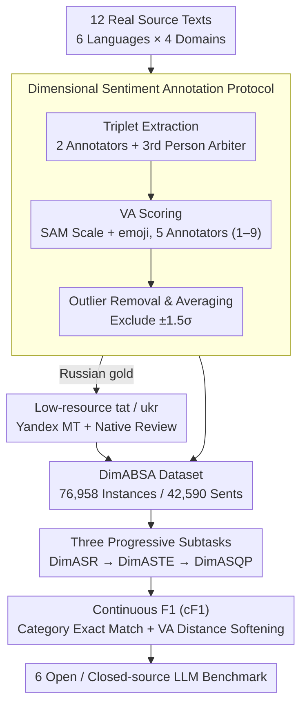

# DimABSA: Building Multilingual and Multidomain Datasets for Dimensional Aspect-Based Sentiment Analysis

**Conference**: ACL 2026  
**arXiv**: [2601.23022](https://arxiv.org/abs/2601.23022)  
**Code**: https://github.com/DimABSA/DimABSA2026 (Available)  
**Area**: Multilingual / Sentiment Analysis / Evaluation Benchmark  
**Keywords**: ABSA, Dimensional Sentiment, Valence-Arousal, Multilingual, cF1

## TL;DR
The authors constructed DimABSA, the first multilingual (6 languages) and multi-domain (4 domains) dimensional aspect-based sentiment analysis dataset (76,958 aspect instances / 42,590 sentences). It replaces traditional "positive/negative/neutral" tri-classification with continuous valence–arousal scores, designs three new subtasks and a unified metric cF1, and evaluates 6 open/closed-source LLMs systematically.

## Background & Motivation

**Background**: Traditional ABSA (Aspect-Based Sentiment Analysis) has followed a standard paradigm since SemEval-2014 involving (aspect term, aspect category, opinion term, polarity) quadruplets. The prevailing approach relies on a pipeline of extraction and classification into coarse-grained categories: positive, negative, and neutral.

**Limitations of Prior Work**: Coarse-grained labels fail to capture subtle differences in sentiment intensity. For instance, "good" and "excellent" are both labeled as positive, while "a little slow" and "extremely slow" are both negative, despite having vastly different semantic intensities. Information regarding lexical intensity and sentiment modifiers (slightly, very, tremendously) is lost in polarity labels.

**Key Challenge**: Sentiment is inherently continuous. Affective science, particularly Russell’s circumplex model, represents sentiment in a 2D continuous space of valence × arousal. However, ABSA labels are discrete, resulting in: (1) zero discriminative power for fine-grained differences within the same polarity; and (2) difficulty in transferring across tasks such as emotion dynamics or mental health labeling.

**Goal**: To upgrade ABSA from "categorical prediction" to a hybrid task of "continuous dimensional regression + category extraction," ensuring (i) multilinguality including low-resource languages; (ii) multi-domain coverage; and (iii) unified evaluation metrics.

**Key Insight**: Leveraging the Self-Assessment Manikin (SAM) annotation protocol from psychology and auxiliary emojis, valence (1–9) and arousal (1–9) are treated as continuous labels. Each tuple is scored by 5 annotators, with outliers beyond $\pm 1.5\sigma$ removed before calculating the mean to reduce noise to an acceptable range.

**Core Idea**: Replace the (A, C, O, polarity) quadruplet with a (A, C, O, V#A) quintuplet. Design a Continuous F1 (cF1) for the hybrid "categorical extraction + continuous regression" task, where a categorical TP is counted only if categories match exactly, with VA distance then converted into a soft score in $[0,1]$.

## Method

DimABSA is presented as a comprehensive suite comprising a dataset, subtasks, evaluation metrics, and an LLM benchmark.

### Overall Architecture

Input consists of raw texts crawled from 12 real-world sources including Yelp, Amazon, Rakuten Travel, EDINET, SemEval-2016, SIGHAN-2024, Mobile01, and MOPS. It covers 6 languages (English, Japanese, Russian, Tatar, Ukrainian, Chinese) across 4 domains (restaurant, laptop, hotel, finance), totaling 10 sub-datasets. The pipeline follows two stages:

1.  **Triplet Extraction Stage**: Two annotators independently label (A, C, O). A third person adjudicates inconsistencies; otherwise, the instance is discarded.
2.  **VA Scoring Stage**: Using the SAM scale and VA emojis, five annotators assign V (1–9) and A (1–9) to each confirmed tuple, followed by mean calculation after removing $\pm 1.5\sigma$ outliers.

Tatar and Ukrainian are low-resource languages obtained via machine translation of Russian data (Yandex Translate) followed by native speaker review (45.5% of Tatar and 35.6% of Ukrainian were manually revised).

### Key Designs

**1. Dimensional Sentiment Annotation Protocol: Replacing Polarity Classification with Continuous Valence–Arousal Coordinates**

Coarse labels discard intensity information. DimABSA upgrades the polarity of each aspect tuple to a pair of continuous scores $(V, A) \in [1,9]^2$. Valence measures positivity (1 = extremely negative, 5 = neutral, 9 = extremely positive), and arousal measures activation (1 = calm, 9 = excited). The annotation interface uses the SAM pictorial scale and emojis for anchoring. Each tuple is scored by 5 people, and the final value is $\hat{r} = \mathrm{mean}(\{r_i : |r_i - \mu| \le 1.5\sigma\})$. Arousal is notoriously harder to label than valence, but multi-annotation and outlier removal reduced arousal RMSE to the 0.76–2.29 range. The resulting data follows a typical "U-shaped distribution," where arousal is higher at valence extremes and lower at neutral, validating annotation quality via psychological consistency.

**2. Progressive Subtasks (DimASR → DimASTE → DimASQP): From "Pure Regression" to "Extraction + Classification + Regression"**

Three subtasks are designed with increasing complexity: DimASR predicts V#A given text + aspect (pure regression, evaluated by RMSE); DimASTE extracts (A, O) before predicting VA (extraction + regression, evaluated by cF1); DimASQP adds aspect category $C$ classification (extraction + classification + regression, evaluated by cF1). This layering allows focused evaluation of LLM capabilities. DimASR shows that one-shot prompting significantly calibrates VA distributions, while DimASTE/DimASQP require $\ge$70B parameters and fine-tuning to master structural patterns.

**3. Continuous F1 (cF1): Unified Evaluation of "Categorical Correctness" and "VA Deviation" within an F1 Framework**

Traditional F1 wastes continuous VA information, while reporting F1 and RMSE separately complicates model comparison. cF1 first identifies a categorical TP (exact match of (A, O) or (A, C, O)), then softens it based on VA error: for $t \in P_{cat}$, $\mathrm{cTP}^{(t)} = 1 - \mathrm{dist}(\mathrm{VA}_p, \mathrm{VA}_g)$, else 0. The normalized Euclidean distance is $\mathrm{dist} = \sqrt{(V_p-V_g)^2 + (A_p-A_g)^2} / \sqrt{128}$, where $\sqrt{128}$ is the maximum possible distance in $[1,9]^2$. cPrecision and cRecall are calculated based on cTP. cF1 degrades to standard F1 when VA is perfect ($\mathrm{dist} = 0$) and decays smoothly as VA error increases.

### Loss & Training
The study benchmarks models rather than proposing a new architecture:
- **Zero/few-shot**: Accesses GPT-5 mini and Kimi K2 Thinking via API. $k$ samples from the training set are used as in-context examples.
- **Supervised fine-tuning**: Qwen3-14B, Ministral-3-14B, Llama-3.3-70B, and GPT-OSS-120B are trained using 4-bit QLoRA with AdamW, linear scheduler, $lr = 2e-5$, $batch = 4$, and 5 epochs on H200 hardware using Hugging Face Transformers.

## Key Experimental Results

### Main Results: Multilingual and Subtask Comparison (Selected Data)

DimASR uses RMSE (lower is better); DimASTE/DimASQP use cF1 (higher is better).

| Subtask | Dataset | GPT-5 mini (0-shot) | Kimi K2 (0-shot) | Llama-3.3 70B (FT) | GPT-OSS 120B (FT) |
|---------|---------|---------------------|------------------|---------------------|--------------------|
| DimASR (RMSE↓) | eng-rest | 2.949 | 2.343 | 2.524 | **1.461** |
| DimASR (RMSE↓) | jpn-hot | 3.141 | 2.329 | 2.626 | **0.719** |
| DimASR (RMSE↓) | zho-fin | 2.655 | 2.966 | 2.563 | **0.651** |
| DimASR (RMSE↓) | AVG (10 langs) | 2.760 | 2.344 | 2.567 | **1.192** |
| DimASTE (cF1↑) | eng-rest | 0.499 | 0.510 | 0.542 | **0.544** |
| DimASTE (cF1↑) | jpn-hot | 0.173 | 0.315 | 0.469 | **0.540** |
| DimASTE (cF1↑) | AVG | 0.353 | 0.379 | **0.464** | 0.457 |
| DimASQP (cF1↑) | eng-rest | 0.404 | 0.374 | **0.505** | 0.501 |
| DimASQP (cF1↑) | AVG | 0.225 | 0.254 | **0.386** | 0.373 |

Observations: (i) In DimASR, 120B fine-tuning halves the RMSE, while 14B/70B models struggle compared to prompting baselines. (ii) In DimASTE/DimASQP, 70B and 120B models perform similarly, while 14B is insufficient. (iii) Tatar remains the weakest language; Chinese and Japanese performance approaches English after fine-tuning.

### Ablation Study: Few-shot Examples vs. cF1 (GPT-5 mini)

| Configuration | DimASR (avg RMSE) | DimASTE (avg cF1) | DimASQP (avg cF1) | Description |
|------|-------------------|--------------------|--------------------|------|
| 0-shot | 2.760 | 0.353 | 0.225 | No examples |
| 1-shot | 2.155 | 0.348 | 0.234 | DimASR improves significantly; structural tasks remain unchanged |
| 32-shot | ~1.9 (plateau) | ~0.40 | ~0.26 | Performance nears plateau |
| 256-shot | ~1.9 | ~0.41 | ~0.27 | Still worse than FT baselines |
| **FT 120B** | **1.192** | – | – | Best DimASR across all baselines |
| **FT 70B** | – | **0.464** | **0.386** | Best cF1 across all baselines |

### Key Findings
- **Regression is highly sensitive to examples**: A single example can calibrate the VA scale. 1-shot prompts immediate alignment with gold distributions, but gains saturate after 32-shot.
- **Structural extraction requires scale and fine-tuning**: In DimASTE/DimASQP, fine-tuning 14B models often harms cF1, while 70B models show a qualitative leap, indicating that structural patterns in underrepresented languages require sufficient capacity.
- **Higher category counts lead to performance drops**: DimASQP drops 0.07–0.1 cF1 compared to DimASTE. The laptop domain (148 categories) suffers more than restaurants (18 categories).
- **MT + manual review** is viable for low-resource languages (Tatar/Ukrainian), though Tatar remains the weakest language, suggesting translation signals cannot fully bridge structural gaps.
- **Arousal is more difficult than valence**: Arousal RMSE consistently exceeds valence RMSE across all languages.

## Highlights & Insights
- **cF1 is an elegant design for hybrid tasks**: By normalizing Euclidean distance as $1 - \mathrm{dist}/\sqrt{128}$, it penalizes categorical errors while allowing soft decay for VA deviations. This approach is portable to any "classification then regression" task.
- **The U-shaped VA distribution as a sanity check**: The consistency of the U-shaped distribution across 10 datasets validates the annotation quality. Domain-specific differences (e.g., narrower arousal in finance) further prove data reliability.
- **"Regression vs. Extraction" as distinct LLM capabilities**: DimASR requires calibration (1-shot is enough), whereas DimASTE requires structural induction (256-shot is insufficient). Benchmarks should decouple these capabilities.
- **MT + Review transparency**: Providing manual revision statistics (Tatar 45.5%, Ukrainian 35.6%) sets a high standard for transparent low-resource dataset construction.

## Limitations & Future Work
- **Cross-cultural sentiment interpretation**: Valence/arousal scales shift across cultures (e.g., more centralized in East Asian data), making direct numerical comparisons difficult.
- **Compressed signals in MT data**: Tatar and Ukrainian labels were projected from Russian gold data, implying that low performance in these languages might reflect projection noise.
- **Limited domain coverage for subtasks**: The finance domain lacks (A, C, O) labels, preventing systematic complexity comparisons between finance and reviews in structural tasks.
- **Model selection**: The evaluation focused on recent LLMs (2024–2025) without comparing against traditional SOTA encoder-based ABSA models (e.g., InstructABSA).
- **Future directions**: (i) Culture-invariant VA metrics; (ii) Multi-task models that jointly learn categories and VA; (iii) Extension to document-level or conversational dimensional ABSA.

## Related Work & Insights
- **vs. M-ABSA (Wu 2025)**: M-ABSA is multilingual but uses categorical polarity. DimABSA is broader in dimension (continuous VA) and domains.
- **vs. SIGHAN-2024 Chinese DimABSA (Lee 2024)**: This work serves as the direct successor, expanding from monolingual restaurant reviews to 6 languages and 4 domains with new metrics.
- **vs. SemEval-2014/15/16 ABSA**: It naturally extends the traditional (A, C, O, polarity) quadruplet by upgrading polarity to VA.
- **vs. NRC-VAD lexicon (Mohammad 2018)**: NRC-VAD provides word-level VA; DimABSA provides aspect-level VA within an ABSA pipeline.

## Rating
- Novelty: ⭐⭐⭐⭐ First multilingual/multi-domain dimensional ABSA dataset + cF1 metric.
- Experimental Thoroughness: ⭐⭐⭐⭐ Extensive benchmark across 10 datasets and 6 LLMs, though missing comparisons with non-LLM baselines.
- Writing Quality: ⭐⭐⭐⭐ Clear structure with density in tables and formulas; includes full examples for metric derivation.
- Value: ⭐⭐⭐⭐⭐ High community impact as a SemEval-2026 track; data and code are fully open-sourced.

<!-- RELATED:START -->

## Related Papers

- [\[ACL 2026\] MSMO-ABSA: Multi-Scale and Multi-Objective Optimization for Cross-Lingual Aspect-Based Sentiment Analysis](msmo-absa_multi-scale_and_multi-objective_optimization_for_cross-lingual_aspect-.md)
- [\[ACL 2025\] Dynamic Order Template Prediction for Generative Aspect-Based Sentiment Analysis](../../ACL2025/nlp_understanding/dot_absa_template.md)
- [\[ACL 2026\] A Computational Method for Measuring "Open Codes" in Qualitative Analysis](a_computational_method_for_measuring_34open_codes34_in_qualitative_analysis.md)
- [\[ACL 2025\] SynGraph: A Dynamic Graph-LLM Synthesis Framework for Sparse Streaming User Sentiment Analysis](../../ACL2025/nlp_understanding/syngraph_a_dynamic_graph-llm_synthesis_framework_for_sparse_streaming_user_senti.md)
- [\[ACL 2026\] MADE: A Living Benchmark for Multi-Label Text Classification with Uncertainty Quantification](made_a_living_benchmark_for_multi-label_text_classification_with_uncertainty_qua.md)

<!-- RELATED:END -->
