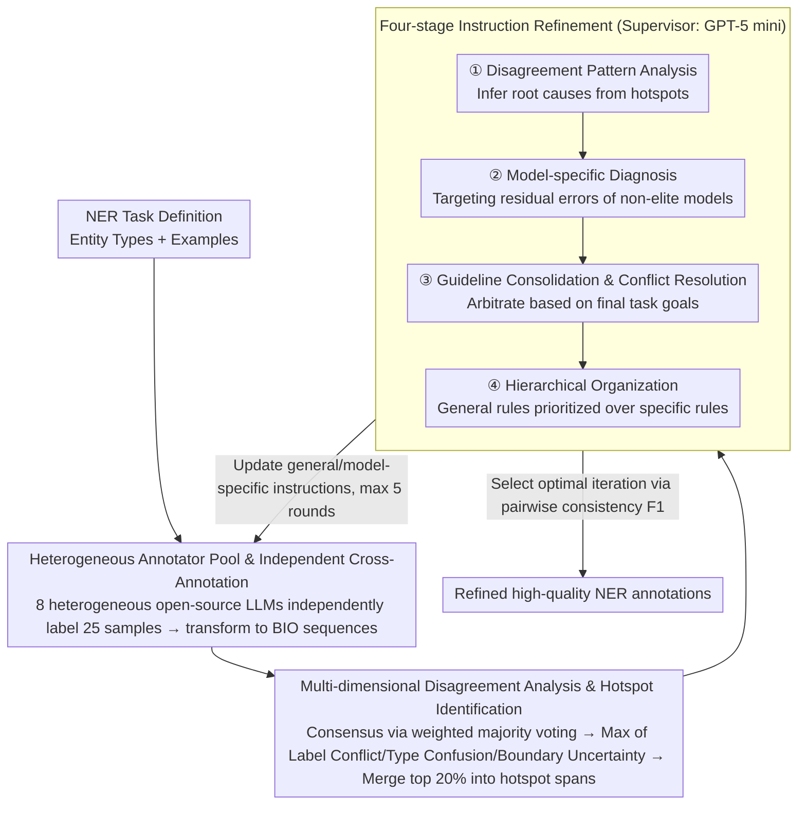

# DiZiNER: Disagreement-guided Instruction Refinement via Pilot Annotation Simulation for Zero-shot Named Entity Recognition

**Conference**: ACL 2026  
**arXiv**: [2604.15866](https://arxiv.org/abs/2604.15866)  
**Code**: [https://github.com/SiunKim/diziner-ner/](https://github.com/SiunKim/diziner-ner/)  
**Area**: LLM Evaluation  
**Keywords**: Zero-shot NER, Disagreement-guided, Instruction Refinement, Pilot Annotation Simulation, Multi-model Assembly

## TL;DR

DiZiNER achieves zero-shot SOTA on 14 out of 18 NER benchmarks by simulating the "pilot annotation" process from human labeling. It utilizes multiple heterogeneous LLMs as annotators and a supervisor LLM to analyze inter-model disagreements and iteratively refine task instructions, resulting in an average improvement of +8.0 F1 and outperforming its supervisor (GPT-5 mini).

## Background & Motivation

**Background**: Large Language Models (LLMs) have made significant progress in Named Entity Recognition (NER) through zero-shot and few-shot learning. However, current state-of-the-art NER systems still heavily rely on human-labeled data, and a substantial performance gap (average ~-32.0 F1) exists between zero-shot methods and supervised fine-tuning methods.

**Limitations of Prior Work**: LLMs exhibit persistent systematic error patterns in NER, primarily categorizable into: (1) difficulty in following complex annotation guidelines; (2) ambiguity in entity boundary detection; and (3) frequent confusion of entity types. Existing solutions such as instruction fine-tuning, open NER frameworks, and large-scale synthetic data generation have provided improvements but remain far behind supervised methods.

**Key Challenge**: Existing zero-shot NER methods lack an effective mechanism to systematically discover and correct LLM annotation error patterns. Instruction optimization for a single model is constrained by the model's own biases, making it difficult to transcend its inherent limitations.

**Goal**: To design a zero-shot NER framework requiring no parameter updates that can automatically discover and correct systematic errors in LLM annotations, thereby narrowing the performance gap between zero-shot and supervised methods.

**Key Insight**: The authors observed that the NER error patterns of LLMs are highly similar to annotation inconsistencies seen in the early stages of human labeling. In manual annotation, these issues are effectively resolved through a "pilot annotation" workflow—where multiple annotators label independently, a supervisor analyzes disagreements, and guidelines are updated accordingly.

**Core Idea**: Use multiple heterogeneous LLMs to simulate annotators and a stronger LLM to simulate a supervisor. By analyzing inter-model disagreements to iteratively refine NER task instructions, the framework continuously improves zero-shot NER performance without any parameter updates.

## Method

### Overall Architecture

DiZiNER adopts an iterative pilot annotation simulation framework. The pipeline comprises three core stages: (1) Independent Cross-Annotation—multiple heterogeneous LLMs independently annotate the same set of documents; (2) Disagreement Analysis—identifying high-disagreement regions (hotspot spans), quantifying, and classifying annotation disagreement patterns; (3) Instruction Refinement—a supervisor model iteratively optimizes general and model-specific instructions based on disagreement reports. The input is the NER task definition (entity types, examples), and the output is the high-quality NER results after iterative refinement.

### Key Designs

**1. Heterogeneous Annotator Pool and Independent Cross-Annotation: Ensuring error independence via diverse sources**

If multiple annotators share the same origin, their errors are likely highly correlated; high consistency could then represent a "collective mistake," distorting the disagreement signal. DiZiNER addresses this by selecting 8 open-source LLMs from different organizations and architectures (e.g., mistral-small3.2:24b, gpt-oss:20b, phi4:14b, qwen3:14b) as independent annotators. In each iteration, 25 samples are drawn from the document set. All annotators label independently according to their respective task configurations $\Theta_k^{(t)} = (\Sigma, C^{(t)}, R_k^{(t)}, G^{(t)})$, and the results are converted from span-level to BIO sequences for token-level comparison. Heterogeneity ensures that errors are as independent as possible, allowing disagreement signals to truly point toward systematic issues.

**2. Multi-dimensional Disagreement Analysis and Hotspot Recognition: Locating high-disagreement zones via three metrics**

Simply measuring "annotator agreement" is insufficient, as different types of inconsistency indicate different annotation pathologies. DiZiNER first calculates model weights based on inter-model pairwise F1 to obtain consensus labels via weighted majority voting. It then computes three complementary disagreement metrics for each token: Label Conflict $D_{\text{conf}}$ (BIO label dispersion), Type Confusion $D_{\text{type}}$ (disagreement on entity types), and Boundary Uncertainty $U_{\text{bnd}}$ (consistency of entity boundaries). The final disagreement score is the maximum of these three values. Tokens in the top 20% are identified as high disagreement, and adjacent high-disagreement tokens are merged into hotspot spans. These three metrics correspond to "entity detection / type confusion / boundary issues," and taking the maximum ensures that no type of systematic error is overlooked.

**3. Four-stage Instruction Refinement: Enabling the supervisor model to systematically translate disagreement reports into new instructions**

After discovering disagreements, they must be converted into executable instruction revisions. DiZiNER employs GPT-5 mini as the supervisor model across four stages: Disagreement Pattern Analysis (identifying recurring patterns and root causes from hotspots); Model-specific Diagnosis (adjusting for residual errors in non-elite models); Guideline Consolidation and Conflict Resolution (merging old and new instructions and arbitrating conflicts based on final goals); and Hierarchical Organization (rearranging instructions such that general rules precede specific ones). This structured process ensures updates remain controlled and organized.

### Loss & Training

DiZiNER does not involve any parameter training and is entirely based on iterative instruction refinement. Each iteration processes 25 document samples, with a maximum of 5 optimization cycles. The optimal configuration is selected based on inter-model pairwise consistency (strict span F1). Since consistency is strongly correlated with NER performance (correlation coefficient up to 0.922), the best "iteration-model" combination can be reliably identified without labeled data. Three sets of parameter configurations were explored to ensure consistency across benchmarks.

## Key Experimental Results

### Main Results

| Method | CrossNER Avg | 13 Benchmark Avg | Gap with best Zero-shot | Gap with Supervised |
|------|------------|-----------|--------------|----------|
| B2NER (Prev. SOTA) | 75.3 | - | - | -32.0 |
| GPT-5 mini (Supervisor) | 69.3 | 62.3 | - | - |
| Ours | 75.7 | 68.4 | +11.1 | -20.9 |

Ours achieved zero-shot SOTA on 14 out of 18 benchmarks, outperforming the GPT-5 mini supervisor by an average of +5.0 to +6.4 F1.

### Ablation Study

| Ablation Item | Impact |
|--------|------|
| Remove final task goals | F1 dropped from 77.6 to 71.9 |
| Heterogeneous vs. Same-family pool | Heterogeneous pool superior by 1.7-3.7 F1 |
| Annotator count 4→8 | F1 rose from 73.1 to 75.5 |
| Annotator count > 12 | Performance drop (consensus noise) |
| Use gold labels | Only marginal improvement (+0.3 F1) |
| Optimal document set size | 15-25 samples |

### Key Findings

- Inter-model consistency is strongly correlated with NER performance and serves as a label-free quality metric.
- Heterogeneous model pools (≤24B) consistently outperform same-series large model pools.
- Gold labels provide minimal benefit to the framework, indicating that disagreement guidance is sufficiently effective.
- The average optimization cost per benchmark is only $40.1 ($1.90/round for inference + $0.77/round for supervision).

## Highlights & Insights

- Methodologically transfers the mature "pilot annotation" concept from human labeling to LLM scenarios; this analogy is profound and practical.
- Outperforms the supervisor model without any parameter updates, demonstrating that disagreement signals contain information exceeding the capability limit of a single model.
- Uses inter-model consistency as a label-free performance proxy, offering a feasible quality monitoring solution for real-world deployment.
- Extremely low cost (~$40 per benchmark) facilitates large-scale application.

## Limitations & Future Work

- A gap of approximately -20.9 F1 remains between zero-shot and supervised methods, which has not yet been fully closed.
- The framework has some dependency on the supervisor model's capability; performance varies with different supervisors.
- The fixed 20% threshold might lead to over-correction, with some benchmarks showing performance degradation after early peaks.
- The small document set size (25 samples) may limit coverage for highly complex tasks.

## Related Work & Insights

- Unlike instruction fine-tuning methods like InstructUIE or GoLLIE, DiZiNER is entirely training-free.
- Complementary to encoder-based methods like UniversalNER or GLiNER, which prioritize inference efficiency.
- Unlike self-iterative methods like EvoPrompt that use self-generated pseudo-samples, DiZiNER leverages inter-model disagreement as a stronger signal.
- Insight: Multi-model disagreement signals may play similar roles across other Information Extraction (IE) tasks, such as Relation Extraction or Event Extraction.

## Rating

- **Novelty**: ⭐⭐⭐⭐⭐ Systematically transfers the pilot annotation methodology to zero-shot NER; conceptually novel with complete execution.
- **Experimental Thoroughness**: ⭐⭐⭐⭐⭐ Covers 18 benchmarks, multiple ablations, cost analysis, and robustness verification; extremely comprehensive.
- **Writing Quality**: ⭐⭐⭐⭐ Framework description is clear with standardized mathematical notation, though some details are dense.
- **Value**: ⭐⭐⭐⭐⭐ Provides a low-cost, training-free, high-performance zero-shot NER solution with high practical value.

<!-- RELATED:START -->

## Related Papers

- [\[ACL 2026\] SAM-NER: Semantic Archetype Mediation for Zero-Shot Named Entity Recognition](sam-ner_semantic_archetype_mediation_for_zero-shot_named_entity_recognition.md)
- [\[ACL 2026\] Refining and Reusing Annotation Guidelines for LLM Annotation](refining_and_reusing_annotation_guidelines_for_llm_annotation.md)
- [\[ACL 2026\] Reasoning-Based Refinement of Unsupervised Text Clusters with LLMs](reasoning-based_refinement_of_unsupervised_text_clusters_with_llms.md)
- [\[ECCV 2024\] SLIMER: Show Less, Instruct More - Enriching Prompts with Definitions and Guidelines for Zero-Shot NER](../../ECCV2024/nlp_understanding/slimer_zero_shot_ner.md)
- [\[ACL 2026\] LLM-Guided Semantic Bootstrapping for Interpretable Text Classification with Tsetlin Machines](llm-guided_semantic_bootstrapping_for_interpretable_text_classification_with_tse.md)

<!-- RELATED:END -->
## Related Papers

- [\[ACL 2026\] SAM-NER: Semantic Archetype Mediation for Zero-Shot Named Entity Recognition](sam-ner_semantic_archetype_mediation_for_zero-shot_named_entity_recognition.md)
- [\[ACL 2026\] Refining and Reusing Annotation Guidelines for LLM Annotation](refining_and_reusing_annotation_guidelines_for_llm_annotation.md)
- [\[ACL 2026\] Reasoning-Based Refinement of Unsupervised Text Clusters with LLMs](reasoning-based_refinement_of_unsupervised_text_clusters_with_llms.md)
- [\[ECCV 2024\] SLIMER: Show Less, Instruct More - Enriching Prompts with Definitions and Guidelines for Zero-Shot NER](../../ECCV2024/nlp_understanding/slimer_zero_shot_ner.md)
- [\[ACL 2026\] LLM-Guided Semantic Bootstrapping for Interpretable Text Classification with Tsetlin Machines](llm-guided_semantic_bootstrapping_for_interpretable_text_classification_with_tse.md)

<!-- RELATED:END -->
