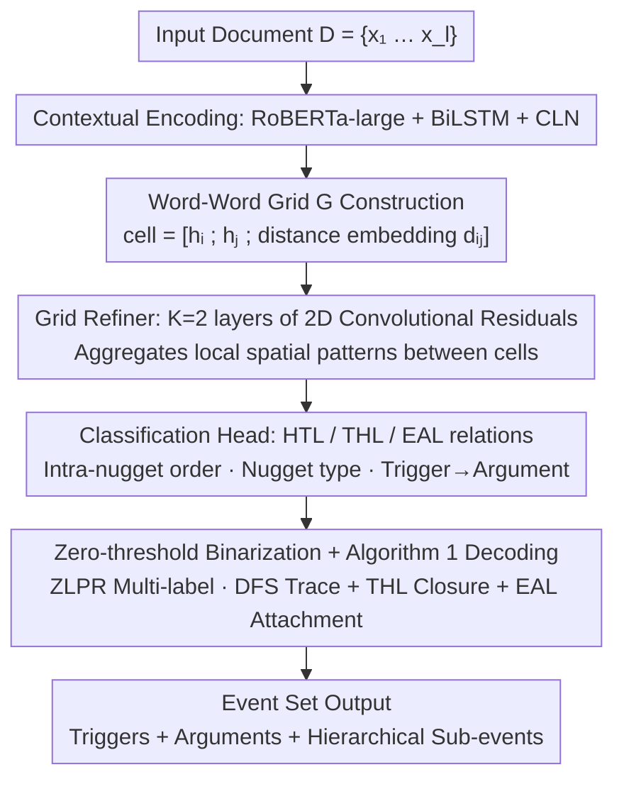

# EXCEEDS: Extracting Complex Events via Nugget-based Grid Modeling in Scientific Domain

**Conference**: ACL 2026  
**arXiv**: [2406.14075](https://arxiv.org/abs/2406.14075)  
**Code**: https://github.com/HammerScholar/EXCEEDS  
**Area**: NLP Understanding / Event Extraction / Information Extraction  
**Keywords**: Event Extraction, Document-level, Word-Word Relation Grid, Scientific Literature, Hierarchical Events

## TL;DR
The authors identify two major pain points in "scientific abstract" EE scenarios that are absent in legacy datasets: **high information density** (5.54 events + 12.82 arguments per 100 tokens) and **complex event structures** (overlapping/discontinuous/reverse-order nuggets + sub-events). Consequently, they (a) annotated the SciEvents dataset with 2,508 documents and 24,381 events, and (b) proposed EXCEEDS—an end-to-end framework that reformulates EE as "multi-label relation classification on an $l \times l$ word-word grid." By utilizing three types of edges (HTL/THL/EAL) to unify the modeling of triggers, arguments, and sub-events, EXCEEDS outperforms 9 SOTA baselines in both main metrics and complex scenarios.

## Background & Motivation
**Background**: Event Extraction (EE) is typically divided into event detection (ED) and event argument extraction (EAE). Mainstream approaches include global joint extraction (OneIE), discriminative token classification (PAIE/Tagprime), and generative methods (DEGREE/KnowCoder); these have achieved strong F1 scores on existing benchmarks like ACE05, RAMS, and Genia.

**Limitations of Prior Work**: Upon detailed statistical analysis of information density and complex morphological ratios across 9 major domain-specific datasets, the authors found two overlooked facts: (1) Scientific text (paper abstracts) has much higher density than news/legal/cyber domains—SciEvents contains 5.54 events and 39.49 nugget tokens per 100 tokens, over 3x higher than ACE05 (1.80 events); (2) 33.70% of nuggets in scientific texts are overlapping, 25.63% are sub-events, 3.08% are discontinuous, and 1.01% are reverse-order. Most existing datasets only annotate continuous nuggets.

**Key Challenge**: Existing EE modeling assumptions are broken by the scientific domain: (a) Most methods assume non-hierarchical structures (no sub-events) and local contexts (sentence-level), but scientific triggers often link to distant arguments and trigger-of-trigger sub-event relations are ubiquitous; (b) Discriminative methods relying on span start/end offsets cannot represent discontinuous or reverse-order nuggets.

**Goal**: (1) Construct a scientific EE dataset that simultaneously examines "high density + complex structures"; (2) Design a method that handles overlapping, discontinuous, reverse-order nuggets, and hierarchical sub-events within a **single end-to-end** framework.

**Key Insight**: Borrowing from the word-word relation grid concepts in NER (e.g., W2NER)—since span boundary representations fail for complex morphologies, the task should return to token-pair relations. This allows "which two tokens are in a nugget" and "which nugget is an argument for another" to be unified as multi-label relation predictions on a grid.

**Core Idea**: Simplify EE into "nugget-based relation classification on an $l \times l$ grid"—using HTL (head→next) to connect tokens within a nugget, THL (last→first with type) to close the nugget, and EAL (trigger-head→argument-head) to link cross-nugget relations. This structure accommodates all complex nugget forms and naturally expresses hierarchical sub-events.

## Method

### Overall Architecture
The EXCEEDS pipeline: Input document $D = \{x_1, \dots, x_l\}$ → RoBERTa-large encoding → BiLSTM for sequential dependencies → Conditional Layer Normalization (CLN) for context adaptation to obtain $\mathbf{H} \in \mathbb{R}^{l \times d}$ → Construct pair-wise grid $\mathbf{G} \in \mathbb{R}^{l \times l \times C_g}$ (each cell is $[\mathbf{h}_i; \mathbf{h}_j; \mathbf{d}_{i,j}]$ projected via MLP, where $\mathbf{d}_{i,j}$ is relative distance embedding) → $K=2$ layers of 2D convolutional residual Grid Refiner for local information aggregation → Linear classification head outputs $\mathbf{Y} \in \mathbb{R}^{l \times l \times |R|}$ → Multi-label zero-threshold binarization → Decode event set using Algorithm 1: First, use DFS to trace nugget chains via HTL, requiring a THL-type edge to close from tail to head; then, determine if it is a trigger or argument based on the THL label; finally, attach arguments to triggers using EAL edges and ontology constraints.

### Key Designs

**1. Word-Word Event Grid (HTL + THL + EAL edges): Accommodating complex nuggets via token-pair grids**

Traditional BIO or span boundary representations assume nuggets are continuous left-to-right segments. They fail when encountering overlapping (one token in two nuggets), discontinuous (intervening stop words), or reverse-order (inversion) structures—common in scientific abstracts (33.70% overlapping, 3.08% discontinuous). The solution changes the modeling unit from "span" to "token pair": cell $G[i,j]$ stores relation types $r \in R$ between $(x_i, x_j)$, reducing all structures to a set of edges on the grid.

Three edge types fulfill distinct roles. **HTL** (head-tail-link) marks adjacent tokens within a nugget; it supports discontinuous nuggets (intervening tokens are simply skipped by the HTL chain) and reverse-order nuggets (HTL directions are not restricted to left-to-right). **THL** (tail-head-link) points from the last token back to the first, with the edge label indicating the semantic type (trigger or argument type), simultaneously closing the nugget and classifying it. **EAL** (event-argument-link) connects trigger head tokens to argument head tokens; hierarchical sub-events are simply trigger→trigger EAL relations. This unifies ED, EAE, and hierarchical relation extraction into a single, end-to-end trainable matrix.

**2. CLN + Distance Embeddings + 2D CNN Grid Refiner: Enabling inter-cell awareness**

A naive pair-wise MLP treats each cell independently, losing spatial patterns like "multiple cells around a trigger activating together." The authors use Conditional Layer Normalization to adaptive re-normalize token representations: $\mathbf{H} = \text{MLP}_\gamma(\mathbf{L}) \odot \frac{\mathbf{L} - \mu}{\sigma + \epsilon} + \text{MLP}_\beta(\mathbf{L})$, allowing affine parameters to vary with context. Relative distance embeddings $\mathbf{d}_{i,j}$ are concatenated during cell construction.

Local propagation is handled by $K=2$ layers of residual 2D convolution blocks $\mathbf{G}^{(k+1)} = \text{Norm}(\mathbf{G}^{(k)} + \mathcal{F}(\mathbf{G}^{(k)}))$. Relation patterns (like trigger-argument diagonal proximity) are injected as spatial priors at an $O(Kl^2)$ cost. Ablation shows dropping the Grid Refiner decreases AC by 0.76 and EC by 0.21, indicating it is an effective refinement, though smaller in impact than token-level encoding (CLN/BiLSTM).

**3. Multi-label Zero-Threshold Loss + Heuristic Decoding: Managing multi-label cells and structural validity**

In complex nuggets, one token pair often belongs to multiple relations (e.g., both HTL and EAL head). Binary sigmoid chains fail to capture inter-type dependencies. Instead, ZLPR multi-label cross-entropy is used: $\mathcal{L}_{i,j} = \log(1 + \sum_{r \in \Omega^-} e^{y^r_{i,j}}) + \log(1 + \sum_{r \in \Omega^+} e^{-y^r_{i,j}})$. This optimizes the margin between positive and negative labels, balances label counts automatically, and is differentiable with a zero threshold. Inference uses $\mathbb{I}[y^r_{i,j} > 0]$ without needing a preset activation count.

Decoding (Algorithm 1) applies two hard constraints: (i) Each HTL chain must be closed by a THL-type edge; (ii) Arguments not attached to a valid trigger are discarded. This ensures structural legality and prevents DFS from exploding into exponential HTL chains during early training.

### Key Experimental Results

#### Main Results
Overall F1 scores on SciEvents (TI=Trigger Identification, TC=Trigger Classification, AI/AC=Argument I/C, EC=Event Correlation i.e., sub-event extraction):

| Model | TI | TC | AI | AC | EC |
|------|------|------|------|------|------|
| OneIE (global) | 75.72 | 62.93 | 30.30 | 28.81 | 37.41 |
| EEQA (generative) | 74.85 | 62.15 | 37.75 | 35.64 | 44.81 |
| PAIE† (discriminative) | 73.27 | 63.03 | 43.92 | 42.06 | 47.17 |
| Tagprime (discriminative) | 73.27 | 63.03 | 44.67 | 42.69 | 47.72 |
| BartGen† (generative) | 73.27 | 63.03 | 39.85 | 37.81 | 42.75 |
| KnowCoder (LLM-based) | 69.88 | 52.02 | 35.24 | 33.43 | 34.54 |
| **EXCEEDS** | 75.29 | **63.74** | **44.97** | **43.20** | **48.25** |

EXCEEDS ranks first in TC, AI, AC, and EC. In TI, it is second only to OneIE ($-0.43$). Compared to the second-best Tagprime, it gains $+0.30$ to $+0.53$ absolute F1 in EAE metrics.

#### Ablation Study
**Module Ablation + Complex Scenario Breakdown**:

| Configuration | TC | AC | EC | Note |
|------|------|------|------|------|
| EXCEEDS Full | 63.74 | 43.20 | 48.25 | Full Model |
| − Contextual encoding | 63.44 | 42.14 | 47.64 | No CLN/BiLSTM, AC −1.06 |
| − Grid Refiner | 63.41 | 42.44 | 48.04 | No 2D CNN, AC −0.76 |

Complex Scenario Subsets (F1%):

| Model | Discontinuous AC | Overlapping TC | Overlapping AC | Reverse-order AC | Sub-event EC |
|------|----------|----------|----------|----------|----------|
| Tagprime | – | 55.03 | 18.11 | – | 48.11 |
| PAIE | – | 49.62 | 13.18 | – | 49.08 |
| BartGen | 2.74 | 31.98 | 10.58 | 0.00 | 40.19 |
| **EXCEEDS** | **13.86** | **62.46** | **22.46** | **7.27** | **51.15** |

#### Key Findings
- **Discriminative baselines cannot handle discontinuous/reverse-order nuggets**: Marked as "–" because these offset-based methods physically cannot represent such structures. EXCEEDS' grid relation paradigm is the only one applicable here.
- **Generative models collapse on complex nuggets**: BartGen/KnowCoder AC scores drop significantly on overlapping nuggets because generating textual spans cannot express a token belonging to two nuggets.
- **Contextual encoding is more critical than the Grid Refiner**: Removing CLN/BiLSTM drops AC by 1.06, while removing the Refiner drops it by 0.76.
- **Error Analysis**: 89.2% of TI and 84.6% of AI errors are "missed" detections rather than boundary errors, suggesting recall is the main bottleneck in dense scientific contexts.

## Highlights & Insights
- **Elegant Extension of W2NER to EE**: Expanding word-word relations into three types (intra-nugget, nugget type, inter-nugget) unifies ED, EAE, and multi-stage pipelines into a single matrix. This "common graph representation" is a highly inspiring paradigm for IE.
- **Efficiency of THL-Type Edges**: A single tail→head edge simultaneously performs "nugget closure" and "nugget typing," reducing model complexity and error propagation.
- **Direct Sub-event Modeling via EAL**: Bypasses traditional multi-stage hierarchical pipelines by using trigger→trigger EAL edges, which is particularly natural for nested scientific patterns like "Method X uses Dataset Y."

## Limitations & Future Work
- **Abstract-only Focus**: SciEvents is derived entirely from ACL paper abstracts (2019-2022), missing figures, tables, and cross-section citations where full event contexts often reside.
- **Narrow Domain**: Limited to NLP literature writing styles; applicability to physics or chemistry remains unverified.
- **Persistent Complex Challenges**: Reverse-order AC (7.27) and discontinuous AC (13.86) remain far lower than continuous nugget AC (43.20), indicating that while the grid can "model" them, significant performance gaps persist.
- **$O(l^2)$ Scalability**: Memory usage and computation explode with document length, making full-text processing without chunking or sparsification difficult.

## Related Work & Insights
- **vs Tagprime**: Tagprime uses token-level sequence labeling for AC (42.69). EXCEEDS (43.20) shows its fundamental parigmatic advantage in complex scenarios, like overlapping AC (22.46 vs 18.11).
- **vs KnowCoder (LLM-based)**: KnowCoder (LLaMA2-7B + LoRA) lags significantly (AC 33.43). This serves as a reminder that general LLM capabilities do not yet replace specialized structural modeling in professional domains with complex EE requirements.

## Rating
- Novelty: ⭐⭐⭐⭐ Clear incremental contribution by extending relation grids to EE and hierarchical sub-events.
- Experimental Thoroughness: ⭐⭐⭐⭐⭐ Comprehensive evaluation against 9 SOTA baselines across various scenarios.
- Writing Quality: ⭐⭐⭐⭐ Excellent visualization of edges and rigorous algorithm descriptions.
- Value: ⭐⭐⭐⭐⭐ SciEvents is a high-quality benchmark (24k events) that serves as essential infrastructure for scientific knowledge graph construction.

<!-- RELATED:START -->

## Related Papers

- [\[ACL 2026\] ASTRA: Adaptive Semantic Tree Reasoning Architecture for Complex Table Question Answering](astra_adaptive_semantic_tree_reasoning_architecture_for_complex_table_question_a.md)
- [\[ACL 2025\] Beyond Prompting: An Efficient Embedding Framework for Open-Domain Question Answering](../../ACL2025/nlp_understanding/embqa_embedding_odqa.md)
- [\[ACL 2025\] Recursive Question Understanding for Complex Question Answering over Heterogeneous Personal Data](../../ACL2025/nlp_understanding/recursive_question_understanding_for_complex_question_answering_over_heterogeneo.md)
- [\[ACL 2026\] DimABSA: Building Multilingual and Multidomain Datasets for Dimensional Aspect-Based Sentiment Analysis](dimabsa_building_multilingual_and_multidomain_datasets_for_dimensional_aspect-ba.md)
- [\[ACL 2026\] It's High Time: A Survey of Temporal Question Answering](it39s_high_time_a_survey_of_temporal_question_answering.md)

<!-- RELATED:END -->
