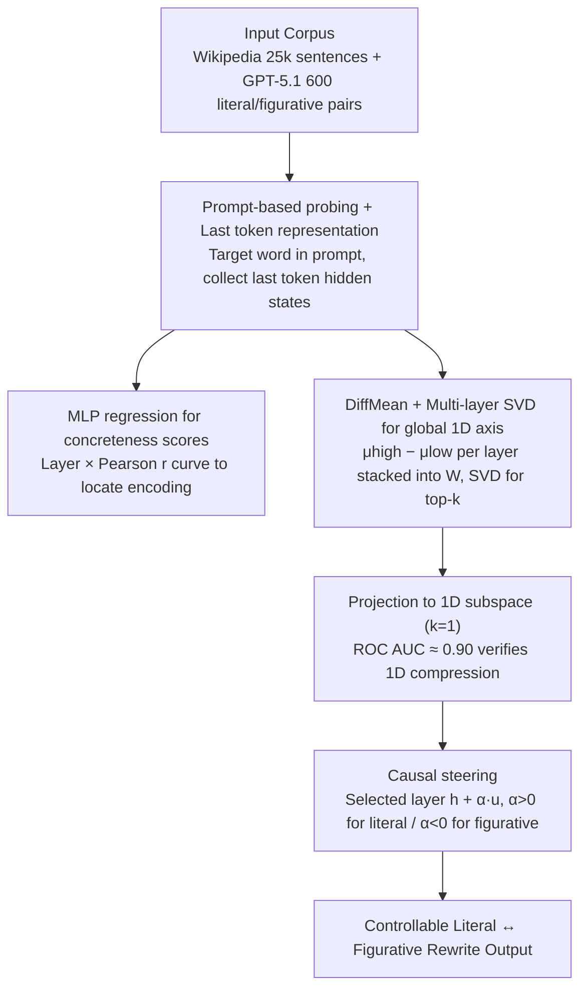

# Exploring Concreteness Through a Figurative Lens

**Conference**: ACL 2026  
**arXiv**: [2604.18296](https://arxiv.org/abs/2604.18296)  
**Code**: https://github.com/cincynlp/concreteness-interpretability  
**Area**: NLP Understanding / Linguistics / LLM Interpretability  
**Keywords**: Concreteness, Figurative Language, LLM Internal Representation, Geometric Subspace, Representation Intervention

## TL;DR
The authors use prompt-based probing + DiffMean + SVD to dissect the internal representation of "concreteness" in four LLMs (Llama-3.1-8B / Qwen3-8B / Gemma2-9B / GPT-OSS-20B). They find that early layers already distinguish between literal (high concrete) and figurative (low concrete) usages of nouns, while mid-to-late layers compress the entire concreteness information into **a single one-dimensional direction**. It is demonstrated that this axis can perform zero-shot figurative text classification nearly on par with a supervised 4096-dimensional classifier and can be added to hidden states to perform controllable "literal ↔ figurative" rewriting.

## Background & Motivation
**Background**: Psycholinguistics and NLP have long regarded "concreteness" as a core semantic dimension of words—high-concrete words refer to tangible objects perceptible by senses (apple, chair), while low-concrete words refer to abstract concepts (justice, idea). Brysbaert et al. (2014) provided 1-5 static concreteness scores for 40k English words using 4000+ annotators, serving as the gold standard. Subsequent works (Charbonnier & Wartena 2019, Tater 2022, Wartena 2024) predicted these scores using contextual embeddings, proving that models like BERT can already encode "concreteness shifts in context."

**Limitations of Prior Work**: However, these works are limited to external evaluations such as "predicting concreteness scores" or "embedding correlation." No systematic research has addressed: (i) **which layers** of modern decoder LLMs truly encode concreteness? (ii) Does concreteness occupy a **dedicated geometric direction** in the hidden representation space? (iii) Can this direction be used to **intervene** in the literal/figurative tendency of generation?

**Key Challenge**: Concreteness is context-sensitive—for the same word "window," "window was broken" is a high-concrete literal usage, while "window of opportunity" is a low-concrete figurative usage (metaphor, metonymy, and idioms all trigger this shift, as per Lakoff & Johnson 1980). Existing probing methods face a bottleneck in decoder-only LLMs: directly extracting noun contextual embeddings is limited by "left-to-right" causal masking, meaning the model might not yet "see" the figurative cues provided in the later text (e.g., in "chain of events led to his downfall," the embedding of "chain" is calculated before reading "events/downfall").

**Goal**: (1) Design a probing scheme that correctly captures **contextual concreteness** in decoder LLMs; (2) Characterize the internal representation from both hierarchical and geometric dimensions; (3) Verify that this representation is interpretable, usable for downstream tasks, and capable of causal intervention.

**Key Insight**: The authors borrow the DiffMean method from Marks & Tegmark (2024)'s "Geometry of Truth"—a simple linear direction formed by "mean of high-class minus mean of low-class" can capture many semantic dimensions. SVD is then used to synthesize multi-layer DiffMeans into a global axis.

**Core Idea**: By using the prompt "On a scale of 1 to 5, what is the concreteness of [word] in this sentence?", the LLM is forced to aggregate the entire sentence information into the last token. The hidden state of that token then carries "contextual concreteness." Treating these hidden states as probe inputs allows for quantitative analysis of hierarchical encoding, geometric structure, and causal intervention.

## Method

### Overall Architecture
The method consists of three steps: (a) **Layer-wise probing**: Using 25,000 sentences from Wikipedia and 600 pairs of literal/figurative synthetic sentences generated by GPT-5.1, the hidden states of the last token at each layer are collected using the prompt. An MLP regression is trained to predict Brysbaert concreteness scores, and a "layer × Pearson r" curve is plotted to locate encoding layers. (b) **Geometric axis**: Nouns in Wikipedia sentences are categorized as high (static score > 4) or low (static score < 2). For each layer, a DiffMean vector $w^{(l)} = \mu^{(l)}_{high} - \mu^{(l)}_{low}$ is calculated. All layer-wise DiffMeans are stacked into a matrix $W$, and SVD is applied to extract the top-$k$ right singular vectors $B_k = V^\top_{1:k}$ as the "global concreteness subspace." Testing with $k=1$ determines if it can be compressed into a single direction. (c) **Causal steering**: The unit direction $\mathbf{u}$ is directly added to the hidden state $h^{(\ell)}$ of a mid-to-late layer: $h^{(\ell)}_{\text{steer}} = h^{(\ell)} + \alpha \mathbf{u}$ ($\alpha > 0$ steers toward literal, $\alpha < 0$ toward figurative), and the model continues decoding to generate a rewrite.

### Key Designs

**1. Prompt-based probing + Last token representation: Bypassing the "no lookahead" causal mask limit**

Directly extracting noun contextual embeddings in decoder-only LLMs has a fatal flaw: the token has not yet read the subsequent context. For example, in "chain of events led to his downfall," the embedding for `chain` is computed without seeing `events/downfall`, failing to capture cues shifting it toward figurative usage. The authors' solution is to use the prompt: "Sentence: [sentence] On a scale of 1 to 5 (5 being the highest), in the context of the sentence, what is the concreteness of the word [target_word]?" By placing the entire sentence and the target word in the prompt and **extracting the hidden state of the final token**, the model aggregates the full context via causal attention.

After obtaining the representation, two paths are used: (Gen) letting the model generate a number directly, and (Tok) feeding the hidden state into an MLP regression. Two details ensure probing reliability: first, if the target word is not at the end of the prompt, the Pearson $r$ drops from 0.98 to 0.80 ± 0.10, confirming a strong recency bias. Second, the Gen path only achieves an $r$ of 0.58-0.70, significantly lower than the Tok path's 0.82-0.92, indicating that hidden states contain more precise signals than the generated output.

**2. DiffMean + Multi-layer SVD for global 1D axis: Verifying 1D geometric compression**

To determine if concreteness occupies a specific direction, the authors use DiffMean, a lightweight linear method validated by Marks & Tegmark (2024). It provides a concrete direction vector in geometric space more interpretable than logistic regression. High (>4) and low (<2) concrete instances are extracted from Wikipedia (2,256 high / 2,116 low). For each layer, $w^{(l)} = \mu^{(l)}_{high} - \mu^{(l)}_{low}$ is calculated.

To find a "global direction" across layers, the $w^{(l)}$ vectors are stacked as rows in matrix $W$. SVD is performed, and the top-$k$ right singular vectors $B_k = V^\top_{1:k}$ form a layer-agnostic subspace. Projecting hidden states onto this $k$-dimensional space yields an AUROC of ~0.90 for $k=1$ in mid-to-late layers, proving 1-D compression. Increasing $k$ to 2/3/4 actually decreases AUROC, clear evidence of inverse scaling.

**3. Causal steering: Direct hidden state intervention as control knob**

An axis distinguishing categories does not prove causality. To demonstrate control, the authors add the axis to the hidden state at layers where concreteness is clearest: $h^{(\ell)}_{\text{steer}} = h^{(\ell)} + \alpha \mathbf{u}$ ($\alpha=+40$ for literal, $\alpha=-40$ for figurative). Subsequent layers perform a normal forward pass for the prompt "Rewrite the following sentence clearly and naturally:".

Crucially, the prompt does not mention "figurative" or "literal." All control signals come from the axis intervention. Human evaluation of 100 sentences shows Lit→Fig improvements from 0 to 15% and Fig→Lit from 39-52% to 67-75%, proving the axis is a controllable knob while revealing that figurative generation remains harder than literal paraphrasing.

### Loss & Training
No traditional training is used: (a) the probing MLP uses hyper-parameters from Wartena (2024) (512→256→128, ReLU, 0.2 dropout, AdamW lr=1e-5, 50 epochs, batch=15); (b) DiffMean is a closed-form calculation; (c) SVD is a closed-form decomposition; (d) Steering is an inference-time addition with zero parameter updates.

## Key Experimental Results

### Main Results
**Probing Correlation** (Pearson $r$ between predicted and Brysbaert human ratings):

| Model | With Context (Gen) | With Context (Tok) | W/o Context (Gen) | W/o Context (Tok) |
|-------|---------------------|---------------------|--------------------|--------------------|
| Llama-3.1-8B | 0.66 | 0.88 | 0.70 | **0.98** |
| Qwen3-8B | 0.60 | 0.87 | 0.65 | **0.98** |
| Gemma2-9B | 0.64 | 0.92 | 0.68 | **0.98** |
| GPT-OSS-20B | 0.58 | 0.82 | 0.63 | **0.98** |

**Zero-shot figurative classification** (Llama-3.1-8B, AUROC, 1-D axis vs. 4096-D trained classifier):

| Task | Dataset | 1-D Subspace (zero-shot) | Full Rep. (trained) | Retention |
|------|---------|--------------------------|---------------------|-----------|
| Idioms | MAGPIE | 95.2 | 98.5 | 96.6% |
| Idioms | EPIE | 95.3 | 99.2 | 96.1% |
| Metaphor | VUA | 95.7 | 97.6 | 98.1% |
| Metaphor | MUNCH | 93.2 | 95.1 | 98.0% |
| Metonymy | ConMeC | 60.2 | 62.6 | 96.2% |
| Metonymy | MetFuse | 85.7 | 96.3 | 89.0% |

### Ablation Study
**Impact of dimension $k$ and Steering Human Eval** (100 samples, 2 annotators):

| Configuration | Key Metric | Description |
|---------------|------------|-------------|
| $k=1$ subspace | AUROC ≈ 0.90 | Single direction is sufficient; validates 1-D compression |
| $k=2$ | AUROC ↓ | Information diluted by extra directions |
| $k=3$ | AUROC ↓↓ | Further decline |
| Lit→Fig Llama (no steer) | 0/100 | Literal input remains literal |
| Lit→Fig Llama ($\alpha=-40$) | 12/100 | 12% converted to figurative |
| Fig→Lit Llama (no steer) | 42/100 | Model inherently biased toward literal |
| Fig→Lit Llama ($\alpha=+40$) | 71/100 | Literal proportion nearly doubles after intervention |

### Key Findings
- **Early layers perform "Literal vs. Figurative" classification**: In synthetic data, the delta $\delta^{(l)}_{\text{mean}} = C^{(l)}_{\text{pred}} - C_{\text{static}}$ separates from layer 2, consistent with the mechanistic interpretability finding that early layers handle semantic categorization.
- **Mid-to-late layers perform 1D compression**: AUROC is stable at ~0.90 for $k=1$ in mid-to-late layers across all models.
- **1-D axis matches 4096-D supervised classifier**: The 1-D zero-shot axis retains 95-98% of the performance of a full supervised classifier on idioms/metaphors.
- **Metonymy is an exception**: AUROC is lower (60-86%) because metonymy involves smaller concreteness shifts since the referent remains a tangible entity.
- **Steering Asymmetry**: Fig→Lit is easy (+25 to +36 pp improvement), while Lit→Fig is difficult (only 9-15%), indicating a strong "literal bias" in LLMs.
- **Verbs perform worse**: Concreteness shifts are smaller in verbs than in nouns, matching linguistic theory.

## Highlights & Insights
- **Probing engineering details dictate conclusions**: The necessity of placing the target word at the end of the prompt highlights the recency bias of decoder LLMs—a trap for future probing research.
- **Representation-as-control paradigm**: Controlling generation via geometric directions without changing parameters or prompts is an emerging paradigm, parallel to truth or sycophancy control.
- **DiffMean + SVD design**: Using SVD to merge layer-wise DiffMeans into a single direction provides a more stable and layer-agnostic interpretation than single-layer probes.
- **"Models know, but cannot say"**: The gap between Tok and Gen paths suggests hidden states are more accurate than verbalized outputs for internal model assessment.
- **Downstream value**: This allows for pedagogical or literary style transfer with significantly lower cost than fine-tuning.

## Limitations & Future Work
- **Lack of human contextual labels**: Predicted values are aligned with Brysbaert static scores; direct human ground truth for contextual concreteness is missing.
- **Axis purity**: The direction may encode other features like frequency or imageability.
- **Concreteness vs. Figurativity**: Word sense disambiguation (e.g., "root of tree" vs "root of number") also causes shifts but isn't always figurative.
- **Limited Lit→Fig effect**: Higher $\alpha$ introduces noise; figurative generation likely requires higher-dimensional conceptual mapping.

## Related Work & Insights
- **vs. Wartena (2024)**: Upgrades the paradigm from BERT-based prediction to decoder-only LLM geometric analysis and causal control.
- **vs. Marks & Tegmark (2024)**: Applies the "Geometry of Truth" framework to the new dimension of figurativity, suggesting "linear axis + steering" is a universal framework.
- **vs. Chakrabarty (2021) MERMAID**: Offers a training-free alternative to fine-tuning-based figurative generation.

## Rating
- Novelty: ⭐⭐⭐⭐ Applies "linear axis + DiffMean + SVD" to concreteness; solid engineering.
- Experimental Thoroughness: ⭐⭐⭐⭐⭐ Extensive cross-model and cross-dataset validation with human evaluation.
- Writing Quality: ⭐⭐⭐⭐ Clear visualization of core findings; honest assessment of limitations.
- Value: ⭐⭐⭐⭐ High utility for both the interpretability community and controllable generation tasks.

<!-- RELATED:START -->

## Related Papers

- [\[ACL 2026\] Agree, Disagree, Explain: Decomposing Human Label Variation in NLI through the Lens of Explanations](agree_disagree_explain_decomposing_human_label_variation_in_nli_through_the_lens.md)
- [\[ACL 2026\] MetFuse: Figurative Fusion between Metonymy and Metaphor](metfuse_figurative_fusion_between_metonymy_and_metaphor.md)
- [\[NeurIPS 2025\] Generalization Error Analysis for Selective State-Space Models Through the Lens of Attention](../../NeurIPS2025/nlp_understanding/generalization_error_analysis_for_selective_state-space_models_through_the_lens_.md)
- [\[ACL 2026\] BoundRL: Efficient Structured Text Segmentation through Reinforced Boundary Generation](boundrl_efficient_structured_text_segmentation_through_reinforced_boundary_gener.md)
- [\[ACL 2025\] CaLMQA: Exploring Culturally Specific Long-Form Question Answering across 23 Languages](../../ACL2025/nlp_understanding/calmqa_cultural_multilingual_qa.md)

<!-- RELATED:END -->
