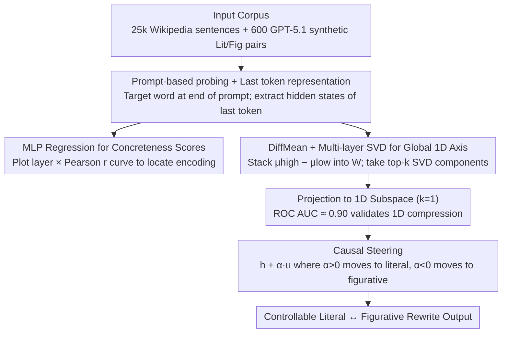

# Exploring Concreteness Through a Figurative Lens

**Conference**: ACL 2026  
**arXiv**: [2604.18296](https://arxiv.org/abs/2604.18296)  
**Code**: https://github.com/cincynlp/concreteness-interpretability  
**Area**: NLP Understanding / Linguistics / LLM Interpretability  
**Keywords**: Concreteness, Figurative Language, LLM Internal Representations, Geometric Subspaces, Representation Intervention  

## TL;DR
The authors decompose the internal representation of "concreteness" across four LLMs (Llama-3.1-8B / Qwen3-8B / Gemma2-9B / GPT-OSS-20B) using prompt-based probing, DiffMean, and SVD. They find that early layers already distinguish between literal (high concrete) and figurative (low concrete) noun usage. Mid-to-late layers compress concreteness information into a **single one-dimensional direction**. This axis achieves zero-shot figurative text classification performance nearly on par with supervised 4096-dimensional classifiers and can be directly added to hidden states to perform controllable "literal ↔ figurative" rewrites during generation.

## Background & Motivation
**Background**: Psycholinguistics and NLP have long recognized "concreteness" as a core semantic dimension of words. High-concreteness words refer to tangible objects perceptible by senses (apple, chair), while low-concreteness words refer to abstract concepts (justice, idea). Brysbaert et al. (2014) provided a gold standard by having 4000+ annotators rate 40k English words on a 1-5 scale. Subsequent work (Charbonnier & Wartena 2019, Tater 2022, Wartena 2024) predicted these scores using contextual embeddings, proving that models like BERT can encode "contextual concreteness shifts."

**Limitations of Prior Work**: Existing research is confined to external evaluations such as "predicting concreteness scores" or "embedding correlations." No systematic study has addressed: (i) **which layers** of modern decoder LLMs truly encode concreteness? (ii) Does concreteness inhabit a **dedicated geometric direction** in the hidden representation space? (iii) Can this direction be used to **intervene** in the literal/figurative tendencies of generated text?

**Key Challenge**: Concreteness is context-sensitive—the word "window" in "window was broken" is a high-concrete literal use, while in "window of opportunity," it is a low-concrete figurative use (metaphor, metonymy, or idioms trigger this shift, following Lakoff & Johnson 1980). However, existing probing methods for decoder-only LLMs face an engineering bottleneck: extracting contextual embeddings of a noun is limited by "left-to-right" causal masking, meaning the model might not yet "see" the figurative cues provided in the subsequent text (e.g., the embedding of "chain" in "chain of events led to his downfall" is calculated before reading "events/downfall").

**Goal**: (1) Design a probing scheme for decoder LLMs to correctly capture **contextual concreteness**; (2) Characterize internal representations via hierarchical and geometric dimensions; (3) Verify that these representations are interpretable, applicable to downstream tasks, and controllable via intervention.

**Key Insight**: The authors borrow the DiffMean method from the "Geometry of Truth" work by Marks & Tegmark (2024), where a simple linear direction formed by "mean of high class minus mean of low class" captures semantic dimensions. They further use SVD to synthesize multi-layer DiffMean vectors into a global axis.

**Core Idea**: Using the prompt "On a scale of 1 to 5, what is the concreteness of [word] in this sentence?" allows the LLM to aggregate sentence-wide information into the last token. The hidden state of that token then carries "contextual concreteness." Treating these hidden states as probe inputs enables quantitative analysis of layer-wise encoding, geometric structure, and causal intervention.

## Method

### Overall Architecture
The method consists of three steps: (a) **Layer-wise probing**: Using 25,000 Wikipedia sentences and 600 pairs of literal/figurative synthetic sentences generated by GPT-5.1. By placing the target word at the end of a prompt, the hidden states of the last token at each layer are extracted to train an MLP regressor for predicting Brysbaert scores. This produces a "layer × Pearson r" curve to locate encoding layers. (b) **Geometric axis**: Nouns in Wikipedia sentences are categorized as high (static concreteness > 4) or low (< 2). For each layer, a DiffMean vector is calculated as $w^{(l)} = \mu^{(l)}_{high} - \mu^{(l)}_{low}$. DiffMean vectors across layers are stacked into matrix $W$, and SVD is applied to extract the top-$k$ right singular vectors $B_k = V^\top_{1:k}$ as the "global concreteness subspace." Testing $k=1$ determines if the information is compressed into a single direction. (c) **Causal steering**: A unit direction $\mathbf{u}$ is added to the hidden state $h^{(\ell)}$ of a selected mid-to-late layer: $h^{(\ell)}_{\text{steer}} = h^{(\ell)} + \alpha \mathbf{u}$ ($\alpha > 0$ shifts toward literal, $\alpha < 0$ shifts toward figurative). The model then continues decoding to generate a rewrite.

### Key Designs

**1. Prompt-based probing + Last token representation: Circumventing the "no future context" limit of decoder masking**

Taking the contextual embedding of a noun directly in a decoder-only LLM is problematic: due to causal masking, the token hasn't "read" the subsequent text. The authors solve this by designing a prompt: "Sentence: [sentence] On a scale of 1 to 5 (5 being the highest), in the context of the sentence, what is the concreteness of the word [target_word]?" By placing the target word and entire context inside the prompt and **extracting the hidden state of the final token**, they ensure the representation aggregates the full context via causal attention.

**2. DiffMean + Multi-layer SVD for a global 1D axis: Validating 1D geometric compression**

To determine if concreteness occupies a specific direction, the authors use the DiffMean method—a lightweight linear approach more interpretable than logistic regression. High and low concrete instances are drawn from Wikipedia. While individual layer DiffMeans reflect layer-specific discriminative directions, SVD on the stacked matrix $W$ identifies a "layer-agnostic" global direction. Results show that at $k=1$, the AUROC stabilizes around ~0.90 in mid-to-late layers, while increasing $k$ to 2, 3, or 4 actually decreases performance, providing clear evidence of inverse scaling and 1D compression.

**3. Causal steering: Turning an axis into a "control knob"**

To prove the axis is causal rather than just correlative, the authors modify hidden states during decoding at a specific layer (e.g., Llama-3.1-8B layer 20) by adding $h^{(\ell)}_{\text{steer}} = h^{(\ell)} + \alpha \mathbf{u}$. Parameters $\alpha=+40$ (literal) and $\alpha=-40$ (figurative) are used. The subsequent generation "Rewrite the following sentence clearly and naturally:" is executed without mentioning figurativity in the prompt. Any style change in the output serves as clean causal evidence.

### Loss & Training
The work involves no traditional training of the LLMs: (a) Probing MLPs use standard hyperparameters (512→256→128, ReLU, dropout, AdamW); (b) DiffMean and SVD are closed-form calculations; (c) Steering is an inference-time addition. This training-free nature significantly reduces the cost of reproduction.

## Key Experimental Results

### Main Results
**Probing Correlation** (Pearson r between predicted concreteness and Brysbaert human ratings):

| Model | With Context (Gen) | With Context (Tok) | W/o Context (Gen) | W/o Context (Tok) |
|-------|---------------------|---------------------|--------------------|--------------------|
| Llama-3.1-8B | 0.66 | 0.88 | 0.70 | **0.98** |
| Qwen3-8B | 0.60 | 0.87 | 0.65 | **0.98** |
| Gemma2-9B | 0.64 | 0.92 | 0.68 | **0.98** |
| GPT-OSS-20B | 0.58 | 0.82 | 0.63 | **0.98** |

**Zero-shot Figurative Classification** (Llama-3.1-8B, AUROC, 1-D axis vs. 4096-D trained classifier):

| Task | Dataset | 1-D Subspace (zero-shot) | Full Rep. (trained) | Retention |
|------|---------|--------------------------|---------------------|-----------|
| Idioms | MAGPIE | 95.2 | 98.5 | 96.6% |
| Metaphor | VUA | 95.7 | 97.6 | 98.1% |
| Metonymy | MetFuse | 85.7 | 96.3 | 89.0% |

### Ablation Study
**Causal Steering Human Evaluation** (100 samples, 2 annotators):

| Configuration | Gain/Metric | Explanation |
|---------------|-------------|-------------|
| Lit→Fig Llama-3.1-8B $\alpha=-40$ | 12/100 | Intervention forces 12% shift to figurative |
| Fig→Lit Llama-3.1-8B $\alpha=+40$ | 71/100 | Literal ratio nearly doubles from baseline (42% to 71%) |

### Key Findings
- **Early layers distinguish Literal vs. Figurative**: Probing shows that predicted concreteness offsets $\delta^{(l)}_{\text{mean}}$ separate as early as Layer 2.
- **Mid-to-late layer 1D compression**: All 4 models compress concreteness into a single dimension in later layers (AUROC ~0.90).
- **Metonymy as an exception**: 1-D AUROC for metonymy is lower (60-86%) than metaphors/idioms, aligning with linguistics: metonymy shifts concreteness less as it still refers to concrete entities.
- **Steering Asymmetry**: Shifting figurative text to literal is easier than the reverse, confirming that LLMs possess a strong "literal bias."

## Highlights & Insights
- **Engineering details matter**: Moving the target word to the prompt end increased Pearson r from 0.80 to 0.98, highlighting the recency bias in decoders.
- **Representation-as-control paradigm**: Using a geometric direction as a control knob without modifying parameters or prompts is a powerful emergent paradigm for steerability.
- **Hidden states are more accurate than text**: The gap between "Gen" (outputting numbers) and "Tok" (probing hidden states) reveals that internal representations contain more precise signals than what the model can verbalize.

## Limitations & Future Work
- **Static vs. Contextual Ground Truth**: The probe is trained on static Brysbaert scores; there is a lack of direct human ground truth for "contextual concreteness."
- **Axis Purity**: A single dimension may encode entangled signals like frequency or imageability.
- **Lit→Fig Difficulty**: The limited success in generating figurative text suggests that figurativity involves high-dimensional concept mapping beyond just a concreteness axis.

## Related Work & Insights
- Compared to **Wartena (2024)**, this work upgrades the paradigm from BERT-based score prediction to decoder-based geometric analysis and causal control.
- It extends the **Marks & Tegmark (2024)** "Geometry of Truth" framework to a new linguistic dimension.
- It provides a training-free alternative to models like **MERMAID** for controllable figurative generation.

## Rating
- **Novelty**: ⭐⭐⭐⭐ (Solid application of mechanistic interpretability frameworks to linguistics)
- **Experimental Thoroughness**: ⭐⭐⭐⭐⭐ (Extensive testing across 4 models and multiple datasets)
- **Writing Quality**: ⭐⭐⭐⭐ (Clear visualization and honest discussion of limitations)
- **Value**: ⭐⭐⭐⭐ (Provides a direct tool for controllable generation and interpretability study)

<!-- RELATED:START -->

## Related Papers

- [\[ACL 2026\] Agree, Disagree, Explain: Decomposing Human Label Variation in NLI through the Lens of Explanations](agree_disagree_explain_decomposing_human_label_variation_in_nli_through_the_lens.md)
- [\[ACL 2026\] MetFuse: Figurative Fusion between Metonymy and Metaphor](metfuse_figurative_fusion_between_metonymy_and_metaphor.md)
- [\[NeurIPS 2025\] Generalization Error Analysis for Selective State-Space Models Through the Lens of Attention](../../NeurIPS2025/nlp_understanding/generalization_error_analysis_for_selective_state-space_models_through_the_lens_.md)
- [\[ACL 2026\] TruthSplit: Operationalizing Conditional Validity in Arguments Through Multi-Perspective Reasoning](truthsplit_operationalizing_conditional_validity_in_arguments_through_multi-pers.md)
- [\[ACL 2026\] BoundRL: Efficient Structured Text Segmentation through Reinforced Boundary Generation](boundrl_efficient_structured_text_segmentation_through_reinforced_boundary_gener.md)

<!-- RELATED:END -->
