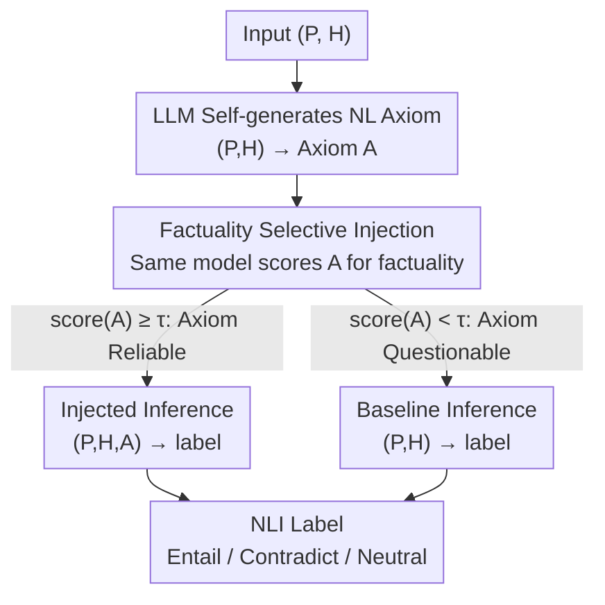

# Filling the Gap: Is Commonsense Knowledge Generation useful for Natural Language Inference?

**Conference**: ACL 2026  
**arXiv**: [2507.15100](https://arxiv.org/abs/2507.15100)  
**Code**: None (Link not provided in paper)  
**Area**: Natural Language Inference / Commonsense Reasoning / LLM Evaluation  
**Keywords**: NLI, Commonsense Axiom, SNLI, ANLI, Selective Knowledge Injection

## TL;DR
The paper proposes a method where LLMs generate natural language "commonsense axioms" to bridge premises and hypotheses. A "factuality judge" filters unreliable axioms, and high-quality ones are injected back into the NLI prompt. Consequently, Llama-3.1-70B and gpt-oss-120b achieve accuracy gains of 1.99-6.88% on SNLI/ANLI and significantly mitigate the "Neutral" safety bias.

## Background & Motivation
**Background**: NLI (Recognizing Textual Entailment, RTE) requires determining if a premise entails, contradicts, or is neutral toward a hypothesis. Theoretically, this requires inferences that a "commonsense adult reader" would make. While LLMs report high accuracy on benchmarks like SNLI/ANLI, studies (Luo 2022, McKenna 2023, Liu 2023) suggest they often rely on surface artifacts rather than genuine premise-to-hypothesis logic chains.

**Limitations of Prior Work**: When implicit "bridging knowledge" exists (e.g., "a woman with a big grin" $\to$ "she is not shot"), models frequently fail due to the lack of specific commonsense. Existing methods for integrating external knowledge (ExBERT, ERNIE-NLI, e-SNLI extensions) either rely on manual keyword labeling or extract from structured KGs like ConceptNet/Aristo, which cannot guarantee relevance to the specific P-H pair.

**Key Challenge**: There is a conflict between "coverage" and "relevance" in commonsense knowledge—KG sources are accurate but narrow, while LLM-generated content is broad but prone to hallucinations. To be effective, commonsense must be both "freely generated" and "selectively utilized."

**Goal**: (1) Verify whether LLMs can reliably generate commonsense axioms for P-H pairs; (2) Evaluate the impact of injecting these axioms on NLI accuracy.

**Key Insight**: Reconceptualize "commonsense" as natural language "axioms"—bridge rules about the world expressed in sentences rather than formal logic. LLMs first generate an axiom, which is then scored by the same model for factuality/helpfulness. Only high-scoring axioms are injected.

**Core Idea**: A "selective access" hybrid strategy is used, injecting axioms only when the judge deems them highly factual, allowing the model to revert to original P-H reasoning when the axiom is unreliable.

## Method

### Overall Architecture
The authors designed a three-stage prompting pipeline: (1) **Axiom Generation Prompt**: Feeds $(P, H)$ to the LLM to generate a single-sentence commonsense axiom $A$; (2) **Axiom Evaluation Prompt**: Feeds $(P, H, A)$ back to the same model to score dimensions like factuality, consistency, and helpfulness (adapted from Zheng 2024 metrics); (3) **Inference Prompt**: Follows two paths based on (2)—baseline mode $(P, H) \to \text{label}$; axiom-injected mode $(P, H, A) \to \text{label}$. The hybrid mode executes injection only if $A$ is judged highly factual; otherwise, it reverts to baseline. This hybrid path constitutes the selective access proposal.

### Key Designs

**1. LLM Self-generated Natural Language Axioms: Bridging Premise and Hypothesis with Sentences**

The authors attribute NLI failure to the "knowledge gap" between $P$ and $H$. When an implicit commonsense chain is required (e.g., "a woman with a big grin" $\to$ "she is not shot"), models fail without that specific bridge. Extracting triples from ConceptNet/Aristo is often too sparse or irrelevant. Instead, the authors let the LLM write the bridging rule in natural language—for instance, "A big grin usually implies a happy/safe state, which is incompatible with being shot."

This approach offers dual benefits: the same model possesses both linguistic understanding and vast commonsense, producing axioms highly relevant to $(P, H)$ and avoiding the sparsity of discrete KGs. Furthermore, natural language is more expressive than triples, explaining "why" an inference holds. Essentially, it helps the model articulate the missing link in its own reasoning.

**2. Factuality-aware Selective Injection: Injecting Only Trusted Content**

Unrestricted injection revealed that LLM-generated axioms vary in quality, often containing hallucinations or duplicating the hypothesis. Forcing injection can mislead the model. The solution is a factuality gate: the same LLM evaluates the axiom based on helpful/factual/consistent dimensions. Only axioms exceeding the factuality threshold $\tau$ proceed to the injection phase.

Formally, $\hat{y} = \text{LLM}(P, H, A)$ if $\text{score}(A) \geq \tau$ else $\text{LLM}(P, H)$. This "selective access" ensures the model reverts to standard reasoning when the axiom is untrustworthy. This step is the primary driver of performance gains; ablation shows that unfiltered injection often decreases performance. High-quality axioms push the model away from the "safe" Neutral default by providing explicit justification for Entailment or Contradiction, explaining why gains are more pronounced on the harder ANLI dataset.

### Loss & Training
No training is involved. Llama-3.1-70B-Instruct and gpt-oss-120b were utilized in zero-shot settings via three distinct prompts (generation, evaluation, inference). 2000 balanced samples were sampled from each of SNLI and ANLI.

## Key Experimental Results

### Main Results
Comparison of three strategies across 2000 samples for SNLI/ANLI:

| Dataset | Model | Baseline | Strong Injection | Hybrid (factuality-gated) | Gain |
|--------|------|----------|--------|--------------------------|------|
| SNLI | Llama-3.1-70B | ~Original | Fluctuation | +1.99% ~ +6.88% | Consistently Positive |
| SNLI | gpt-oss-120b | ~Original | Fluctuation | +1.99% ~ +6.88% | Consistently Positive |
| ANLI | Llama-3.1-70B | ~Original | Fluctuation | +1.99% ~ +6.88% | Consistently Positive |
| ANLI | gpt-oss-120b | ~Original | Fluctuation | +1.99% ~ +6.88% | Consistently Positive |

> Note: Detailed numerical tables appear in §4/Appendix; the abstract confirms a 1.99% to 6.88% range across all configurations.

Data distribution (Table 1): SNLI Entail 689 / Contradict 651 / Neutral 660; ANLI Entail 771 / Contradict 585 / Neutral 644. Classes are balanced, ruling out gains from prior class bias.

### Ablation Study

| Configuration | Key Observation | Explanation |
|------|----------|------|
| Baseline (Direct P, H inference) | Reference point | High recall on Neutral label |
| Strong inject (Inject all axioms) | Unstable gain | Performance dropped in some cases due to axiom noise |
| **Hybrid (factuality-gated injection)** | **+1.99~+6.88%** | Selective injection is the primary source of improvement |

### Key Findings
- Injecting axioms primarily moves the model from "conservative Neutral preference" toward Entail/Contradict by providing "reasons to take a stance."
- Strong injection (without filtering) often results in performance drops, confirming fluctuating quality in LLM-generated axioms. The filtering step is a core contribution rather than a minor trick.
- Improvements are more significant on ANLI (adversarial) than SNLI, indicating that commonsense bridges are more critical for difficult cases.

## Highlights & Insights
- Using the LLM as its own "axiom factuality judge" is a simple but effective self-evaluation approach—cheaper and more context-aware than external KGs.
- The failure of NLI is framed as a "knowledge gap" rather than insufficient model capacity. Filling this gap yields consistent gains.
- The results confirm that adding more information to a prompt isn't always better; the credibility of the information must be assessed first, echoing observations in RAG where noisy retrieval hurts performance.

## Limitations & Future Work
- Only SNLI/ANLI were used; generalizability to MNLI, e-SNLI, or HANS remains unverified.
- Using the same LLM for scoring may lead to a self-reinforcement loop; a separate model as a judge would be more credible.
- Lack of direct comparison with external knowledge baselines (e.g., RAG-from-ConceptNet or e-SNLI explanations).
- Evaluated only on 70B+ models; the quality of axiom generation and self-judging in smaller models is unknown.

## Related Work & Insights
- **vs. ExBERT (Gajbhiye 2021)**: Both inject external commonsense, but ExBERT trains fusion layers with ConceptNet. This work uses prompting and factuality filtering, eliminating training costs but sacrificing tight coupling.
- **vs. e-SNLI Explanation (Camburu 2018)**: e-SNLI uses human-labeled explanations. This work uses LLM-generated axioms, saving on annotation but requiring filtering mechanisms.
- **vs. Nguyen & Hatua 2024**: They retrieve commonsense from ConceptNet/Google via e-SNLI keywords. This work uses internalized model knowledge, avoiding retrieval failure risks.

## Rating
- Novelty: ⭐⭐⭐ Hybridizing LLM generation, self-evaluation, and selective injection is an effective synthesis of existing ideas.
- Experimental Thoroughness: ⭐⭐⭐ Covers two datasets and two models, but lacks comparisons with smaller models or more NLI benchmarks.
- Writing Quality: ⭐⭐⭐⭐ Clear motivation via Figure 1 and precise conceptualization of "axioms."
- Value: ⭐⭐⭐⭐ Provides a cautionary note for "external knowledge injection" in prompts—gates are essential. This principle applies to RAG and CoT enhancement.

<!-- RELATED:START -->

## Related Papers

- [\[ACL 2026\] Commonsense Knowledge with Negation: A Resource to Enhance Negation Understanding](commonsense_knowledge_with_negation_a_resource_to_enhance_negation_understanding.md)
- [\[ACL 2025\] Automatic Generation of Inference Making Questions for Reading Comprehension Assessments](../../ACL2025/nlp_understanding/automatic_generation_of_inference_making_questions_for_reading_comprehension_ass.md)
- [\[ACL 2026\] Semantic Reranking at Inference Time for Hard Examples in Rhetorical Role Labeling](semantic_reranking_at_inference_time_for_hard_examples_in_rhetorical_role_labeli.md)
- [\[ACL 2026\] Creating ConLangs to Probe the Metalinguistic Grammatical Knowledge of LLMs](creating_conlangs_to_probe_the_metalinguistic_grammatical_knowledge_of_llms.md)
- [\[ACL 2026\] Knowledge-driven Augmentation and Retrieval for Integrative Temporal Adaptation](knowledge-driven_augmentation_and_retrieval_for_integrative_temporal_adaptation.md)

<!-- RELATED:END -->
