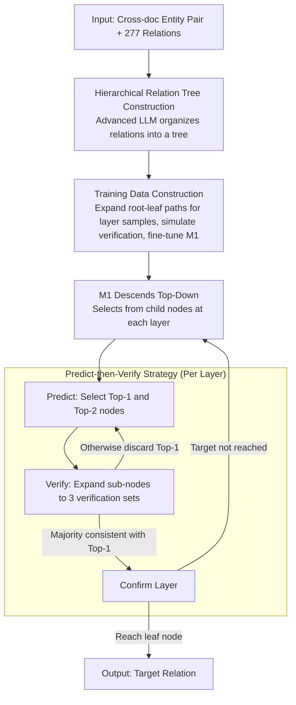

# HCRE: LLM-based Hierarchical Classification for Cross-Document Relation Extraction

**Conference**: ACL 2026 Findings  
**arXiv**: [2604.07937](https://arxiv.org/abs/2604.07937)  
**Code**: [https://github.com/XMUDeepLIT/HCRE](https://github.com/XMUDeepLIT/HCRE)  
**Area**: NLP Understanding  
**Keywords**: Cross-Document Relation Extraction, Hierarchical Classification, Large Language Models, Error Propagation Mitigation, Predict-then-Verify Strategy

## TL;DR
The HCRE model is proposed to transform cross-document relation extraction from direct classification over large relation sets into layer-by-layer hierarchical classification by constructing a hierarchical relation tree. A predict-then-verify inference strategy is designed to mitigate inter-layer error propagation, significantly outperforming SLM and LLM baselines on the CodRED dataset.

## Background & Motivation

**Background**: Cross-document relation extraction (RE) aims to identify relations between entities distributed across different documents. Over half of the relational facts in Wikidata span multiple documents. Existing methods primarily adopt the "Small Language Model (SLM) + Classifier" paradigm.

**Limitations of Prior Work**: The limited linguistic understanding of SLMs constrains further improvements in cross-document RE. Preliminary experiments show that directly applying LLMs to cross-document RE yields suboptimal results, even underperforming strong SLM baselines. In-depth analysis reveals the root cause is the excessive number of predefined relations (277 in CodRED): (1) numerous semantically similar relations are difficult to distinguish; (2) enumerating all relations leads to excessive input length, distracting the LLM's attention from key document information.

**Key Challenge**: LLMs possess strong linguistic understanding but fail to effectively handle large-scale relation option sets, while SLMs can handle them but lack sufficient understanding.

**Goal**: To reduce the number of relation options the LLM must consider during each inference while avoiding the error propagation issues inherent in hierarchical classification.

**Key Insight**: Preliminary experiments demonstrate that reducing the number of relation options significantly improves LLM performance (see Figure 4), which inspires the design of hierarchical classification.

**Core Idea**: Construct a hierarchical relation tree allowing the LLM to perform top-down reasoning for target relations layer by layer, considering only a few options at each level. A predict-then-verify strategy is used to mitigate inter-layer error propagation through multi-view verification.

## Method

### Overall Architecture
The core problem HCRE addresses is that while LLMs have strong linguistic capabilities, presenting all 277 relations from CodRED in a single prompt makes it difficult to distinguish similar relations and distracts the model. HCRE decomposes "1-out-of-277" into "top-down layer-wise selection": an advanced LLM is used offline to organize relations into a tree. Tree paths (root to leaf) are expanded to construct training data for layer-wise classification and verification, used to fine-tune the prediction LLM $\mathcal{M}_1$. During inference, $\mathcal{M}_1$ descends the tree, selecting from a few child nodes at each level. To prevent errors from propagating, a "Predict-then-Verify" strategy is executed at each layer, using fine-grained sub-node information to double-check decisions.

### Key Designs

**1. Hierarchical Relation Tree Construction: Decomposing 277-way Classification** 

Directly handling 277 relations causes LLMs to struggle with near-synonyms and long option lists. HCRE uses an advanced LLM (e.g., GPT-4o) offline to organize relations into a tree. At each level, a partitioning criterion $C_l$ (e.g., "by domain") is generated to group relations. The second layer is specifically designed with "Valid Relation" and "No Valid Relation" (NA) branches to explicitly handle label imbalance. This ensures each parent has a small number of children, reducing classification difficulty.

**2. Training Data Construction: Learning Layer-wise Classification and Verification**

Level-wise descent and verification are behaviors not inherent to $\mathcal{M}_1$. For each sample $(x, \mathcal{R}, r)$, HCRE identifies the root-to-leaf path and expands it into $L-1$ classification samples $\mathcal{D}_1$. Verification samples $\mathcal{D}_2$ are generated by simulating the inference process—replacing candidate nodes with their sub-nodes. Fine-tuning $\mathcal{M}_1$ on $\mathcal{D}_1 \cup \mathcal{D}_2$ teaches the model to use the tree hierarchy and leverage fine-grained information for verification.

**3. Predict-then-Verify (PtV) Inference Strategy: Mitigating Error Propagation**

Hierarchical classification suffers from error propagation. HCRE splits decisions into prediction and verification. In the prediction step, $\mathcal{M}_1$ selects the top-1 node $\hat{r}_{1st}$ and top-2 node $\hat{r}_{2nd}$ from the current options $\mathcal{R}_l$. In the verification step, $\hat{r}_{1st}$ and $\hat{r}_{2nd}$ are expanded into their sub-nodes to create three verification sets $\mathcal{R}_l^{v_1}, \mathcal{R}_l^{v_2}, \mathcal{R}_l^{v_3}$. If the majority of verification results match the semantics of $\hat{r}_{1st}$, the prediction is confirmed; otherwise, $\hat{r}_{1st}$ is discarded. This leverages fine-grained sub-node semantics to distinguish subtle differences between the top candidates.

### Loss & Training
Standard supervised fine-tuning loss (cross-entropy) is used, training on $\mathcal{D}_1 \cup \mathcal{D}_2$.

## Key Experimental Results

### Main Results
Results on the CodRED dataset:

| Model | Closed micro F1 | Closed binary F1 | Open micro F1 | Open binary F1 |
|------|----------------|-----------------|---------------|----------------|
| ECRIM (RoBERTa) | 42.54 | 49.47 | 23.39 | 27.60 |
| NEPD (RoBERTa) | 42.96 | 52.67 | 30.12 | 37.04 |
| Vanilla LLaMA | 38.14 | 41.43 | 15.19 | 17.00 |
| **Ours (LLaMA)** | **45.35** | **58.19** | **34.91** | **49.33** |

### Ablation Study

| Configuration | micro F1 | binary F1 | Description |
|------|---------|----------|------|
| Full HCRE | 45.35 | 58.19 | Complete model |
| w/o multi-view | 39.37 | 49.63 | Single verification set |
| w/o PtV | 37.66 | 47.28 | Without Predict-then-Verify |
| w/o LTC | 43.18 | 56.60 | Direct tree generation vs. layer-wise |
| w/o HRT | 38.14 | 41.43 | No tree, direct classification |

### Key Findings
- HCRE outperforms the strongest SLM baseline (NEPD) by 2.39 micro F1 and 5.52 binary F1 in the closed setting.
- Improvements are even more significant in the open setting (binary F1 jumps from 37.04 to 49.33), indicating hierarchical classification is more effective for long documents.
- The PtV strategy is the most critical component: removing it drops micro F1 by 7.69 and binary F1 by 10.91.
- Multi-view verification (3 sets vs. 1) provides an additional 1.71 micro F1 gain.
- Error propagation analysis shows that PtV effectively reduces error rates at every layer.

## Highlights & Insights
- The finding that "excessive relation options" cause LLM performance degradation in RE provides general guidance for applying LLMs to any large-scale classification task.
- The PtV strategy's design of "replacing parents with sub-nodes" effectively utilizes fine-grained information to validate coarse-grained judgments.
- The analysis of evaluation metrics (maximum F1 overestimating performance, P@K sensitivity) offers valuable methodological suggestions for the community.

## Limitations & Future Work
- Tree construction relies on GPT-4o, creating dependency on tree quality and incurring high costs.
- Verification steps increase inference overhead due to multiple LLM calls per layer.
- Experiments are limited to the CodRED dataset; generalization needs further verification.
- Future work could explore adaptive tree depth or dynamic verification intensity to balance efficiency and accuracy.

## Related Work & Insights
- **vs. NEPD**: NEPD focuses on long-range dependency but is limited by the SLM capacity ceiling; HCRE breaks this using LLM linguistic power.
- **vs. HTC Methods**: Traditional Hierarchical Text Classification (e.g., DFS-L, BFS-L) lacks verification mechanisms, leading to severe error propagation in cross-doc RE.
- **vs. Vanilla LLM**: Preliminary experiments clearly show the necessity of hierarchy when dealing with large relation sets.

## Rating
- Novelty: ⭐⭐⭐⭐ Combination of hierarchical classification and PtV is novel and practical.
- Experimental Thoroughness: ⭐⭐⭐⭐ Strong ablation and convincing motivation analysis.
- Writing Quality: ⭐⭐⭐⭐⭐ Clear logical chain from problem discovery to solution.
- Value: ⭐⭐⭐⭐ High practical value for applying LLMs to large-scale classification.

<!-- RELATED:START -->

## Related Papers

- [\[ACL 2026\] Beyond Chunking: Discourse-Aware Hierarchical Retrieval for Long Document Question Answering](beyond_chunking_discourse-aware_hierarchical_retrieval_for_long_document_questio.md)
- [\[ACL 2026\] LLM-Guided Semantic Bootstrapping for Interpretable Text Classification with Tsetlin Machines](llm-guided_semantic_bootstrapping_for_interpretable_text_classification_with_tse.md)
- [\[ACL 2026\] LexRel: Benchmarking Legal Relation Extraction for Chinese Civil Cases](lexrel_benchmarking_legal_relation_extraction_for_chinese_civil_cases.md)
- [\[ACL 2025\] Towards a More Generalized Approach in Open Relation Extraction](../../ACL2025/nlp_understanding/generalized_open_relation_extract.md)
- [\[ACL 2025\] A Variational Approach for Mitigating Entity Bias in Relation Extraction](../../ACL2025/nlp_understanding/variational_approach_mitigating_entity_bias_relation_extraction.md)

<!-- RELATED:END -->
