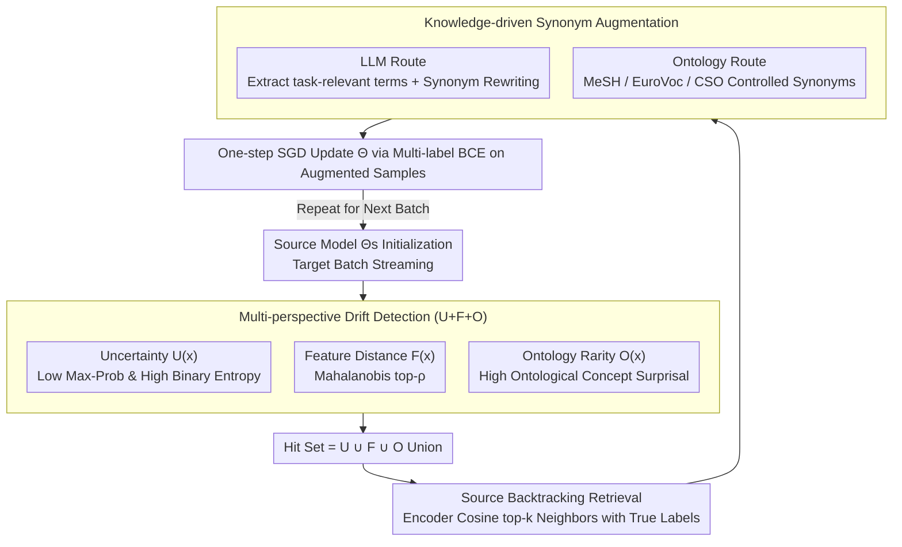

# Knowledge-driven Augmentation and Retrieval for Integrative Temporal Adaptation

**Conference**: ACL 2026  
**arXiv**: [2604.22098](https://arxiv.org/abs/2604.22098)  
**Code**: https://github.com/trust-nlp/TemporalLearning-KARITA  
**Area**: Temporal Adaptation / Data Drift / Medical NLP  
**Keywords**: Temporal Shift, Ontological Knowledge, Retrieval Augmentation, Synthetic Synonyms, Multi-label Classification

## TL;DR
KARITA decomposes "temporal drift" into three complementary signals: uncertainty, feature distance, and ontological term rarity. For each target sample hit by these signals, it backtracks and retrieves semantically similar source samples with ground truth. It then employs LLM + domain ontologies (MeSH / EuroVoc / CSO) to generate synonym rewrites for data augmentation. This approach migrates the source model to future periods in a purely data-driven manner, consistently outperforming strong baselines on long-span multi-label classification data across clinical, legal, and scientific domains.

## Background & Motivation

**Background**: In real-world deployments, models are trained on historical data and inferred on future data, where semantic distributions and domain knowledge are constantly evolving. Existing temporal adaptation works either ignore the time dimension or focus only on a single drift signal—such as diachronic embeddings, feature space distance, or concept distributions—relying on a single signal to describe all shifts.

**Limitations of Prior Work**: In long-span, high-stakes corpora such as clinical (MIMIC), legal (EurLex), and scientific (arXiv-CS) data, temporal shifts are naturally multi-source: new medication regulations, legislative changes, and emerging CS sub-fields occur simultaneously. Unified feature representations flatten and misjudge shifts of different natures, leading to model collapse in certain time periods (e.g., EATA's ma-F1 on MIMIC drops to 28.02 from source to target, a typical failure).

**Key Challenge**: Shifts can be categorized as "semantically visible" and "semantically invisible." Terminology-level evolution (e.g., new disease codes, new legislative abbreviations) often does not produce significant distances in feature space, causing pure feature-shift detection to fail; meanwhile, entropy/uncertainty only considers output, potentially missing samples where the model is confident but the actual semantics have shifted. No single signal is sufficient.

**Goal**: (1) Characterize heterogeneous temporal drift using multi-perspective, complementary signals; (2) Avoid reliance on target labels or blind pseudo-labeling by utilizing "backtracking retrieval" of real source annotations; (3) Perform term-level synonym rewriting on retrieved samples to enhance model robustness against terminology evolution without retraining the entire architecture.

**Key Insight**: The authors reframe temporal adaptation as a "data-centric, iterative selection" process: for each target batch, "drift-hit" samples are first identified, and then corresponding source samples are retrieved and augmented, rather than performing one-time full retraining.

**Core Idea**: Use a joint hit signal of uncertainty + feature + ontology to identify "still credible" source samples, perform LLM/ontology synonym augmentation, and feed them back for training, achieving an iterative adaptation of "shift-aware retrieval + knowledge-aware augmentation."

## Method

### Overall Architecture
KARITA addresses the problem where models trained on historical data must perform inference on future data, where shifts are multi-source and overlapping. Its core strategy is to treat temporal adaptation as a "data-centric, batch-level iterative" process. Initializing with a source model $\Theta_s$, it performs four steps for each streaming target batch $\mathcal{B}_t$ (Algorithm 1): first, it selects "drift-hit" samples $\mathcal{D}_{shift}$ using the union of $U(x), F(x), O(x)$; second, it retrieves the nearest source neighbors with true labels for each hit sample; third, it uses LLMs or domain ontologies to rewrite terms in these source samples into potential future synonyms; finally, it updates $\Theta$ with a single gradient step on these "ground truth + term-aligned" augmented samples. The process requires no target labels, and LLM-based term identification is cached to save costs.

### Key Designs

**1. Multi-perspective Drift Detection (U+F+O): Judging who to focus on via output, representation, and ontology**

Temporal shifts include "semantically visible" and "semantically invisible" types: term-level evolution (new disease codes, new abbreviations) often does not produce obvious distances in feature space, which pure feature-shift misses; meanwhile, entropy-based output signals miss samples where the model is confident but the semantics have changed. KARITA thus uses three complementary signals. Uncertainty is defined by max sigmoid probability and average binary entropy: $U(x)=\mathbf{1}[\max_l p_l(x)<\tau_p \wedge H(x)>\tau_H]$ ($\tau_p{=}0.5,\tau_H{=}0.25$); Feature distance uses Mahalanobis distance $d(x)=\sqrt{(E(x)-\mu)^\top\Sigma^{-1}(E(x)-\mu)}$, taking top-$\rho$ after min-max normalization; Ontology uses source period concept frequencies $p_{t_1}(c)$ as a prior, calculating the average surprisal of all ontological concepts in a target document: $O_{\text{tail}}(x)=\frac{1}{|\mathcal{C}(x)|}\sum_c -\log(p_{t_1}(c)+\varepsilon)$. Larger values indicate more rare/new terms. The final hit set is the union $\mathcal{D}_{shift}=\mathcal{D}_U\cup\mathcal{D}_F\cup\mathcal{D}_O$ ($\rho{=}0.1$). This union is necessary because t-SNE shows that ontology-shift and feature-shift samples barely overlap (only 0.37% on MIMIC).

**2. Source Backtracking: Using ground truth source neighbors as credible teachers**

Once drift samples are identified, the method avoids pseudo-labeling (which accumulates errors) or target entropy minimization (which is unstable). Instead, KARITA uses the source model's encoder to map $x_t$ and source $x_s$ to $\mathbf{z}_t,\mathbf{z}_s$, retrieving top-$k$ neighbors (default $k{=}3$) via cosine similarity $\text{sim}(x_t,x_s)=\cos(\mathbf{z}_t,\mathbf{z}_s)$. These true-labeled source neighbors act as semantically aligned teachers, significantly suppressing error accumulation.

**3. Knowledge-driven Synonym Augmentation: Rewriting source terms into future synonyms**

To help the model learn that terms have changed but semantics remain, KARITA performs term-level synonym rewriting on retrieved source samples. LLM route: GPT-4o-mini identifies 3–10 "task-relevant terms" and generates synonyms. Ontology route: For MIMIC (where privacy prevents LLM use), it queries MeSH (descriptors/supplementary concepts), EuroVoc, or CSO for controlled synonyms. Controlled lexical perturbations are applied to the source sentences to generate augmented samples that align with target-period term evolution.

### Loss & Training
Source models: XLM-RoBERTa-base for EurLex / arXiv-CS and Longformer for MIMIC were trained on the earliest period $T_1$ for 10 epochs using multi-label BCE. For adaptation, KARITA uses the same BCE loss to perform SGD only on augmented retrieved source samples, requiring no target labels. Sensitivity analysis shows $\rho{=}0.1, k{=}3$ are optimal.

## Key Experimental Results

### Main Results
Source $\rightarrow$ Target classification performance (%), test sets in target periods:

| Dataset | Metric | Source Model | Self-Labeling | EATA (TTA) | IFT | **KARITA** | Target Upper |
|--------|------|-------------|---------------|------------|-----|------------|-------------|
| MIMIC | ma-F1 | 40.65 | 40.55 | 28.02 | 43.05 | **52.12** | 65.78 |
| MIMIC | mi-F1 | 52.86 | 52.34 | 45.98 | 55.24 | **63.95** | 76.66 |
| EurLex | ma-F1 | 46.75 | 42.02 | 47.97 | 37.12 | **56.15** | 71.74 |
| arXiv-CS | ma-F1 | 34.86 | 34.94 | 27.63 | 40.67 | **49.82** | 65.51 |
| arXiv-CS | sa-F1 | 43.36 | 43.46 | 34.90 | 49.17 | **62.63** | 74.98 |

KARITA closes the source-to-target ma-F1 gap by +11.47 on MIMIC and +14.96 on arXiv-CS. EATA fails on MIMIC, dropping 12 points below the Source baseline, confirming the risks of unsupervised TTA in clinical domains.

### Ablation Study
Removing specific KARITA components (Target test ma-F1):

| Configuration | MIMIC | EurLex | arXiv-CS | Note |
|------|-------|--------|----------|------|
| Full KARITA | 52.12 | 56.15 | 49.82 | Full method |
| w/o detection (random) | 49.33 | 48.77 | 31.02 | arXiv-CS drops 18.8 |
| w/o augmentation | 48.13 | 54.60 | 43.74 | No term alignment |
| w/o retrieval (dissimilar) | 50.67 | 44.16 | 36.40 | EurLex drops 12 |

### Key Findings
- **Ontological term drift is an irreplaceable signal**: On MIMIC, $O\cap F$ overlap is only 0.37%. t-SNE confirms ontology-shift and feature-shift samples occupy different regions.
- **Retrieval + Augmentation work synergistically**: Removing either component results in a steeper performance drop than removing both, proving it is a truly integrated framework.
- **TTA paradigms are unstable under multi-source drift**: EATA/SAR degrade on MIMIC because entropy minimization reinforces incorrect labels; KARITA avoids this through true source supervision.
- **Temporal distance $\uparrow$ correlates with three shifts $\uparrow$**: Features, ontology surprisal, and entropy all monotonically increase over time, validating the multi-signal approach.

## Highlights & Insights
- "Temporal drift" is usually measured as a scalar; this paper structures it into "output, representation, and ontology" layers, pioneering the use of ontological surprisal as a first-order detection signal.
- Using LLMs to extract task-relevant terms ensures that lexical perturbations are "label-aware," avoiding semantic degradation during augmentation.
- The MeSH/EuroVoc route provides a practical "privacy fallback": the framework remains effective using only local ontologies when medical data cannot be sent to external LLMs.
- Reframing adaptation as a batch-level iterative process with cached synonyms makes it more deployment-friendly than continuous online backpropagation.

## Limitations & Future Work
- The framework depends heavily on external knowledge resources (LLMs/Ontologies).
- It only addresses lexical/terminology shifts; structural shifts like new concepts or task redefinitions are not explicitly modeled.
- The merging of signals uses a simple union/top-$\rho$; learning domain-specific weights for signals remains for future work.

## Related Work & Insights
- **vs IFT / ChronosLex**: IFT uses incremental training to "follow time"; KARITA uses augmentation to make source samples "act as if they are from the future."
- **vs Self-Labeling**: KARITA uses true labels from the source as a bridge, offering much better robustness.
- **vs SAR / EATA / TENT**: These TTA methods collapse when distribution shifts are massive; KARITA's data-centric approach avoids negative feedback loops from entropy minimization.

## Rating
- Novelty: ⭐⭐⭐⭐ 
- Experimental Thoroughness: ⭐⭐⭐⭐ 
- Writing Quality: ⭐⭐⭐⭐ 
- Value: ⭐⭐⭐⭐

<!-- RELATED:START -->

## Related Papers

- [\[ACL 2026\] It's High Time: A Survey of Temporal Question Answering](it39s_high_time_a_survey_of_temporal_question_answering.md)
- [\[ACL 2026\] Beyond Chunking: Discourse-Aware Hierarchical Retrieval for Long Document Question Answering](beyond_chunking_discourse-aware_hierarchical_retrieval_for_long_document_questio.md)
- [\[ACL 2026\] Creating ConLangs to Probe the Metalinguistic Grammatical Knowledge of LLMs](creating_conlangs_to_probe_the_metalinguistic_grammatical_knowledge_of_llms.md)
- [\[ACL 2026\] AdapTime: Enabling Adaptive Temporal Reasoning in Large Language Models](adaptime_enabling_adaptive_temporal_reasoning_in_large_language_models.md)
- [\[ACL 2026\] Filling the Gap: Is Commonsense Knowledge Generation useful for Natural Language Inference?](filling_the_gap_is_commonsense_knowledge_generation_useful_for_natural_language_.md)

<!-- RELATED:END -->
