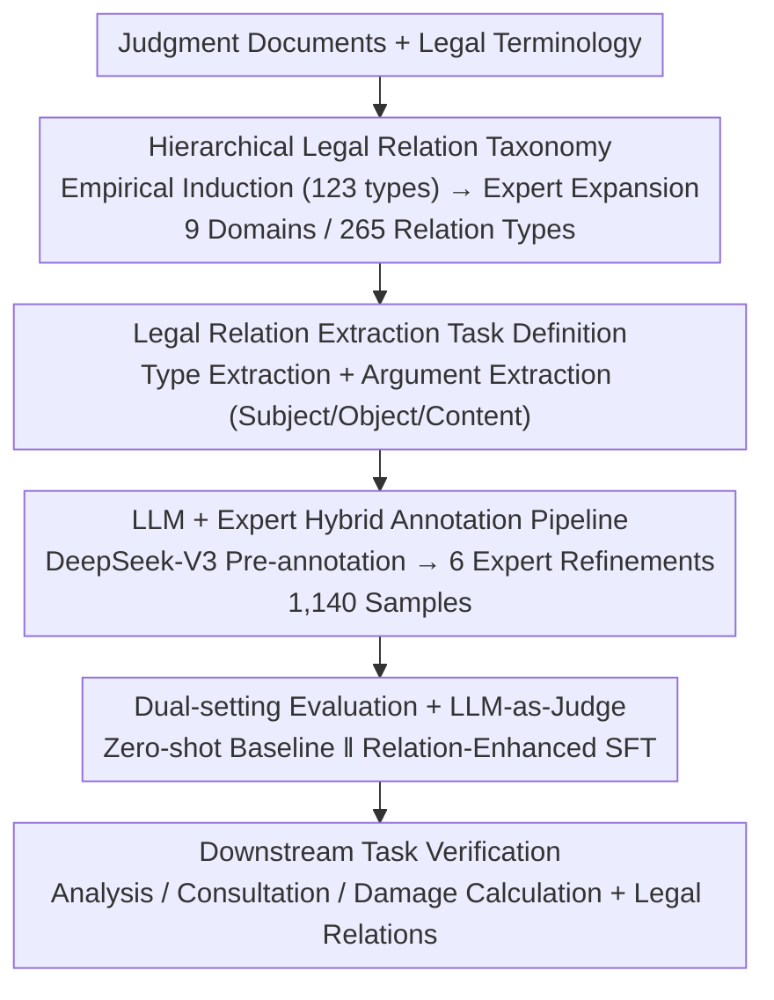

# LexRel: Benchmarking Legal Relation Extraction for Chinese Civil Cases

**Conference**: ACL 2026  
**arXiv**: [2512.12643](https://arxiv.org/abs/2512.12643)  
**Code**: [GitHub](https://github.com/thunlp/LexRel)  
**Area**: LLM Evaluation / Legal NLP  
**Keywords**: Legal relation extraction, Chinese civil cases, legal knowledge graph, benchmark, relation taxonomy

## TL;DR

Constructed the first structured classification system for Chinese civil legal relations (9 domains, 265 relation types) and proposed the LexRel benchmark (1,140 expert-annotated samples). Evaluated the capabilities of mainstream LLMs in legal relation extraction, identifying significant limitations in current models while demonstrating the performance gains legal relation information provides to downstream legal AI tasks.

## Background & Motivation

**Background**: Legal relations are the fundamental analysis units in Chinese civil cases, referring to the relationships between individuals prescribed by legal norms. In judicial practice, legal professionals frequently rely on legal relations for legal information retrieval, statute prediction, and case outcome analysis. However, legal relations have been long overlooked in legal AI, particularly lacking systematic research within the context of Chinese civil law.

**Limitations of Prior Work**: Information extraction in current legal AI primarily targets factual entities (e.g., persons, objects, contracts) or general social relations (e.g., employment, ownership), ignoring that legal relations—as concepts rooted in statutory rules and judicial practice—differ essentially from ordinary semantic associations in natural language. Furthermore, legal relations are almost never explicitly stated in judgment documents and must typically be inferred from factual descriptions. Existing legal relation schemas are often too coarse-grained, classifying only at the broad level of civil rights and obligations.

**Key Challenge**: The lack of a fine-grained, structured legal relation classification system and high-quality annotated data makes it impossible to systematically evaluate and enhance the capabilities of AI models in understanding legal relations.

**Goal**: (1) Establish the first comprehensive legal relation classification system covering Chinese civil law; (2) Define the legal relation extraction task and construct an expert-annotated benchmark dataset; (3) Evaluate the legal relation extraction capabilities of mainstream LLMs; (4) Verify the gains of legal relation information for downstream tasks.

**Key Insight**: Starting from legal theory and combining judicial practice with expert guidance, the taxonomy is constructed before computational annotation and evaluation, ensuring both legal normativity and AI utility.

## Method

### Overall Architecture

LexRel aims to address the gap where legal relations in Chinese civil law lack fine-grained structured descriptions and high-quality evaluation data for LLMs. It proceeds through a sequential pipeline: first, designing a hierarchical legal relation taxonomy and argument definitions top-down; second, formalizing "legal relation extraction" as a computational task and creating benchmark data via an "LLM pre-annotation + expert refinement" pipeline; finally, evaluating multiple SOTA LLMs under zero-shot and relation-enhanced settings, and verifying whether extracted legal relations benefit downstream legal tasks.

### Key Designs

**1. Hierarchical Legal Relation Classification System: A fine-grained coordinate system for implicit relations**

Existing legal KGs mostly characterize general social relations like employment or ownership. True "legal relations" rooted in statutory rules are rarely explicit in judgments, and existing schemas are too broad. This paper constructs a system in two stages: first, extracting relation expressions from judgments using keyword matching and filtering 123 candidate types against legal literature across 6 domains; then, having two senior legal experts audit and expand the system, adding three new domains (negotiable instruments, letters of credit, and independent guarantees), resulting in **9 domains and 265 relation types**. This ensures the taxonomy has both empirical induction from judgment data and normative grounding from legal theory.

**2. Legal Relation Extraction Task Definition: Splitting "inference from facts" into type and arguments**

Legal relations are usually implicit and must be inferred from factual descriptions, making them harder than conventional RE. This paper formalizes it as two cascaded sub-tasks: **Type Extraction** identifies the relation type $\hat{r} = f_{\text{type}}(x), \hat{r} \in \mathcal{R}$ from factual text $x$; **Argument Extraction** then extracts the subject, object, and content $(\hat{S}, \hat{O}, \hat{c}) = f_{\text{arg}}(x, \hat{r})$ conditioned on the predicted type. This cascading allows for quantifiable evaluation and reveals the differing difficulties of relation identification versus argument completion.

**3. LLM + Expert Hybrid Annotation Pipeline: Maintaining quality while controlling costs**

Pure manual annotation is expensive and requires legal expertise. This paper uses DeepSeek-V3 to extract candidate types and arguments from full judgments as drafts. Six legal annotators then verify and correct each entry under the supervision of a senior legal AI expert. After removing 60 samples where relations could not be identified, 1,140 annotated samples were obtained. LLMs downgraded the human role from "annotating from scratch" to "reviewing drafts," significantly reducing the burden.

**4. Dual-setting Evaluation + LLM-as-Judge Argument Scoring: Scaling coverage and open-ended scoring**

Evaluation includes: **Zero-shot Baselines** for direct extraction; and **Relation-Enhanced Baselines (RE)** using GPT-4o or DeepSeek-R1 to generate training data from full judgments (including legal analysis) to perform SFT on open-source small models. Since arguments are open-ended text, LLM-as-Judge (DeepSeek-V3) is used for scoring. Manual audits showed its accuracy reached 95.4% (subject), 96.9% (object), and 81.0% (content), ensuring the reliability of automated scoring.

## Key Experimental Results

### Main Results

| Model | Method | Type Micro-F1 | Type Macro-F1 | Argument Micro-F1 | Argument Macro-F1 |
|------|------|------------------|------------------|------------------|------------------|
| o3-mini | zero-shot | **0.762** | **0.441** | **0.382** | **0.129** |
| DeepSeek-R1 | zero-shot | 0.693 | 0.376 | 0.268 | 0.065 |
| GPT-4o | zero-shot | 0.670 | 0.314 | 0.224 | 0.068 |
| Claude-Sonnet-4 | zero-shot | 0.590 | 0.330 | 0.258 | 0.088 |
| Qwen3-14B | RE w/ R1 | 0.733 | 0.430 | 0.381 | 0.146 |
| Qwen3-8B | RE w/ R1 | 0.675 | 0.337 | 0.304 | 0.098 |
| Llama3.1-8B | zero-shot | 0.250 | 0.052 | 0.027 | 0.006 |

### Downstream Task Gain

| Model | Case Analysis | Analysis+LR | Consultation | Consult+LR | Damage Calculation | Damage+LR |
|------|---------|------------|------|---------|---------|------------|
| MiniCPM4-8B | 32.0 | **45.0** | 7.6 | **8.4** | 65.0 | **76.8** |
| DeepSeek-V3 | 66.2 | **68.2** | 16.4 | **16.5** | 85.0 | **86.4** |
| GPT-4o | 55.8 | **56.6** | 18.2 | **19.2** | 84.4 | **85.8** |

### Key Findings

- Reasoning LLMs (o3-mini, DeepSeek-R1) significantly outperform non-reasoning models in zero-shot settings, indicating that legal relation extraction requires strong reasoning capabilities.
- Argument extraction (max micro-F1 only 0.382) is much harder than type extraction (0.762). Macro-F1 for all models is much lower than micro-F1, indicating poor performance on long-tail relation types.
- SFT can significantly boost small model performance (e.g., InternLM3-8B argument micro-F1 rose from 0.048 to 0.323); Qwen3-14B + RE nearly matches o3-mini's zero-shot level.
- Legal relation distribution in LexRel exhibits a long-tail characteristic, highly consistent with the distribution of "cause of action" in 26.6 million real civil judgments (where the top 25 causes cover 80% of cases).
- Legal relation information consistently provides gains across downstream tasks; MiniCPM4-8B improved from 32.0 to 45.0 (+13.0) in case analysis and 65.0 to 76.8 (+11.8) in damage calculation.

## Highlights & Insights

- **First Comprehensive Civil Legal Relation System**: 265 relation types across 9 domains, combining legal theory and data-driven construction, filling a major gap in legal AI.
- **High Task Value**: Legal relations are implicit in judgments and must be inferred from facts, posing a severe challenge to LLMs' legal reasoning abilities.
- **Deep Long-tail Analysis**: Demonstrated representative distribution by comparing LexRel with the cause-of-action distribution of 26.6 million real judgments.
- **Verified Practical Utility**: Even with current modest extraction accuracy, injecting legal relation information improves performance in downstream tasks.

## Limitations & Future Work

- The schema and dataset focus on Chinese civil law; migration to other legal systems requires localized adaptation.
- Synthetic training data generation and LLM-as-Judge evaluation rely on the DeepSeek series, posing potential model-family coupling issues.
- Argument extraction performance remains low (max macro-F1 of 0.146), with long-tail types being the primary bottleneck.
- The scale of 1,140 samples is relatively small, particularly given the sparsity across 265 relation types.

## Related Work & Insights

- **vs. Legal Knowledge Graphs**: Existing legal KGs mainly capture general social relations (e.g., employment, kinship). LexRel focuses on relations under legal norms (e.g., creditor-debtor, contractual obligations), which are closer to judicial practice.
- **vs. General Relation Extraction**: Legal RE is more difficult because relations are often not explicitly expressed in text and require inference via legal knowledge.
- **vs. LawBench and Legal Benchmarks**: LexRel focuses on an overlooked yet fundamental capability—the identification of legal relations—serving as a vital supplement to existing legal evaluations.

## Rating

- Novelty: ⭐⭐⭐⭐ First systematic definition and evaluation of Chinese civil legal relation extraction.
- Experimental Thoroughness: ⭐⭐⭐⭐ Evaluated 12 models across two settings, including long-tail analysis and downstream verification, though sample size is modest.
- Writing Quality: ⭐⭐⭐⭐ Effective integration of legal studies and NLP; clear construction process for the taxonomy.
- Value: ⭐⭐⭐⭐ Provides a crucial benchmark resource for the legal AI community and advances the research direction of legal relation modeling.

<!-- RELATED:START -->

## Related Papers

- [\[ACL 2026\] HCRE: LLM-based Hierarchical Classification for Cross-Document Relation Extraction](hcre_llm-based_hierarchical_classification_for_cross-document_relation_extractio.md)
- [\[ACL 2025\] Towards a More Generalized Approach in Open Relation Extraction](../../ACL2025/nlp_understanding/generalized_open_relation_extract.md)
- [\[ACL 2025\] A Variational Approach for Mitigating Entity Bias in Relation Extraction](../../ACL2025/nlp_understanding/a_variational_approach_for_mitigating_entity_bias_in_relation_extraction.md)
- [\[ACL 2025\] Generating Diverse Training Samples for Relation Extraction with Large Language Models](../../ACL2025/nlp_understanding/generating_diverse_training_samples_for_relation_extraction_with_large_language_.md)
- [\[ACL 2026\] DiZiNER: Disagreement-guided Instruction Refinement via Pilot Annotation Simulation for Zero-shot Named Entity Recognition](diziner_disagreement-guided_instruction_refinement_via_pilot_annotation_simulati.md)

<!-- RELATED:END -->
