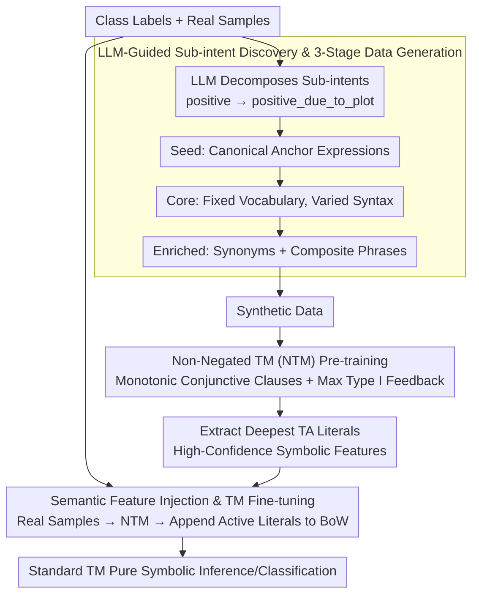

# LLM-Guided Semantic Bootstrapping for Interpretable Text Classification with Tsetlin Machines

**Conference**: ACL 2026 Findings  
**arXiv**: [2604.12223](https://arxiv.org/abs/2604.12223)  
**Code**: None  
**Area**: Interpretability / Text Classification  
**Keywords**: Tsetlin Machine, Semantic Guidance, Symbolic Learning, Sub-intent Discovery, Interpretable Classification

## TL;DR

This paper proposes an LLM-guided semantic bootstrapping framework. By utilizing LLMs to generate sub-intents and three-stage curriculum synthetic data, the authors train a Non-Negated Tsetlin Machine (NTM) to extract high-confidence symbolic features. These features are injected into real data, allowing a standard TM to approach BERT-level classification performance while maintaining full interpretability.

## Background & Motivation

**Background**: Tsetlin Machines (TMs) have gained attention in interpretable NLP due to their clause-level transparency, having been applied to tasks like document classification and sentiment analysis. Meanwhile, Pre-trained Language Models (PLMs) like BERT offer powerful semantic representations but are costly and opaque.

**Limitations of Prior Work**: (1) TMs based on Boolean Bag-of-Words (BoW) representations fail to generalize to semantically similar but morphologically different expressions unless they explicitly appear in the training data; (2) Augmenting TM inputs with Word2Vec/GloVe provides only limited semantic alignment; (3) Despite their performance, BERT models lack decision traceability in high-risk domains like law and medicine.

**Key Challenge**: A fundamental contradiction exists between symbolic interpretability and semantic generalization—BoW representations ensure transparency but sacrifice semantic understanding, while embedding representations capture semantics but lose interpretability.

**Goal**: Transfer the semantic knowledge of LLMs into the TM in a symbolic form without introducing embedding layers or runtime LLM calls.

**Key Insight**: Utilize LLMs to generate interpretable sub-intents (e.g., `positive_due_to_plot`) and corresponding synthetic data, bridging the semantic gap through symbolic augmentation rather than embedding augmentation.

**Core Idea**: The LLM does not participate in classification inference. Instead, it acts as a "semantic teacher" during the offline training phase, providing symbolic semantic priors for the TM through sub-intent decomposition and curriculum data generation.

## Method

### Overall Architecture

The framework addresses the following conflict: Tsetlin Machines (TMs) achieve clause-by-clause readability via Boolean Bag-of-Words (BoW) but cannot generalize to unseen synonyms; BERT is semantically strong but lacks traceability. The authors employ the LLM as an offline "semantic teacher" to transfer semantic knowledge into the TM in three steps: first, the LLM decomposes categories into sub-intents and generates synthetic data across three stages (Seed → Core → Enriched); second, a Non-Negated TM (NTM) is pre-trained on this synthetic data to extract high-confidence symbolic features; finally, these features are injected into the BoW representation of real data to fine-tune a standard TM. Inference remains purely symbolic, requiring no LLM calls or embeddings.

### Key Designs

**1. LLM-Guided Sub-intent Discovery & 3-Stage Data Generation: Decomposing Coarse Labels into Readable Semantic Drivers**

The TM's BoW representation struggles with semantically similar but morphologically distinct expressions. The LLM first decomposes each category into fine-grained sub-intents (e.g., `positive_due_to_plot`, `positive_due_to_acting`). Synthetic data is then generated following a curriculum learning approach: the **Seed** stage generates 15–20 word canonical expressions as anchors; the **Core** stage maintains vocabulary stability while varying syntactic structures; the **Enriched** stage introduces synonyms and composite phrases to expand the vocabulary space. This multi-stage process prevents the LLM from collapsing into high-probability templates and ensures the boolean clauses learn stable, readable patterns.

**2. Non-Negated Tsetlin Machine (NTM): Making Symbolic Features Learned from Synthetic Data Monotonically Interpretable**

To extract "positively correlated" semantic indicators from synthetic data, the authors modify the standard TM in two ways: first, they remove negated literals, reducing clauses to pure monotonic conjunctions $C_\iota^\kappa = \bigwedge_{k \in I_\iota^\kappa} x_k$, ensuring each rule reflects positive vocabulary patterns. Second, they maximize Type I feedback ($P_{\text{reward}}=1.0, P_{\text{penalty}}=0.0$), forcing Tsetlin Automata (TA) to converge rapidly to high-confidence literal sets. The literals with the deepest TA states are used as semantic indicators.

**3. Semantic Feature Injection & TM Fine-tuning: Reconnecting LLM-Derived Symbolic Knowledge to Real Data**

The knowledge learned by the NTM is transferred by feeding real samples into the NTM to predict sub-intents. Binary indicators for the high-confidence literals corresponding to the activated clauses are appended to the original BoW. The standard TM is then fine-tuned on this hybrid representation. Crucially, this augmentation happens entirely offline—the final model remains purely symbolic, introducing no new components during inference.

### Loss & Training

The NTM is trained using modified Type I/II feedback (150 clauses per sub-intent, $T=5000$, $s=5$). The standard TM uses an integer-weighted variant fine-tuned on augmented data. All synthetic data is generated via GPT-4o (nucleus sampling, $p=0.9$, temperature $=0.7$).

## Key Experimental Results

### Main Results

**Performance Comparison across Six Classification Benchmarks**

| Method | AG-News | R8 | R52 | IMDB | SST2 | HoC |
| :--- | :--- | :--- | :--- | :--- | :--- | :--- |
| TM | 88.34 | 96.16 | 84.62 | 90.62 | 75.61 | 77.42 |
| TM (GloVe) | 90.12 | 97.50 | 89.14 | 90.88 | 76.38 | 78.78 |
| BERT | 94.75 | 97.49 | 94.26 | 93.46 | 94.00 | 82.90 |
| **LLM-Guided TM** | **93.10** | **97.88** | **94.45** | **92.10** | **85.24** | **81.90** |

### Ablation Study

**Improvement Gains for TM Variants**

| Dataset | TM → LLM-TM Gain | vs. BERT Gap |
| :--- | :--- | :--- |
| AG-News | +4.76% | -1.65% |
| R8 | +1.72% | +0.39% |
| R52 | +9.83% | +0.19% |
| SST2 | +9.63% | -8.76% |
| HoC | +4.48% | -1.00% |

### Key Findings

- LLM-Guided TM outperforms BERT on R8 and R52 while maintaining full symbolic interpretability.
- The largest improvement was seen on SST2 (+9.63%), though a gap remains (-8.76%), indicating that short-text sentiment analysis still relies heavily on context.
- Performance on the HoC biomedical dataset was close to BERT (81.90% vs 82.90%), as semantic decomposition effectively recovered compound terms (e.g., `immunosuppression` → `immune` + `suppression`).
- Symbolic feature sets are semantically coherent: e.g., the `politics` sub-intent extracted `{parliament, election, results}`.
- The entire inference pipeline remains purely symbolic—no embeddings, no runtime LLM calls.

## Highlights & Insights

- The concept of "LLM as a semantic teacher rather than a classifier" is elegant—leveraging LLM world knowledge while avoiding its runtime overhead.
- Sub-intent decomposition ensures that augmented features themselves are interpretable, unlike black-box embedding augmentations.
- The three-stage curriculum generation strategy is vital for clause learning in Boolean symbolic models, successfully balancing vocabulary stability and diversity.

## Limitations & Future Work

- Dependency on LLM generation quality—sub-intents may be inaccurate in complex or overlapping domains.
- Removing negated literals improves interpretability but reduces expressive power, failing to capture negation logic.
- Systematic hyperparameter ablation (number of clauses, synthetic samples, weighting schemes) was not performed.
- A significant gap remains compared to BERT on SST2, suggesting a bottleneck in short-text contextual understanding.

## Related Work & Insights

- **vs. TM (GloVe)**: GloVe augmentation provides static word vector alignment; sub-intent guidance provides structured semantic associations, leading to a +5.31% gain on R52.
- **vs. BERT**: BERT retains an advantage across most tasks (except R8/R52) but at the cost of interpretability. This work closes most of the gap while maintaining symbolic transparency.
- **vs. Symbolic Distillation**: Existing methods usually distill into decision trees or linear rules; this work distills knowledge directly into clause logic.

## Rating

- Novelty: ⭐⭐⭐⭐ The idea of symbolic transfer of LLM semantic knowledge to TMs is novel.
- Experimental Thoroughness: ⭐⭐⭐⭐ Coverage of 6 datasets across multiple domains, though specific ablations are limited.
- Writing Quality: ⭐⭐⭐⭐ Clear framework description and persuasive case studies.
- Value: ⭐⭐⭐⭐ Provides a practical solution for high-risk scenarios requiring interpretability.

<!-- RELATED:START -->

## Related Papers

- [\[ACL 2026\] HCRE: LLM-based Hierarchical Classification for Cross-Document Relation Extraction](hcre_llm-based_hierarchical_classification_for_cross-document_relation_extractio.md)
- [\[ACL 2026\] MADE: A Living Benchmark for Multi-Label Text Classification with Uncertainty Quantification](made_a_living_benchmark_for_multi-label_text_classification_with_uncertainty_qua.md)
- [\[ACL 2026\] Reasoning-Based Refinement of Unsupervised Text Clusters with LLMs](reasoning-based_refinement_of_unsupervised_text_clusters_with_llms.md)
- [\[ACL 2025\] Rethinking Semantic Parsing for Large Language Models: Enhancing LLM Performance with Semantic Hints](../../ACL2025/nlp_understanding/rethinking_semantic_parsing_for_large_language_models_enhancing_llm_performance_.md)
- [\[ACL 2026\] BoundRL: Efficient Structured Text Segmentation through Reinforced Boundary Generation](boundrl_efficient_structured_text_segmentation_through_reinforced_boundary_gener.md)

<!-- RELATED:END -->
