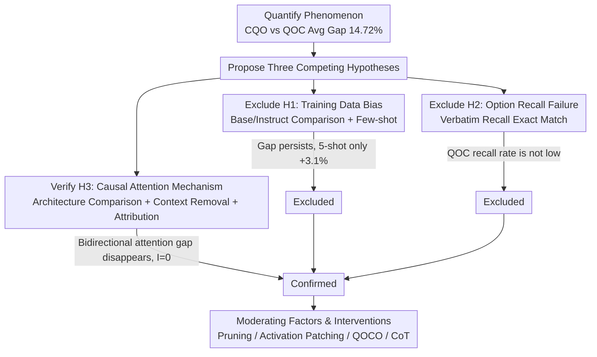

# Lost in the Prompt Order: Revealing the Limitations of Causal Attention in Language Models

**Conference**: ACL 2026 Findings  
**arXiv**: [2601.14152](https://arxiv.org/abs/2601.14152)  
**Code**: None  
**Area**: NLP Understanding / Prompt Sensitivity  
**Keywords**: causal attention, prompt order sensitivity, multiple-choice QA, information bottleneck, mechanistic explanation

## TL;DR

This paper investigates the sensitivity of Large Language Models (LLMs) to the order of prompt components in multiple-choice questions (MCQA). Through systematic experiments, it excludes training bias and memory decay hypotheses, revealing that the causal attention mask is the fundamental mechanism leading to significant performance degradation in the QOC (Question-Options-Context) order.

## Background & Motivation

**Background**: The sensitivity of LLMs to prompt structure has been widely reported—whether it is the order of examples in in-context learning or the arrangement of options in multiple-choice questions, both can cause significant fluctuations in model performance. However, current research mostly remains at the level of phenomenological description; we know "what" affects model performance but are unclear about "why."

**Limitations of Prior Work**: In MCQA tasks, a typical prompt consists of three parts: a context passage (C), a question (Q), and options (O). Intuitively, rearranging these components should not affect performance since the semantic content remains identical. However, experiments show that placing the context before the question and options (CQO) consistently outperforms the reverse arrangement (QOC), with an average gap of over 14 percentage points across 21 decoder-only models and 4 datasets.

**Key Challenge**: Different prompt arrangements of semantic equivalence produce massive performance differences, posing a serious challenge to the reliability of LLMs. While previous works such as lu2022fantastically and pezeshkpour2024 have reported similar phenomena, none have delved into the architectural level to find the root cause.

**Goal**: To propose three competing hypotheses and verify or exclude them through carefully designed controlled experiments, ultimately identifying the core mechanism leading to prompt order sensitivity and designing targeted interventions to validate the conclusions.

**Key Insight**: Start from the architectural level by comparing behavioral differences among decoder-only, encoder-only, and encoder-decoder architectures to locate the source of the problem.

## Method

### Overall Architecture

Ours aims to answer "why" rather than "what"—why CQO consistently outperforms QOC when they are semantically equivalent. The research paradigm is "Hypothesis Formulation → Controlled Experiment Design → Verification/Exclusion." First, the gap is quantified as exceeding 14.72% on average. Then, three competing hypotheses—training bias, option recall failure, and causal attention—are proposed. The first two are systematically eliminated via controlled experiments, and the third is confirmed through mechanistic analysis and targeted interventions.

### Key Designs

**1. Exclude H1—Training Data Bias: CQO advantage is not about "frequency"**

The first intuitive explanation is that CQO is more common in training data. If true, instruct models (exposed to more CQO-style data) should show larger gaps than base models, and few-shot examples of QOC should close the gap. By comparing 9 matched base/instruct model pairs, the gap $\Delta = \text{Acc}_{\text{CQO}} - \text{Acc}_{\text{QOC}}$ remained similar, and 5-shot only improved QOC by 3.1%, failing to bridge the gap—proving training distribution is not the primary cause.

**2. Exclude H2—Option Recall Failure: QOC is not "forgetting options"**

The second explanation is that the long context in QOC "squeezes out" the options (similar to lost-in-the-middle). If true, the recall rate for options in QOC should be lower. After the prompt, models were asked to recall options verbatim; the recall accuracy for QOC was found to be comparable to or even higher than CQO—indicating the problem lies in reasoning, not memory.

**3. Verify H3—Causal Attention Mechanism: Options are encoded as "context-blind" representations**

The true root cause is the causal attention mask: in QOC, option tokens precede the context, meaning they cannot attend to the context during encoding. Three sub-experiments confirmed this: (a) Architecture comparison—decoder-only (causal) had a 14.72% gap, encoder-decoder (bidirectional encoder) 2.30%, and encoder-only (bidirectional) 0.02%; (b) Context removal—QOC performance nearly equaled QO (context deleted), showing the context is "invisible" to option encoding; (c) Attribution—Context attribution was 0.797 in CQO vs 0.335 in QOC. Information-theoretically, the mutual information $I(h_O^{\text{QOC}}; C \mid Q, O)$ is structurally zero: although the final answer token sees both, the option representations are already "context-blind."

**4. Moderating Factors & Interventions: Scaling and fixing the gap via mechanism**

The mechanism predicts two factors: longer context increases the gap (RACE-H ~305 tokens, gap 20.8%), and earlier correct answers increase the gap (Option A gap 22.4%, Option D 9.9%). Four interventions were designed: **Attention Pruning** (masking context for options in CQO) dropped accuracy from 69.26% to 42.46%; **Activation Patching** (replacing QOC option states with CQO ones $h_{\text{opt}}^{\text{QOC}} \leftarrow h_{\text{opt}}^{\text{CQO}}$) raised QOC by 6.0 points; **Option Repeat (QOCO)** (pasting options after context) raised QOC by 8.2 points; **CoT** reduced the gap from 14.72 to 7.47.

## Key Experimental Results

### Main Results

| Method | LogiQA | SciQ | RACE-M | RACE-H | Average |
|------|--------|------|--------|--------|------|
| CQO | 39.08 | 94.16 | 74.32 | 69.48 | 69.26 |
| QOC | 32.94 | 86.89 | 49.57 | 48.76 | 54.54 |
| Gap Δ | 6.14 | 7.27 | 24.75 | 20.72 | 14.72 |

| Architecture Type | Representative Models | Average Gap Δ |
|----------|----------|-----------|
| Decoder-only | LLaMA/Qwen/Gemma | 14.72% |
| Encoder-decoder | Flan-T5 | 2.30% |
| Encoder-only | BERT/RoBERTa/ALBERT | 0.02% |

### Ablation Study

| Intervention | Goal | Effect |
|----------|------|------|
| Attention Pruning (CQO) | Lower CQO | -26.8% |
| Activation Patching (QOC) | Raise QOC | +6.0% |
| Option Repeat (QOCO) | Raise QOC | +8.2% |
| CoT Prompting | Shrink Gap | Gap 14.72→7.47 |

### Key Findings

- The causal attention mask is the fundamental mechanism for prompt order sensitivity, not training bias or memory decay.
- In QOC, the hidden states of option tokens have zero structural mutual information with the context: $I(h_O^{\text{QOC}}; C \mid Q, O) = 0$.
- Although the final answer token can access both, the option representations are already "context-blind," a bottleneck single-step decoding cannot overcome.
- Long context and early correct answer positions amplify the negative impact of causal masking.

## Highlights & Insights

- **Mechanistic over Descriptive**: Unlike prior work just reporting the phenomenon, Ours provides a clear causal mechanism and validates it through architectural comparisons and interventions.
- **Single-step Bottleneck Theory**: Proposes an elegant explanation—even if the final token sees everything, the options are already encoded as context-independent representations.
- **Practical Value**: Option Repeat (QOCO) and CoT serve as simple prompt engineering strategies to alleviate the issue without model modification.
- **Information-Theoretic Formalization**: Provides rigorous derivation in the appendix showing structural zero mutual information in QOC.

## Limitations & Future Work

- Theoretical analysis is basic, establishing structural independence without quantifying the exact magnitude of information loss.
- Ours is a diagnostic study providing inference-time mitigations but does not explore training-time fundamental fixes.
- Experiments are limited to 0.5B-9B models; performance on larger models remains to be verified.
- CoT reduces but does not eliminate the gap (remaining 7.47%), showing limits of inference-time fixes.

## Related Work & Insights

- **vs Lost-in-the-Middle**: While both involve context utilization, recall experiments prove QOC's issue is structural attention blockage, not "forgetting."
- **vs Option Order Sensitivity**: Prior work focused on the arrangement of options; Ours focuses on macro-component arrangement, finding a much larger gap.
- **vs Bidirectional Models**: The discovery that encoder-only models have near-zero gap provides insights for architecture design (e.g., introducing partial bidirectionality during pre-training).

## Rating

- Novelty: ⭐⭐⭐⭐ First to systematically explain prompt order sensitivity from an architectural level.
- Experimental Thoroughness: ⭐⭐⭐⭐⭐ Extremely thorough across 21 models, 4 datasets, and multiple interventions.
- Writing Quality: ⭐⭐⭐⭐⭐ Logical progression from hypothesis to validation.
- Value: ⭐⭐⭐⭐ High practical guidance for prompt engineering and model reliability.

<!-- RELATED:START -->

## Related Papers

- [\[ACL 2026\] The Imperfective Paradox in Large Language Models](the_imperfective_paradox_in_large_language_models.md)
- [\[ACL 2026\] AdapTime: Enabling Adaptive Temporal Reasoning in Large Language Models](adaptime_enabling_adaptive_temporal_reasoning_in_large_language_models.md)
- [\[ACL 2026\] Revealing Temporal Framing in News Text](uncovering_temporal_framing_in_the_news.md)
- [\[ACL 2026\] Table Question Answering in the Era of Large Language Models: A Comprehensive Survey](table_question_answering_in_the_era_of_large_language_models_a_comprehensive_sur.md)
- [\[NeurIPS 2025\] Generalization Error Analysis for Selective State-Space Models Through the Lens of Attention](../../NeurIPS2025/nlp_understanding/generalization_error_analysis_for_selective_state-space_models_through_the_lens_.md)

<!-- RELATED:END -->
