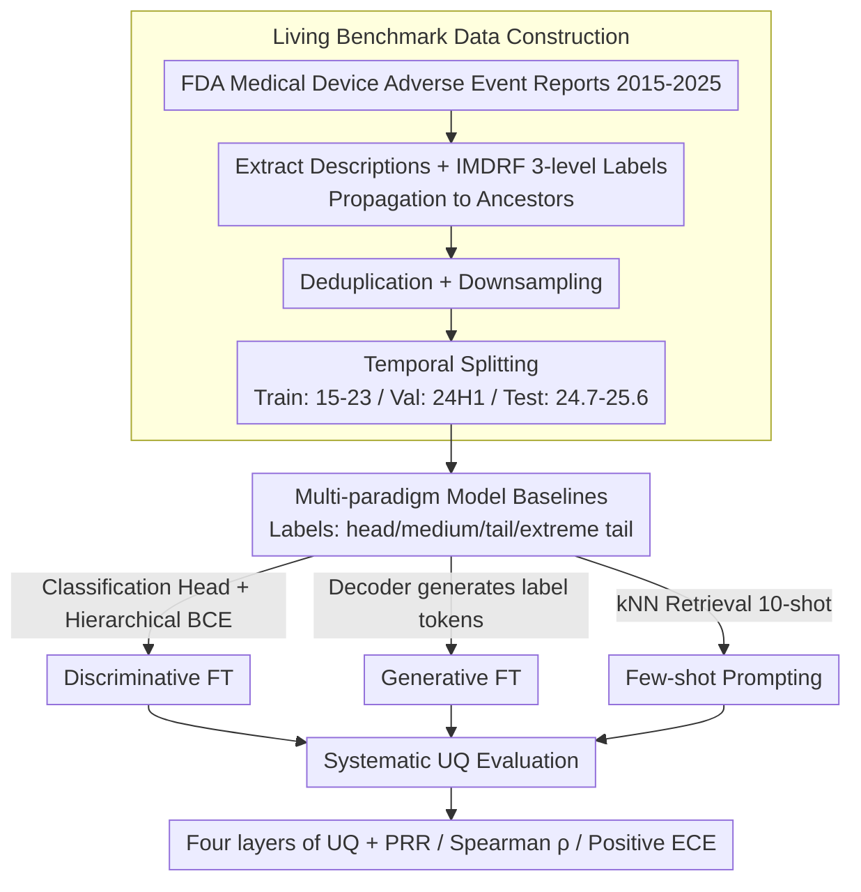

# MADE: A Living Benchmark for Multi-Label Text Classification with Uncertainty Quantification

**Conference**: ACL 2026  
**arXiv**: [2604.15203](https://arxiv.org/abs/2604.15203)  
**Code**: [https://hhi.fraunhofer.de/aml-demonstrator/made-benchmark](https://hhi.fraunhofer.de/aml-demonstrator/made-benchmark)  
**Area**: LLM Evaluation  
**Keywords**: Multi-label classification, Uncertainty quantification, Medical devices, Living benchmark, Long-tail distribution

## TL;DR

This paper proposes MADE—a "living" multi-label text classification benchmark based on FDA medical device adverse event reports, containing 1,154 hierarchical labels and strict temporal splitting. It systematically evaluates the predictive performance and uncertainty quantification (UQ) capabilities of 20+ encoder/decoder models under discriminative fine-tuning, generative fine-tuning, and few-shot prompting, revealing a critical trade-off: small discriminatively fine-tuned decoders are optimal for head-to-tail accuracy, generative fine-tuning provides the most reliable UQ, while large reasoning models improve rare labels but show unexpectedly weak UQ.

## Background & Motivation

**Background**: Multi-label text classification (MLTC) is a core task in healthcare (patient triaging, clinical coding, event reporting, etc.), requiring the selection of multiple labels from a large set. Existing benchmarks (e.g., MIMIC-III, EUR-LEX) are saturating and risk contamination by LLM pre-training data.

**Limitations of Prior Work**: (1) Existing MLTC benchmarks are static, leading to inflated zero-/few-shot performance due to data contamination; (2) Real-world MLTC data exhibits severe intra-/inter-class imbalance (a few common classes dominate, while safety-critical classes reside in the long tail); (3) In high-risk domains like medicine, models require not only strong prediction but also reliable uncertainty quantification (UQ) to support human oversight, yet UQ research in MLTC is nearly non-existent.

**Key Challenge**: Practitioners face unanswered questions—which model architecture (encoder vs. decoder) should be chosen? Which learning paradigm (fine-tuning vs. in-context learning) best balances frequent and rare classes? How reliable are the predictions? There is a lack of a unified, uncontaminated benchmark to systematically answer these questions.

**Goal**: (1) Create a continuously updated, contamination-free MLTC benchmark; (2) Establish comprehensive baselines covering 20+ models; (3) Systematically evaluate various UQ methods in the context of MLTC.

**Key Insight**: Utilize medical device adverse event reports periodically released by the FDA as a continuously updated data source, ensuring test data does not leak into future model pre-training through strict temporal splitting.

**Core Idea**: Build a "living" benchmark—as the FDA continues to release new reports, future models can always be evaluated without contamination on data generated after their training.

## Method

### Overall Architecture

The MADE benchmark consists of three components: (1) Data Pipeline—extracting event descriptions and IMDRF hierarchical labels from FDA reports, generating train/val/test sets via deduplication, downsampling, and temporal splitting; (2) Model Baselines—covering discriminative fine-tuning (encoder/decoder + classification head), generative fine-tuning (decoder generating label tokens), and few-shot prompting (instruction/thinking models); (3) UQ Evaluation—comparing information-level (entropy, perplexity), consistency-level (graph Laplacian eigenvalues), combined, and self-reported uncertainty methods.

### Key Designs

**1. Living Benchmark Data Construction: Plugging Contamination Holes with Government Data Streams**

The fatal flaw of static benchmarks is that test sets eventually enter the pre-training data of future models, inflating zero-/few-shot scores. MADE addresses this by using FDA medical device adverse event reports released quarterly. Descriptions and labels are extracted from 2015-2025; product and patient problem labels are mapped to IMDRF 3-level hierarchical codes and propagated upward. Crucially, **temporal splitting** is applied: train (2015-2023, 298,825 samples), val (2024 H1, 71,271 samples), and test (2024.7-2025.6, 118,177 samples). This ensures test data is generated after model training cut-offs. The final set includes 1,154 labels with an average of 8.79 labels per sample and a heavy long tail.

**2. Multi-paradigm Model Baselines: Head-to-Head Comparison of Three Paradigms**

To provide actionable insights for practitioners, MADE evaluates 20+ models across three lines: (a) Discriminative Fine-tuning—adding classification heads to Llama 3.2 (1B/3B), 3.1 (8B), and Ettin (150M/400M/1B) using hierarchical BCE loss; (b) Generative Fine-tuning—decoders generating label tokens directly, comparing full-parameter vs. LoRA; (c) Few-shot Prompting—10-shot kNN-retrieved prompting for 10+ models including Llama, DeepSeek-R1, Qwen3, and GPT-4.1/5. Labels are categorized by frequency into head (>1%), medium (0.1-1%), tail (0.01-0.1%), and extreme tail (<0.01%).

**3. Systematic UQ Evaluation: Quantifiable Metrics for Uncertainty**

In high-risk medical scenarios, models must route uncertain samples for human review. MADE applies per-label entropy for discriminative models. For generative models, four layers are evaluated: Information-level $U_{\text{info}}$ (entropy, improbability, avg-log-prob, perplexity), Consistency-level $U_{\text{cons}}$ (sum of graph Laplacian eigenvalues from multiple sampled outputs), Combined $U_{\text{combined}} = U_{\text{info}} \times U_{\text{cons}}$, and Self-reported $U_{\text{self}}$ (direct confidence prompting). UQ quality is measured by PRR (Prediction Rejection Rate), Spearman $\rho$ (correlation between uncertainty and error), and Positive ECE$_+$ (expected calibration error for positive predictions).

### Loss & Training

Discriminative fine-tuning uses hierarchical binary cross-entropy loss, summing BCE components calculated at each hierarchy level. The AdamW optimizer is used with a cosine learning rate scheduler, batch size 512, for 20 epochs. Classification thresholds are selected per label on the validation set to maximize F1. Generative fine-tuning uses standard autoregressive language modeling loss for 4 epochs, supporting both full-parameter and LoRA.

## Key Experimental Results

### Main Results

**Predictive Performance and UQ Quality Across Paradigms (Truncated Test Set n=10,288)**

| Paradigm/Model | Macro F1 | Head F1 | Tail F1 | ET F1 | PRR↑ | ρ↓ |
|-----------|---------|---------|---------|-------|------|-----|
| Disc. Llama-3.1-8B | **0.54** | **0.74** | **0.53** | 0.12 | 0.47 | -0.40 |
| Gen. Llama-3.1-70B | 0.53 | 0.73 | 0.51 | 0.16 | 0.55 | -0.27 |
| Gen. Llama-3.2-3B | 0.48 | 0.67 | 0.46 | 0.12 | **0.60** | **-0.46** |
| Prompt Qwen3-235B-Think | 0.49 | 0.62 | 0.48 | 0.33 | 0.34 | -0.09 |
| Prompt GPT-5 | 0.54 | 0.68 | 0.53 | **0.34** | N/A | N/A |
| Prompt DeepSeek-R1 | 0.48 | 0.62 | 0.47 | 0.30 | 0.24 | -0.09 |

### Ablation Study

**Comparison of UQ Methods (Generative FT vs. Prompting)**

| UQ Metric | Generative FT PRR | Instruct PRR | Thinking PRR |
|---------|-------------|-------------|-------------|
| Avg. Log-Prob | 0.54±0.05 | 0.37±0.25 | 0.18±0.12 |
| Entropy | **0.58±0.03** | **0.45±0.15** | 0.19±0.12 |
| Improbability | 0.54±0.05 | 0.43±0.15 | 0.17±0.12 |
| Perplexity | 0.54±0.06 | 0.37±0.25 | 0.18±0.11 |

### Key Findings

- Discriminative fine-tuning consistently outperforms generative fine-tuning of equivalent size in head-tail accuracy (Wilcoxon test $p \leq 0.05$), achieving optimal comprehensive F1 with only 8B parameters.
- Generative fine-tuning performs best in UQ—Llama-3.2-3B (Gen.) obtains the best PRR (0.60) and Spearman $\rho$ (-0.46).
- Reasoning models (GPT-5, Qwen3-235B-Think) excel in extreme tail classes (F1=0.34) but show unexpectedly weak UQ (PRR only 0.21±0.10), and consistently lag behind the best fine-tuned models in head classes.
- Self-reported confidence is not a reliable proxy for uncertainty, showing low correlation with actual error rates.
- Entropy is the optimal choice for $U_{\text{info}}$ in both generative fine-tuning and instruction-following models.

## Highlights & Insights

- The "living benchmark" concept effectively solves the fundamental problem of benchmark contamination in the LLM era by utilizing government data streams for evergreen test sets.
- It reveals a counter-intuitive trade-off between predictive performance and UQ quality—reasoning models perform excellently on rare classes but have the worst UQ, implying their "high performance" may be untrustworthy in high-risk scenarios.
- It demonstrates that discriminative fine-tuning with only 8B parameters can match or exceed the overall performance of GPT-5, providing a highly cost-effective solution for practitioners.

## Limitations & Future Work

- FDA labeling consistency has not been formally verified via inter-annotator agreement studies; labels may contain noise.
- Self-reported UQ only tested simple prompting strategies; more refined calibration prompts might improve results.
- The test set was limited to 10,288 samples to control inference costs, resulting in limited statistical power for evaluating extreme tail labels.
- Potential gains from multi-modal inputs (e.g., device images) were not evaluated.

## Related Work & Insights

- **vs. MIMIC-III ICD Coding**: MIMIC is the gold standard for ICD coding of clinical notes but has been used for over a decade, posing a severe contamination risk; MADE avoids this through temporal splitting.
- **vs. EUR-LEX**: EUR-LEX targets legal document MLTC with a smaller label space and different domain; MADE's 1,154 labels and 3-level hierarchy present higher complexity.
- **vs. Ettin (Weller et al. 2025)**: Ettin provides matched encoder-decoder model comparisons but lacks MLTC evaluation; this work fills that gap.

## Rating

- Novelty: ⭐⭐⭐⭐ The "living benchmark" concept is novel and practical; systematic UQ evaluation in MLTC fills a critical void.
- Experimental Thoroughness: ⭐⭐⭐⭐⭐ Comprehensive comparison across 20+ models, 4 paradigms, and various UQ methods with rigorous statistical testing.
- Writing Quality: ⭐⭐⭐⭐ Clear structure and definitive conclusions, though high density occasionally requires appendix reference.
- Value: ⭐⭐⭐⭐⭐ Provides a practical guide for model selection and UQ methods in high-risk MLTC applications.

<!-- RELATED:START -->

## Related Papers

- [\[ACL 2026\] LLM-Guided Semantic Bootstrapping for Interpretable Text Classification with Tsetlin Machines](llm-guided_semantic_bootstrapping_for_interpretable_text_classification_with_tse.md)
- [\[ACL 2026\] MTSQL-R1: Towards Long-Horizon Multi-Turn Text-to-SQL via Agentic Training](mtsql-r1_towards_long-horizon_multi-turn_text-to-sql_via_agentic_training.md)
- [\[ACL 2026\] MSMO-ABSA: Multi-Scale and Multi-Objective Optimization for Cross-Lingual Aspect-Based Sentiment Analysis](msmo-absa_multi-scale_and_multi-objective_optimization_for_cross-lingual_aspect-.md)
- [\[ACL 2026\] Reasoning-Based Refinement of Unsupervised Text Clusters with LLMs](reasoning-based_refinement_of_unsupervised_text_clusters_with_llms.md)
- [\[ACL 2026\] HCRE: LLM-based Hierarchical Classification for Cross-Document Relation Extraction](hcre_llm-based_hierarchical_classification_for_cross-document_relation_extractio.md)

<!-- RELATED:END -->
