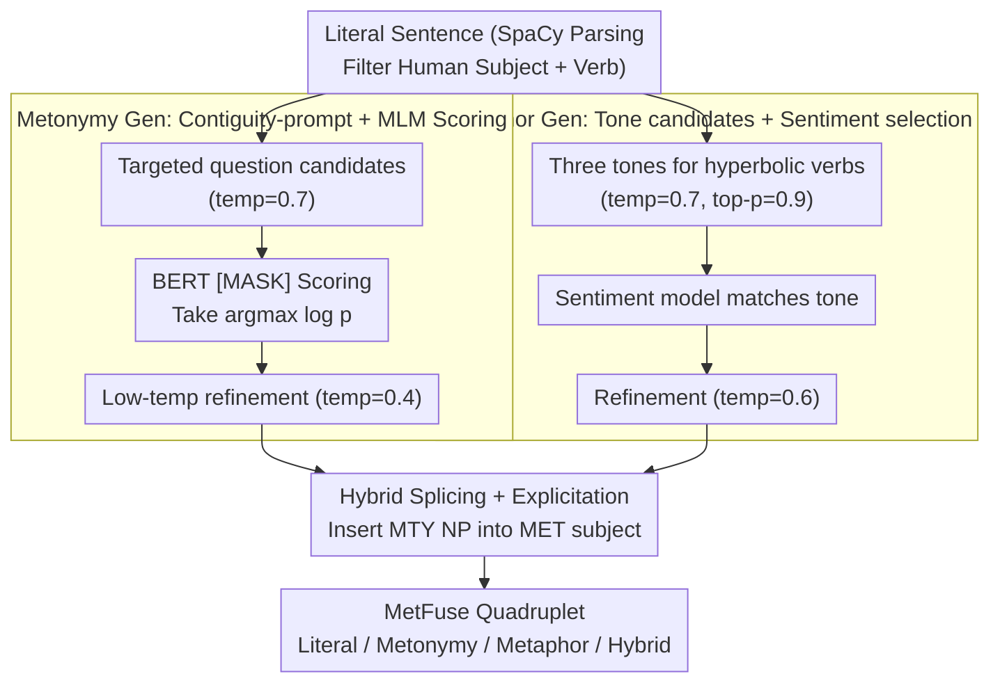

# MetFuse: Figurative Fusion between Metonymy and Metaphor

**Conference**: ACL 2026  
**arXiv**: [2604.12919](https://arxiv.org/abs/2604.12919)  
**Code**: https://github.com/cincynlp/MetFuse (Available)  
**Area**: Linguistics / Figurative Language / Dataset Construction  
**Keywords**: Metonymy, Metaphor, figurative fusion, data augmentation, LLM generation

## TL;DR
The authors propose a three-stage pipeline (candidate generation → MLM scoring/selection → LLM refinement) to rewrite literal sentences into three figurative variants: metonymic, metaphoric, and hybrid. They construct the first MetFuse dataset (1,000 quadruplets, 4,000 sentences) and empirically discover that "the presence of metaphorical verbs makes metonymic nouns in the same sentence more explicit," yielding consistent improvements when used for data augmentation across 8 metonymy/metaphor classification benchmarks.

## Background & Motivation

**Background**: Metonymy (intra-domain substitution, e.g., "stadium" referring to "fans") and metaphor (cross-domain mapping, e.g., "fans erupted") are the two pillars of figurative language. However, the NLP community has long treated them as independent tasks: metonymy has datasets like ConMeC / RelocaR / WiMCor, while metaphor has VUA / FLUTE / MOH-X, with almost no research addressing them together.

**Limitations of Prior Work**: (i) Data scarcity—Theoretical linguistics (Goossens 1990 metaphtonymy; Barcelona 2003) has long noted their co-occurrence, but no meaning-aligned datasets exist to support computational research; (ii) Generation difficulties—Directly prompting LLMs to "turn this sentence into metonymy" achieves only a 38.8% success rate because metonymy must adhere to intra-domain constraints, which naive prompts fail to control; (iii) Lack of interaction analysis—No systematic quantification of how the recognizability of metonymy and metaphor changes when they co-occur.

**Key Challenge**: Metonymy is strictly constrained by contiguity relations (part-whole, container-content, etc.), resulting in a small candidate space; metaphor enjoys the freedom of cross-domain mapping, resulting in a large candidate space. This asymmetry makes "generating both within a unified framework" highly difficult.

**Goal**: (a) Given a literal sentence, controllably generate a set of semantically aligned metonymy / metaphor / hybrid variants; (b) construct the MetFuse dataset using this framework; (c) empirically answer whether metonymy in hybrid sentences is more easily identified than in metonymy-only sentences.

**Key Insight**: The authors leverage two asymmetries—firstly, in the generation phase, they use "narrow candidates + MLM scoring" to constrain metonymy, while using "flexible tone + sentiment selection" to release metaphoric potential; secondly, in the analysis phase, they hypothesize that the strong selectional preference of metaphorical verbs "forces" readers to interpret metonymic nouns as animate agents, thereby making the metonymy more explicit.

**Core Idea**: Generate figurative variants using a three-stage pipeline ("LLM candidates + MLM/sentiment scoring + controlled LLM refinement"), and verify the hypothesis that "metaphor strengthens metonymy" through hybrid data augmentation, embedding similarity, and LLM zero-shot experiments.

## Method

### Overall Architecture
The pipeline focuses on the "subject noun + predicate verb" pair in SVO structures. It first uses SpaCy dependency parsing to filter literal sentences from Wikipedia where the subject is a human entity. Then, it runs two parallel pipelines for **metonymy generation** and **metaphor generation**, finally assembling hybrid sentences by "inserting the refined metonymic noun phrase into the refined metaphoric sentence." Both generation pipelines follow an "i) LLM candidates → ii) External scorer selection → iii) Controlled LLM refinement" structure, though the scorers (MLM probability vs. sentiment) and temperature strategies differ significantly; hybrids are a third variant created via direct splicing rather than independent generation.

### Key Designs

**1. Metonymy Gen: Contiguity-prompt candidates with MLM scoring**

Direct prompting fails (38.8% success) because LLMs often ignore contiguity constraints. The authors decompose this into "asking the right question + probability scoring": first, targeted questions ask for the target noun's location / occupants / salient parts (e.g., "Where does a judge work?") to get candidates $c$ (temp=0.7); then, the original noun is replaced with `[MASK]` and fed to BERT to calculate $\log p(c \mid \text{context})$. The candidate with the highest probability is selected: $c^* = \arg\max_c \log p_{\text{BERT}}(c)$. This translates "intra-domain constraints" into token-level probability scoring—out-of-domain candidates are automatically eliminated (e.g., replacing "judge" with "briefcase" yields $\log p=-12.28$ and is rejected). Finally, a low temperature (0.4) is used for refinement to prevent the LLM from accidentally removing the metonymic substitution.

**2. Metaphor Gen: Tone-conditioned candidates with sentiment selection**

Metaphor enjoys cross-domain freedom, but total freedom can cause "tone clashes"—e.g., an ecstatic verb appearing in a sad sentence. The authors apply a soft "tone consistency" boundary: the LLM generates hyperbolic verb candidates under positive / negative / neutral tones (temp=0.7, top-p=0.9). A TweetNLP sentiment model then labels the original sentence, and only tone-matched candidates are kept for final refinement (temp=0.6). This preserves cross-domain flexibility while maintaining semantic and emotional alignment.

**3. Hybrid Splicing and the "Metaphor strengthens Metonymy" Hypothesis**

Since metonymy generation rarely alters syntax (only substituting nouns), the refined metonymic noun phrase can be directly inserted into the subject position of the refined metaphoric sentence. This zero-cost construction exploits the natural complementarity of "metonymy changes nouns, metaphor changes predicates." To support their core claim, the authors provide three pieces of evidence: (i) In zero-shot metonymy resolution across 4 LLMs, hybrids outperform metonymy-only variants by 1.4–4.3 F1 points; (ii) Using BERT contextual embeddings, $\text{sim}(N_{\text{lit}}, N_{\text{hyb}}) > \text{sim}(N_{\text{lit}}, N_{\text{mty}})$, indicating that noun embeddings in hybrids are closer to literal usage (i.e., more "explicit"); (iii) Augmenting BERT with the hybrid subset consistently outperforms metonymy-only augmentation across 4 metonymy benchmarks. The cognitive linguistic explanation is that metaphorical verbs (e.g., "butchered") carry strong animate-agent selectional preferences that "force" readers to interpret inanimate metonymic nouns (e.g., "newsroom") as animate agents, serving as a forcing device to disambiguate the metonymy.

### Loss & Training
The paper focuses on prompting workflows rather than model training. For downstream evaluations, BERT-base is fine-tuned for 3 epochs (lr=1e-5, batch=8). MetFuse augmentation size is fixed at 50% of the original training set. LLM evaluations are entirely zero-shot, including GPT-OSS-20B / Qwen3-30B / Llama-3.1-70B / Gemini-2.5-Flash.

## Key Experimental Results

### Main Results
Human evaluation (250 samples) shows that the proposed framework significantly outperforms general prompting baselines:

| Variant Type | General prompt | Ours | Gain |
|--------------|----------------|------|------|
| Metonymy     | 38.8%          | 75.2%| +36.4 pp |
| Metaphor     | 70.8%          | 84.0%| +13.2 pp |
| Hybrid       | 49.2%          | 74.0%| +24.8 pp |

Downstream metonymy classification (70/30 split, BERT fine-tuned) with MetFuse augmentation:

| Dataset   | Baseline (Train) | +MetFuse Metonymy | +MetFuse Hybrid |
|-----------|------------------|-------------------|------------------|
| ConMeC    | 75.49            | 76.71 (+1.22)     | **79.33 (+3.84)** |
| Pedinotti | 68.42            | 66.92 (-1.50)     | **70.44 (+2.02)** |
| RelocaR   | 67.33            | 69.99 (+2.66)     | **70.67 (+3.34)** |
| WiMCor    | 81.67            | 82.33 (+0.66)     | **82.67 (+1.00)** |

→ Hybrid augmentation consistently outperforms metonymy-only augmentation, suggesting "metaphoric co-occurrence" provides a stronger training signal.

### Ablation Study
LLM zero-shot metonymy resolution (Hybrid vs. Metonymy-only positive sentences):

| Model          | Metonymy-only F1 | Hybrid F1 | Gain |
|----------------|------------------|-----------|------|
| GPT-OSS-20B    | 67.3             | 71.6      | +4.3 |
| Qwen3-30B      | 85.4             | 87.3      | +1.9 |
| Llama-3.1-70B  | 90.4             | 91.3      | +0.9 |
| Gemini-2.5     | 93.9             | 94.7      | +0.8 |

BERT embedding similarity confirms $\text{sim}(N_{\text{lit}}, N_{\text{hyb}}) > \text{sim}(N_{\text{lit}}, N_{\text{mty}})$ across 4 models (diff 0.20–1.86 pp), aligning with human metonymicity scores (Hybrid 3.65 vs. Metonymy 3.47 on a 5-point scale).

### Key Findings
- **Asymmetry Effect**: The Metaphor → Metonymy direction is robust (consistent across 4 datasets, 4 LLMs, and human evaluation). However, the Metonymy → Metaphor direction is unstable (Hybrid augmentation only outperformed pure Metaphor augmentation in VUA Verb / MOH-X).
- **Interpretability**: Surprisal scores show that hybrid noun surprisal ($12.81 \approx$ metonymy $12.79$) and hybrid verb surprisal ($12.66 \approx$ metaphor $11.38$) prove that hybrids maintain figurative intensity in both dimensions.
- **Robustness to LLMs**: Using different LLMs (Llama-3.1-8B to GPT-5) within the framework yields a stable metonymy success rate (72-75%), indicating that structural constraints (MLM scoring) are the primary factor, not the LLM's capacity.

## Highlights & Insights
- **MLM as a "Domain Gate"**: Translating "intra-domain constraints" into BERT token-level log-likelihood is a clever, training-free way to implement a domain classifier.
- **Forcing-device Explanation**: Linking empirical observations to selectional preference creates a solid theoretical loop back to Lakoff–Johnson theory.
- **Zero-cost Hybrid Splicing**: This avoids complex independent generation and alignment by exploiting the syntactic complementarity of the two figurative types.
- **Clean Experimental Design**: Fixed augmentation ratios and consistent hyperparameters across 8 benchmarks make the "Hybrid > Metonymy-only" conclusion highly credible.

## Limitations & Future Work
- The study only covers location-for-people / institution-for-people subject metonymy; object metonymy and other relations are excluded. The 74% success rate also implies 26% of generation remains flawed.
- The lack of consistent results in the "Metonymy → Metaphor" direction is not fully explained, noted only as "deep semantic complexities" in the appendix.
- No explicit domain mapping labels are provided, preventing fine-grained research on which domain pairs trigger figurative fusion. Future work should include conceptual ontologies and non-English extensions.

## Related Work & Insights
- **vs. PRINCIPLES / MERMAID**: While prior work used symbolic or discriminative decoding for metaphoricity, this work applies "constrained + free" logic to both metonymy and metaphor.
- **vs. ChainNet (Maudslay et al. 2024)**: Whereas ChainNet maps figurative relations in WordNet, this work provides a sentence-level quadruplet dataset.
- **vs. ConMeC (Ghosh & Jiang 2025)**: From the same authors, this paper upgrades from a simple common-noun classification benchmark to a complete "generation + analysis + augmentation" ecosystem.

## Rating
- Novelty: ⭐⭐⭐⭐ First joint metonymy + metaphor dataset and empirical validation of the forcing-device hypothesis.
- Experimental Thoroughness: ⭐⭐⭐⭐⭐ 8 downstream benchmarks, 4 LLM zero-shot tests, 5 LLM framework trials, and multi-angle validation (surprisal/embeddings).
- Writing Quality: ⭐⭐⭐⭐⭐ Excellent loop between experimental phenomena and cognitive theory.
- Value: ⭐⭐⭐⭐ New infrastructure for figurative language NLP; however, the focus on location metonymy limits immediate generalizability.

<!-- RELATED:START -->

## Related Papers

- [\[ACL 2026\] Exploring Concreteness Through a Figurative Lens](exploring_concreteness_through_a_figurative_lens.md)
- [\[ICCV 2025\] Balancing Task-Invariant Interaction and Task-Specific Adaptation for Unified Image Fusion](../../ICCV2025/nlp_understanding/balancing_task-invariant_interaction_and_task-specific_adaptation_for_unified_im.md)
- [\[ACL 2026\] Beyond Chunking: Discourse-Aware Hierarchical Retrieval for Long Document Question Answering](beyond_chunking_discourse-aware_hierarchical_retrieval_for_long_document_questio.md)
- [\[ACL 2026\] LexRel: Benchmarking Legal Relation Extraction for Chinese Civil Cases](lexrel_benchmarking_legal_relation_extraction_for_chinese_civil_cases.md)
- [\[ACL 2026\] Knowledge-driven Augmentation and Retrieval for Integrative Temporal Adaptation](knowledge-driven_augmentation_and_retrieval_for_integrative_temporal_adaptation.md)

<!-- RELATED:END -->
