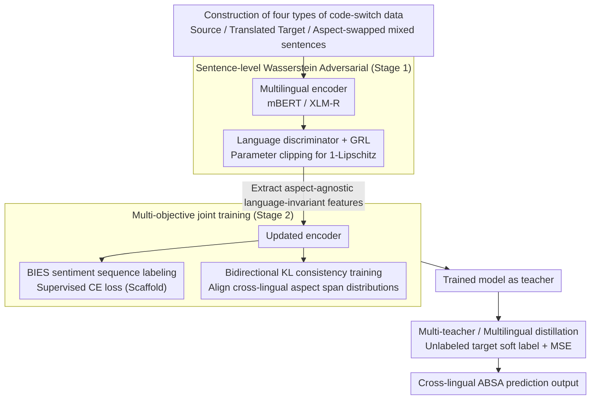

# MSMO-ABSA: Multi-Scale and Multi-Objective Optimization for Cross-Lingual Aspect-Based Sentiment Analysis

**Conference**: ACL 2026  
**arXiv**: [2502.13718](https://arxiv.org/abs/2502.13718)  
**Code**: https://github.com/swaggy66/MSMO  
**Area**: Multilingual / Cross-lingual ABSA / Sentiment Analysis  
**Keywords**: Cross-lingual ABSA, adversarial training, consistency training, code-switch, multi-objective optimization

## TL;DR
The MSMO framework is proposed for cross-lingual aspect-based sentiment analysis. It utilizes sentence-level Wasserstein adversarial training with code-switched data for language discriminator alignment and aspect-level bidirectional KL consistency training to align prediction distributions of aspects with the same sentiment. Complemented by multi-teacher knowledge distillation, it achieves new SOTA results across four target languages in SemEval-2016 using mBERT/XLM-R, significantly outperforming LLM solutions such as GPT-4o and Qwen2.5-7B-LoRA.

## Background & Motivation

**Background**: ABSA (joint task of aspect extraction and sentiment classification) is mature in English, but the coexistence of multiple languages in real-world social scenarios makes cross-lingual ABSA (XABSA) urgent. Since low-resource languages lack manual annotations, major technical routes include: (1) translation-based (e.g., BILINGUAL-TA); (2) code-switch (e.g., ACS which replaces aspect terms with target language terms); (3) contrastive learning (CL-XABSA).

**Limitations of Prior Work**: (1) Alignment in existing XABSA methods is generally performed only at the sentence or word-embedding level, while the alignment of aspect terms themselves (the core anchors of the task) remains coarse; (2) A single objective (such as pure CE or pure contrastive) can bias the model toward the source language's semantic space, ignoring fine-grained cross-lingual correspondences of aspects; (3) Adversarial training in NLP often employs Domain-Adversarial GRL, which suffers from instability in XABSA and fails to utilize perturbation signals from code-switching.

**Key Challenge**: Sentence-level alignment ensures overall distribution similarity, but the "fine-grained semantics" of the same aspect across different languages and contexts remain drifted. Conversely, aspect-level alignment alone ignores language style differences across entire sentences. Both granularities must be aligned **simultaneously**, yet current XABSA methods typically select only one.

**Goal**: Design a unified framework for "multi-scale (sentence + aspect) $\times$ multi-objective (supervised + consistency)" that allows code-switched data to drive alignment at both granularities and extend it to multilingual settings with knowledge distillation.

**Key Insight**: The authors observe that code-switched data naturally provides perturbation signals at the "aspect-swap within a sentence" level. This allows a language discriminator to learn invariant features by "ignoring aspects to focus on language style" (sentence-level) and a consistency module to learn that "changing the language of an aspect with the same sentiment should result in consistent prediction distributions" (aspect-level). The same data can drive training objectives for both granularities.

**Core Idea**: Use code-switched bilingual data as "perturbation anchors" to simultaneously drive (i) Wasserstein distance adversarial training (forcing the language discriminator to learn aspect-agnostic language features) and (ii) bidirectional KL consistency training (aligning cross-lingual aspect-level prediction distributions). Both are jointly updated through a shared multilingual encoder.

## Method

### Overall Architecture

The core premise of MSMO is that cross-lingual ABSA requires **simultaneous** alignment at the sentence and aspect levels, and code-switched (aspect-swap) data can feed objectives for both granularities. It follows a two-stage sequential training process: Stage 1 employs a multilingual encoder (mBERT/XLM-R) with a language discriminator featuring a gradient reversal layer, using Wasserstein adversarial training to compress sentence representations into language-invariant features. Stage 2 uses the updated encoder for BIES sentiment sequence labeling (CE) while using bidirectional KL to align prediction distributions of "the same aspect in source vs. swapped language." The trained model then serves as a teacher for multi-teacher distillation on unlabeled target language data to further improve performance.

### Key Designs

**1. Code-switch Data Driven Sentence-level Wasserstein Adversarial: Extracting Aspect-Agnostic Language-Invariant Features**

Previous adversarial alignment in XABSA (e.g., ADAN-GRL) relied only on bilingual parallel data and lacked aspect perturbation, while GRL adversarial training is inherently unstable. MSMO constructs four types of data—source $D_S$, translated target $D_T$, and mixed sentences $D_{S_T} / D_{T_S}$ where aspect terms are swapped. The language discriminator $Q$ classifies $D_S \cup D_{S_T}$ as source and $D_T \cup D_{T_S}$ as target. The objective is $J_q = \max_{\theta_q} \mathbb{E}[Q(P(h_i))] - \mathbb{E}[Q(P(h_i'))]$, with parameters of $Q$ clipped to $[-c, c]$ to satisfy the 1-Lipschitz condition (replacing standard GAN with Wasserstein distance to avoid oscillations). Crucially, by mixing $D_{S_T}/D_{T_S}$, the discriminator must learn to identify the language based on sentence style regardless of the aspect's language. Through GRL backpropagation, the encoder is forced to yield truly aspect-agnostic invariant features, grounding the next stage of fine-grained aspect alignment.

**2. Bidirectional KL Consistency Training: Constraining "Same Sentiment Aspects Should Be Consistent" on Span Distributions**

Sentence-level alignment only brings the overall distributions closer, but fine-grained correspondences (e.g., "food and nourriture sharing POS, service and service sharing NEG") remain unstable. Constraints must be applied directly to aspects. The authors take a source sentence $X$, perform a transformation $\phi$ (translation/aspect swap) to get $X'$ and corresponding aspect spans $(s, s')$. Span probability is defined as the product of its constituent token probabilities, and the two distributions are aligned using symmetrized KL:

$$\mathcal{L}_{\text{cons}} = \frac{1}{m} \sum \frac{1}{2}\big[\mathrm{KL}(P(y'|s') \,\|\, P(y|s)) + \mathrm{KL}(P(y|s) \,\|\, P(y'|s'))\big]$$

Calculating KL on spans rather than tokens bypasses alignment issues of tokens within BIES sequences, ensuring the consistency constraint targets the core task unit (the aspect). Bidirectional symmetrization prevents bias in unidirectional KL.

**3. Multi-teacher / Multilingual Knowledge Distillation: Using Unlabeled Target Data as an Amplifier**

Since the MSMO teacher is stronger than CL-XABSA and provides more accurate soft labels, a second layer of distillation is added to exploit unlabeled target language text. Three teachers (trained on different source languages or seeds) predict on unlabeled target text to generate a weighted soft label $p_t = \sum_{k=1}^{3} w_k g_{t_k}$ ($w_k = 1/3$). The student, consisting only of the encoder and sentiment classifier, aligns with these soft labels via $\mathcal{L}_{KD} = \frac{1}{|D_{NL}|} \sum \frac{1}{L} \sum_i \mathrm{MSE}(p_{t_i}, p_{s_i})$. Multi-teacher distillation averages strengths across language pairs and reduces single-teacher overfitting bias; experiments show multi-teacher consistently outperforms single-teacher.

### Loss & Training
- **Stage 1**: $J_q$ (Wasserstein adversarial, $Q$ parameter clipping $[-c, c]$ for 1-Lipschitz); GRL coefficient $\lambda = 1$.
- **Stage 2**: $\mathcal{L}_{\text{total}} = \sum \mathcal{L}_{\text{CE}} + \beta \sum \mathcal{L}_{\text{cons}}$. $\beta$ is grid-searched by target language: mBERT uses $\{4.5, 2.5, 2.5, 3.5\} \times 10^{-4}$ and XLM-R uses $\{2.5, 1.5, 1.5, 3.5\} \times 10^{-3}$ (for FR/ES/NL/RU).
- **Hyperparameters**: mBERT lr=5e-5 / bs=16 / 2000 steps; XLM-R lr=2e-5 / bs=8 / 2500 steps; Stage 1 GPU usage ≈ 27 GB (XLM-R); averaged over 5 random seeds.
- **Distillation Phase**: Student is initialized with training on translated target data, followed by MSE distillation on unlabeled target data.

## Key Experimental Results

### Main Results
SemEval-2016 ABSA, Source = English, Target = FR/ES/NL/RU, Micro-F1 Evaluation:

| Method | FR | ES | NL | RU | Avg (mBERT) | Avg (XLM-R) |
|------|----|----|----|----|-------------|-------------|
| Zero-shot baseline | 45.60 / 56.43 | 57.32 / 67.10 | 42.68 / 59.03 | 36.01 / 56.80 | 45.40 | 59.84 |
| Translation-TA (Li et al. 2021) | 40.76 / 47.00 | 50.74 / 58.10 | 47.13 / 56.19 | 41.67 / 50.34 | 45.08 | 52.91 |
| ACS (Zhang et al. 2021a) | 49.65 / 59.39 | 59.99 / 67.32 | 51.19 / 62.83 | 52.09 / 60.81 | 53.23 | 62.59 |
| CL-XABSA (TL, Lin et al. 2023) | 50.55 / 59.47 | 60.09 / 64.63 | 52.45 / 59.40 | 50.73 / 61.13 | 53.46 | 61.16 |
| Equi-XABSA (Lin et al. 2024) | 50.08 / 60.68 | 63.08 / 69.56 | 51.85 / 61.31 | 52.59 / 62.34 | 54.40 | 63.47 |
| **MSMO (Ours)** | **51.42 / 61.01** | **63.26 / 69.74** | **52.68 / 63.26** | **53.45 / 62.52** | **55.20** | **64.13** |
| ACS-Distill-M | 52.25 / 59.90 | 62.91 / 69.24 | 53.40 / 63.74 | 54.58 / 62.02 | 55.79 | 63.73 |
| CL-XABSA-Distill-M | 52.99 / 62.10 | 63.54 / 69.37 | 53.52 / 64.27 | 53.98 / 62.29 | 56.01 | 64.51 |
| **MSMO-Distill-M (Ours)** | **54.39 / 63.89** | **64.59 / 69.93** | **54.14 / 65.15** | **54.89 / 63.20** | **56.94** | **65.54** |
| Supervised (Oracle) | 61.80 / 67.44 | 67.88 / 71.93 | 56.80 / 64.28 | 58.87 / 64.93 | 61.34 | 67.15 |

**vs LLM zero-shot / LoRA**:

| LLM Config | FR | ES | NL | RU | Avg |
|----------|----|----|----|----|-----|
| GPT-4o (zero-shot) | 48.43 | 49.91 | 49.94 | 45.15 | 48.36 |
| Qwen2.5-7B + LoRA | 63.01 | 68.95 | 60.84 | 53.50 | 61.58 |
| **MTL-MSMO-Distill (XLM-R, Ours)** | **63.23** | **70.95** | **66.24** | **64.36** | **66.20** |

### Ablation Study

| Config | FR | ES | NL | RU | Avg (mBERT) | Avg (XLM-R) |
|------|----|----|----|----|-------------|-------------|
| MSMO (Full) | 51.42 / 61.01 | 63.26 / 69.47 | 52.68 / 63.26 | 53.45 / 62.52 | 55.20 | 64.13 |
| w/o Language Discriminator | 49.70 / 59.82 | 60.61 / 68.10 | 51.57 / 62.41 | 52.21 / 60.99 | 53.52 (-1.68) | 62.83 (-1.30) |
| w/o Consistency Training | 50.59 / 59.51 | 60.40 / 67.96 | 51.30 / 62.91 | 52.25 / 61.82 | 53.63 (-1.57) | 63.05 (-1.08) |
| Stage 1 GPU Usage (XLM-R) | – | – | – | – | – | -3 GB vs full |

$\beta$ sensitivity: Too small leads to degradation into pure supervised mode with poor cross-lingual generalization; too large causes consistency to dominate, losing language specificity. Spanish achieves optimality at a smaller $\beta$ due to its linguistic proximity to English.

### Key Findings
- **Both modules are essential**: Removing either the language discriminator or consistency training results in a 1-1.7 F1 drop; the discriminator contributes slightly more, validating the strategy of aligning overall language distributions before fine-grained aspect alignment.
- **XLM-R consistently outperforms mBERT**: Attributed to XLM-R's larger cross-lingual pre-training scale; MSMO's gains are consistent across both backbones, indicating it is backbone-agnostic.
- **Largest improvement in Spanish (+3.14% mBERT / +4.89% XLM-R vs CL-XABSA)**: Since ES and EN are both Indo-European, their semantic spaces align more easily, allowing MSMO’s fine-grained alignment to act as a stronger lever.
- **Multi-teacher > Single-teacher**: The distillation phase with multiple teachers typically yields a +0.5-1.0 F1 gain, as averaging soft labels reduces the bias of individual teachers.
- **MSMO outperforms LLMs**: MTL-MSMO-Distill on XLM-R (66.20) significantly beats Qwen2.5-7B-LoRA (61.58) and GPT-4o zero-shot (48.36), confirming that task-specific fine-tuned small models still surpass general-purpose LLMs in token-level labeling.
- **Closing the Gap to Supervised Oracle**: MSMO-Distill-M (XLM-R Avg 65.54) nearly matches the Supervised results (67.15), effectively reaching the upper bound of target-language labeled training.

## Highlights & Insights
- **"Code-switch driven dual-granularity alignment" is a clean multi-task design**: Reusing the same perturbation data for both invariant feature learning in the discriminator and distribution alignment in the consistency module is an efficient strategy for low-resource NLP.
- **Wasserstein + 1-Lipschitz replaces standard GAN adversarial training**: This avoids the instability of ADAN-GRL, and parameter clipping is simpler than gradient penalty. It is well-suited for sequence labeling on smaller datasets.
- **Defining span probability as a product of token probabilities**: Treating ABSA aspects as span-level units allows KL divergence to operate directly on the aspect unit rather than individual tokens, successfully integrating sequence labeling with distribution alignment.
- **Small models with task-specific methods still beat large LLMs**: The success of MTL-MSMO-Distill over 7B and frontier LLMs suggests that structured output tasks (especially BIES tags) should not be ceded entirely to LLMs; specialized models with multi-teacher distillation remain more cost-effective.

## Limitations & Future Work
- **The authors acknowledge**: (1) Cross-lingual alignment for highly idiomatic expressions remains weak because code-switching assumes word-for-word translatability; (2) Validation was limited to SemEval-2016 across four languages, so generalizability to more diverse corpora is unknown.
- **Internal observations**: (1) Dependence on machine translation to construct $D_T$ limits the performance ceiling—this path is harder to replicate for extremely low-resource languages; (2) $\beta$ requires per-language tuning, which is a deployment burden; (3) Defining span probability as a product assumes token independence; long aspects might result in vanishingly small probabilities where few tokens dominate the KL signal; (4) Multi-teacher distillation involves training multiple models, tripling computational costs without a clear cost-vs-gain analysis; (5) Comparison with LLMs did not include prompt-engineered sequence labeling constraints (e.g., instructions for BIO output), potentially overestimating the LLM gap.
- **Refinement ideas**: Replace hard code-switching with mixup-style "soft token swaps" for untranslatable aspects; implement a learnable or adaptive $\beta$; investigate if GRPO for LLMs can optimize span-level F1 to close the gap with MSMO.

## Related Work & Insights
- **vs ACS (Zhang et al. 2021a)**: ACS introduced aspect code-switching but aligned only at one granularity; MSMO adds Wasserstein adversarial and KL consistency, maximizing the utility of code-swapped data.
- **vs CL-XABSA (Lin et al. 2023)**: CL-XABSA uses contrastive learning at token and sentiment levels; MSMO uses adversarial and KL consistency plus sentence-level alignment, leading by 0.5-2 F1.
- **vs Equi-XABSA (Lin et al. 2024)**: Focused on class imbalance and linguistic representation gaps; MSMO’s focus on dual-granularity alignment is complementary.
- **vs Wang & Pan (2018) Adversarial XABSA**: Early adversarial XABSA used unstable GRL for source/target classification; MSMO stabilizes this with Wasserstein + 1-Lipschitz.
- **vs ConNER (Zhou et al. 2022)**: ConNER used token-level consistency for cross-lingual NER; MSMO adapts this to span-level units for ABSA.
- **vs GPT-NER / General LLMs**: 7B LLMs with LoRA still trail by ~5 F1 points, indicating that joint prediction of BIES tags and sentiment remains challenging for LLMs, preserving the relevance of task-specific architectures.

## Rating
- Novelty: ⭐⭐⭐⭐ Clean multi-task design; the integration of dual-scale alignment with shared code-switched data is intuitive and effective.
- Experimental Thoroughness: ⭐⭐⭐⭐ Covers 4 languages, 2 backbones, 7 baselines, distillation modes, 5 LLM comparisons, and sensitivity analysis.
- Writing Quality: ⭐⭐⭐⭐ Clear explanations of formulas, data flow, and the two-stage training sequence.
- Value: ⭐⭐⭐⭐ Provides a backbone-agnostic framework for the cross-lingual sequence labeling community; nearing supervised performance while being open-sourced.

<!-- RELATED:START -->

## Related Papers

- [\[ACL 2026\] DimABSA: Building Multilingual and Multidomain Datasets for Dimensional Aspect-Based Sentiment Analysis](dimabsa_building_multilingual_and_multidomain_datasets_for_dimensional_aspect-ba.md)
- [\[ACL 2025\] Dynamic Order Template Prediction for Generative Aspect-Based Sentiment Analysis](../../ACL2025/nlp_understanding/dot_absa_template.md)
- [\[ACL 2026\] MADE: A Living Benchmark for Multi-Label Text Classification with Uncertainty Quantification](made_a_living_benchmark_for_multi-label_text_classification_with_uncertainty_qua.md)
- [\[ACL 2026\] MTSQL-R1: Towards Long-Horizon Multi-Turn Text-to-SQL via Agentic Training](mtsql-r1_towards_long-horizon_multi-turn_text-to-sql_via_agentic_training.md)
- [\[ACL 2026\] HCRE: LLM-based Hierarchical Classification for Cross-Document Relation Extraction](hcre_llm-based_hierarchical_classification_for_cross-document_relation_extractio.md)

<!-- RELATED:END -->
