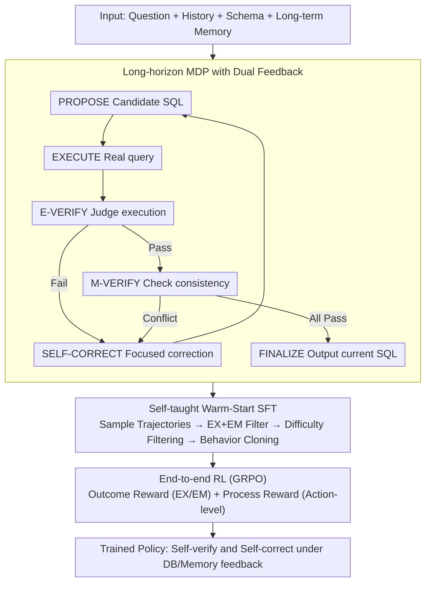

# MTSQL-R1: Towards Long-Horizon Multi-Turn Text-to-SQL via Agentic Training

**Conference**: ACL2026  
**arXiv**: [2510.12831](https://arxiv.org/abs/2510.12831)  
**Code**: https://github.com/taichengguo/MTSQL-R1  
**Area**: NLP Understanding / Multi-turn Text-to-SQL  
**Keywords**: Multi-turn Text-to-SQL, Long-horizon Reasoning, Database Execution Feedback, Dialogue Memory, Reinforcement Learning

## TL;DR
MTSQL-R1 reformulates multi-turn Text-to-SQL from "one-time translation" into a long-horizon agentic training problem involving interactions with databases and dialogue memory. Through self-taught warm-start SFT and multi-level GRPO rewards, small-scale Qwen3 models outperform strong closed-source prompting baselines and short-horizon SFT/RL baselines on CoSQL and SParC.

## Background & Motivation
**Background**: Multi-turn Text-to-SQL requires mapping the current user query, dialogue history, historical SQLs, and database schema into executable SQL within a continuous conversation. Early methods relied on specialized context encoding, relational graphs, or dynamic schema linking. In the LLM era, methods like ACT-SQL and CoE-SQL typically use prompting, CoT, or history-based SQL editing to handle multi-turn contexts.

**Limitations of Prior Work**: Most of these methods still treat the task as short-horizon text-to-SQL translation: the model generates a single SQL and terminates without actual execution or explicit consistency checks against historical constraints. Consequently, two types of errors recur: first, the SQL itself is non-executable, returns empty results, or has incorrect logic; second, the current SQL appears plausible but loses entities, filters, or join paths established in previous turns.

**Key Challenge**: The difficulty of multi-turn Text-to-SQL lies not just in "writing syntactically correct SQL," but in continuous verification and correction across evolving intents. Short-horizon models lack environmental feedback and thus do not know where they failed. Purely prompted agents can use tools but lack training for long-horizon behavior, often failing to call tools stably, interpret feedback, or self-correct.

**Goal**: The authors aim to address three sub-problems: first, how to model multi-turn Text-to-SQL as a long-horizon decision process involving execution, verification, and correction; second, how to construct high-quality long-horizon trajectories when initial model capability is insufficient; and third, how to use reinforcement learning to enable the model to reason in cycles between database feedback and dialogue memory.

**Key Insight**: The observation of this paper is that multi-turn SQL generation is inherently suitable for agentic training: databases provide execution results or error messages, and dialogue memory provides historical constraints—both are finer supervision signals than static labels. Instead of guessing once, the model should go through a closed loop of propose, execute, verify, and refine.

**Core Idea**: Replace pure text context prompting with "database execution feedback + long-term dialogue memory verification," training multi-turn Text-to-SQL as a long-horizon MDP capable of self-verification and self-correction.

## Method
The MTSQL-R1 approach can be understood in two layers: the outer layer is the multi-turn dialogue task itself, where each turn produces a SQL; the inner layer is a sequence of agent actions executed by the model to produce that SQL. Rather than direct output, the model proposes candidate SQLs, executes them, judges execution plausibility, and checks consistency with memory. If any step fails, it enters self-correction and repeats the cycle until it passes and finalizes.

The key is not a new SQL parser, but redesigning training data, action spaces, and rewards around this long-horizon loop. Warm-Start SFT first teaches the model to "act like a Text-to-SQL agent," and subsequent RL optimizes the final SQL and intermediate verification behaviors under tool feedback.

### Overall Architecture
Inputs include the current user query, dialogue history, database schema, and a long-term memory consisting of historical queries, SQLs, and parsed constraints/entities. The output is the final SQL for the current turn.

The overall pipeline consists of three steps.

The first step is MDP modeling. The state includes history, schema, the query, memory, candidate SQL, and accumulated observations. Actions include PROPOSE, EXECUTE, E-VERIFY, M-VERIFY, SELF-CORRECT, and FINALIZE. EXECUTE queries the real database, and M-VERIFY accesses dialogue memory.

The second step is Self-taught Warm-Start SFT. The current policy model generates multiple trajectories for training samples. Only successful trajectories (where final SQL satisfies both EX and EM) are kept. Difficulty-aware rejection sampling filters trajectories for behavior cloning. This iterates to cover more samples.

The third step is End-to-end Long-horizon RL. The SFT model continues interacting with the MDP, trained using a weighted sum of outcome and process rewards. The optimization uses GRPO, with loss masking applied to tool outputs and instructions so gradients primarily act on model-generated actions, judgments, and SQL.

### Key Designs

**1. Long-horizon MDP + Dual Feedback: Decomposing Translation into a Loop**

Short-horizon models generate one SQL and stop, neither executing nor checking historical constraints. MTSQL-R1 models generation as a long-horizon MDP with an action space of PROPOSE, EXECUTE, E-VERIFY, M-VERIFY, SELF-CORRECT, and FINALIZE, following a fixed sequence to ensure execution and memory consistency are checked before finalizing.

The dual environment is crucial: the database returns execution results (data, empty, or error), while long-term memory stores history and constraints. The database exposes syntax/execution errors; memory exposes multi-turn consistency errors (e.g., losing previously established filters). This fine-grained feedback allows for targeted correction—something pure prompt-based methods lack.

**2. Self-taught Warm-Start SFT + Difficulty-aware Selection: Teaching Agentic Behavior**

Small models cannot stably call tools without training (a $1.7\text{B}$ base model achieves only $\approx 23.3$ EX). Directly synthesizing trajectories from gold SQL is too "perfect" and lacks real failure/correction processes. The authors use self-taught iteration: sampling 20 trajectories per sample and keeping those where the final SQL passes EX and EM. Simplified or "always correct" samples are minimized to avoid unnecessary length, while hard samples prioritize longer interaction trajectories, using Qwen3-Embedding clustering to ensure diversity.

**3. Outcome + Process Multi-level Rewards: Mitigating Sparse Signals**

Hard problems often require multiple trials. If only a 0/1 final reward is used, the model struggles to identify which intermediate step improved. MTSQL-R1 splits rewards. Outcome rewards use EX and EM. Process rewards are action-specific: PROPOSE and SELF-CORRECT use the average F1 of SQL clauses (SELECT, WHERE, JOIN, etc.) relative to gold; E-VERIFY rewards matching the pass/fail judgment with the execution result; M-VERIFY rewards based on clause F1 and consistency judgment.

### Loss & Training
SFT uses standard auto-regressive cross-entropy but masks system instructions, execution outputs, and memory prompts, supervising only action and SQL tokens.

RL uses GRPO. Trajectories are sampled per question, and advantages are calculated within the group. An easy-to-hard curriculum is employed: samples are binned by the success rate of 20 initial samples; those with $20/20$ success are discarded as too easy, and training progresses from high to low success rates. Backbones include Qwen3-1.7B and Qwen3-4B.

## Key Experimental Results

### Main Results
Evaluated on CoSQL and SParC using Execution Accuracy (EX) and Exact Match (EM).

| Method | Size | CoSQL EX/EM | SParC EX/EM | Avg EX/EM | Note |
|------|----------|-------------|-------------|------------|------|
| CoE-SQL | Closed | 69.6 / 52.4 | 70.3 / 56.0 | 64.1 / 51.6 | Strong prompt/edit baseline |
| RASAT+PICARD | 3B | 67.0 / 58.8 | 73.3 / 67.7 | 64.5 / 57.7 | Classic structural baseline |
| Qwen3-1.7B Short-SFT | 1.7B | 68.1 / 59.3 | 74.3 / 69.2 | 69.6 / 62.2 | Standard SFT |
| Qwen3-1.7B Short-RL | 1.7B | 72.8 / 59.0 | 72.1 / 65.5 | 70.5 / 60.7 | Standard RL |
| Qwen3-1.7B MTSQL-R1 | 1.7B | 77.3 / 63.5 | 76.2 / 66.1 | 74.6 / 64.4 | Ours |
| Qwen3-4B MTSQL-R1 | 4B | 79.9 / 65.2 | 79.0 / 68.7 | 77.6 / 66.5 | $+3.5$ pts Avg EX over best |

Short-horizon SFT sometimes achieves high EM but significantly lower EX than MTSQL-R1, suggesting it mimics string forms without logical correctness. MTSQL-R1's long-horizon verification primarily boosts EX.

### Ablation Study

| Configuration | CoSQL EX | CoSQL EM | Note |
|------|----------|----------|------|
| Qwen3-4B + Warm-Start + RL | 79.9 | 65.2 | Full model |
| w/o Execution Tool | 74.6 | 64.6 | -5.3 EX: Execution is a main contributor |
| w/o Memory Tool | 77.8 | 64.1 | -2.1 EX: Multi-turn consistency drops |
| Qwen3-14B Few-shot | 74.4 | 55.1 | Prompted 14B still weaker than trained 4B |
| Qwen3-14B Direct | 66.5 | 54.3 | Lowest performance without agentic reasoning |

### Key Findings
- **Self-taught coverage**: Samples with high-quality trajectories increased from 6311 (Round 1) to 7555 (Round 3) on CoSQL.
- **Complexity benefit**: RL provides significant gains for "Hard" and "Extra-hard" problems and deep turns (Turn $\ge 4$).
- **Predicted Prior**: In real-world scenarios where historical SQLs are not gold labels, MTSQL-R1's robustness is even more pronounced due to self-correction.
- **Efficiency**: 4B MTSQL-R1 with $8000$ tokens has $\approx 28.3\text{s}$ latency. Reducing budget to $4000$ tokens maintains $77.0$ EX with $\approx 15.6\text{s}$ latency.

## Highlights & Insights
- Successfully transforms "historical consistency" from a passive prompt into an active, rewardable agent action.
- The self-taught trajectory collection is a practical alternative to non-existent agentic trace datasets.
- Clause-level F1 rewards for SQL provide much denser signals than binary execution results.
- Demonstrates that for multi-turn tasks, "agentic RL" (learning to check/fix) is superior to "short-horizon RL" (learning to generate once).

## Limitations & Future Work
- **Aggregation Drift**: While most error types decreased, errors related to SQL aggregations (MAX, MIN, etc.) remain difficult to resolve in complex queries.
- **Cost**: High token overhead and latency compared to standard SFT.
- **Scaling**: Current experiments use memory for text constraints; future work could explore vector DBs for larger industrial schemas.

## Related Work & Insights
- Compared to ACT-SQL (prompt-based CoT), MTSQL-R1 enables small open-source models to perform stable tool-use.
- Compared to CoE-SQL (incremental editing), MTSQL-R1 is more robust when historical SQLs are erroneous.
- In contrast to Reasoning-SQL (RL for single-turn), MTSQL-R1 expands the scope of RL to include interactive verification and cross-turn constraint management.

## Rating
- Novelty: ⭐⭐⭐⭐☆
- Experimental Thoroughness: ⭐⭐⭐⭐⭐
- Writing Quality: ⭐⭐⭐⭐☆
- Value: ⭐⭐⭐⭐⭐

<!-- RELATED:START -->

## Related Papers

- [\[ACL 2026\] MADE: A Living Benchmark for Multi-Label Text Classification with Uncertainty Quantification](made_a_living_benchmark_for_multi-label_text_classification_with_uncertainty_qua.md)
- [\[ACL 2026\] Reasoning-Based Refinement of Unsupervised Text Clusters with LLMs](reasoning-based_refinement_of_unsupervised_text_clusters_with_llms.md)
- [\[ACL 2026\] Beyond Chunking: Discourse-Aware Hierarchical Retrieval for Long Document Question Answering](beyond_chunking_discourse-aware_hierarchical_retrieval_for_long_document_questio.md)
- [\[ACL 2025\] ReSCORE: Label-free Iterative Retriever Training for Multi-hop Question Answering with Relevance-Consistency Supervision](../../ACL2025/nlp_understanding/rescore_multihop_qa.md)
- [\[ACL 2026\] MSMO-ABSA: Multi-Scale and Multi-Objective Optimization for Cross-Lingual Aspect-Based Sentiment Analysis](msmo-absa_multi-scale_and_multi-objective_optimization_for_cross-lingual_aspect-.md)

<!-- RELATED:END -->
