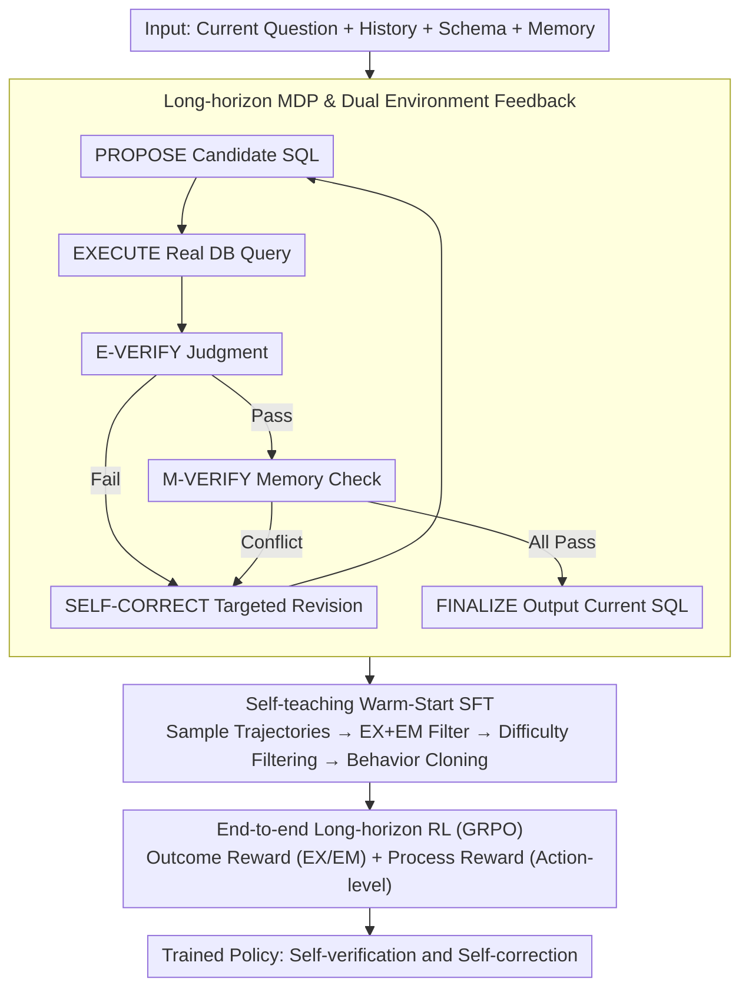

# MTSQL-R1: Towards Long-Horizon Multi-Turn Text-to-SQL via Agentic Training

**Conference**: ACL2026  
**arXiv**: [2510.12831](https://arxiv.org/abs/2510.12831)  
**Code**: https://github.com/taichengguo/MTSQL-R1  
**Area**: NLP Understanding / Multi-Turn Text-to-SQL  
**Keywords**: Multi-Turn Text-to-SQL, Long-Horizon Reasoning, Database Execution Feedback, Dialogue Memory, Reinforcement Learning

## TL;DR
MTSQL-R1 transforms multi-turn Text-to-SQL from "one-shot translation" into a long-horizon agent training problem that interacts with databases and dialogue memory. Through self-teaching warm-start SFT and multi-level GRPO rewards, small-scale Qwen3 models outperform strong closed-source prompting baselines and short-horizon SFT/RL baselines on CoSQL and SParC.

## Background & Motivation
**Background**: Multi-turn Text-to-SQL requires mapping the current user question, historical questions, historical SQLs, and database schema together into executable SQL in a continuous dialogue. Early methods relied heavily on Specialized context encoding, Relational graphs, or dynamic schema linking. In the LLM era, methods like ACT-SQL and CoE-SQL usually handle multi-turn context using prompting, CoT, or editing based on historical SQL.

**Limitations of Prior Work**: Most of these methods still treat the task as short-horizon text-to-SQL translation: the model generates a single SQL and then ends, without performing real SQL execution or explicitly checking consistency with historical constraints. Consequently, two types of errors recur: one where the SQL itself is non-executable, returns empty results, or has incorrect logic; the other where the current SQL seems reasonable but loses entities, filtering conditions, or join paths previously defined by the user.

**Key Challenge**: The difficulty of multi-turn Text-to-SQL is not just "writing a syntactically correct SQL," but continuously verifying and correcting it within evolving intents. Short-horizon models lack environmental feedback and thus do not know where they failed. Purely prompt-based agents can connect to tools, but without long-horizon behavioral training, they often fail to invoke tools stably, interpret feedback, or perform self-correction.

**Goal**: The authors aim to solve three sub-problems: first, how to model multi-turn Text-to-SQL as a long-horizon decision-making process containing execution, verification, and correction; second, how to construct high-quality long-horizon behavioral trajectories when the initial model capability is insufficient; third, how to use reinforcement learning to enable the model to truly learn cyclic reasoning between database feedback and dialogue memory.

**Key Insight**: The observation of this paper is that multi-turn SQL generation is inherently suitable for agentic training: the database provides execution results or error messages, and the dialogue memory provides historical constraints—both of which are finer-grained supervision signals than static labels. Instead of having the model guess everything at once, it is better to let it undergo a closed loop of propose, execute, verify, and refine.

**Core Idea**: Replace pure text context prompting with "database execution feedback + long-term dialogue memory verification," training multi-turn Text-to-SQL as a self-verifying and self-correcting long-horizon MDP.

## Method
The method of MTSQL-R1 can be understood in two layers: the outer layer is the multi-turn dialogue task itself, where every user question must produce a SQL; the inner layer is a sequence of agent actions executed by the model to produce the current turn's SQL. Instead of outputting the final SQL directly, the model first proposes a candidate SQL, then calls the database for execution, judges whether the execution is reasonable, and then calls the memory to check historical consistency. If any step fails, it enters self-correction and repeats the cycle until it passes the check and finalizes.

The key to this paper is not inventing a new SQL parser, but redesigning the training data, action space, and rewards around this long-horizon closed loop. Warm-Start SFT first teaches the model to "act like a Text-to-SQL agent," and subsequent RL allows the model to optimize final SQL and intermediate verification behaviors under tool feedback.

### Overall Architecture
Input includes the current user question, previous dialogue history, database schema, and long-term memory consisting of historical questions, historical SQLs, and parsed constraints/entities. The output is the final SQL for the current turn.

The overall pipeline is divided into three steps.

The first step is MDP modeling. The state contains historical dialogue, schema, current question, long-term memory, current candidate SQL, and accumulated execution observations; actions include PROPOSE, EXECUTE, E-VERIFY, M-VERIFY, SELF-CORRECT, and FINALIZE. EXECUTE queries the real database, M-VERIFY accesses the dialogue memory, and other actions are generated by the LLM as text reasoning or SQL.

The second step is Self-teaching Warm-Start SFT. The authors first let the current policy model generate multiple long-horizon trajectories for training samples, keeping only the correct trajectories where the final SQL satisfies both EX and EM, then use difficulty-aware rejection sampling to select trajectories suitable for supervision to perform behavior cloning. This process iterates over multiple rounds, allowing the model to gradually cover more training samples it originally could not solve.

The third step is End-to-end Long-horizon RL. The SFT-tuned model continues to interact with the database and memory according to the MDP, trained using a weighted sum of outcome rewards and process rewards. The optimization algorithm adopts GRPO, and loss masking is applied to tool outputs and human instructions so that gradients mainly act on the model-generated actions, verification judgments, and SQL.

### Key Designs

**1. Long-horizon MDP and Dual Environment Feedback: Decomposing One-shot Translation into Execute-Verify-Correct Loop**

Short-horizon models finish after generating one SQL, without actual execution or checking for violations of previous turn constraints, making it impossible to locate errors. MTSQL-R1 models the current turn's SQL generation as a long-horizon MDP with an action space of PROPOSE, EXECUTE, E-VERIFY, M-VERIFY, SELF-CORRECT, and FINALIZE, following a fixed transition sequence: first PROPOSE a candidate SQL, then EXECUTE a real database query, followed by E-VERIFY to judge if execution is reasonable. After passing execution, it enters M-VERIFY to access memory for consistency checks. Any verification failure leads to SELF-CORRECT and re-enters the loop, while passing all checks leads to FINALIZE.

The key lies in the dual environment: the database is responsible for returning execution results, empty results, or errors, while long-term memory stores historical queries, SQLs, and parsed constraints/entities. The database exposes syntax and execution-level errors, while memory exposes multi-turn consistency errors (e.g., whether the current SQL lost entities, filters, or join paths defined earlier). Combined, they allow the model to not only know it is "wrong" but also whether the error is an execution issue or a context consistency issue, enabling targeted correction—a fine-grained feedback that prompt-based methods using pure text concatenation cannot obtain.

**2. Self-teaching Warm-Start SFT and Difficulty-aware Trajectory Filtering: Teaching the Model to "Act Like an Agent" Before RL**

Small models cannot stably call tools without training—the 1.7B base agent achieves only about 23.3 EX. However, synthesizing trajectories directly with gold SQL is too "perfect," lacking real execution failures and correction processes; relying solely on base model sampling provides insufficient coverage. The authors' compromise is self-teaching iteration: in each round, they sample 20 trajectories for each training sample, keeping only correct trajectories where the final SQL passes both EX and EM for behavior cloning. Difficulty sensitivity is reflected in the filtering strategy—simple samples or samples with 20/20 correct outcomes retain only a few short trajectories to avoid artificially lengthening easy problems; difficult samples prioritize long trajectories with more interactions and use Qwen3-Embedding clustering to select representative trajectories for diversity.

After each training round, samples that have already obtained high-quality trajectories are removed from the next round's exploration set, continuing iterations to expand coverage. Thus, the model learns long-horizon reasoning from its own successful experiences rather than memorizing an externally labeled "perfect" trajectory.

**3. Multi-level Outcome + Process Rewards: Attaching Learning Signals to Intermediate Actions**

Difficult problems and deep dialogue turns often require multiple trials; if only a 0/1 reward for the final SQL is provided, the model struggles to know which step improved. MTSQL-R1 splits rewards into two layers. The final reward considers EX (execution correctness) and EM (exact match with reference SQL). Process rewards are designed by action type: PROPOSE and SELF-CORRECT use the average F1 of SQL clauses like SELECT, WHERE, JOIN, GROUP, and ORDER to measure proximity to gold SQL; E-VERIFY rewards matching the model's pass/fail judgment with the actual execution result; M-VERIFY rewards are based on the candidate SQL's clause F1 and memory verification conclusions.

The overall reward is a weighted sum of outcome and process rewards, with weights determined via grid search on a small validation set. Consequently, "proposing closer SQL," "correctly identifying execution errors," and "correctly discovering memory conflicts" are transformed into optimizable targets, preventing sparse rewards in the long-horizon closed loop.

### Loss & Training
The SFT stage uses standard autoregressive cross-entropy, but token masking excludes system instructions, execution outputs, and memory prompts, supervising only action tokens and SQL tokens. Thus, the model learns when to call actions, how to provide verification judgments, and how to correct SQL, rather than memorizing tool-returned text.

The RL stage adopts GRPO. For each problem, a group of trajectories is sampled, and group-normalized advantages are calculated according to total rewards, followed by PPO-style ratio clipping and KL regularization updates. The authors also use an easy-to-hard curriculum: first estimating difficulty by the success count of 20 samples from the current model, discarding overly easy samples (20/20 correct), and then training in buckets from high to low success counts. Implementation-wise, Qwen3-1.7B and Qwen3-4B are the primary backbones; SFT uses a learning rate of 5e-6 with full-parameter fine-tuning; GRPO uses a learning rate of 1e-6, batch size of 256, maximum prompt length of 4000, maximum response length of 8000, and a maximum of 4 tool interactions.

## Key Experimental Results

### Main Results
The paper evaluates on CoSQL and SParC, reporting Execution Accuracy (EX) and Exact Match (EM). CoSQL contains about 3,000 multi-turn dialogues with over 10,000 labeled SQLs; SParC contains 4,298 question sequences and over 12,000 questions. Besides standard in-domain settings, the authors performed out-of-domain cross-training evaluation to test generalization.

| Method | Model Size | CoSQL EX/EM | SParC EX/EM | Avg EX/EM | Description |
|------|----------|-------------|-------------|------------|------|
| CoE-SQL | Closed-source | 69.6 / 52.4 | 70.3 / 56.0 | 64.1 / 51.6 | Strong multi-turn prompt/edit baseline, includes OOD avg |
| RASAT+PICARD | 3B | 67.0 / 58.8 | 73.3 / 67.7 | 64.5 / 57.7 | Classic structured pre-LLM baseline, includes OOD avg |
| Qwen3-1.7B Short-Horizon SFT | 1.7B | 68.1 / 59.3 | 74.3 / 69.2 | 69.6 / 62.2 | Short-horizon SFT on original training set |
| Qwen3-1.7B Short-Horizon Direct RL | 1.7B | 72.8 / 59.0 | 72.1 / 65.5 | 70.5 / 60.7 | Direct RL similar to single-turn SQL-R1/Reasoning-SQL |
| Qwen3-1.7B MTSQL-R1 | 1.7B | 77.3 / 63.5 | 76.2 / 66.1 | 74.6 / 64.4 | Warm-Start SFT + outcome/process RL |
| Qwen3-4B Short-Horizon SFT | 4B | 73.1 / 64.8 | 78.3 / 71.5 | 74.1 / 66.6 | Strong short-horizon SFT baseline |
| Qwen3-4B Short-Horizon Direct RL | 4B | 75.2 / 64.8 | 75.8 / 66.5 | 74.0 / 64.2 | Strong short-horizon RL baseline |
| Qwen3-4B MTSQL-R1 | 4B | 79.9 / 65.2 | 79.0 / 68.7 | 77.6 / 66.5 | Avg EX Gain of 3.5 points over best previous |

A notable phenomenon is that short-horizon SFT sometimes yields decent EM, but its EX is significantly weaker than MTSQL-R1. This indicates it might approach the reference SQL in string format but lacks logical correctness at the execution level, whereas the long-horizon verification of MTSQL-R1 primarily improves the more critical EX.

### Ablation Study

| Configuration | CoSQL EX | CoSQL EM | Description |
|------|----------|----------|------|
| Qwen3-4B + Warm-Start + RL | 79.9 | 65.2 | Full long-horizon model |
| w/o Execution Tool | 74.6 | 64.6 | EX drops 5.3 points without DB tool, a major contributor |
| w/o Memory Verification Tool | 77.8 | 64.1 | EX drops 2.1, EM drops 1.1, multi-turn consistency weakens |
| Qwen3-14B Long-horizon no training | 74.4 | 55.1 | Prompting large model for tools is still weaker than trained 4B |
| Qwen3-14B w/o Execution Tool | 71.4 | 54.6 | Even larger models drop points significantly without execution tool |
| Qwen3-14B Direct | 66.5 | 54.3 | Lowest performance without long-horizon reasoning |

### Analysis

| Item | Result | Conclusion |
|--------|------|------|
| Outcome Only RL | 79.1±0.15 EX / 64.5±0.18 EM | Final reward alone significantly outperforms short-horizon baselines |
| Outcome + Verify Reward | 79.7±0.14 EX / 65.0±0.19 EM | Verification rewards improve execution correctness |
| Outcome + Propose/Correction Reward | 79.4±0.11 EX / 65.4±0.18 EM | Clause rewards for proposal/correction improve EM |
| All Process Rewards | 79.9±0.11 EX / 65.2±0.17 EM | Combined rewards achieve highest EX, process signals are effective |
| Predicted Prior Evaluation | Direct RL 71.2 EX, MTSQL-R1 76.5 EX | Advantage of long-horizon verification is greater when using own predicted history |
| LLaMA3.2-3B Transfer | Short-Horizon RL 70.4/70.9 EX, MTSQL-R1 74.8/75.2 EX | Framework works across backbones, not just Qwen |

### Key Findings
- More rounds of Warm-Start SFT allow covering more high-quality long-horizon trajectories. Training samples with trajectories in CoSQL increased from 6,311 in Round 1 to 7,555 in Round 3, ultimately yielding 19,416 long-horizon trajectories.
- RL is particularly helpful for hard and extra-hard problems. The difficulty bucket and turn-wise analysis show larger gains in deep turns (Turn $\geq$ 4) and complex SQLs, indicating that memory verification and execution feedback primarily address cumulative errors in context.
- Small models struggle to stably follow long-horizon function calls without training. The 1.7B base agent has only about 23.3 EX / 17.1 EM; the 4B base agent is better but still significantly lower than Warm-Start + RL, showing that "providing tools" $\neq$ "knowing how to use tools."
- Regarding efficiency, the 4B MTSQL-R1 with a max of 8000 output tokens achieves 79.9 EX on CoSQL with a latency of ~28.3s; limiting to 4000 tokens still yields 77.0 EX with ~15.6s latency. It is suitable for high-stakes, offline, or latency-tolerant DBQA but not necessarily for ultra-low latency BI dashboards.

## Highlights & Insights
- The most valuable point is turning "historical consistency" in multi-turn Text-to-SQL into callable and rewardable memory verification actions. While many methods simply append history to the prompt, MTSQL-R1 allows the model to explicitly ask for historical constraints and judge conflicts accordingly.
- Self-teaching trajectory collection is practical. It avoids assuming existing human long-horizon trajectories by filtering from the model's own successful rollouts and expanding coverage via iteration, which is transferable to other tasks lacking agent trajectory labels.
- The process reward design is closely tied to SQL structure. Using clause F1 (SELECT, WHERE, JOIN, etc.) to score propose and self-correction actions guides the model more effectively than pure execution results.
- The paper clearly distinguishes between "short-horizon RL" and "long-horizon agentic RL." Direct RL can improve single-step SQL generation, but without tool interaction and memory checks, it still fails to learn post-execution reflection or cross-turn constraint recovery.
- The predicted-prior evaluation for real deployment is critical. Standard evaluations often use gold SQL as history, underestimating error accumulation; MTSQL-R1's larger advantage when using its own history suggests that closed-loop correction effectively mitigates snowballing errors.

## Limitations & Future Work
- The authors admit Aggregation Drift remains difficult to solve. Error analysis shows significant declines in execution, constraint consistency, schema linking, and join path errors, but improvements in aggregation-related drift are limited, especially for extra-hard SQL.
- Long-horizon reasoning incurs higher token and latency costs. Compared to short-horizon SFT outputting only SQL, MTSQL-R1 must generate actions, verification, and correction processes, leading to ~28s latency at 8000 tokens.
- Current memory primarily stores parsed text constraints. Although the paper discusses replacing this with vector databases or complex backends, experiments have not systematically verified performance with large-scale schemas or noisy memory.
- Rewards still rely on gold SQL and execution results, making training expensive. Future research should explore how weak supervision, log feedback, or RLHF can be integrated for enterprise environments without exact SQL labels.
- Tool call limits and output lengths affect performance. The paper mentions some execution failures stem from the 8000 token cap, suggesting that reasoning budget management for long-horizon agents is a follow-up problem.

## Related Work & Insights
- **vs ACT-SQL**: ACT-SQL rewrites multi-turn questions via auto-generated CoT for LLMs, but relies on closed-source in-context capabilities without training models to use feedback. MTSQL-R1's advantage is training stable tool-use and correction in open-source small models.
- **vs CoE-SQL**: CoE-SQL uses chain-of-editions for incremental updates, suitable for small semantic changes. MTSQL-R1 is more robust in predicted-prior settings because it explicitly executes and checks memory.
- **vs SQL-R1 / Reasoning-SQL**: These apply RL to single-turn SQL, emphasizing logic or consistency but lacking dialogue memory or long-horizon MDPs. MTSQL-R1 extends the role of RL from "generating a better single SQL" to "learning complete verification and correction strategies."
- **vs Structural methods (RASAT+PICARD, etc.)**: Traditional methods use relation-aware attention or constrained decoding but lack the open reflection and tool interaction of LLM agents. MTSQL-R1 reconstructs a learnable interactive semantic parsing process at the LLM level.
- **Insights for other tasks**: Any multi-turn generation task with external verifiable environments can borrow this framework, such as code generation (compilers/unit tests) or data analysis agents (notebook execution). The key is decomposing environmental feedback into action-level rewards.

## Rating
- Novelty: ⭐⭐⭐⭐☆ Combining MDP, tool execution, memory verification, and GRPO for multi-turn Text-to-SQL is complete; while components aren't all new, the task modeling and training loop are significant contributions.
- Experimental Thoroughness: ⭐⭐⭐⭐⭐ Covers CoSQL/SParC, in-domain/OOD, multiple models, predicted-prior, reward ablation, and error type analysis with a solid chain of evidence.
- Writing Quality: ⭐⭐⭐⭐☆ Clear structure and well-organized experiments; however, some formula/action name extractions in the arXiv version need contextual restoration.
- Value: ⭐⭐⭐⭐⭐ Highly valuable for multi-turn Text-to-SQL and verifiable DB agents, especially for high-reliability enterprise data access scenarios.

<!-- RELATED:START -->

## Related Papers

- [\[ACL 2026\] MADE: A Living Benchmark for Multi-Label Text Classification with Uncertainty Quantification](made_a_living_benchmark_for_multi-label_text_classification_with_uncertainty_qua.md)
- [\[ACL 2026\] Reasoning-Based Refinement of Unsupervised Text Clusters with LLMs](reasoning-based_refinement_of_unsupervised_text_clusters_with_llms.md)
- [\[ACL 2026\] Beyond Chunking: Discourse-Aware Hierarchical Retrieval for Long Document Question Answering](beyond_chunking_discourse-aware_hierarchical_retrieval_for_long_document_questio.md)
- [\[ACL 2025\] ReSCORE: Label-free Iterative Retriever Training for Multi-hop Question Answering with Relevance-Consistency Supervision](../../ACL2025/nlp_understanding/rescore_multihop_qa.md)
- [\[ACL 2026\] BoundRL: Efficient Structured Text Segmentation through Reinforced Boundary Generation](boundrl_efficient_structured_text_segmentation_through_reinforced_boundary_gener.md)

<!-- RELATED:END -->
