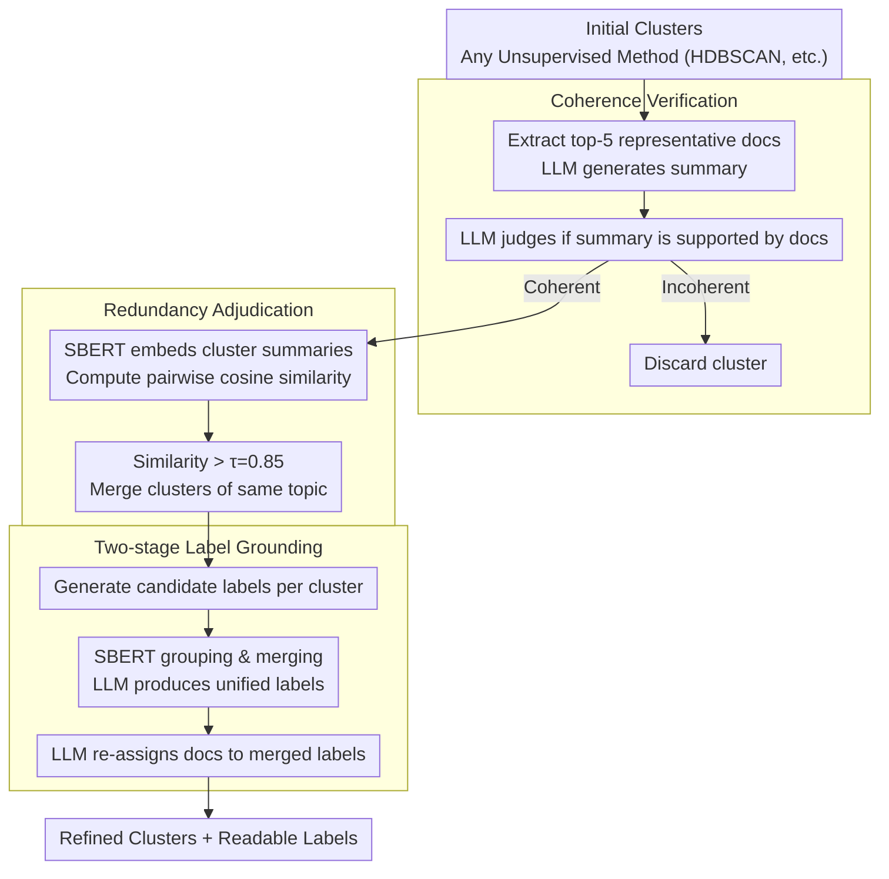

# Reasoning-Based Refinement of Unsupervised Text Clusters with LLMs

**Conference**: ACL 2026 Findings  
**arXiv**: [2604.07562](https://arxiv.org/abs/2604.07562)  
**Code**: [GitHub](https://github.com/tunazislam/reasoning-based-refinement-llms-vegan)  
**Area**: Text Clustering / Unsupervised Learning  
**Keywords**: Text Cluster Refinement, LLM Semantic Judge, Consistency Verification, Redundancy Adjudication, Label Grounding

## TL;DR
A reasoning-based cluster refinement framework is proposed that utilizes LLMs as semantic judges (rather than embedding generators) to verify and reconstruct the output of unsupervised clustering. Through three reasoning stages—coherence verification, redundancy adjudication, and label grounding—it significantly improves cluster consistency and human-aligned labeling quality on social media corpora.

## Background & Motivation

**Background**: Unsupervised text clustering (e.g., LDA, BERTopic, HDBSCAN) is widely used to discover latent semantic structures from large-scale text collections. Recent methods primarily rely on contextual embeddings combined with geometric clustering criteria to evaluate cluster quality.

**Limitations of Prior Work**: Geometric properties in embedding space (such as separation and density) do not always align with human semantic understanding. Clusters may be numerically well-separated but semantically incoherent, and multiple clusters may encode overlapping topics. This is particularly evident in social media short-text scenarios where high noise, lexical variation, and rapid topic drift exacerbate the gap between statistical consistency and human interpretability.

**Key Challenge**: Existing pipelines lack an explicit semantic verification mechanism—the "hypotheses" generated by clustering algorithms are never tested for true semantic coherence, non-redundancy, and interpretability.

**Goal**: To design a post-refinement layer that leverages the reasoning capabilities of LLMs to verify and reconstruct the output of any unsupervised clustering method.

**Key Insight**: Treat clustering as a "proposal" and the LLM as a "semantic judge" rather than an embedding generator, decoupling representation learning from structural verification.

**Core Idea**: LLMs possess strong natural language reasoning capabilities that can assess whether a cluster is internally consistent, whether two clusters are meaningfully distinct, and whether a topic is well-grounded in the text—tasks that purely geometric methods cannot achieve.

## Method

### Overall Architecture
A three-stage post-refinement process: the input is an initial set of clusters produced by any unsupervised method (e.g., HDBSCAN), and the output is a refined set of clusters with interpretable labels. Stage 1 verifies the semantic coherence of each cluster, Stage 2 merges semantically redundant clusters, and Stage 3 generates and merges explanatory labels for the refined clusters.

### Key Designs

**1. Coherence Verification: Identifying "Geometrically Compact but Semantically Fragmented" clusters using language understanding**

Clusters that appear compact in embedding space may contain semantically heterogeneous content—a failure mode invisible to purely geometric criteria. In this stage, the top-5 representative documents closest to the centroid are selected for each cluster. The LLM first generates a concise summary for them and then assesses whether this summary is actually supported by those documents. If the LLM determines the summary fails to capture a consistent theme running through all documents, the cluster is judged incoherent and discarded. In other words, the adjudication of whether "these documents discuss the same thing" is delegated to linguistic reasoning rather than embedding proximity.

**2. Redundancy Adjudication: Merging clusters that are distinct in form but identical in topic**

Multiple clusters often differ only in surface-level vocabulary while discussing the same underlying topic, leading to structural redundancy. This stage uses SBERT to generate embeddings for each cluster summary and computes pairwise cosine similarities. Clusters with a similarity exceeding a threshold $\tau=0.85$ are merged. This threshold is not arbitrary but determined via grid search to balance Silhouette Score, Davies-Bouldin Index, and cluster count—ensuring redundant clusters are combined without collapsing distinct topics.

**3. Label Grounding: Assigning non-redundant, human-readable labels to refined clusters**

To ensure interpretability, labels are generated in two phases to avoid redundancy within the label system itself. In the first phase, candidate labels are generated from the summaries of each cluster. In the second phase, SBERT similarity between labels is calculated, and labels with similarity $>0.85$ are grouped. The LLM then generates a unified label for each group. Finally, the LLM re-assigns each document to the most appropriate unified label, ensuring true alignment between labels and documents rather than just naming at the cluster level.

### Loss & Training
The framework requires no training and is entirely based on zero-shot reasoning with an LLM (GPT-4o). The initial clustering stage uses TF-IDF + SVD + UMAP + HDBSCAN. In the refinement stage, the LLM and SBERT work in synergy.

## Key Experimental Results

### Main Results

| Method | CC | SS↑ | DBi↓ | Description |
|------|-----|-----|------|------|
| HDBSCAN (X) | 359 | 0.122 | 2.322 | Original clusters |
| SBERT Refinement (X) | 250 | 0.156 | 0.569 | Refinement using embeddings only |
| LLM Refinement (X) | 232 | **0.674** | - | Refinement via semantic reasoning; 5.5x SS gain |
| HDBSCAN (Bluesky) | - | - | - | Baseline |
| LLM Refinement (Bluesky) | - | Significant Gain | - | Consistently effective across platforms |

### Ablation Study

| Evaluation Dimension | Result | Description |
|----------|------|------|
| LLM Labels vs. Human Eval | High Consistency | Strong alignment with human judgment even without gold standards |
| Cross-platform Stability | Consistent | Stable structure under matched time and quantity conditions |
| Incoherent Cluster Detection | Effective | Successfully identifies and discards clusters with mixed content |

### Key Findings
- LLM refinement improved the Silhouette Score from 0.122 to 0.674 (X dataset), a 5.5x increase.
- The number of clusters was reduced from 359 to 232, removing incoherent and redundant entries.
- Human evaluation showed high consistency between LLM-generated labels and expert annotators.
- Structural stability was maintained across platforms (X vs. Bluesky) under matched conditions.
- SBERT refinement improved separation (DBi) but was inferior to LLM refinement in enhancing semantic consistency.

## Highlights & Insights
- Positioned LLM as a "semantic judge" rather than an embedding generator is the core idea—leveraging LLM reasoning for structural verification while leaving representation learning to specialized embedding models. This decoupled design makes the framework agnostic to the clustering algorithm, allowing it to serve as a general post-refinement layer.
- The three-stage reasoning checkpoints specifically target three typical failure modes of unsupervised clustering (incoherence, redundancy, and non-interpretability), resulting in a highly targeted design.
- Validating LLM label quality through human evaluation in scenarios without a gold standard is a pragmatic and robust approach.

## Limitations & Future Work
- Dependence on GPT-4o API calls results in high costs and limited reproducibility.
- Validation was limited to veganism-related topics, restricting thematic diversity.
- Top-5 representative documents may be insufficient to represent large, heterogeneous clusters.
- The merge threshold of 0.85 is empirical and may require adjustment for different domains.
- Future work could explore using open-source LLMs as alternatives to GPT-4o and expanding to more domains.

## Related Work & Insights
- **vs. BERTopic**: While BERTopic relies on embedding geometry to evaluate quality, this work adds a semantic reasoning verification layer.
- **vs. LDA/HDP**: Probabilistic topic models often exhibit poor semantic consistency on short texts; this post-refinement can improve the output of any topic model.
- **vs. LLooM**: Unlike LLooM, which requires user-provided seed sets, this framework is entirely unsupervised.

## Rating
- Novelty: ⭐⭐⭐⭐ The idea of using LLMs as semantic judges to refine clusters is novel and versatile.
- Experimental Thoroughness: ⭐⭐⭐ Evaluation is limited to a single thematic domain with few baseline comparisons.
- Writing Quality: ⭐⭐⭐⭐ Clear description of the framework and well-defined design principles.
- Value: ⭐⭐⭐⭐ Provides a generalized methodology for cluster post-processing.

<!-- RELATED:START -->

## Related Papers

- [\[ACL 2026\] BoundRL: Efficient Structured Text Segmentation through Reinforced Boundary Generation](boundrl_efficient_structured_text_segmentation_through_reinforced_boundary_gener.md)
- [\[ACL 2026\] LLM-Guided Semantic Bootstrapping for Interpretable Text Classification with Tsetlin Machines](llm-guided_semantic_bootstrapping_for_interpretable_text_classification_with_tse.md)
- [\[ACL 2026\] DiZiNER: Disagreement-guided Instruction Refinement via Pilot Annotation Simulation for Zero-shot Named Entity Recognition](diziner_disagreement-guided_instruction_refinement_via_pilot_annotation_simulati.md)
- [\[ACL 2026\] MADE: A Living Benchmark for Multi-Label Text Classification with Uncertainty Quantification](made_a_living_benchmark_for_multi-label_text_classification_with_uncertainty_qua.md)
- [\[ACL 2026\] AdapTime: Enabling Adaptive Temporal Reasoning in Large Language Models](adaptime_enabling_adaptive_temporal_reasoning_in_large_language_models.md)

<!-- RELATED:END -->
