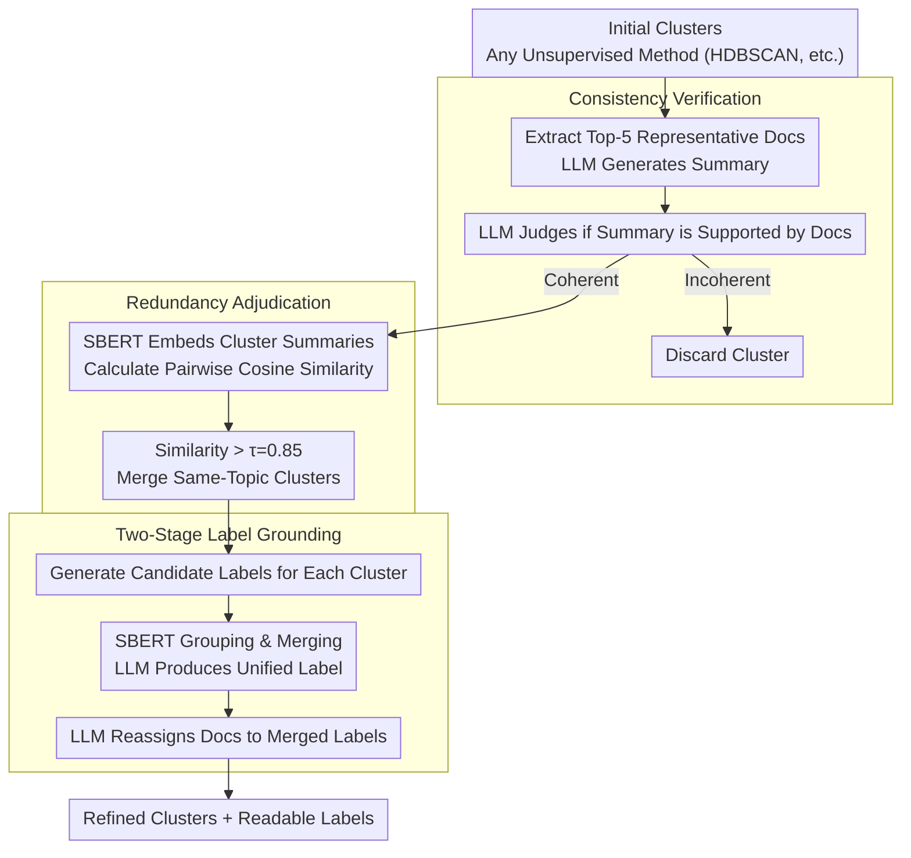

# Reasoning-Based Refinement of Unsupervised Text Clusters with LLMs

**Conference**: ACL 2026 Findings  
**arXiv**: [2604.07562](https://arxiv.org/abs/2604.07562)  
**Code**: [GitHub](https://github.com/tunazislam/reasoning-based-refinement-llms-vegan)  
**Area**: Text Clustering / Unsupervised Learning  
**Keywords**: Text Cluster Refinement, LLM Semantic Juror, Consistency Verification, Redundancy Adjudication, Label Grounding

## TL;DR
A reasoning-based cluster refinement framework is proposed, positioning LLMs as semantic judges (rather than embedding generators) to verify and restructure unsupervised clustering outputs. Through three reasoning stages—consistency verification, redundancy adjudication, and label grounding—this framework significantly improves cluster coherence and human-aligned labeling quality on social media corpora.

## Background & Motivation

**Background**: Unsupervised text clustering (LDA, BERTopic, HDBSCAN, etc.) is widely used to discover latent semantic structures in large-scale text collections. Recent methods primarily rely on contextual embeddings and geometric clustering criteria to evaluate cluster quality.

**Limitations of Prior Work**: Geometric properties in embedding spaces (e.g., separation, density) do not always align with human semantic understanding. Clusters may be numerically well-separated but semantically incoherent, while multiple clusters may encode overlapping themes. Particularly in social media short-text scenarios, high noise, lexical variation, and rapid topic drift exacerbate the gap between statistical consistency and human interpretability.

**Key Challenge**: Existing pipelines lack an explicit semantic verification mechanism—the "hypotheses" generated by clustering algorithms are never tested for true semantic coherence, non-redundancy, or interpretability.

**Goal**: Design a post-refinement layer that leverages the reasoning capabilities of LLMs to verify and restructure the output of any unsupervised clustering method.

**Key Insight**: Treat clusters as "proposals" and use the LLM as a "semantic judge" rather than an embedding generator, thereby decoupling representation learning from structural verification.

**Core Idea**: LLMs possess strong natural language reasoning capabilities that can evaluate whether a cluster is internally consistent, whether two clusters are meaningfully distinct, and whether a theme is well-grounded in the text—tasks that pure geometric methods cannot achieve.

## Method

### Overall Architecture
A three-stage post-refinement process: The input consists of initial clusters generated by any unsupervised method (e.g., HDBSCAN), and the output is a refined set of clusters with interpretable labels. Stage 1 verifies the semantic consistency of each cluster, Stage 2 merges semantically redundant clusters, and Stage 3 generates and merges explanatory labels for the refined clusters.

### Key Designs

**1. Consistency Verification: Using language understanding to identify "geometrically compact, semantically fragmented" clusters**

Clusters that appear compact in the embedding space may contain semantically heterogeneous content—a failure mode invisible to pure geometric criteria. In this stage, the top-5 representative documents closest to the centroid are selected for each cluster. The LLM first generates a concise summary for them and then assesses whether this summary is truly supported by those representative documents. If the LLM determines the summary fails to capture a consistent theme running through all documents, the cluster is judged incoherent and discarded. In other words, the decision of whether "these documents speak about the same thing" is deferred to linguistic reasoning rather than proximity in embedding space.

**2. Redundancy Adjudication: Merging clusters that are superficially different but semantically identical**

Multiple clusters often differ only in surface-level vocabulary while discussing the same topic, resulting in structural redundancy. This stage uses SBERT to generate embeddings for each cluster summary and calculates pairwise cosine similarities. Clusters with similarity exceeding a threshold $\tau=0.85$ are merged. This threshold is determined via grid search to balance Silhouette Score, Davies-Bouldin Index, and cluster count—ensuring truly duplicate clusters are merged without collapsing distinct topics.

**3. Label Grounding: Assigning non-redundant, human-readable labels to refined clusters**

To ensure interpretability, labels are generated in two phases to avoid redundancy within the label set itself. First, candidate labels are generated for each cluster based on its summary. Second, SBERT similarity between labels is calculated; labels with similarity $>0.85$ are grouped, and the LLM generates a unified label for each group. Finally, the LLM reassigns each document to the most appropriate merged label, ensuring true alignment between labels and documents rather than just naming at the cluster level.

### Loss & Training
The framework requires no training and is entirely based on zero-shot reasoning from an LLM (GPT-4o). The clustering phase utilizes TF-IDF + SVD + UMAP + HDBSCAN. In the refinement phase, the LLM and SBERT work collaboratively.

## Key Experimental Results

### Main Results

| Method | CC | SS↑ | DBi↓ | Description |
|------|-----|-----|------|------|
| HDBSCAN (X) | 359 | 0.122 | 2.322 | Original clusters |
| SBERT Refined (X) | 250 | 0.156 | 0.569 | Refinement using embeddings only |
| LLM Refined (X) | 232 | **0.674** | - | Semantic reasoning refinement, SS improved 5.5x |
| HDBSCAN (Bluesky) | - | - | - | Baseline |
| LLM Refined (Bluesky) | - | Significant gain | - | Consistently effective across platforms |

### Ablation Study

| Evaluation Dimension | Result | Description |
|----------|------|------|
| LLM Label vs. Human Eval | High Consistency | Strong alignment with human judgment in the absence of gold standards |
| Cross-Platform Stability | Consistent | Stable structure under matched time and volume conditions |
| Incoherent Cluster Detection | Effective | Successfully identified and discarded clusters with mixed content |

### Key Findings
- LLM refinement increased the Silhouette Score from 0.122 to 0.674 (X dataset), a 5.5x improvement.
- The number of clusters was reduced from 359 to 232 by removing incoherent and redundant clusters.
- Human evaluation showed high consistency between LLM-generated labels and expert annotators.
- Cross-platform results (X vs. Bluesky) remained stable under matched conditions.
- SBERT refinement improved separation (DBi) but was less effective than LLM refinement in improving semantic consistency.

## Highlights & Insights
- Positioning the LLM as a "semantic judge" rather than an embedding generator is the core insight—leveraging LLM reasoning for structural verification while leaving representation learning to specialized embedding models. This decoupled design makes the framework algorithm-agnostic, serving as a general-purpose post-refinement layer.
- The three-stage reasoning checkpoints specifically target three typical failure modes of unsupervised clustering (incoherence, redundancy, and non-interpretability), resulting in a highly targeted design.
- Validating LLM label quality through human evaluation in scenarios without gold standards is a pragmatic and robust approach.

## Limitations & Future Work
- Dependence on GPT-4o API calls limits cost-efficiency and reproducibility.
- Evaluation was limited to veganism-related topics, which may lack thematic diversity.
- Using only Top-5 representative documents might be insufficient for large, heterogeneous clusters.
- The merge threshold of 0.85 is empirical and may require adjustment for different domains.
- Future work could explore open-source LLMs as alternatives to GPT-4o and expand to more domains.

## Related Work & Insights
- **vs. BERTopic**: While BERTopic relies on embedding geometry for quality assessment, this work adds a semantic reasoning verification layer.
- **vs. LDA/HDP**: Probabilistic topic models often show poor semantic consistency on short texts; this post-refinement can improve the output of any topic model.
- **vs. LLooM**: Unlike LLooM, which requires user-provided seed sets, this approach is entirely unsupervised.

## Rating
- Novelty: ⭐⭐⭐⭐ The idea of using LLMs as semantic judges for cluster refinement is novel and generalizable.
- Experimental Thoroughness: ⭐⭐⭐ Evaluation was limited to a single thematic domain with a lack of more extensive baseline comparisons.
- Writing Quality: ⭐⭐⭐⭐ The framework description is clear, and design principles are well-defined.
- Value: ⭐⭐⭐⭐ Provides a general methodology for cluster post-processing.

<!-- RELATED:START -->

## Related Papers

- [\[ACL 2026\] Revealing Temporal Framing in News Text](uncovering_temporal_framing_in_the_news.md)
- [\[ACL 2026\] DiZiNER: Disagreement-guided Instruction Refinement via Pilot Annotation Simulation for Zero-shot Named Entity Recognition](diziner_disagreement-guided_instruction_refinement_via_pilot_annotation_simulati.md)
- [\[ACL 2026\] BoundRL: Efficient Structured Text Segmentation through Reinforced Boundary Generation](boundrl_efficient_structured_text_segmentation_through_reinforced_boundary_gener.md)
- [\[ACL 2026\] LLM-Guided Semantic Bootstrapping for Interpretable Text Classification with Tsetlin Machines](llm-guided_semantic_bootstrapping_for_interpretable_text_classification_with_tse.md)
- [\[ACL 2026\] AdapTime: Enabling Adaptive Temporal Reasoning in Large Language Models](adaptime_enabling_adaptive_temporal_reasoning_in_large_language_models.md)

<!-- RELATED:END -->
