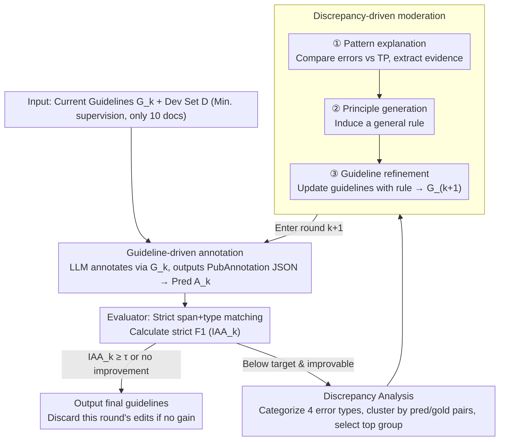

# Refining and Reusing Annotation Guidelines for LLM Annotation

**Conference**: ACL2026  
**arXiv**: [2605.20809](https://arxiv.org/abs/2605.20809)  
**Code**: https://github.com/KonWooKim/llm-guideline-moderation  
**Area**: Biomedical NLP / LLM Annotation / Annotation Guidelines  
**Keywords**: Annotation Guidelines, LLM Annotation, Biomedical NER, Guideline Refinement, Moderation  

## TL;DR
This paper transfers the guideline reuse and moderation processes from traditional manual annotation projects to LLM annotation. It demonstrates that explicit annotation guidelines, reasoning models, and iterative refinement driven by a small number of gold discrepancies improve strict span+type F1 in biomedical NER.

## Background & Motivation
**Background**: Text annotation is the foundation for semantic retrieval, information extraction, and text mining. While LLMs perform well in zero-shot or few-shot annotation, benchmark gold annotations often follow specific conventions, particularly in biomedical NER where entity boundaries, types, and gray-area cases have strict rules.

**Limitations of Prior Work**: Human annotation projects typically constrain annotators with guidelines, but many methods for LLM annotation provide only simple task descriptions. LLMs may possess domain knowledge but do not necessarily adhere to specific benchmark conventions regarding minimal spans, entity boundaries, or complex entities.

**Key Challenge**: LLMs possess strong linguistic and world knowledge, but this knowledge may not align with the annotation conventions of a specific dataset. Achieving high-quality annotation requires the model to not only "understand medicine" but also to make decisions following specific gold standard rules.

**Goal**: To verify three hypotheses: incorporating original annotation guidelines improves LLM annotation; reasoning models are better suited for guideline-driven annotation than non-reasoning models; and LLMs can iteratively refine guidelines through moderation given minimal gold supervision.

**Key Insight**: The authors simulate pilot moderation from the early stages of human annotation projects. An LLM first annotates 10 development documents using current guidelines. The system performs strict matching between predictions and gold labels to identify dominant error patterns, then an LLM moderator explains the errors, generates principles, and updates the guidelines.

**Core Idea**: Use annotation guidelines as an intermediate representation to align LLM annotation behavior and drive guideline refinement via discrepancy patterns, rather than directly fine-tuning the model.

## Method
The proposed method is an iterative closed loop: the LLM annotator labels documents using current guidelines; the evaluator calculates F1 and error sets via strict span+type matching; the discrepancy analyzer identifies the most frequent error groups; and the LLM moderator updates the guidelines based on error evidence before the next round. The process stops if a quality threshold is reached or if refinement yields no improvement, at which point ineffective edits are discarded.

### Overall Architecture
In round $k$, the input consists of current guidelines $G_k$ and a development set $D$. The LLM annotator generates predictions $A_k$. The evaluator compares $A_k$ with gold labels $A_g$ to compute strict F1. If $IAA_k$ is below the threshold and there is room for improvement, discrepancies are collected. The system categorizes errors into label mismatch, boundary mismatch, false negative, and false positive using soft overlap, then clusters them by predicted/gold label pairs, selecting the most frequent group for moderation. The LLM moderator performs pattern explanation, principle generation, and guideline refinement to produce $G_{k+1}$.

### Key Designs

**1. Guideline-driven annotation: Explicitly feeding human annotation guidelines to the LLM**

LLM annotation errors often stem not from a lack of "entity knowledge" but from a misalignment between world knowledge and dataset conventions—details like minimal span or complex entities might not match the gold standard. Beyond a simple prompt-only baseline, the authors inject lightly formatted human guidelines into the LLM prompt and require output in PubAnnotation JSON format, evaluating with exact boundary + type matching. Guidelines serve as an alignment vehicle, telling the model the specific project rules more directly than few-shot examples.

**2. Discrepancy-driven moderation: Refining guidelines via minimal gold error evidence**

Allowing LLMs to freely modify guidelines can lead to divergence. This approach constrains modifications using specific error evidence: the system performs soft matching on predictions versus gold, clusters dominant error patterns, and tasks the LLM moderator with three steps—explaining the linguistic context of the error pattern, inducing a general principle, and rewriting the guidelines. For instance, on NCBI Disease, if the model misses `DiseaseClass` in feature lists, the moderator generates a rule: "Clinical conditions as items in dependency feature-lists should also be annotated as DiseaseClass." Each refinement targets current failure modes, resulting in human-readable and reusable rules.

**3. Small supervision setting: Simulating early-stage projects with minimal gold docs**

The goal is not to achieve SOTA via large-scale statistical learning, but to test if LLMs can induce high-level rules from minimal disagreements. Supervision is kept to a minimum: only 10 documents are sampled from the training set for development refinement. Evaluation is conducted on a 100-document set: the full dev split for NCBI Disease and BioRED, and 100 sampled docs for BC5CDR. Because gold data is scarce, the stopping and rollback logic is critical—refinement stops and changes are discarded if F1 does not check out, preventing overfitting to noise.

### Loss & Training
No models are trained or fine-tuned. The experiment compares three prompting/moderation strategies: Prompt-only, Original-guidelines, and Guideline-refinement. Models include GPT, Gemini, and DeepSeek families, distinguishing between reasoning and non-reasoning versions (e.g., GPT-5 with low/high reasoning effort, DeepSeek-chat vs. DeepSeek-reasoner).

## Key Experimental Results

### Main Results

| Dataset / Model | Prompt-only F1 | Original-guidelines F1 | Moderation F1 | Iterations |
|---------------|----------------|------------------------|---------------|------------|
| NCBI / GPT-5 | 0.46 | 0.73 (+0.27) | 0.76 (+0.03) | 3 |
| NCBI / Gemini | 0.40 | 0.63 (+0.23) | 0.66 (+0.03) | 5 |
| NCBI / DeepSeek | 0.31 | 0.55 (+0.24) | 0.56 (+0.01) | 2 |
| BC5CDR / GPT | 0.80 | 0.85 (+0.05) | 0.86 (+0.01) | 1 |
| BC5CDR / Gemini | 0.68 | 0.76 (+0.08) | 0.77 (+0.01) | 1 |
| BC5CDR / DeepSeek | 0.58 | 0.64 (+0.06) | 0.65 (+0.01) | 1 |
| BioRED / GPT-5 | 0.74 | 0.76 (+0.02) | 0.82 (+0.06) | 2 |
| BioRED / Gemini | 0.61 | 0.67 (+0.06) | 0.69 (+0.02) | 1 |
| BioRED / DeepSeek | 0.45 | 0.53 (+0.08) | 0.54 (+0.01) | 1 |

### Reasoning Model Comparison

| Dataset | GPT non-reason / reason | Gemini non-reason / reason | DeepSeek non-reason / reason |
|--------|-------------------------|----------------------------|------------------------------|
| NCBI | 0.69 → 0.73 (+0.04) | 0.48 → 0.63 (+0.15) | 0.29 → 0.55 (+0.26) |
| BC5CDR | 0.78 → 0.85 (+0.07) | 0.70 → 0.76 (+0.06) | 0.57 → 0.64 (+0.07) |
| BioRED | 0.72 → 0.76 (+0.04) | 0.66 → 0.67 (+0.01) | 0.43 → 0.53 (+0.10) |

### Key Findings
- Original guidelines provide the largest gain, e.g., NCBI F1 increased from 0.46 to 0.73 for GPT-5.
- Moderation provides smaller but consistent absolute gains (+0.01 to +0.03 F1, up to +0.06 in BioRED).
- Reasoning models outperform non-reasoning counterparts across all datasets, indicating that applying complex guidelines requires reasoning capability.
- GPT-5 is high-performance but costly; DeepSeek is low-cost but has higher latency and lower performance; Gemini is balanced in cost and stability.

## Highlights & Insights
- The paper identifies a key issue in LLM annotation: errors often stem from "not knowing the rules" rather than "not knowing the entities." Guidelines are a more interpretable alignment tool than few-shot examples.
- The moderation process mirrors real-world annotation projects. Instead of black-box optimization, it induces readable rules, allowing for human review and reuse.
- Results suggest that while moderation yields consistent gains, the magnitude is limited by small sample sizes, which find some rule gaps but may not cover all long-tail ambiguities.

## Limitations & Future Work
- Using only 10 development documents is susceptible to sample selection; dominant error patterns in the sample might not represent the whole dataset.
- Stopping criteria depend on F1 changes in small samples, which can be statistically unstable.
- Moderation processes only the most frequent discrepancy group per round, potentially ignoring several mid-frequency but important error types.
- Future work should incorporate human-in-the-loop experts to audit LLM-generated guideline edits.

## Related Work & Insights
- **Vs. Direct LLM Annotation**: Prompt-only relies on prior knowledge and often deviates from gold conventions; guidelines make project rules explicit.
- **Vs. Few-shot Annotation**: Few-shot provides examples without explaining the underlying rules; guideline refinement produces readable, reusable text.
- **Vs. Human Moderation**: Human moderation is more reliable but expensive; LLM moderation can serve as a draft generator to help experts locate rule gaps.
- **Insight**: For demanding data annotation tasks, maintaining an "LLM-readable and human-auditable" guideline is more sustainable than simple prompt tuning or adding examples.

## Rating
- Novelty: ⭐⭐⭐⭐☆ Formalizing annotation moderation for LLMs is highly practical.
- Experimental Thoroughness: ⭐⭐⭐⭐☆ Covers three datasets and multiple model families, though cross-task generalization needs more verification.
- Writing Quality: ⭐⭐⭐⭐☆ Clear hypotheses and complete analysis of limitations.
- Value: ⭐⭐⭐⭐⭐ Valuable for building auditable and reusable LLM annotation pipelines, especially for domain-specific corpora.

<!-- RELATED:START -->

## Related Papers

- [\[ACL 2026\] DiZiNER: Disagreement-guided Instruction Refinement via Pilot Annotation Simulation for Zero-shot Named Entity Recognition](diziner_disagreement-guided_instruction_refinement_via_pilot_annotation_simulati.md)
- [\[ACL 2026\] HCRE: LLM-based Hierarchical Classification for Cross-Document Relation Extraction](hcre_llm-based_hierarchical_classification_for_cross-document_relation_extractio.md)
- [\[ACL 2026\] LLM-Guided Semantic Bootstrapping for Interpretable Text Classification with Tsetlin Machines](llm-guided_semantic_bootstrapping_for_interpretable_text_classification_with_tse.md)
- [\[NeurIPS 2025\] Planning without Search: Refining Frontier LLMs with Offline Goal-Conditioned RL](../../NeurIPS2025/nlp_understanding/planning_without_search_refining_frontier_llms_with_offline_goal-conditioned_rl.md)
- [\[ECCV 2024\] SLIMER: Show Less, Instruct More - Enriching Prompts with Definitions and Guidelines for Zero-Shot NER](../../ECCV2024/nlp_understanding/slimer_zero_shot_ner.md)

<!-- RELATED:END -->
