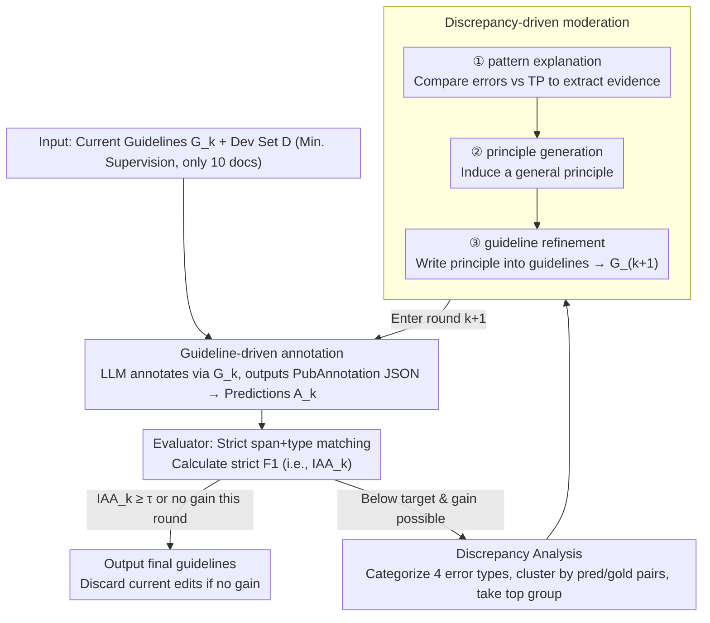

# Refining and Reusing Annotation Guidelines for LLM Annotation

**Conference**: ACL2026  
**arXiv**: [2605.20809](https://arxiv.org/abs/2605.20809)  
**Code**: https://github.com/KonWooKim/llm-guideline-moderation  
**Area**: Biomedical NLP / LLM Annotation / Annotation Guidelines  
**Keywords**: Annotation Guidelines, LLM Annotation, Biomedical NER, guideline refinement, moderation  

## TL;DR
This paper transfers the guideline reuse and moderation processes from traditional manual annotation projects to LLM annotation. It demonstrates that explicit annotation guidelines, reasoning-based models, and iterative guideline refinement driven by a small amount of gold discrepancy can significantly improve strict span+type F1 in biomedical NER.

## Background & Motivation
**Background**: Text annotation is the foundation of semantic retrieval, information extraction, and text mining. LLMs perform well on zero-shot or few-shot annotation tasks, but benchmark gold annotations often follow very specific annotation conventions. Especially in biomedical NER, there are strict rules for entity boundaries, types, and gray-area cases.

**Limitations of Prior Work**: Human annotation projects typically use annotation guidelines to constrain annotators. However, when using LLMs for annotation directly, many methods only provide simple task descriptions. While LLMs may possess domain knowledge, they do not necessarily adhere to benchmark details such as minimal spans, entity type boundaries, or conventions for composite entities.

**Key Challenge**: LLMs have strong linguistic and world knowledge, but this knowledge is not necessarily aligned with the specific annotation conventions of a given dataset. To obtain high-quality annotations, it is not enough for the model to "understand medicine"; it must also make decisions according to the specific rules of the gold standard.

**Goal**: To verify three hypotheses: adding original human annotation guidelines improves LLM annotation; reasoning-based models are better suited for guideline-driven annotation than non-reasoning models; and LLMs can iteratively refine guidelines through moderation with minimal gold supervision.

**Key Insight**: The authors simulate "pilot moderation" from the early stages of human annotation projects. The LLM first annotates 10 development documents using existing guidelines. The system performs strict matching between predictions and gold labels to identify dominant error patterns. An LLM moderator then explains the errors, generates principles, and modifies the guidelines.

**Core Idea**: Treat annotation guidelines as an intermediate representation for aligning LLM annotation behavior and use discrepancy patterns to drive guideline refinement, rather than fine-tuning the model directly.

## Method
The proposed method is an iterative closed-loop: an LLM annotator labels documents using the current guidelines; an evaluator uses strict span+type matching to obtain F1 and an error set; a discrepancy analyzer identifies the most frequent error groups; and an LLM moderator updates the guidelines based on the error evidence before entering the next round. If a quality threshold is met, or if a new round of refinement yields no improvement, the process stops and ineffective modifications are discarded.

### Overall Architecture
At round $k$, the input consists of the current guidelines $G_k$ and the development set $D$. The LLM annotator generates predicted annotations $A_k$, and the evaluator compares $A_k$ with gold labels $A_g$ to calculate strict F1. If $IAA_k$ has not reached the threshold and there is room for improvement, all discrepancies are collected. The system categorizes errors into four types—label mismatch, boundary mismatch, false negative, and false positive—using soft overlap and clusters them by predicted/gold label pairs, selecting the most frequent group for moderation. The LLM moderator performs pattern explanation, principle generation, and guideline refinement in sequence to produce $G_{k+1}$.

### Key Designs

**1. Guideline-driven annotation: Explicitly feeding existing guidelines to the LLM**

LLM annotation errors often stem from a lack of alignment with dataset-specific conventions rather than a lack of entity knowledge. Models may not follow gold standards for minimal spans or type boundaries. To address this, the authors inject lightly formatted human guidelines directly into the LLM prompt (beyond simple prompt-only baselines) and require outputs in PubAnnotation JSON format. Evaluation uses strict exact boundary + type matching. Guidelines serve as an alignment carrier, informing the model of specific project rules more directly than few-shot examples.

**2. Discrepancy-driven moderation: Refining guidelines using minimal gold error evidence**

Allowing an LLM to freely modify guidelines often leads to divergence. This approach constrains modifications using specific error evidence: the system performs soft matching between predictions and gold labels, categorizes dominant error patterns, and tasks the LLM moderator with three steps: explaining the linguistic context of the error, inducing a general principle, and inserting/rewriting the principle in the guidelines. For example, on NCBI Disease, if the model misses a "DiseaseClass" in a feature list, the moderator generates a rule: "Clinical conditions acting as dependency feature list items should also be labeled as DiseaseClass." Each refinement targets current failures, resulting in human-readable and reusable rules.

**3. Minimal supervision setting: Simulating early stages with few gold documents**

The goal is to test if LLMs can induce high-level rules from minimal disagreement rather than achieving SOTA via large-scale statistical learning. Supervision is deliberately kept minimal: only 10 documents are randomly sampled from the training set for guideline refinement. Evaluation is conducted on an independent set of 100 documents (from NCBI Disease and BioRED dev splits, or a 100-doc sample from BC5CDR dev split). Because visibility into gold data is low, the stop-and-rollback logic is critical—if a refinement round fails to improve F1, it is immediately stopped and discarded to avoid overfitting on small samples.

### Loss & Training
No models are trained or fine-tuned. The experiment compares three prompting/moderation strategies: Prompt-only, Original-guidelines, and Guideline-refinement. Models include the GPT, Gemini, and DeepSeek families, distinguishing between reasoning and non-reasoning versions: GPT-5 (low/high reasoning effort), Gemini 2.5 Pro (min/max thinking budget), and deepseek-chat vs. deepseek-reasoner. Default hyperparameters are used for all main experiments.

## Key Experimental Results

### Main Results

| Dataset / Model | Prompt-only F1 | Original-guidelines F1 | Moderation F1 | Iterations |
|---------------|----------------|------------------------|---------------|-----------|
| NCBI / GPT-5 | 0.46 | 0.73 (+0.27) | 0.76 (+0.03) | 3 |
| NCBI / Gemini | 0.40 | 0.63 (+0.23) | 0.66 (+0.03) | 5 |
| NCBI / DeepSeek | 0.31 | 0.55 (+0.24) | 0.56 (+0.01) | 2 |
| BC5CDR / GPT | 0.80 | 0.85 (+0.05) | 0.86 (+0.01) | 1 |
| BC5CDR / Gemini | 0.68 | 0.76 (+0.08) | 0.77 (+0.01) | 1 |
| BC5CDR / DeepSeek | 0.58 | 0.64 (+0.06) | 0.65 (+0.01) | 1 |
| BioRED / GPT-5 | 0.74 | 0.76 (+0.02) | 0.82 (+0.06) | 2 |
| BioRED / Gemini | 0.61 | 0.67 (+0.06) | 0.69 (+0.02) | 1 |
| BioRED / DeepSeek | 0.45 | 0.53 (+0.08) | 0.54 (+0.01) | 1 |

### Ablation Study: Reasoning Models

| Dataset | GPT non-reason / reason | Gemini non-reason / reason | DeepSeek non-reason / reason |
|--------|-------------------------|----------------------------|------------------------------|
| NCBI | 0.69 → 0.73 (+0.04) | 0.48 → 0.63 (+0.15) | 0.29 → 0.55 (+0.26) |
| BC5CDR | 0.78 → 0.85 (+0.07) | 0.70 → 0.76 (+0.06) | 0.57 → 0.64 (+0.07) |
| BioRED | 0.72 → 0.76 (+0.04) | 0.66 → 0.67 (+0.01) | 0.43 → 0.53 (+0.10) |

### Key Findings
- Original guidelines provide the largest gain (e.g., NCBI F1 increased from 0.46 to 0.73 for GPT-5).
- Moderation provides smaller but consistent absolute gains (typically +0.01 to +0.03 F1), reaching +0.06 on BioRED/GPT-5.
- Reasoning models outperform non-reasoning counterparts across all families, confirming that applying complex guidelines requires reasoning capabilities.
- GPT-5 is powerful but expensive; DeepSeek is cheap but has high latency and lower performance; Gemini is balanced in cost and stability.

## Highlights & Insights
- The paper addresses a core issue in LLM annotation: errors often stem from a lack of "project rule knowledge" rather than "entity knowledge." Guidelines are more interpretable alignment carriers than few-shot examples.
- The moderation workflow closely mirrors real annotation projects. Instead of black-box optimization of F1, it induces readable rules, allowing for human review and reuse.
- The results are honest: moderation provides consistent positive gains, but the magnitude is modest, suggesting that while small gold samples can identify rule gaps, they cannot cover all long-tail ambiguities.

## Limitations & Future Work
- Using only 10 development documents makes the process sensitive to sample selection; dominant error patterns in the sample may not reflect the entire dataset.
- Stopping criteria rely on IAA/F1 changes over small samples, which can be statistically unstable, potentially leading to premature stopping or retention of rules effective only by chance.
- Moderation handles only the most frequent discrepancy group per round, potentially ignoring multiple mid-frequency but important error types.
- Future work could involve human experts auditing LLM-generated guideline edits, creating a semi-automated moderation loop.

## Related Work & Insights
- **vs. Direct LLM Annotation**: Prompt-only methods rely on pre-existing knowledge and frequently drift from gold conventions; guideline prompts make project rules explicit.
- **vs. Few-shot Annotation**: Few-shot provides examples but not necessarily logical rules; guideline refinement produces readable and reusable text.
- **vs. Manual Moderation**: Human moderation is reliable but costly; LLM moderation can serve as an early-stage draft generator to help experts identify rule gaps.
- **Insight**: For high-requirement annotation tasks, maintaining an "LLM-readable and human-auditable" guideline is more sustainable than just tuning prompts or adding examples.

## Rating
- Novelty: ⭐⭐⭐⭐☆ Formalizing annotation moderation for LLMs is highly practical.
- Experimental Thoroughness: ⭐⭐⭐⭐☆ Covers three datasets and multiple model families, though cross-task generalization needs more verification.
- Writing Quality: ⭐⭐⭐⭐☆ Clear hypotheses, complete experimental design, and thorough limitation discussion.
- Value: ⭐⭐⭐⭐⭐ Highly valuable for building auditable and reusable LLM annotation pipelines, particularly in specialized domains.

<!-- RELATED:START -->

## Related Papers

- [\[ACL 2026\] DiZiNER: Disagreement-guided Instruction Refinement via Pilot Annotation Simulation for Zero-shot Named Entity Recognition](diziner_disagreement-guided_instruction_refinement_via_pilot_annotation_simulati.md)
- [\[ACL 2026\] HCRE: LLM-based Hierarchical Classification for Cross-Document Relation Extraction](hcre_llm-based_hierarchical_classification_for_cross-document_relation_extractio.md)
- [\[ACL 2026\] LLM-Guided Semantic Bootstrapping for Interpretable Text Classification with Tsetlin Machines](llm-guided_semantic_bootstrapping_for_interpretable_text_classification_with_tse.md)
- [\[NeurIPS 2025\] Planning without Search: Refining Frontier LLMs with Offline Goal-Conditioned RL](../../NeurIPS2025/nlp_understanding/planning_without_search_refining_frontier_llms_with_offline_goal-conditioned_rl.md)
- [\[ECCV 2024\] SLIMER: Show Less, Instruct More - Enriching Prompts with Definitions and Guidelines for Zero-Shot NER](../../ECCV2024/nlp_understanding/slimer_zero_shot_ner.md)

<!-- RELATED:END -->
