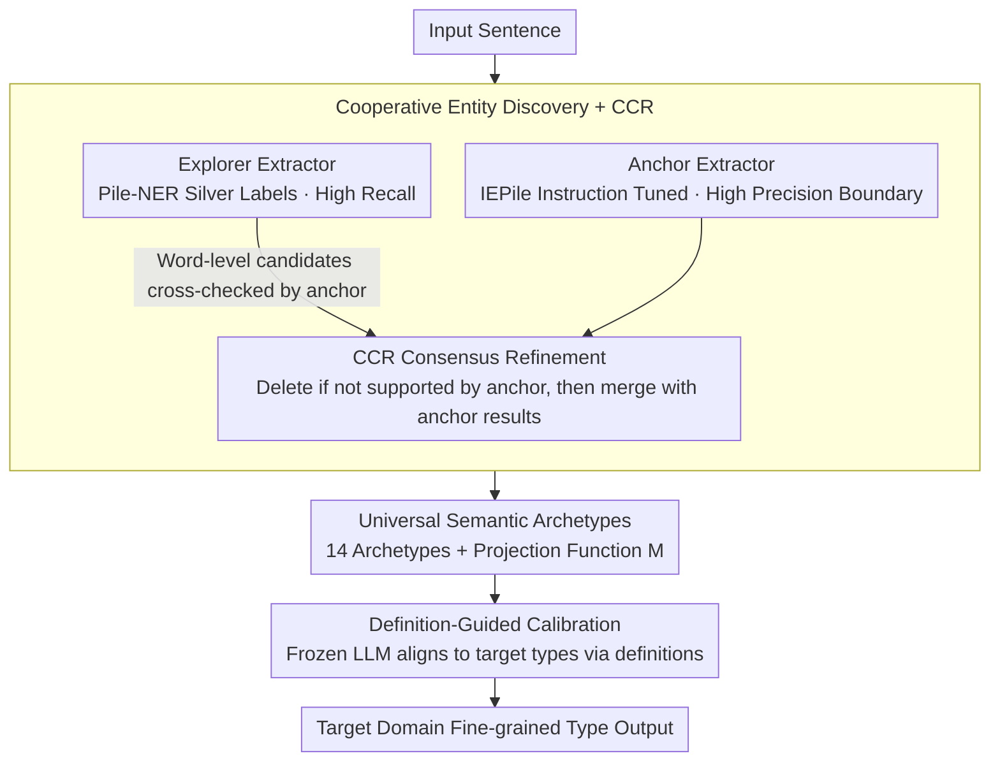

# SAM-NER: Semantic Archetype Mediation for Zero-Shot Named Entity Recognition

**Conference**: ACL2026 Findings  
**arXiv**: [2605.03706](https://arxiv.org/abs/2605.03706)  
**Code**: https://github.com/DMIRLAB-Group/SAM-NER  
**Area**: Named Entity Recognition / Zero-Shot Information Extraction / LLM NLP  
**Keywords**: Zero-Shot NER, Semantic Archetypes, Cross-Domain Transfer, Definition Calibration, Entity Discovery

## TL;DR
SAM-NER utilizes a three-stage mediation framework consisting of "Entity Discovery → 14 Universal Semantic Archetypes → Target Type Definition Calibration" to alleviate schema drift in zero-shot NER, achieving an average micro-F1 of 66.3 on CrossNER, surpassing several strong baselines.

## Background & Motivation
**Background**: Zero-shot NER aims to enable models to extract entities based on target type names or definitions without target-domain annotations. Recently, LLM-based methods often improve cross-domain generalization through instruction tuning, type definitions, structured code constraints, or retrieval augmented generation.

**Limitations of Prior Work**: Target domain schemas often contain fine-grained, semantically close, or domain-specific types. Mapping entity mentions directly to target types requires the internal semantic organization of the LLM to align perfectly with human definitions; when labels are novel, definitions overlap, or external knowledge is sparse, models are prone to semantic drift.

**Key Challenge**: NER requires sufficiently fine-grained target type differentiation, but zero-shot generalization requires a stable type space. Predicting fine-grained types directly leads to large cross-domain shifts, while performing only coarse-grained entity extraction fails to meet the fine-grained requirements of the target task.

**Goal**: The authors aim to construct a cross-domain stable intermediate semantic space that decouples entity span discovery, universal semantic understanding, and target type grounding, without relying on target-domain supervision or external knowledge bases.

**Key Insight**: The paper proposes Semantic Archetype Mediation: distilling a large number of heterogeneous NER labels into 14 universal semantic archetypes, such as Person, Organization, Medicine, Science, etc. The model first determines which archetype an entity belongs to, and then performs refined calibration based on target type definitions.

**Core Idea**: Instead of forcing the LLM to bridge the semantic gap from "entity mention → target fine-grained type" in one step, it first maps to a stable universal archetype and then uses definition constraints to map the archetype to the target schema.

## Method

### Overall Architecture
SAM-NER is a progressive mediation pipeline. The first stage, Entity Discovery, is responsible for finding high-coverage and high-quality candidate entity spans in the input sentence; the second stage, Abstract Mediation, projects candidate spans into the universal semantic archetype space; the third stage, Definition-Guided Semantic Calibration, uses a frozen LLM to parse archetype-level predictions into target domain types based on archetype definitions and target type definitions.

The key to this design is decoupling: span boundaries are resolved by dual-extractor collaboration, cross-domain semantic stability is provided by the archetype classifier, and fine-grained type attribution is handled by definition alignment. Each step reduces the search space and semantic uncertainty for the next step.

### Key Designs

**1. Cooperative Entity Discovery with CCR: Using dual-extractor division of labor to "achieve long-tail recall while avoiding generalization noise"**

A single extractor in a zero-shot target domain struggle to balance boundaries and recall—instruction-tuned models have precise boundaries but miss long-tail entities, while silver-label models have high recall but often mistake general functional words for entities. SAM-NER assigns roles: Anchor Extractor is a Llama3-8B fine-tuned on high-quality IEPile IE instructions for high-precision boundaries; Explorer Extractor is trained on Pile-NER silver labels for broad, high-recall discovery. The key is the merging process: Collaborative Consensus Refinement (CCR) takes the word-level candidates most prone to noise from the explorer and submits them to the anchor for review. If the anchor does not independently support the span, it is removed. Finally, anchor results are merged with the denoised explorer results. Thus, the silver-label model only expands coverage, while the instruction model acts as a semantic filter, converging high recall into reliable candidates—removing CCR causes a 7.4-point drop in the AI domain, proving this consensus prunes noise.

**2. Universal Semantic Archetypes: Distilling heterogeneous labels into 14 stable archetypes to provide a non-drifting anchor for cross-domain transfer**

The biggest pain point in zero-shot NER is the vast difference in target domain schemas. Directly jumping from entity mention to fine-grained target types results in significant schema drift. The solution is an intermediate layer: distilling heterogeneous labels from the IEPile NER subset to construct 14 universal semantic archetypes (Person, Organization, Medicine, Science, etc.), and defining a deterministic projection function $M:T_{orig}\rightarrow A$ to map original labels to archetypes. During training, mentions are marked with `<ENT>`, and original fine-grained labels are converted to archetype-level supervision via $M$; during inference, the classifier only needs to predict the abstract type among these 14 archetypes. The count of 14 is not arbitrary—clustering analysis showed k=14 offers the best trade-off between Silhouette and Gap Statistics; k=24 is finer but more prone to coupling domain noise. This mediation layer significantly reduces uncertainty in "target type judgment," effectively assigning entities to stable semantic parents before handling fine-grained membership.

**3. Definition-Guided Semantic Calibration: Mapping archetypes back to target types via definition alignment to avoid confusion by similar label names**

Archetype prediction is insufficient; the final output must be target domain types. If an LLM predicts target labels directly, similar label names (e.g., Politician vs. Person) can cause confusion. SAM-NER employs "definition alignment": preparing clear, mutually exclusive canonical definitions for each abstract archetype and applying lightweight normalization to target domain type definitions. A frozen LLM acts as a calibrator, selecting the most compatible target type under the triple constraint of sentence context + predicted archetype definition + candidate target type definitions. Since the archetype prior has already narrowed the reasoning space, target type selection shifts from "open-ended label guessing" to "alignment judgment among a few candidate definitions," requiring no target-domain training data. This step is critical—removing calibration results in drops of 9.7/12.6/12.6/11.0 points in AI/Literature/Music/Science respectively.

### Loss & Training
The Anchor Extractor uses Llama3-8B LoRA weights provided by IEPile; the Explorer Extractor and Archetype Classifier are trained via supervised instruction tuning with LoRA rank 8 and alpha 16. In the Qwen2.5-7B setup, the anchor still uses Llama3 weights, while Qwen is used for the explorer, classifier, and calibrator. Training data includes approximately 13K entity types and 240K entity instances from Pile-NER, along with the IEPile NER subset; experiments were completed on three RTX 3090s using LlamaFactory.

## Key Experimental Results

### Main Results

Experiments used CrossNER, covering five cross-domain zero-shot scenarios: AI, Literature, Music, Politics, and Science, with micro-F1 as the metric.

| Method | Params / Backbone | AI | Literature | Music | Politics | Science | Avg. |
| :--- | :--- | :--- | :--- | :--- | :--- | :--- | :--- |
| UniNER | 13B / LLaMA | 54.2 | 60.9 | 64.5 | 61.4 | 63.5 | 60.9 |
| KnowCoder | 7B / LLaMA2 | 60.3 | 61.1 | 70.0 | 72.2 | 59.1 | 64.5 |
| GLiNER-Large | 0.3B / DeBERTa-v3 | 57.2 | 64.4 | 69.6 | 72.6 | 62.6 | 65.3 |
| GUIDEX | 8B / LLaMA3.1 | 62.4 | 63.8 | 67.9 | 69.6 | 64.6 | 65.7 |
| SAM-NER(Qwen2.5-7B) | 7B / Qwen2.5 | 57.9 | 64.1 | 69.3 | 66.7 | 62.1 | 64.3 |
| SAM-NER(Llama3-8B) | 8B / LLaMA3 | 58.2 | 68.7 | 71.2 | 68.2 | 65.1 | 66.3 |

### Ablation Study

| Configuration | AI | Literature | Music | Politics | Science | Description |
| :--- | :--- | :--- | :--- | :--- | :--- | :--- |
| Full SAM-NER | 58.2 | 68.7 | 71.2 | 68.2 | 65.1 | Full 3-stage |
| w/o explorer | 53.0 | 64.6 | 65.3 | 63.6 | 61.4 | Insufficient recall, drops in all domains |
| w/o anchor | 54.1 | 61.9 | 66.1 | 61.9 | 58.8 | Increased noisy spans, more significant drop |
| w/o calibration | 48.5 | 56.1 | 58.6 | 63.7 | 54.1 | Largest average loss without definition calibration |
| w/o CCR | 50.8 | 65.3 | 67.2 | 65.5 | 60.9 | Merging extractors alone retains silver noise |
| w/ CCR | 58.2 | 68.7 | 71.2 | 68.2 | 65.1 | 7.4 point gain in AI domain |

### Key Findings
- The Llama3-8B version achieves an average of 66.3, surpassing GUIDEX (65.7) and achieving SOTA results in Literature, Music, and Science; Literature is 4.3 points higher than the runner-up.
- Definition-guided calibration is one of the most critical modules; removing it leads to drops of 9.7, 12.6, 12.6, and 11.0 in AI, Literature, Music, and Science respectively, showing that jumping directly from training labels to target types is heavily impacted by schema drift.
- CCR gains come from precision recovery: the explorer often mistakes functional words for entities, which the anchor consensus prunes while maintaining long-tail entity coverage.
- The choice of 14 archetypes comes from clustering: k=14 strikes a balance between Silhouette and Gap Statistics; k=24 might capture finer semantics but couples more domain noise.
- Complexity analysis shows the full model takes 7247s with 1GPU × 29.53GB for an average of 66.3; w/o calibration is faster and uses only 17.78GB but drops to 56.2.

## Highlights & Insights
- The core insight is that "zero-shot NER errors are not just extraction errors, but type semantic alignment errors." The semantic archetype layer explicitly decouples this problem, making the method more interpretable.
- Roles of Anchor and Explorer are well-defined: one provides high-precision validation, the other provides high-recall candidates, and CCR converts their complementarity into physical gains.
- Definition calibration does not require target-domain training data; instead, it uses human-readable definitions for constrained reasoning, meeting real-world zero-shot requirements.
- The number of archetypes is not arbitrary; the paper uses clustering structures to explain why 14 is more stable than finer sets like 21/24, making the intermediate space more credible.

## Limitations & Future Work
- The 14 archetypes are derived from IEPile, and their coverage and granularity are limited by the source data; they do not constitute a complete ontology and may be too coarse for specialized fields like medicine, law, or material science.
- Final calibration depends on the quality of target type definitions. If definitions are too short, overlapping, or inconsistent, the alignment judgment of the frozen LLM may become unstable.
- The method involves multiple LLM modules, resulting in higher time and VRAM costs than simplified versions, requiring consideration for latency and cost in online deployment.
- In the Qwen setup, the anchor still relies on Llama3's IEPile LoRA weights; fully independent verification across model families is not yet complete.
- Experiments focused on CrossNER; future work should validate the generalization of the archetype space across more languages, low-resource vertical domains, and diverse annotation standards.

## Related Work & Insights
- **vs UniNER / IEPile**: These methods emphasize extraction power from large-scale instruction data; SAM-NER adds a semantic mediation layer on top to handle cross-domain type drift.
- **vs KnowCoder**: KnowCoder uses structured code to represent schema constraints; SAM-NER uses universal archetypes and definition alignment for semantic constraints. The former focuses on structure, the latter on ontology mediation.
- **vs GLiNER**: GLiNER is lightweight and strong in the Politics domain, but SAM-NER is better suited for scenarios with complex target type semantics and obvious cross-domain shifts.
- **vs GUIDEX / IRRA**: GUIDEX and IRRA rely on type definitions or retrieved knowledge; SAM-NER does not directly rely on external knowledge but first reduces target definition difficulty through abstract archetypes.
- **Insight**: For zero-shot extraction tasks, "target labels" can be decomposed into stable intermediate concepts and task-specific terminal concepts. This strategy is also applicable to event extraction, relation extraction, and multi-label document classification.

## Rating
- Novelty: ⭐⭐⭐⭐☆ Semantic archetype mediation is inspiring for ZS-NER, though module combinations follow common LLM extraction and definition reasoning paradigms.
- Experimental Thoroughness: ⭐⭐⭐⭐☆ CrossNER main experiments and multi-module ablations are solid; cross-dataset and cross-lingual validation can be further extended.
- Writing Quality: ⭐⭐⭐⭐☆ The three-stage narrative is clear, with sufficient explanation of archetype design and ablations.
- Value: ⭐⭐⭐⭐☆ Highly practical for cross-domain info extraction, especially for business scenarios where target schemas change frequently.

<!-- RELATED:START -->

## Related Papers

- [\[ACL 2026\] DiZiNER: Disagreement-guided Instruction Refinement via Pilot Annotation Simulation for Zero-shot Named Entity Recognition](diziner_disagreement-guided_instruction_refinement_via_pilot_annotation_simulati.md)
- [\[ECCV 2024\] SLIMER: Show Less, Instruct More - Enriching Prompts with Definitions and Guidelines for Zero-Shot NER](../../ECCV2024/nlp_understanding/slimer_zero_shot_ner.md)
- [\[ACL 2026\] Accurate and Efficient Statistical Testing for Word Semantic Breadth](accurate_and_efficient_statistical_testing_for_word_semantic_breadth.md)
- [\[ACL 2026\] Semantic Reranking at Inference Time for Hard Examples in Rhetorical Role Labeling](semantic_reranking_at_inference_time_for_hard_examples_in_rhetorical_role_labeli.md)
- [\[ACL 2026\] LLM-Guided Semantic Bootstrapping for Interpretable Text Classification with Tsetlin Machines](llm-guided_semantic_bootstrapping_for_interpretable_text_classification_with_tse.md)

<!-- RELATED:END -->
