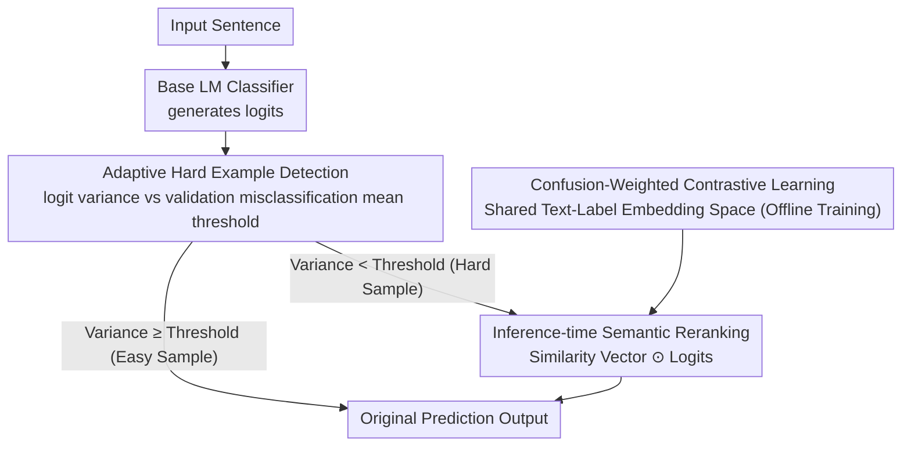

# Semantic Reranking at Inference Time for Hard Examples in Rhetorical Role Labeling

**Conference**: ACL 2026  
**arXiv**: [2605.18007](https://arxiv.org/abs/2605.18007)  
**Code**: [GitHub](https://github.com/AnasBelfathi/rise-framework)  
**Area**: Medical Imaging  
**Keywords**: Rhetorical Role Labeling, Inference-time Reranking, Label Semantics, Contrastive Learning, Hard Examples

## TL;DR
This paper proposes RiSE, an inference-time semantic reranking framework that automatically identifies low-confidence hard examples and utilizes label semantic representations obtained from contrastive learning to rerank model outputs. It achieves an average gain of +9.15 macro-F1 on hard examples across eight Rhetorical Role Labeling datasets.

## Background & Motivation
**Background**: Rhetorical Role Labeling (RRL) assigns functional roles to each sentence in a document and is widely applied in legal, medical, and scientific domains. Language models perform well on average but remain unreliable on hard examples.

**Limitations of Prior Work**: (1) Existing methods treat labels as discrete identifiers, ignoring the semantic information encoded in the label names; (2) The handling of hard examples (low-confidence predictions) is usually implicit and lacks a dedicated mechanism; (3) Labels with semantic proximity are easily confused; the gap between Top-1 and Top-3 macro-F1 indicates that correct labels are often ranked highly but not selected.

**Key Challenge**: Standard classifiers use one-hot vectors to represent labels, failing to utilize semantic relationships between labels; whereas pure similarity-based methods leverage label semantics but lose the discriminative power of the classifier.

**Goal**: Design an inference-time method that utilizes label semantics to improve predictions on hard examples while maintaining the discriminative behavior of the classifier.

**Key Insight**: Intervene at inference time—automatically detect low-confidence samples and re-weight classifier logits using text-label semantic similarity derived from contrastive learning.

**Core Idea**: Confusion-weighted contrastive learning + adaptive hard example detection + logit semantic reranking = inference-time hard example repair without retraining.

## Method

### Overall Architecture
RiSE operates at inference time: it first generates logits for an input sentence using a base classifier; then, it automatically identifies hard examples based on logit variance. For hard examples, it calculates semantic similarity using text-label representations from contrastive learning and reranks the logits via element-wise multiplication. Easy samples use the original output directly. The shared text-label embedding space is pre-trained offline via confusion-weighted contrastive learning for querying during the reranking stage.

### Key Designs

**1. Adaptive Hard Example Detection: Automatically identifying uncertainty where "label competition is intense" using logit variance**

In existing methods, the processing of hard examples is often implicit and lacks specific mechanisms. RiSE aims to accurately identify these samples first before intervention. Instead of entropy, it directly calculates the variance of the classifier's logit vector as a confidence metric—low variance implies scores for multiple labels are clustered together, indicating strong label competition and a high likelihood of error. The threshold is adaptive, set to the mean logit variance of misclassified samples on the validation set $\sigma^2_{\text{mis}} = \frac{1}{|\mathcal{M}|} \sum_{i \in \mathcal{M}} \text{Var}(\mathbf{z}_i)$. Samples with variance below this value are classified as hard. Variance is used instead of entropy because it directly characterizes score dispersion in the original decision space and is less sensitive to whether logits are calibrated, making it adaptable to different model and dataset combinations.

**2. Confusion-Weighted Contrastive Learning: Forcing the label embedding space to specifically learn to distinguish the label pairs most confused by the model**

Existing methods treat labels as discrete identifiers, losing the semantic information in label names, while pure semantic similarity loses the classifier's discriminative power. RiSE learns a shared text-label embedding space shaped by the classifier's confusion behavior on the validation set. It calculates label affinity weights $w_{y'} = P(y, y')$ (normalized label confusion probabilities) and injects them into a weighted InfoNCE loss $\mathcal{L}_{\text{CW}}$ (Confusion-Weighted). Negative pairs with higher confusion probabilities receive larger weights, forcing the model to work harder to separate semantically similar labels. Since label confusion is domain-specific (e.g., "Analysis" and "Argument" are confused in legal contexts), weighting by confusion probability is more targeted than uniform weighting across all negative samples.

**3. Inference-time Semantic Reranking: Multiplying semantic similarity into logits only for hard examples to fix errors without harming easy samples**

The gap between Top-1 and Top-3 macro-F1 suggests that correct labels are often ranked highly but not chosen. The final step integrates label semantic signals back into the classifier output. For each hard example $x$, the cosine similarity vector $\mathbf{s}_x \in \mathbb{R}^C$ between the input embedding $\mathbf{e}_x$ and each label embedding $\mathbf{e}_y$ is computed, then multiplied element-wise with the original logits to complete the reranking:

$$\tilde{\mathbf{z}}_x = \mathbf{s}_x \odot \mathbf{z}_x$$

Easy samples are output as-is. Element-wise multiplication cleanly blends discriminative signals (logits) with semantic signals (similarity). The "hard examples only" design preserves the classifier's reliable discriminative ability on simple samples. The entire process is plug-and-play and requires no retraining.

## Key Experimental Results

### Main Results (7 LMs × 8 Datasets, mean macro-F1 / weighted-F1)

| Model | Baseline mF1 | + RiSE mF1 | Baseline wF1 | + RiSE wF1 |
|------|-------------|-----------|-------------|-----------|
| LLaMA-3-8B | 67.98 | **68.51†** | 74.88 | **75.65†** |
| Mistral-7B | 67.66 | **69.50†** | 74.61 | **75.75†** |
| Qwen3-8B | 67.59 | **68.82†** | 74.28 | **75.23†** |
| ALBERT-base | 66.45 | **66.99** | 72.98 | **73.39** |
| BERT-base | 66.17 | **67.25†** | 73.49 | **73.86** |
| DeBERTa-base | 68.02 | **68.50** | 74.44 | **74.86** |
| RoBERTa-base | 67.21 | **68.11†** | 74.24 | **74.77** |

### Gain on Hard Examples (Average across models and datasets)

| Metric | Improvement |
|------|---------|
| Hard Example macro-F1 | **+9.15** |
| Full Set macro-F1 | +0.5 ~ +1.8 |

### Key Findings
- RiSE improves macro-F1 by an average of +9.15 on hard examples while maintaining or slightly improving performance on the full dataset.
- It is consistently effective across 7 models (including encoder and causal architectures) and 8 datasets (Legal/Medical/Scientific), demonstrating strong generalization.
- The Cohen's κ between manual difficulty labels and model difficulty is 0.40 (moderate agreement), indicating that model-perceived difficulty and human-perceived difficulty overlap but are not identical.
- Absolute gains for causal LMs (LLaMA-3/Mistral/Qwen3) are slightly larger than for encoder models, possibly because causal LMs are more prone to label confusion.

## Highlights & Insights
- Zero-cost inference-time intervention: A universal plug-and-play framework that requires no model modification, no retraining, and no architectural changes.
- Confusion-weighted contrastive learning cleverly utilizes the classifier's own error patterns to guide label semantic learning—learning from failure.
- Variance as a difficulty metric is simple yet effective, outperforming alternatives like entropy.
- The introduction of manual difficulty labeling provides an interpretability perspective for understanding model behavior.

## Limitations & Future Work
- The label semantic embedder requires training a contrastive model on each dataset using training data; while lightweight, it is not entirely zero-overhead.
- The variance threshold relies on misclassification statistics from the validation set, which may be unstable under extreme class imbalance.
- The element-wise multiplication fusion method is relatively simple and may miss more complex signal interactions.
- Validated only on sentence-level classification tasks; applicability to token-level or finer-grained labeling remains to be explored.

## Related Work & Insights
- HiCuLR handles hard examples via curriculum learning during training, while RiSE handles them at inference time—the two are complementary.
- Label semantics are widely used in zero-shot/few-shot text classification; applying them to inference-time hard example repair is a novel perspective.
- The idea of combining contrastive learning with confusion matrix weighting can be extended to post-processing improvements in other multi-class classification tasks.
- Inference-time intervention paradigms (such as self-consistency, reranking, etc.) are increasingly important in the LLM era.

## Rating
- Novelty: ⭐⭐⭐⭐ Utilizing confusion-weighted label semantic reranking at inference time is a clear and novel contribution.
- Experimental Thoroughness: ⭐⭐⭐⭐⭐ 7 models × 8 datasets × 3 domains + manual annotation analysis.
- Writing Quality: ⭐⭐⭐⭐ Clear problem definition with coherent methodological motivation and design logic.
- Value: ⭐⭐⭐⭐ A highly practical, plug-and-play universal framework.

<!-- RELATED:START -->

## Related Papers

- [\[ACL 2026\] It's High Time: A Survey of Temporal Question Answering](it39s_high_time_a_survey_of_temporal_question_answering.md)
- [\[ACL 2026\] Filling the Gap: Is Commonsense Knowledge Generation useful for Natural Language Inference?](filling_the_gap_is_commonsense_knowledge_generation_useful_for_natural_language_.md)
- [\[ACL 2026\] Test-Time Reasoners Are Strategic Multiple-Choice Test-Takers](test-time_reasoners_are_strategic_multiple-choice_test-takers.md)
- [\[ACL 2026\] Accurate and Efficient Statistical Testing for Word Semantic Breadth](accurate_and_efficient_statistical_testing_for_word_semantic_breadth.md)
- [\[ACL 2026\] LLM-Guided Semantic Bootstrapping for Interpretable Text Classification with Tsetlin Machines](llm-guided_semantic_bootstrapping_for_interpretable_text_classification_with_tse.md)

<!-- RELATED:END -->
