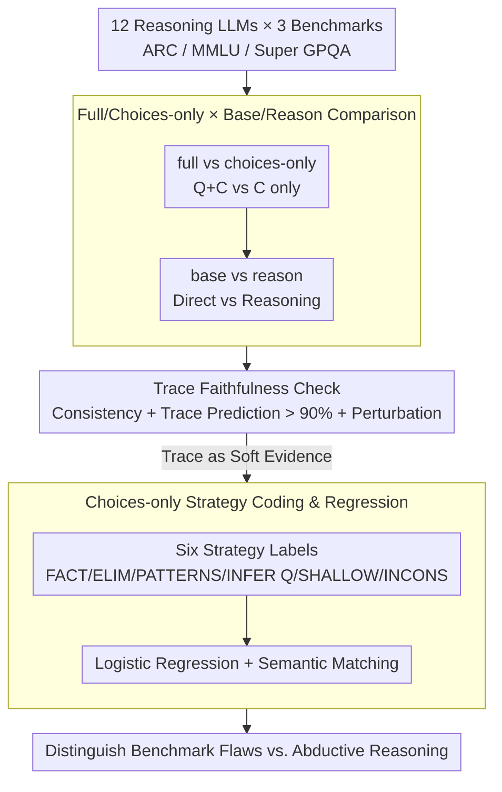

# Test-Time Reasoners Are Strategic Multiple-Choice Test-Takers

**Conference**: ACL2026  
**arXiv**: [2510.07761](https://arxiv.org/abs/2510.07761)  
**Code**: https://github.com/nbalepur/mcqa-shortcuts  
**Area**: NLP Understanding / LLM Evaluation  
**Keywords**: Multiple-Choice Evaluation, Test-Time Reasoning, partial-input, choices-only, Reasoning Traces

## TL;DR
This paper systematically compares 12 reasoning LLMs on full multiple-choice questions (MCQs) versus choices-only MCQs. It finds that test-time reasoning (TTR) indeed allows models to perform above chance in choices-only scenarios. However, reasoning traces reveal that this is not entirely shallow cheating but includes "strategic test-taking" behaviors such as inferring missing questions, eliminating incorrect options, and invoking factual knowledge.

## Background & Motivation
**Background**: Multiple-choice questions remain one of the most commonly used formats in LLM evaluation, with benchmarks like ARC, MMLU, and Super GPQA relying on the "question + options + single correct answer" format. With the rise of reasoning models, models no longer simply output an option but generate long reasoning traces at test time before providing a final answer.

**Limitations of Prior Work**: Previous partial-input research found that models can significantly exceed random chance on MCQs even without seeing the question. This is usually interpreted as the presence of dataset artifacts or models exploiting shallow cues like "longest option," "most specific option," or "unique numerical format." However, these conclusions primarily stem from non-reasoning models or simple perturbation experiments, making it difficult to determine whether models are speculating or using options to infer the question.

**Key Challenge**: Success in choices-only scenarios may expose benchmark writing flaws on one hand, but on the other, it may reflect a legitimate form of partial-information reasoning. For example, a student who forgets the question text might still increase their hit rate by eliminating obviously wrong items, identifying option categories, or guessing the intent of the original question. Labeling all partial-input success as "cheating" may ignore these non-shallow abilities; ignoring it entirely allows genuine option artifacts to persist.

**Goal**: The authors aim to answer two questions: Does test-time reasoning amplify choices-only success? If a model answers correctly while only seeing options, what strategies does its reasoning trace utilize, and do these strategies necessarily indicate a problem with the benchmark or the model?

**Key Insight**: Instead of viewing choices-only accuracy as a single metric, this paper combines two axes—full/choices-only and base/reason—and further performs manual coding of choices-only reasoning traces. This allows the quantification of TTR's impact and decomposes "correct answers" into different mechanisms such as shallow cues, factual recall, elimination, option pattern recognition, and inferring the missing problem.

**Core Idea**: Treat reasoning traces as soft evidence to distinguish between harmful MCQ artifacts and less harmful strategic partial-information reasoning, rather than using a single choices-only accuracy figure to declare a benchmark invalid.

## Method

### Overall Architecture
The paper does not train new models but performs controlled evaluations of 12 existing reasoning LLMs on three multiple-choice benchmarks of increasing difficulty: ARC, MMLU, and Super GPQA. Each question consists of a stem $q$, a set of choices $C$, and a correct answer $a$. The authors decompose the evaluation into two orthogonal axes: input condition (full, given $q$ and $C$, vs. choices-only, given only $C$ and asking the model to "use any strategy necessary") and prompt mode (base, selecting directly, vs. reason, generating step-by-step reasoning). After running the same questions under these four combinations, the authors conduct faithfulness checks and manual strategy coding on choices-only traces to categorize success into shallow cheating or legitimate partial-information reasoning.

### Key Designs

**1. Full / Choices-only × Base / Reason Two-Dimensional Comparison**
Measuring only choices-only accuracy cannot determine if reasoning models "cheat" more, as it conflates normal answering ability, partial-input ability, and TTR gains. By running the same model/question across four quadrants, the authors can isolate effects: if reason only improves full but not choices-only, reasoning relies on the stem $q$; if choices-only reason also increases significantly, reasoning enhances option-level strategies. Models include Gemini 1.5 Lite/Flash/Pro, GPT-4o Mini/GPT-4o/o1, Claude Haiku/Sonnet, Cohere Command R/R+, DeepSeek-V3, and Qwen2.5-72B-Instruct.

**2. Reasoning Trace Faithfulness Check**
CoT is not always a true causal explanation. If a trace cannot support the model's own answer, it is useless for strategy analysis. The authors perform three faithfulness sanity checks: first, whether the model maintains the same answer after TTR; second, using GPT-4o to predict the final choice based solely on the trace (achieving >90% accuracy); and third, human-introduced perturbations (repetitive, synonymous, or nonsensical options) to see if the trace explicitly mentions these changes. Passing these allows the trace to be treated as "informative soft evidence."

**3. Choices-only Strategy Coding & Regression Analysis**
The meaning of a partial-input success depends on the strategy: guessing based on "1.5 looks like a messy number" is a benchmark flaw, but guessing correctly by inferring "the question might be about renewable resources" is abductive reasoning. The authors sampled 180 traces from ARC and MMLU across Gemini Pro, Claude Sonnet, and Qwen-Instruct for qualitative coding into six labels: FACT (factual recall), ELIM (elimination), PATTERNS (category recognition), INFER Q (inferring the stem), SHALLOW (surface cues), and INCONS (self-contradiction). Logistic regression then determines which strategies predict success.

### Loss & Training
No new models were trained. All experiments are zero-shot evaluations with temperature $1.0$ and a max output of $8192$ tokens. Appendix experiments using Qwen-2.5 Instruct 3B compared SFT (optimizing answers) and GRPO (rewarding traces leading to correct answers); both led to above-random performance in choices-only, but GRPO did not provide a massive advantage in choices-only as it did in the full setting.

## Key Experimental Results

### Main Results
Test-time reasoning helps full MCQA significantly more than choices-only. Across 36 model-dataset combinations, TTR improved accuracy in the full setting for 25/36 cases, whereas it only improved choices-only performance in 15/36 cases.

| Key Question | Key Result | Interpretation |
|----------|----------|------|
| Does TTR improve full MCQA? | Significant improvement in 25/36 combinations. | Reasoning is generally helpful in standard MCQA. |
| Does TTR improve choices-only? | Improvement in 15/36 combinations. | Reasoning enhances partial-information guessing, but less than full info. |
| Is choices-only above random? | All LLMs significantly exceeded random chance. | Models exploit option info or infer questions. |
| Is reasoning length key? | Higher effort levels increased trace length but only slightly changed accuracy. | Longer thinking $\neq$ stronger partial-input success. |
| Are traces faithful? | Accuracy of predicting options from traces exceeded 90%. | Traces serve as soft evidence for strategy analysis. |

Prompt ablation shows that choices-only success is not an artifact of a specific prompt. Adding an "I don't know" (IDK) option slightly reduces accuracy but models still stay above the 0.25 random baseline.

| Dataset | Model | Choices-only Base | + IDK | Choices-only Reason | Reason + IDK |
|--------|------|-------------------|-------|---------------------|--------------|
| ARC | G-Flash | 0.5010 | 0.4880 | 0.5350 | 0.5075 |
| ARC | GPT-4o Mini | 0.4640 | 0.4273 | 0.5290 | 0.4848 |
| MMLU | G-Flash | 0.4650 | 0.4515 | 0.4530 | 0.4698 |
| MMLU | GPT-4o Mini | 0.4258 | 0.3907 | 0.4920 | 0.4432 |

### Ablation Study
Qualitative coding indicates that choices-only reasoning is not limited to shallow cues. FACT, ELIM, PATTERNS, and INFER Q involve knowledge or high-level reasoning. SHALLOW is the only strategy closely linked to traditional artifacts.

| Strategy | Definition | Harmful? | Observation |
|------|------|--------------|--------------|
| FACT | Recalling facts about options | Not necessarily | Judging if an option is a scientific fact. |
| ELIM | Eliminating wrong choices | Not necessarily | Similar to human partial knowledge guessing. |
| PATTERNS | Identifying category patterns | Target dependent | Can help infer the question or expose poor distractors. |
| INFER Q | Guessing the original question | Mostly not | Semantic match with original question in >75% of successful cases. |
| SHALLOW | Using surface cues (e.g., outliers) | Yes | In ARC, regression coefficient -0.701 (p=0.002), predicts failure. |
| INCONS | Trace contradicts answer | Yes | Less common; negative predictor of success. |

### Key Findings
- Choices-only accuracy alone is insufficient for diagnosis. It stems from both shallow artifacts and legitimate abductive reasoning.
- TTR improves full MCQA more consistently than choices-only, suggesting reasoning models aren't simply "better at cheating."
- Reasoning traces, while not perfectly faithful causal explanations, are informative enough for strategy-level qualitative analysis.
- Benchmark iteration should target specific strategies. If traces show SHALLOW strategies, options should be rewritten for homogeneity; if INFER Q succeeds, the question item itself may still be valid.

## Highlights & Insights
- The transition from "accuracy audit" to "strategy diagnosis" is the most valuable contribution. Success via shallow outliers vs. success via abductive inference carries different implications.
- Utilizing reasoning traces for benchmark item debugging is practical. For instance, identifying a non-kitchen item as an outlier allows specifically rewriting it to eliminate the shortcut.
- The study adopts a robust stance on CoT faithfulness, treating it as "informative soft evidence" rather than a definitive causal chain, which is more operationally useful.

## Limitations & Future Work
- Trace analysis sample size is limited. Qualitative coding focused on a subset of models and benchmarks.
- Focus is limited to English MCQs. Option cues and question-inference may differ across languages or cultures.
- Faithfulness remains a sanity check; models may still rationalize answers with plausible-sounding traces.
- Future work could integrate strategy classifiers with automated MCQ rewriting pipelines to reduce shallow shortcuts systematically.

## Related Work & Insights
- **vs. partial-input baselines**: While traditional studies use partial-input to identify artifacts, this paper shows that success is not a monolith and distinguishes between shallow cues and high-level inference.
- **vs. MCQA benchmark research**: Provides a path to locate poor distractors using reasoning traces rather than just statistical correlations.
- **vs. human test-taking strategy**: Analogizing LLM behavior to human partial-knowledge guessing suggests that strategic test-taking should not be automatically equated with cheating.

## Rating
- Novelty: ⭐⭐⭐⭐☆ Combines TTR, choices-only, and trace coding in an insightful way.
- Experimental Thoroughness: ⭐⭐⭐⭐☆ Covers 12 models and multiple benchmarks, including faithfulness checks.
- Writing Quality: ⭐⭐⭐⭐☆ Clear structure and restrained arguments.
- Value: ⭐⭐⭐⭐⭐ Useful for MCQ evaluation, benchmark refinement, and reasoning trace analysis.

<!-- RELATED:START -->

## Related Papers

- [\[ACL 2026\] It's High Time: A Survey of Temporal Question Answering](it39s_high_time_a_survey_of_temporal_question_answering.md)
- [\[ACL 2026\] Semantic Reranking at Inference Time for Hard Examples in Rhetorical Role Labeling](semantic_reranking_at_inference_time_for_hard_examples_in_rhetorical_role_labeli.md)
- [\[ACL 2026\] Can LLMs Estimate Cognitive Complexity of Reading Comprehension Items?](can_llms_estimate_cognitive_complexity_of_reading_comprehension_items.md)
- [\[ACL 2026\] The Imperfective Paradox in Large Language Models](the_imperfective_paradox_in_large_language_models.md)
- [\[ACL 2026\] ASTRA: Adaptive Semantic Tree Reasoning Architecture for Complex Table Question Answering](astra_adaptive_semantic_tree_reasoning_architecture_for_complex_table_question_a.md)

<!-- RELATED:END -->
