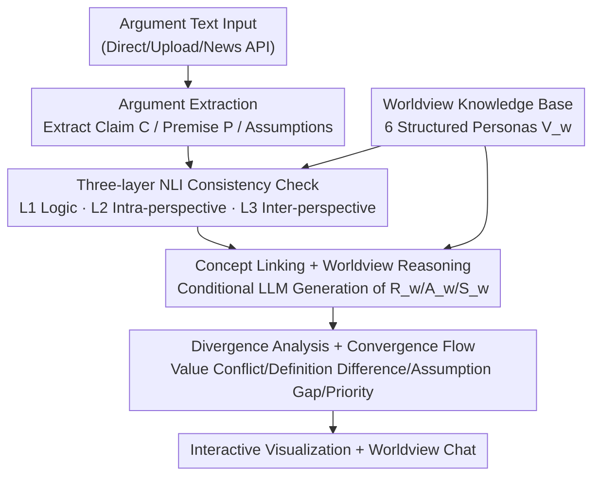

# TruthSplit: Operationalizing Conditional Validity in Arguments Through Multi-Perspective Reasoning

**Conference**: ACL 2026  
**arXiv**: [2606.09251](https://arxiv.org/abs/2606.09251)  
**Code**: https://github.com/unisg-ics-dsnlp/truthsplit (Available)  
**Area**: NLP Understanding / Computational Argumentation / Multi-perspective Reasoning  
**Keywords**: Computational Argumentation, Conditional Validity, Worldview Personas, NLI Consistency, LLM Conditional Reasoning

## TL;DR
TruthSplit is an interactive argument analysis system that formalizes the phenomenon where "the same argument leads to different conclusions under different worldviews" as **conditional validity**. It decomposes text into claims, premises, and assumptions, employs a three-layer NLI check for logic and intra-worldview consistency, and utilizes six structured worldview personas to **conditionalize** LLM reasoning. The system generates interpretations and visualizes sources of divergence for each stance—not by assigning "right/wrong" labels, but by revealing whether disagreements stem from value prioritizations or conceptual definitions.

## Background & Motivation

**Background**: Traditional computational argumentation tools (argument mining) excel at extracting argumentative structures, evaluating quality/persuasiveness, identifying stances, or classifying arguments as "valid" or "fallacious."

**Limitations of Prior Work**: These tools typically assume **universal validity**—that an argument is either objectively right or wrong. However, many real-world disagreements arise not from "faulty reasoning," but from differing value priorities, assumptions about how the world works, and varied definitions of contested concepts like "freedom" or "justice." For instance, regarding Universal Basic Income (UBI): one party opposes it because it "undermines individual responsibility," while another supports it for "providing financial security and environmental benefits." Both look at the same data but reach opposite conclusions. Labeling either as "wrong" misses the core issue.

**Key Challenge**: Argumentation tools often conflate the **premise layer (facts)** with the **normative prior layer (values/assumptions/definitions)**, making it impossible to explain why the same argument holds in worldview A but not in B. The root of divergence lies in normative prior differences rather than factual inconsistencies.

**Goal**: To construct a system capable of (i) systematically analyzing the same argument across multiple perspectives rather than providing a single validity label; (ii) generating explicit reasoning chains conditionalized by worldview personas; and (iii) interactively exposing value conflicts, assumption gaps, and conceptual definition differences.

**Key Insight**: By fixing premises as a cross-perspective "shared factual layer" and only varying the worldview priors, the system can observe how conclusions bifurcate—thereby transforming "the source of disagreement" into a comparable and visualizable computational object.

**Core Idea**: Use **structured worldview personas** to explicitly encode the values, definitions, and decision principles of each ideology. This information is used to conditionalize NLI consistency checks and LLM reasoning, turning "conditional validity" from a philosophical concept into an executable analytical pipeline.

## Method

### Overall Architecture
The system consists of two main components: a **structured worldview knowledge base** (6 ideological personas) and a **six-stage analysis pipeline**. The input is an argumentative text (direct input, file upload, or news fetched via News API), and the output includes "interpretations of the same argument under up to 3 worldviews + divergence analysis + visualization." The core logic is: extract an invariant factual skeleton (Claim $C$, Premise $P$), then allow different worldview priors $V_w$ to conditionalize the reasoning, producing worldview-specific reasoning layers $R_w$, assumption layers $A_w$, and stances $S_w$. Finally, cross-worldview divergence is aggregated. The key lies in "**Fixed Premises, Variable Priors**"—ensuring any conclusion difference is attributed to normative priors rather than facts.

### Key Designs

**1. Structured Worldview Knowledge Base: Turning Ideologies into Computable JSON Personas**

Addressing the limitation that "prior work uses informal prompts or simple stance classification," TruthSplit constructs six representative worldviews based on political philosophy—Libertarian, Religious-Conservative, Ecological Social-Democrat, Populist-Nationalist, Communist, and Neo-Reactionary—validated by experts. Each persona is not a prose description but a JSON object containing **weighted core values, key concept definitions (how the worldview interprets contested terms), assumed principles, decision frameworks, and factor scores across 16 ideological dimensions**. These numeric scores make worldviews "computable," allowing for quantitative cross-perspective comparisons. Sharing a common JSON schema allows new worldviews to be added without modifying the core pipeline—this is the fundamental difference from simply prompting an LLM to "act like a conservative": it is extensible, auditable, and quantifiable.

**2. Three-layer NLI Consistency Check: Decoupling "Logical Validity" from "Perspective-specific Validity"**

Addressing the issue that a single consistency judgment cannot distinguish between "structural flaws" and "value misalignment." The authors use an NLI model pre-trained on MultiNLI for a three-tiered check (the authors emphasize this as a system design choice rather than a standard NLI classification task):

$$\text{L1 (Premise-Claim Logic)} \to \text{L2 (Intra-perspective Consistency)} \to \text{L3 (Inter-perspective Comparison)}$$

-   **Layer 1 — Premise-Claim Logic**: Ignores value judgments; does the premise logically support the conclusion? This layer filters out structural flaws (unrelated arguments, unsupported claims) where further analysis would be futile.
-   **Layer 2 — Intra-perspective Consistency**: Checks if the argument is self-consistent within the principles of a specific worldview persona. A claim may be consistent in one framework but contradictory in another.
-   **Layer 3 — Inter-perspective Comparison**: Determines if there is universal consensus or high divergence across worldviews. High consistency suggests shared values, while high divergence marks fundamental conflicts for deeper analysis.

Taking UBI as an example: L1 checks if "providing a safety net" logically supports "reducing poverty" (high entailment). L2 reveals the split—Social-Democrat finds UBI aligns with collective welfare (high consistency), while Libertarian finds forced redistribution conflicts with property rights (low consistency). L3 confirms this as a fundamental cross-perspective divergence. Thus, "disagreement" is precisely located at L2/L3 rather than L1, proving it arises from normative priors rather than logical errors.

**3. Concept Linking + Worldview-Conditional Reasoning: Grounding the Same Word in Different Meanings**

Contested concepts like "freedom" or "rights" mean different things across worldviews. Each persona includes short contextual definitions for these concepts. For a given input, the system calculates the **cosine similarity between worldview concept definitions and extracted arguments**, selecting the most relevant concepts (e.g., "freedom" as "non-interference" for Libertarians vs. "capability to flourish" for Social-Democrats). Consistency scores, linked concepts, and the full persona are fed into a structured prompt, requiring the LLM to generate—within JSON constraints—interpretations, stances (support/oppose/conditional), reasoning chains, key assumptions, concerns, and alternatives. This standardization ensures outputs are parseable and comparable rather than free-form prose.

**4. Divergence Analysis + Convergence Flow: Categorizing "Why We Disagree" into Four Sources**

Simply stating "they disagree" is uninformative. TruthSplit uses an LLM to categorize and assess the severity of divergence into four types: **Value Conflict** (e.g., Liberty vs. Equality), **Definition Difference** (the same concept interpreted differently, like negative vs. positive rights), **Assumption Gap** (reliance on different empirical or normative assumptions), and **Priority Difference** (shared values, different ranking). The accompanying **Convergence Flow** tracks the chain from "Core Values → Beliefs → Interpretation → Conclusion," marking where perspectives converge or diverge—answering whether they "parted ways at the very beginning or shared values but differed in interpretation." This transforms abstract disagreement into a traceable trajectory.

### Example Walkthrough
Using the UBI argument "UBI provides a financial safety net → will reduce poverty": The extraction phase identifies the claim (reduce poverty) and premise (safety net). L1 determines the premise logically supports the claim (high entailment). Inside the Social-Democrat and Libertarian personas, concept linking grounds "freedom/welfare" differently. L2 yields high consistency for Social-Democrat and low for Libertarian. Worldview reasoning generates "Support (aligns with collective welfare)" vs. "Oppose (violates property rights)." Divergence analysis labels it as **Value Conflict + Definition Difference**, and the Convergence Flow shows they diverged at the "Core Value" step. Users see both interpretations and divergence hotspots on a dashboard and can use "Worldview Chat" to query specific stances.

## Key Experimental Results

### Main Results (Usability and Accessibility)

| Metric | Expert Group | Broader Group |
| :--- | :--- | :--- |
| Ease of Use (1–5) | 4.67 | – |
| Visual Appeal (1–5) | 5.00 | 4.36 |
| Understanding Divergence (1–5) | 4.33 | 4.07 |
| Understanding Options (1–5) | – | 3.47 |
| Argument Extraction Quality (1–10) | – | 6.67 |

Divergence analysis is accessible even to non-experts (4.07/5), indicating no philosophical training is required to understand the comparisons. "Understanding options" (local vs. cloud modes) scored lower (3.47), highlighting a need for interface improvement.

### Worldview Representation Validation and Robustness

| Analysis Task | Result | Implication |
| :--- | :--- | :--- |
| Correlation: factor scores vs. expert importance | $r=0.33$ | Moderate positive correlation |
| Strongest Aligned Worldview | Religious-Conservative / Ecological Social-Democrat ($r=0.46$) | These encodings best match expert intuition |
| Inter-expert Variance | Mean SD 2.01, 39% of cases divergence $\geq 5$ (1–10 scale) | Quantifying ideology has inherent ambiguity |
| LLM Family Robustness | No significant quality difference between Claude/GPT/Gemini/Grok/DeepSeek | Structured prompting standardizes conditional reasoning |

Extraction offers two tiers: a local sequence classification model (~75–80% accuracy, full privacy) and a cloud-based LLM (~95%+ accuracy).

### Key Findings
- Fixing premises while varying priors effectively visualizes "disagreement attribution": users can distinguish whether divergence stems from value ranking or definition differences.
- Structured prompting leads to consistent output quality across different LLM families, suggesting the system's value lies in the persona-prompt structure rather than a specific powerful model.
- Ideological quantification naturally carries high variance (39% of cases saw strong expert disagreement), suggesting factor scores should serve as scaffolds for relative comparison rather than absolute truth.

## Highlights & Insights
- **"Fixed Premises, Variable Priors" is the system's most ingenious design**: It converts vague "stance differences" into attributable computational objects; when premises are fixed, any conclusion difference must originate from normative priors.
- **Three-layer NLI decouples "logical errors" from "value misalignment"**: Using L1 as a threshold for structural flaws before discussing perspectives (L2/L3) provides an operational test for "conditional validity" beyond its conceptual definition.
- **The engineering decision to use a shared JSON schema for worldviews is highly reusable**: Any task requiring "multi-persona conditional reasoning + quantifiable comparison" (e.g., stakeholder requirement analysis, multi-cultural value alignment) can leverage this persona-prompt architecture.

## Limitations & Future Work
- The authors admit that the evaluation measures usability/explainability but **does not validate the "correctness" of reasoning or divergence explanations**; the small sample size (3+52) and self-identified neutral participants mean conclusions should be seen as indicative.
- The 6 worldviews are representative but not exhaustive, and 2/3 of experts felt confused by worldview boundaries—ideological boundaries are inherently fuzzy.
- Moderate correlation between factor scores and expert intuition ($r=0.33$) and high inter-expert variance suggest that quantitative dimensions are subjective; numeric comparisons across worldviews should be handled with caution.
- Future work: Custom worldview builders, educational curriculum integration, and expansion to multi-modal (audio/video) inputs.

## Related Work & Insights
- **vs. Traditional Argument Quality/Fallacy Classification (Wachsmuth et al.; Goffredo et al.)**: These assign a single "right/wrong/fallacious" label. TruthSplit rejects single validity in favor of comparing validity under different priors, explaining "why" there is conflict at the cost of not providing a final verdict.
- **vs. Computational Ideology Analysis (Bamman et al.; Hardisty et al.)**: These focus on **detection and classification** of stances. TruthSplit **generates** worldview-conditional reasoning, turning perspectives from labels into traceable reasoning chains.
- **vs. Interactive Argumentation Systems (ArgueTutor, CoArgue, Xia et al.)**: These serve engagement, persuasion, or training. TruthSplit focuses on **comparative analysis** across ideologies, acting as an analytical/educational tool rather than a decision-making system.

## Rating
- Novelty: ⭐⭐⭐⭐ Operationalizing "conditional validity" into a computational pipeline of fixed premises and variable priors is a fresh perspective.
- Experimental Thoroughness: ⭐⭐⭐ A demo paper; only evaluates usability with a small sample, without validating reasoning correctness.
- Writing Quality: ⭐⭐⭐⭐ The conceptual framework ($C/P/V_w/R_w$) is clear, and the recurring UBI example aids understanding.
- Value: ⭐⭐⭐⭐ The persona-prompt structure is transferable to computational argumentation, education, and value alignment evaluation.

<!-- RELATED:START -->

## Related Papers

- [\[ACL 2026\] Exploring Concreteness Through a Figurative Lens](exploring_concreteness_through_a_figurative_lens.md)
- [\[ACL 2025\] BELLE: A Bi-Level Multi-Agent Reasoning Framework for Multi-Hop Question Answering](../../ACL2025/nlp_understanding/belle_a_bi-level_multi-agent_reasoning_framework_for_multi-hop_question_answerin.md)
- [\[ACL 2025\] Multi-Hop Reasoning for Question Answering with Hyperbolic Representations](../../ACL2025/nlp_understanding/multi-hop_reasoning_for_question_answering_with_hyperbolic_representations.md)
- [\[ACL 2025\] Self-Critique Guided Iterative Reasoning for Multi-hop Question Answering](../../ACL2025/nlp_understanding/self-critique_guided_iterative_reasoning_for_multi-hop_question_answering.md)
- [\[ACL 2026\] BoundRL: Efficient Structured Text Segmentation through Reinforced Boundary Generation](boundrl_efficient_structured_text_segmentation_through_reinforced_boundary_gener.md)

<!-- RELATED:END -->
