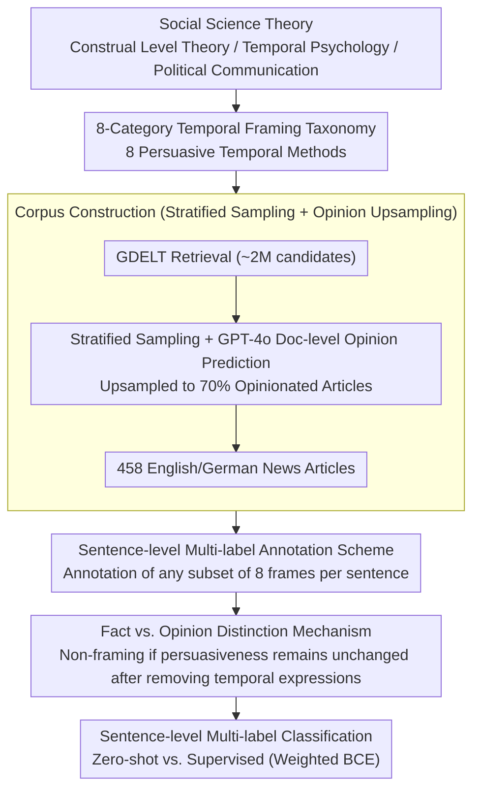

# Revealing Temporal Framing in News Text

**Conference**: ACL 2026 Oral  
**arXiv**: [2606.00294](https://arxiv.org/abs/2606.00294)  
**Code**: https://mbzuai-nlp.github.io/temporal-framing/  
**Area**: NLP Understanding / Discourse Analysis  
**Keywords**: Temporal Framing, Rhetorical Analysis, News Discourse, Multilingual Corpus, Text Classification

## TL;DR

This paper proposes the concept of "temporal framing" in news text. Drawing from social science theories, it establishes a taxonomy consisting of 8 categories of temporal frames, annotates a bilingual English-German news corpus, and trains models for temporal frame detection using both supervised and zero-shot approaches.

## Background & Motivation

**Background**: Temporal processing in NLP has traditionally focused on tasks such as temporal expression extraction, event ordering, and temporal reasoning, primarily treating time as an objective, descriptive property of events. Meanwhile, extensive work in framing analysis has been conducted under framing theory, covering document-level, entity-level, and event-level detection.

**Limitations of Prior Work**: Existing temporal processing work treats time as an objective attribute rather than a rhetorical resource, overlooking the persuasive function of temporal language in discourse. Although framing analysis is well-developed, it has not explicitly modeled the temporal dimension of framing. This leaves NLP systems unable to analyze rhetorical manipulation through temporal references—such as evoking nostalgia, creating a sense of urgency, or anchoring historical events to justify policies.

**Key Challenge**: Time can be used both to state facts ("Inflation rose by 2% in 2024") and as a rhetorical strategy ("Inflation has risen steadily for years, marking a policy failure"). The temporal elements in the latter are crucial for persuasiveness, yet existing NLP models struggle to distinguish between these two usages. Furthermore, while social sciences have systematically studied how temporal framing affects cognition and decision-making, these insights have not been integrated into NLP.

**Goal**: To systematically model the role of temporal framing as a rhetorical dimension in news text, including: (1) establishing a theory-grounded temporal framing taxonomy; (2) creating a multilingual annotated corpus; (3) evaluating the performance of computational models; and (4) analyzing the patterns and triggers of temporal framing.

**Key Insight**: Drawing from social science foundations such as construal level theory and temporal psychology, temporal framing is defined as "the way meaning is structured and audiences are persuaded through the rhetorical use of temporal elements," rather than merely describing event sequences.

**Core Idea**: Establish a classification system with 8 categories of temporal framing (Primacy, Recency, Urgency, Temporal Anchoring, Nostalgia, Temporal Contrast, Continuity, Skepticism) and detect these frames through sentence-level multi-label classification to capture rhetorical intent in news discourse.

## Method

### Overall Architecture

This research follows a three-stage pipeline from theory to resources to models. The first stage derives an 8-category temporal framing taxonomy from social sciences (construal level theory, temporal psychology, political communication). The second stage involves corpus construction—retrieving approximately 2M candidate articles from GDELT, performing stratified sampling by topic/language/media/month, using GPT-4o for document-level opinion prediction to upsample to 70% opinionated articles, and finally retaining 458 English and German news articles for manual sentence-level annotation (LLM labels are only used for sampling, not final annotation). The third stage formalizes temporal framing detection as sentence-level multi-label classification, comparing zero-shot and supervised models.

### Key Designs

**1. 8-Category Temporal Framing Taxonomy: Upgrading Time from Event Attribute to Rhetorical Dimension**

Existing NLP framing classifications mostly remain at the document or entity level and have never modeled time as an independent rhetorical dimension. Consequently, they cannot analyze "persuasion through time" in news. This paper derives 8 categories from social science theories, each corresponding to a way time is used to persuade the audience: **Primacy** ("The first to find a cure will lead the world"), **Recency** (emphasizing the importance of recent events), **Urgency** (time limits or imminent threats), **Temporal Anchoring** ("A post-9/11 world," using historical references to frame the present), **Nostalgia** ("Reclaim past glory," invoking past emotions), **Temporal Contrast** ("Once a center of prosperity, now a city in decline"), **Continuity** ("The economy has risen steadily for a decade"), and **Skepticism** (questioning the future). This system fills the gap in the temporal dimension and aligns highly with existing social science research.

**2. Sentence-level Multi-label Annotation Scheme: Balancing Precision and Cost**

Due to the high complexity and cost of cross-sentence annotation, the authors chose sentence-level granularity and defined the task as multi-label classification: given a document $D$ and sentence $s_i$, the output is $f(D, s_i) \in \mathcal{P}(F)$, where $F$ is the set of 8 framing categories and $\mathcal{P}(F)$ is its power set. Multi-labeling is allowed because a single sentence often contains multiple frames (e.g., Urgency + Skepticism), reflecting the co-occurrence of frames in real news discourse. Ultimately, approximately 2,365 English sentences and 617 German sentences were annotated with at least one frame category, with total annotation counts of 1,934 and 2,317 respectively.

**3. Fact vs. Opinion Distinction Mechanism: Teaching Models to Identify Rhetorical Intent Over Surface Patterns**

This is the essential difference between temporal framing and traditional temporal expression extraction. "Inflation rose 2% in 2024" is a verifiable factual statement, while "steady rise for years, marking policy failure" is a rhetorical frame. The authors introduce a heuristic criterion: if the persuasiveness of the sentence remains unchanged after removing temporal expressions, the temporal element is incidental and not considered a frame. For instance, in "The plan announced last week has deep flaws," removing "last week" does not change the core argument, so it is not counted as a temporal frame. Annotation also excludes quotes and indirect statements where the speaker is not the author. This rule is concise but captures the key—the model must learn "rhetorical intent," not just "temporal concepts."

### Loss & Training

For corpus sampling, stratified sampling and GPT-4o-based document-level opinion label prediction were used to ensure 70% of the final set consists of opinionated articles to enrich rhetorical content. Regarding training, to address the long-tail distribution of labels (e.g., only 42 cases of Nostalgia), weighted BCE loss and label-aware batching were used, allowing XLM-R with only 270M parameters to approach the performance of fine-tuned large models.

## Key Experimental Results

### Main Results

| Method | Model | Binary Detection F1 | Multi-label Micro-F1 | Opinion |
|------|------|------------|-----------------|------|
| Zero-shot | Qwen3-8B | 0.33 | 0.13 | LLMs struggle with unsupervised learning |
| Zero-shot | Qwen3-235B | 0.44 | 0.24 | Limited gains from parameter scale |
| Zero-shot | GPT-5.2 | 0.45 | 0.31 | Strongest zero-shot baseline |
| Supervised | XLM-R (270M) | 0.51 | 0.37 | Small supervised models rival LLMs |
| Supervised | LLaMA-3.1-8B | 0.54 | 0.42 | High precision but low recall |
| Supervised | Qwen3-8B | **0.57** | **0.44** | Best performance |

### Ablation Study

| Configuration | Binary Detection F1 | Multi-label Micro-F1 | Description |
|------|------------|-----------------|------|
| Sentence Only | 0.57 | 0.44 | Optimal configuration |
| Sentence + Context | 0.51 | 0.38 | Extra context reduces performance (-10%) |
| Sentence + Full Doc | 0.48 | 0.35 | Full document performs worst (-16%) |
| Random Baseline | 0.20 | 0.04 | Random prediction baseline |

### Key Findings

- **Significant Advantage of Supervision over Zero-shot**: The strongest zero-shot model (GPT-5.2, F1=0.45) performs 27% worse than the strongest supervised model (Qwen3-8B, F1=0.57). This indicates that temporal framing relies on subtle rhetorical cues and relational contrasts that cannot be reliably captured through general prompting.
- **Diminishing Returns on Model Scale**: In the zero-shot setting, increasing Qwen3 parameters from 8B to 235B only improved F1 from 0.33 to 0.44. In contrast, supervised fine-tuning yielded substantial improvements at any scale (LLaMA-3.1-8B zero-shot F1=0.24, vs. fine-tuned F1=0.54, an increase of 125%).
- **Surprising Performance of Encoder Models**: Despite having only 270M parameters, the fine-tuned XLM-R achieved an F1 of 0.51, surpassing all zero-shot baselines.
- **Impact of Language and Data Sparsity**: The proportion of annotated sentences in the German dataset was significantly lower than in the English dataset, leading to slightly lower fine-tuning performance for German.
- **Frame-level Heterogeneity**: Frequent frames (Continuity, Temporal Contrast, Temporal Anchoring) are detected well, while rare frames (Nostalgia, with only 42 cases) are susceptible to data sparsity.

## Highlights & Insights

- **Bridging the Gap between NLP and Social Sciences**: This work is the first to systematically integrate deep social science theories regarding temporal framing into NLP. Time is no longer just an attribute label for events but a carrier of rhetorical intent—a conceptual upgrade for existing temporal processing tasks.
- **Ingenious Fact vs. Opinion Distinction Heuristic**: The proposed criterion—"if persuasiveness remains unchanged after removing temporal expressions, it is not a frame"—is simple and effective, avoiding complex multi-step reasoning.
- **Elegant Handling of Data Imbalance**: Through weighted BCE loss and label-aware batching, a model with only 270M parameters achieves performance comparable to fine-tuned LLMs.
- **Explanation for the Zero-shot vs. Supervised Divide**: The experiments reveal why LLMs, while powerful in open domains, fail in fine-grained rhetorical analysis—temporal framing detection requires learning "rhetorical intent" rather than "temporal concepts."

## Limitations & Future Work

- **Limited Corpus Representativeness**: The 458 articles come from a fixed set of media outlets and cover only English and German, introducing media source bias.
- **Annotation Granularity Constraints**: Annotation is conducted at the sentence level rather than the span level, potentially missing temporal frames that span sentence boundaries.
- **Data Scarcity for Rare Frames**: The Nostalgia frame has only 42 cases, leading to insufficient learning by fine-tuned models.
- **Challenges of Implicit Rhetorical Cues**: Many temporal framing expressions rely on event-specific references and evaluative language, lacking stable surface patterns.

**Future Directions**: (1) Expanding to other languages and media types; (2) Modeling the interaction of temporal frames (the dynamics of multi-frame co-occurrence); (3) Exploring rich text representations (integrating cross-sentence dependencies, event structures, and discourse coherence).

## Related Work & Insights

- **vs. Document-level Framing Analysis (Card et al., 2015; Liu et al., 2019)**: Existing work focuses on document/headline level framing, which is coarse-grained but easy to scale. This work moves down to the sentence level, capturing the localized implementation of framing in discourse with higher precision.
- **vs. Temporal Expression Extraction (Tan et al., 2023; Ding & Wang, 2025)**: Traditional temporal NLP focuses on the objective "when"; this work focuses on the rhetorical "why use this time." The two are complementary rather than conflicting.
- **vs. Entity/Event Framing (Stammbach et al., 2022; Mahmoud et al., 2025)**: Recent fine-grained framing work explores how roles and attributes frame entities and events but has not explicitly modeled the temporal dimension. This work fills that gap.

## Rating

- Novelty: ⭐⭐⭐⭐⭐ First to systematically model time as an independent rhetorical framing dimension, closely integrating theory and practice.
- Experimental Thoroughness: ⭐⭐⭐⭐ Compares zero-shot vs. supervised, various model scales, bilingual performance, and feature analysis, though analysis of rare frames could be deeper.
- Writing Quality: ⭐⭐⭐⭐⭐ Clear motivation, rigorous process, lucid charts, and strong argumentation.
- Value: ⭐⭐⭐⭐ Provides new tools for downstream tasks such as news bias detection, public opinion analysis, and communication research; open resources benefit community development.

<!-- RELATED:START -->

## Related Papers

- [\[ACL 2026\] Creating ConLangs to Probe the Metalinguistic Grammatical Knowledge of LLMs](creating_conlangs_to_probe_the_metalinguistic_grammatical_knowledge_of_llms.md)
- [\[ACL 2026\] Commonsense Knowledge with Negation: A Resource to Enhance Negation Understanding](commonsense_knowledge_with_negation_a_resource_to_enhance_negation_understanding.md)
- [\[ACL 2026\] Agree, Disagree, Explain: Decomposing Human Label Variation in NLI through the Lens of Explanations](agree_disagree_explain_decomposing_human_label_variation_in_nli_through_the_lens.md)
- [\[ACL 2026\] Exploring Concreteness Through a Figurative Lens](exploring_concreteness_through_a_figurative_lens.md)
- [\[ACL 2026\] LexRel: Benchmarking Legal Relation Extraction for Chinese Civil Cases](lexrel_benchmarking_legal_relation_extraction_for_chinese_civil_cases.md)

<!-- RELATED:END -->
