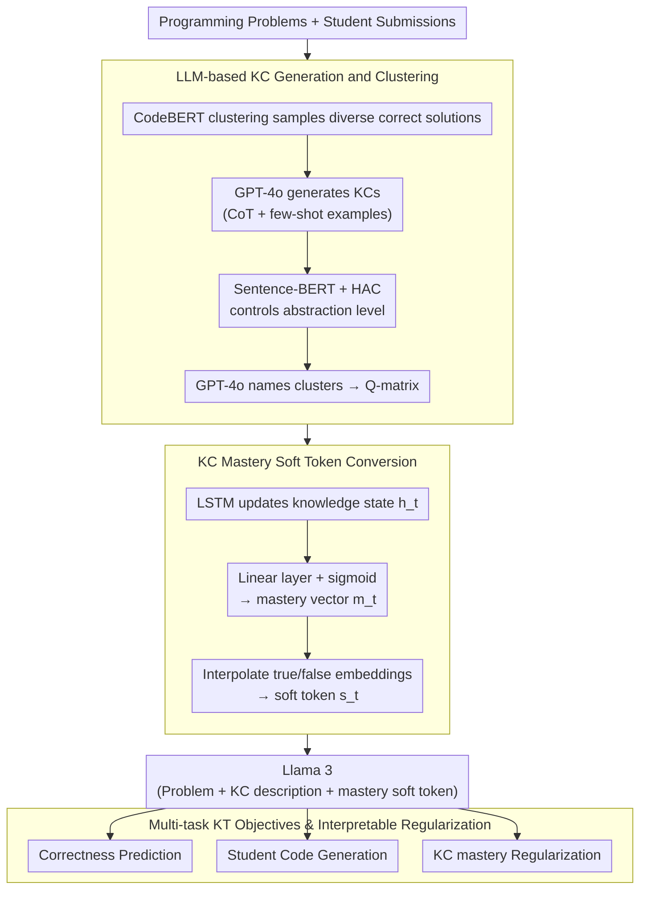

# Automated Knowledge Component Generation and Interpretable Knowledge Tracing in Coding Problems

**Conference**: ACL2026 Findings  
**arXiv**: [2502.18632](https://arxiv.org/abs/2502.18632)  
**Code**: https://github.com/umass-ml4ed/kcgen-kt  
**Area**: AI in Education / Knowledge Tracing  
**Keywords**: Knowledge Component, Knowledge Tracing, Programming Education, LLM, Interpretable Student Modeling

## TL;DR
This paper utilizes LLMs to automatically generate and cluster Knowledge Components (KCs) for open-ended programming problems. It proposes KCGen-KT, which converts student mastery of each KC into soft tokens as input for Llama 3, improving both correctness prediction and student code generation performance on CodeWorkout and FalconCode.

## Background & Motivation
**Background**: Knowledge tracing (KT) requires estimating students' mastery of fine-grained knowledge points, often relying on Knowledge Components (KCs) as skill labels. Traditional KCs are typically authored by teachers or domain experts and manually mapped to problems.

**Limitations of Prior Work**: Manual KC design is costly and prone to bias. Furthermore, open-ended programming problems are more difficult to label than multiple-choice questions. A single programming problem may have multiple correct solutions involving different skills; student errors are also diverse and cannot be evaluated through fixed options.

**Key Challenge**: Knowledge tracing models require fine-grained, interpretable, and transferable KCs; however, finer granularity increases the cost of manual design and labeling. Existing automated KC generation mostly focuses on multiple-choice questions, providing insufficient support for open-ended student code submissions.

**Goal**: The authors aim to use LLMs to automatically generate the KCs required for programming problems and allow these natural language KC descriptions to directly assist KT models in predicting future student performance and code submissions, while maintaining interpretability regarding "which KCs a student is weak in."

**Key Insight**: The paper connects KC generation and KT modeling into a closed loop: first, real correct student code is used to help the LLM identify skills required by a problem, then skill descriptions and student mastery are used as part of the LLM input to predict the next response.

**Core Idea**: Generate readable KCs using LLMs, control abstraction levels via clustering, and project each student's mastery of KCs into differentiable soft text tokens. This allows LLM-based KT to simultaneously acquire semantic knowledge and interpretable student states.

## Method

### Overall Architecture
The method consists of two stages forming a closed loop. The first stage is an automated KC generation and labeling pipeline: diverse correct student submissions are sampled for each programming problem, GPT-4o is prompted to generate necessary KCs, Sentence-BERT embeddings and Hierarchical Agglomerative Clustering (HAC) are used to merge similar KCs, and finally, GPT-4o names each cluster and maps problems to clusters to obtain the Q-matrix. The second stage is the KCGen-KT model: it maintains a "mastery vector across KCs" for each student, converts mastery values into soft tokens, and feeds them into Llama 3 along with the next problem description and KC descriptions to predict both "correctness of the next response" and "potential student code submission."

### Key Designs

**1. LLM-based KC Generation and Clustering: Extracting readable KCs with controllable granularity from diverse correct solutions**

Open-ended programming problems cannot be labeled like multiple-choice questions—the same problem has multiple correct approaches, and looking only at the prompt or a single solution may miss necessary skills. Free-form LLM generation often produces overly granular, redundant, or non-generalizable KCs. This paper clusters correct student code using CodeBERT embeddings, samples representative solutions from different clusters (serving as few-shot examples), and tasks GPT-4o with generating KCs using Chain-of-Thought based on the problem and these diverse solutions. Sentence-BERT then vectorizes KC descriptions, which are merged via HAC to control abstraction levels. GPT-4o eventually names each cluster and maps problems to cluster labels to form the Q-matrix.

**2. KC Mastery Soft Token Conversion: Integrating continuous mastery into the LLM text space**

LLMs excel at reading text descriptions, but student mastery of a KC is a continuous value that cannot be directly input as text. The model uses an LSTM to update a 511-dimensional student knowledge state $h_t$, which passes through a linear layer and sigmoid to produce a $k$-dimensional mastery vector $m_t\in[0,1]^k$. For the $j$-th KC, mastery is interpolated into a soft token via $s_t^j=m_t^j\cdot emb^{true}+(1-m_t^j)\cdot emb^{false}$. This soft token preserves continuous information while remaining differentiable, allowing the mastery state to be integrated end-to-end into the LLM's representation space without losing information via discretization.

**3. Multi-task KT Objectives and Interpretable Regularization: Balancing accuracy and profile interpretability**

Optimizing only for prediction accuracy may result in uninterpretable hidden states. KCGen-KT adopts three objectives: correctness prediction using sigmoid classification on Llama 3 hidden states, code prediction via token-by-token generation, and a KC regularization term that predicts correctness using the average of relevant KC mastery values. This forces a binding between "high KC mastery ↔ high probability of correctness." The total loss is $\mathcal{L}_{KCGen-KT}=\lambda(\mathcal{L}_{CodeGen}+\mathcal{L}_{CorrPred})+(1-\lambda)\mathcal{L}_{KC}$. The KC loss is crucial for interpretability, forcing the mastery vector to correspond to meaningful educational skills rather than collapsing into black-box numbers.

### Loss & Training
The training objective comprises three parts: BCE loss for correctness prediction, token-level negative log-likelihood for code generation, and a BCE regularization between KC mastery and correctness. The model is based on instruction-tuned Llama 3 8B using LoRA fine-tuning and 8-bit quantization. In KCGen-KT, the learning rates are 1e-5 for Llama 3, 5e-4 for the LSTM, and 1e-4 for the mastery linear layer. Experiments were repeated across 5 random train-validation-test splits.

## Key Experimental Results

### Main Results
Two datasets consisting of real open-ended programming submissions were used: CodeWorkout (246 students, 50 Java problems, 10,834 first submissions) and FalconCode (3,267 students, 157 Python problems, 28,617 first submissions).

| Dataset | Method | AUC | F1 | Accuracy | CodeBLEU |
|---------|--------|-----|----|----------|----------|
| CodeWorkout | Code-DKT | 0.766 | 0.672 | 0.724 | - |
| CodeWorkout | TIKTOC* | 0.788 | 0.666 | 0.726 | 0.507 |
| CodeWorkout | Ours (Human KCs) | 0.797 | 0.706 | 0.727 | 0.557 |
| CodeWorkout | Ours (Generated KCs) | 0.816 | 0.727 | 0.746 | 0.580 |
| FalconCode | Code-DKT | 0.709 | 0.552 | 0.617 | - |
| FalconCode | TIKTOC* | 0.728 | 0.585 | 0.633 | 0.427 |
| FalconCode | Ours (Human KCs) | 0.752 | 0.599 | 0.700 | 0.473 |
| FalconCode | Ours (Generated KCs) | 0.771 | 0.645 | 0.712 | 0.498 |

LLM-generated KCs outperformed human KCs across both datasets in both correctness prediction and code generation tasks, with statistically significant improvements (p < 0.05).

### Ablation Study

| Configuration | AUC | F1 | Accuracy | CodeBLEU | Description |
|---------------|-----|----|----------|----------|-------------|
| KCGen-KT | 0.812 | 0.723 | 0.724 | 0.569 | CodeWorkout Ablation Baseline |
| w/o Correct Sol. | 0.789 | 0.674 | 0.704 | 0.529 | Incomplete KCs without correct student solutions |
| w/ Incorrect Sol. | 0.773 | 0.651 | 0.700 | 0.516 | Adding incorrect solutions introduces noise |
| w/o KC Loss | 0.791 | 0.680 | 0.709 | 0.540 | Interpretable mastery regularization contributes |
| w/o ICL Ex. | 0.782 | 0.677 | 0.705 | 0.539 | Performance drops as KCs become more abstract |
| Code → AST | 0.784 | 0.691 | 0.715 | 0.546 | AST representation is inferior to raw code text |
| Generated Code | 0.807 | 0.706 | 0.721 | 0.557 | LLM solutions lack the diversity of real student code |

### Key Findings
- KC abstraction levels must be balanced. In CodeWorkout, 50 medium-granularity clusters achieved 0.816 AUC, while reducing to 10 high-level KCs dropped performance to 0.794 AUC.
- Real correct student submissions are critical. Removing correct submissions or using only LLM-generated code degrades KC coverage, as real student solutions possess greater strategic diversity.
- Human evaluation confirms the quality of generated KCs: 98.6% of LLM-generated KCs were deemed interpretable (vs 94.6% for baseline). KC mapping precision was 93.2% (vs 92.5%), and generated KCs were rated as having equal or better coverage in 96% of cases.
- Learning curve analysis shows LLM-generated KCs align better with the power law of practice: weighted $R^2$ was 0.21, compared to 0.18 for human-written KCs.

## Highlights & Insights
- The key contribution is not merely "using LLMs for labeling," but transforming labels into semantic inputs that are usable by downstream KT models through differentiable soft tokens.
- Sampling diverse correct code is a clever design. The skill set of an open-ended programming problem is determined not just by the prompt but by the space of feasible solutions; real student code exposes this space more effectively than gold standard answers.
- The fact that generated KCs outperform human KCs suggests that human labels may be too coarse or use outdated naming conventions, whereas LLMs can generate natural, function-level skill descriptions better suited for LLM-based KT.

## Limitations & Future Work
- KC generation depends on in-context examples; without human examples, zero-shot generation tends toward abstraction, making it difficult to capture low-level skills.
- Multi-KC problems lack reliable ground-truth labels; current KC correctness labeling requires further validation.
- The experiments are limited to Computer Science education (Java/Python); the generalizability to mathematics, science, or conversational tutoring remains to be verified.
- While human evaluation proves interpretability, the ultimate value depends on whether it improves student learning outcomes, requiring classroom deployment or A/B testing.

## Related Work & Insights
- **vs Code-DKT**: Code-DKT uses student code content for KT but lacks natural language KC semantics and explicit mastery interpretation; KCGen-KT utilizes code, problems, and KC descriptions simultaneously.
- **vs TIKTOC**: TIKTOC also uses Llama 3 for generative KT but does not explicitly model KC mastery; KCGen-KT's advantage stems from KC semantics and the KC loss.
- **vs Manual KC Labeling**: Manual labels are expensive and may not fit the downstream model's granularity; LLM-generated KCs showed better predictive performance and interpretability in this study.
- **Insight**: LLMs in educational settings should serve not just as answer generators, but as "knowledge structure generators" to help build interpretable student models.

## Rating
- Novelty: ⭐⭐⭐⭐ Automated KC generation exists, but the integration with soft-token LLM KT is novel.
- Experimental Thoroughness: ⭐⭐⭐⭐⭐ Two real-world datasets, multiple strong baselines, abstraction level analysis, ablation, human evaluation, and learning curves are all robust.
- Writing Quality: ⭐⭐⭐⭐ The methodological chain is clear, and the educational motivation and model details are well-explained.
- Value: ⭐⭐⭐⭐⭐ Highly practical value for programming education, intelligent tutoring, and interpretable knowledge tracing.

<!-- RELATED:START -->

## Related Papers

- [\[ACL 2025\] Knowledge Tracing in Programming Education Integrating Students' Questions](../../ACL2025/others/knowledge_tracing_in_programming_education_integrating_students_questions.md)
- [\[AAAI 2026\] LeanRAG: Knowledge-Graph-Based Generation with Semantic Aggregation and Hierarchical Retrieval](../../AAAI2026/others/leanrag_knowledge-graph-based_generation_with_semantic_aggregation_and_hierarchi.md)
- [\[CVPR 2026\] VideoWorld 2: Learning Transferable Knowledge from Real-world Videos](../../CVPR2026/others/videoworld_2_learning_transferable_knowledge_from_real-world_videos.md)
- [\[CVPR 2026\] Towards Knowledge-augmented Bayesian Deep Learning For Computer Vision](../../CVPR2026/others/towards_knowledge-augmented_bayesian_deep_learning_for_computer_vision.md)
- [\[AAAI 2026\] Variance Computation for Weighted Model Counting with Knowledge Compilation Approach](../../AAAI2026/others/variance_computation_for_weighted_model_counting_with_knowledge_compilation_appr.md)

<!-- RELATED:END -->
