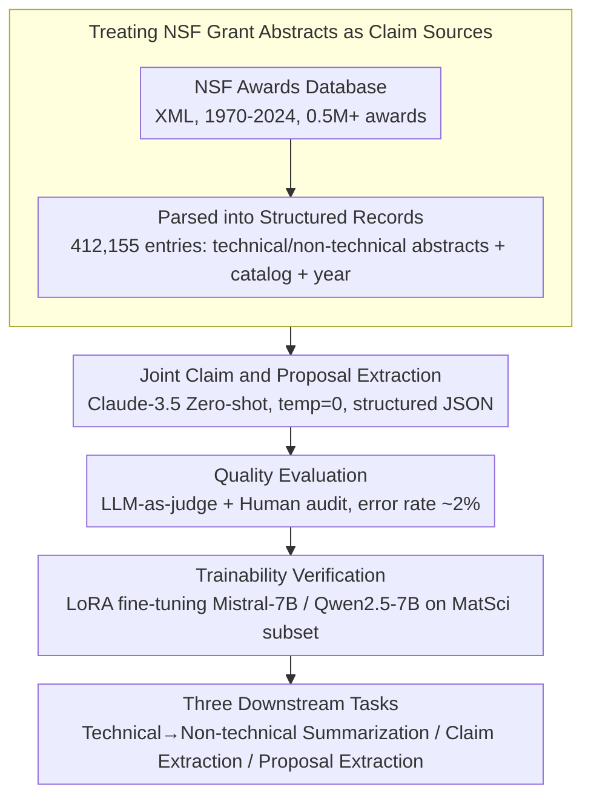

# NSF-SciFy: Mining the NSF Awards Database for Scientific Claims

**Conference**: ACL2026  
**arXiv**: [2503.08600](https://arxiv.org/abs/2503.08600)  
**Code**: https://github.com/darpa-scify/NSFSciFy  
**Area**: Scientific Text Mining / Dataset Construction  
**Keywords**: Scientific Claim Extraction, NSF Award Abstracts, Scientific Feasibility, LoRA Fine-tuning, Metascience

## TL;DR
NSF-SciFy extracts 2.8M scientific claims and investigation proposals from NSF award abstracts, constructing a resource orders of magnitude larger than existing scientific claim datasets and demonstrating significant performance gains for claim/proposal extraction models.

## Background & Motivation

**Background**: Existing scientific claim verification datasets like SciFACT, PubHEALTH, CLIMATE-FEVER, and HealthVer primarily rely on papers, news, or fact-checking sites. These datasets typically range from several hundred to ten thousand claims and focus on specific domains like biomedicine, public health, or climate.

**Limitations of Prior Work**: Scientific literature is growing rapidly, with an annual growth rate of approximately 4% and a doubling time of about 17 years. Manually tracking "which scientific claims are being made versus which are merely intended research plans" is becoming increasingly infeasible. Existing datasets are small in scale and rarely cover early-stage scientific claims and future research plans found in grant proposals.

**Key Challenge**: Scientific grant abstracts contain both knowledge claimed as true by the authors and "intended research" (future-looking proposals). If an extraction system fails to distinguish these, it may misidentify uncompleted research plans as established scientific facts. Conversely, extracting only claims loses vital clues for understanding the evolution of scientific activities.

**Goal**: The authors aim to leverage the NSF Awards database to build a large-scale, cross-disciplinary resource for science and mathematics. This resource includes both scientific claims and investigation proposals, and its utility is validated across three tasks: technical-to-non-technical summary generation, claim extraction, and proposal extraction.

**Key Insight**: NSF award abstracts offer several natural advantages: they cover broad fields of basic research, undergo expert review, are publicly available, and recent projects can be linked to subsequent publications. They are closer to the "source of scientific ideas being funded and formed" than published papers.

**Core Idea**: Use zero-shot LLM prompting to jointly extract claims and investigation proposals from NSF grant abstracts, then use these high-precision, large-scale weakly labeled data to train smaller open-source models.

## Method

The NSF-SciFy method does not propose a complex model but rather constructs a reusable data generation and evaluation pipeline: first, scraping the NSF Awards XML database to parse structured award records; second, performing joint extraction using Claude-3.5; third, conducting quality assessment via LLM/human evaluation; and finally, training Mistral-7B and Qwen2.5-7B on a materials science subset to verify the data's downstream value.

### Overall Architecture

The data source is the NSF Awards database from 1970 to September 2024. The raw XML contains over 0.5M awards. After parsing, 412,155 usable awards form the core of NSF-SciFy. The paper analyzes two subsets: NSF-SciFy-MatSci (Division of Materials Research) and NSF-SciFy-20K (stratified sampling from five NSF directorates).

Each record typically includes award ID, title, year, directorate/division, technical abstract, non-technical abstract, claims, investigation proposals, and linked subsequent publications. Non-technical abstracts are not mere copies of technical ones: in 13,025 technical/non-technical pairs, only 1.5% showed a symmetric BLEU similarity exceeding 0.6.

The extraction phase utilizes Claude-3.5-Sonnet-20240620 with temperature set to 0. The prompt requires JSON output containing award ID, abstracts, claims list, and investigation proposals list. The authors emphasize that joint extraction is crucial: if only claims are extracted, models are more likely to mislabel forward-looking investigation statements as established claims.

### Key Designs

**1. Treating NSF grant abstracts as claim sources: Shifting from "published" to "funded"**

Existing scientific claim datasets are mostly derived from papers or news, with scales ranging from hundreds to tens of thousands, often restricted to narrow domains. NSF-SciFy shifts the focus "upstream" by parsing the NSF Awards database, retaining technical/non-technical abstracts, disciplinary metadata, and longitudinal publication links. Grant abstracts capture the knowledge hypotheses and plans at the moment of funding, offering a larger volume of 2.8M claims—orders of magnitude larger than SciFACT (1.4K).

**2. Joint claim and investigation proposal extraction: Forcing the model to distinguish "known" from "to-be-studied"**

Scientific abstracts frequently use forward-looking language (e.g., "we will investigate..."). If only claims are targeted, models often mislabel these plans as facts. NSF-SciFy uses Claude-3.5-Sonnet to perform zero-shot extraction where claims (asserted truths) and investigation proposals (planned studies) are explicitly separated into different categories in a structured JSON. This joint modeling provides an "exit" for future plans, preventing them from contaminating the claim list.

**3. Verifying trainability with NSF-SciFy: Proving it's not just "large" but also "useful"**

The authors demonstrate the value of this weakly labeled data through downstream training. Using 11,141 samples from NSF-SciFy-MatSci (split 8,641 / 500 / 2,000), they fine-tuned Mistral-7B and Qwen2.5-7B using LoRA. Results showed that training on LLM-extracted data significantly improves-the performance of smaller open-source models on claim/proposal extraction—with claim extraction F1 nearly doubling—validating the bootstrapping approach.

### Loss & Training

The paper uses LoRA fine-tuning for 7B models. LoRA rank is set to 128, `lora_alpha=64`, and a learning rate of $1 \times 10^{-5}$ with a linear scheduler. The adaptation targets query, key, value, output projection, and MLP gate/up/down projections. Training lasts 3 epochs with 100 warmup steps, a batch size of 2, and gradient accumulation of 4, taking approximately 1 hour per epoch on an A100 GPU.

Evaluation for the technical-to-non-technical summarization task uses BERTScore and ROUGE. Claim/proposal extraction uses a pairwise boolean judge function defined by GPT-4o-mini to calculate precision, recall, and F1, which was verified against human samples.

## Key Experimental Results

### Dataset Scale

| Dataset | Awards / Abstracts | Claims | Investigation Proposals | Coverage |
|--------|--------------------|--------|-------------------------|----------|
| NSF-SciFy | 412,155 | 2.8M | - | 1970-2024, Science & Math |
| NSF-SciFy-MatSci | 16,042 | 114K | 145K | Materials Science |
| NSF-SciFy-20K | 20,001 | 135K | 139K | Five Directorates: MPS, GEO, ENG, CSE, BIO |
| MatSci Training Subset | 11,141 | - | - | train/val/test = 8,641/500/2,000 |

### Main Results

| Task | Model | Precision / BERTScore-F1 | Recall | F1 / Other Metrics | Key Conclusion |
|------|------|--------------------------|--------|---------------|----------|
| Tech→Non-tech Summary | Mistral-7B | 0.8561 (BERTScore) | - | 0.1273 (ROUGE-L) | Minority gain from fine-tuning; base model strong |
| Tech→Non-tech Summary | Qwen2.5-7B | 0.8437 (BERTScore) | - | 0.1466 (ROUGE-L) | Qwen has higher ROUGE-L, Mistral overall stronger |
| Claim Extraction | Mistral-7B | 0.7450 (+116.7%) | 0.7098 (+59.5%) | 0.7097 (+101.8%) | F1 nearly doubled through fine-tuning |
| Claim Extraction | Qwen2.5-7B | 0.6839 (+107.1%) | 0.6611 (+7.8%) | 0.6541 (+63.3%) | Significant benefit, though weaker than Mistral |
| Proposal Extraction | Mistral-7B | 0.7351 (+18.24%) | 0.7539 (+127.24%) | 0.7261 (+90.97%) | Strong dependency on fine-tuning |
| Proposal Extraction | Qwen2.5-7B | 0.7245 (+70.07%) | 0.6865 (+81.57%) | 0.6827 (+112.60%) | High relative gain, lower absolute F1 than Mistral |

### Key Findings

- NSF-SciFy scale far exceeds existing datasets: while SciFACT has 1.4K claims, the MatSci subset alone contains 114K.
- Fine-tuning yields much higher gains for claim/proposal extraction than for summarization, suggesting the dataset's core value lies in teaching structural scientific identification.
- The extraction pipeline prioritizes high precision, though recall remains a challenge; the authors suggest multi-turn extraction or ensemble methods as future improvements.

## Highlights & Insights

- The choice of data source is the most valuable contribution: grant abstracts capture scientific claims in their "upstream" state before formal publication.
- Joint extraction of claims and proposals is a small but critical design choice that forces the model to distinguish between "what is known" and "what is planned."
- The paper avoids overstating the perfection of zero-shot extraction, acknowledging its high precision and low recall, and uses fine-tuning to demonstrate how the data can further improve models.
- The paired technical/non-technical abstracts are valuable not just for science communication but also for studying linguistic transformations between expert and public registers.

## Limitations & Future Work

- **US-centric**: NSF represents about 25% of US federal basic research funding; it excludes non-funded proposals, international grants, and private applications.
- **Precision-Recall Tradeoff**: Zero-shot extraction prioritizes reliability, leading to lower recall. Future work may require multi-round extraction or active annotation.
- **LLM-as-judge Validation**: While GPT-4o-mini showed high consistency with humans in samples, its reliability across broader disciplines and complex claims needs further verification.
- **Verification Loop**: The dataset contains claims and proposals but does not provide direct support/refute evidence or truth labels, which are required for full claim verification.

## Related Work & Insights

- **vs SciFACT / SciFACT-Open**: SciFACT focuses on biomedical paper claim verification (1.4K claims); NSF-SciFy targets grant abstracts (2.8M claims) but lacks direct evidence labels.
- **vs PubHEALTH / CLIMATE-FEVER**: These target public discourse; NSF-SciFy is closer to the funding and planning stages of scientific research.
- **Inspiration**: Academic NLP data can be mined from administrative texts (grants, reviews, reports) rather than just full-text papers to reveal the evolving state of scientific knowledge.

## Rating
- Novelty: ⭐⭐⭐⭐☆ The data source and joint extraction design are innovative.
- Experimental Thoroughness: ⭐⭐⭐⭐☆ Includes scale statistics, human quality audits, and three downstream tasks.
- Writing Quality: ⭐⭐⭐⭐☆ Clear structure and sufficient data points.
- Value: ⭐⭐⭐⭐⭐ High resource value for scientific claim mining and metascience.

## Related Papers

- [\[ACL 2026\] APB-V: Accelerating Long-Video Understanding via Sequence-Parallelism-aware Approximate Attention](apb-v_accelerating_long-video_understanding_via_sequence-parallelism-aware_appro.md)
- [\[ACL 2026\] Rethinking the Idiomaticity Decomposability Hypothesis: Evidence from Distributional Learning](rethinking_the_idiomaticity_decomposability_hypothesis_evidence_from_distributio.md)
- [\[ACL 2026\] CRAFT: Critic-Refined Adaptive Key-Frame Targeting for Multimodal Video Question Answering](craft_critic-refined_adaptive_key-frame_targeting_for_multimodal_video_question_.md)
- [\[ACL 2026\] Response-G1: Explicit Scene Graph Modeling for Proactive Streaming Video Understanding](response-g1_explicit_scene_graph_modeling_for_proactive_streaming_video_understa.md)
- [\[ACL 2026\] GameplayQA: A Benchmarking Framework for Decision-Dense POV-Synced Multi-Video Understanding of 3D Virtual Agents](gameplayqa_a_benchmarking_framework_for_decision-dense_pov-synced_multi-video_un.md)

<!-- RELATED:END -->

<!-- RELATED:START -->

## Related Papers

- [\[ACL 2026\] GameplayQA: A Benchmarking Framework for Decision-Dense POV-Synced Multi-Video Understanding of 3D Virtual Agents](gameplayqa_a_benchmarking_framework_for_decision-dense_pov-synced_multi-video_un.md)
- [\[ACL 2026\] ViLL-E: Video LLM Embeddings for Retrieval](vill-e_video_llm_embeddings_for_retrieval.md)
- [\[ACL 2026\] APB-V: Accelerating Long-Video Understanding via Sequence-Parallelism-aware Approximate Attention](apb-v_accelerating_long-video_understanding_via_sequence-parallelism-aware_appro.md)
- [\[ACL 2026\] HERMES: KV Cache as Hierarchical Memory for Efficient Streaming Video Understanding](hermes_kv_cache_as_hierarchical_memory_for_efficient_streaming_video_understandi.md)
- [\[ACL 2026\] VISTA: Verification In Sequential Turn-based Assessment](vista_verification_in_sequential_turn-based_assessment.md)

<!-- RELATED:END -->
