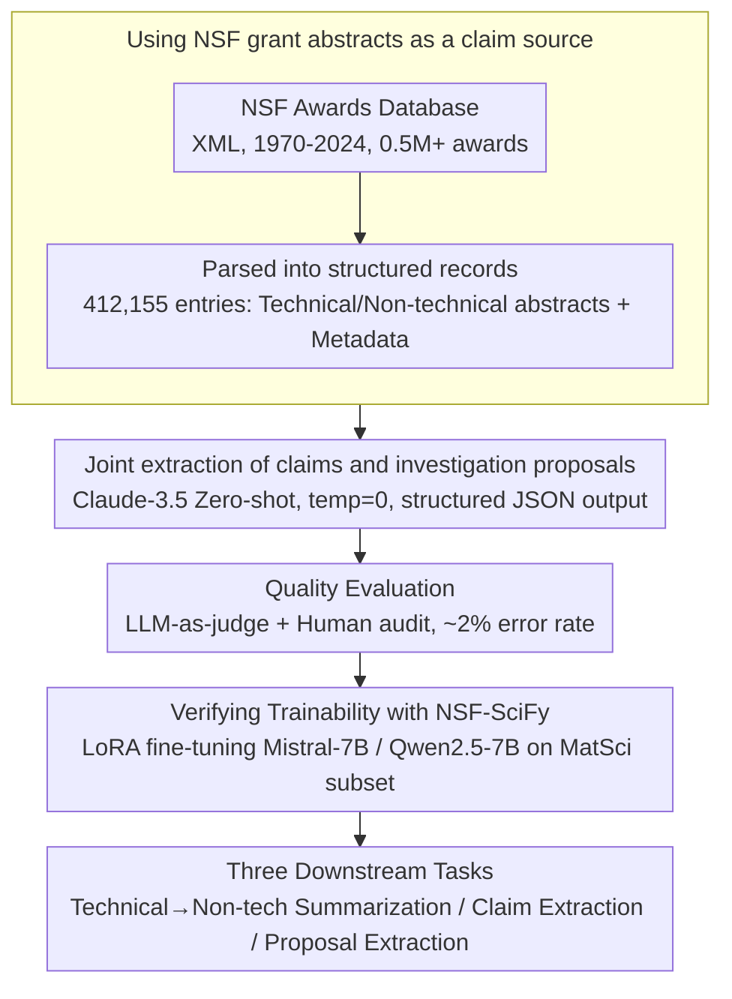

# NSF-SciFy: Mining the NSF Awards Database for Scientific Claims

**Conference**: ACL2026  
**arXiv**: [2503.08600](https://arxiv.org/abs/2503.08600)  
**Code**: https://github.com/darpa-scify/NSFSciFy  
**Area**: Scientific Text Mining / Dataset Construction  
**Keywords**: Scientific Claim Extraction, NSF Award Abstracts, Scientific Feasibility, LoRA Fine-tuning, Metascience

## TL;DR
NSF-SciFy extracts 2.8M scientific claims and investigation proposals from NSF award abstracts, building a resource orders of magnitude larger than existing scientific claim datasets and demonstrating significant performance gains for claim and proposal extraction models.

## Background & Motivation

**Background**: Scientific claim verification datasets like SciFACT, PubHEALTH, CLIMATE-FEVER, and HealthVer exist, but most are derived from papers, news, or fact-checking sites. Their scales typically range from a few hundred to over ten thousand claims, often restricted to specific topics such as biomedicine, public health, or climate.

**Limitations of Prior Work**: The growth of scientific literature is rapid, with an overall annual growth rate of approximately 4% and a doubling time of about 17 years. Manually tracking which scientific claims are made versus which are merely research plans is increasingly infeasible. Existing datasets are small and rarely cover early-stage scientific claims or future research plans found in grant proposals.

**Key Challenge**: Scientific grant abstracts contain both knowledge claimed as true by the authors and "future-looking proposals" intended for study. If an extraction system fails to distinguish these, it may misidentify uncompleted research plans as established scientific facts. Conversely, extracting only claims loses vital clues for understanding the evolution of scientific activities.

**Goal**: The authors aim to utilize the NSF Awards database to construct a large-scale, cross-disciplinary resource covering science and mathematics. This resource includes both scientific claims and investigation proposals to verify its utility for three tasks: technical-to-lay abstract transformation, claim extraction, and proposal extraction.

**Key Insight**: NSF award abstracts offer several natural advantages: they cover broad fields of basic research, undergo expert review, are publicly available, and for recent projects, link to subsequent publications. They are closer to the "source" of scientific ideas being funded than published papers.

**Core Idea**: Use zero-shot LLM prompting to jointly extract claims and investigation proposals from NSF grant abstracts, then use this high-precision, large-scale weakly labeled data to train smaller open-source models.

## Method

The NSF-SciFy method focuses on building a reusable data generation and evaluation pipeline rather than a complex model architecture. The pipeline involves: scraping the NSF Awards XML database, parsing it into structured records, performing joint extraction using Claude-3.5, conducting human/LLM-assisted evaluation, and finally fine-tuning Mistral-7B and Qwen2.5-7B on a materials science subset to validate the data's downstream utility.

### Overall Architecture

The data source is the NSF Awards database from 1970 to September 2024, with original XML containing over 0.5M awards. Parsing yielded 412,155 usable records. The paper focuses on two subsets: NSF-SciFy-MatSci (from the Division of Materials Research) and NSF-SciFy-20K (stratified sampling from five NSF directorates).

Each record typically includes the award ID, title, year, directorate/division, technical abstract, non-technical abstract, claims, investigation proposals, and links to publications (for recent awards). Technical and non-technical pairs are distinct; in 13,025 pairs, only 1.5% had a symmetric BLEU similarity over 0.6.

Extraction uses Claude-3.5-Sonnet-20240620 with temperature set to 0. The prompt requires a JSON output containing claims and investigation proposals. The authors emphasize that joint extraction is crucial: without it, models tend to mislabel forward-looking statements as established claims.

### Key Designs

**1. Using NSF grant abstracts as a claim source: Moving from "Published" to "Funded"**

Existing scientific claim datasets are mostly sourced from published papers or news, capturing established conclusions. NSF-SciFy shifts the focus "upstream" to the point of funding. By parsing NSF XML, it maintains metadata (directorate, year, links to publications), creating a longitudinal repository. Grant abstracts capture hypotheses at the inception of research, enabling a much larger scale (2.8M claims) compared to SciFACT (1.4K).

**2. Joint extraction of claims and investigation proposals: Forcing models to distinguish "Known" from "Proposed"**

Scientific abstracts frequently use forward-looking language ("We will study..."). If only claims are extracted, models often incorrectly label these plans as facts. NSF-SciFy uses Claude-3.5-Sonnet to explicitly categorize statements into claims (asserted as true) and investigation proposals (planned actions), outputting them in structured JSON. This joint modeling provides an output "sink" for proposals, increasing the purity of the claim set.

**3. Verifying trainability with NSF-SciFy: Proving scale enables bootstrapping**

To prove value beyond mere size, the authors used 11,141 samples from the MatSci subset (8,641/500/2,000 split) for LoRA fine-tuning Mistral-7B-instruct-v0.3 and Qwen2.5-7B-Instruct. If large-scale data from a high-end LLM can significantly improve a smaller model’s performance, the "LLM extraction → small model training" bootstrapping loop is validated—evidenced by the near doubling of F1 scores in claim extraction.

### Loss & Training

The authors utilized LoRA fine-tuning on 7B models rather than proposing a new loss function. Parameters: LoRA rank 128, $lora\_alpha=64$, learning rate $1 \times 10^{-5}$ with a linear scheduler. Projections for query, key, value, output, and MLP (gate, up, down) were updated. Training lasted 3 epochs with a warmup of 100 steps, batch size 2, and gradient accumulation 4, taking approximately 1 hour per epoch on an A100 GPU.

Evaluation: Technical-to-non-technical summarization was assessed via BERTScore and ROUGE. Claim/proposal extraction utilized a pairwise boolean judge function defined by GPT-4o-mini to calculate precision, recall, and F1, with human validation confirming LLM-judge accuracy.

## Key Experimental Results

### Dataset Scale

| Dataset | Awards / Abstracts | Claims | Investigation Proposals | Coverage |
|--------|--------------------|--------|-------------------------|----------|
| NSF-SciFy | 412,155 awards | 2.8M | - | 1970-2024, all Science/Math |
| NSF-SciFy-MatSci | 16,042 awards | 114K | 145K | Materials Science |
| NSF-SciFy-20K | 20,001 awards | 135K | 139K | Five Directorates (MPS, GEO, etc.) |
| MatSci Training Subset | 11,141 samples | Used for training | Used for training | 8,641 / 500 / 2,000 |

### Main Results

| Task | Model | Precision / BERTScore-F1 | Recall | F1 / Other Metrics | Key Conclusion |
|------|------|--------------------------|--------|---------------|----------|
| Tech to Non-tech Summarization | Mistral-7B | BERTScore-F1 0.8561 | - | ROUGE-L 0.1273 | Base models are already strong |
| Tech to Non-tech Summarization | Qwen2.5-7B | BERTScore-F1 0.8437 | - | ROUGE-L 0.1466 | Qwen had higher ROUGE-L |
| Scientific Claim Extraction | Mistral-7B | 0.7450 (+116.7%) | 0.7098 (+59.5%) | 0.7097 (+101.8%) | F1 nearly doubled after fine-tuning |
| Scientific Claim Extraction | Qwen2.5-7B | 0.6839 (+107.1%) | 0.6611 (+7.8%) | 0.6541 (+63.3%) | Significant gain, though weaker than Mistral |
| Investigation Proposal Extraction | Mistral-7B | 0.7351 (+18.24%) | 0.7539 (+127.24%) | 0.7261 (+90.97%) | Strong dependency on fine-tuning |
| Investigation Proposal Extraction | Qwen2.5-7B | 0.7245 (+70.07%) | 0.6865 (+81.57%) | 0.6827 (+112.60%) | High relative gain |

### Quality & Error Analysis

| Analysis Item | Value | Description |
|--------|------|------|
| Similarity in Abstract Pairs | 1.5% | Only 1.5% of technical/non-tech pairs are highly similar |
| SVM Category Discrimination | F1 88-91 | Classifiers easily distinguish technical from non-technical styles |
| Top-3 Claim Categories | Methods (32.8%), Gaps (21.0%), Obs. (18.9%) | Based on 810 claims from 120 awards |
| Top-3 Proposal Categories | Analysis (36.9%), Tools (16.8%), Education (12.8%) | Based on 833 proposals |
| Mistral Claim Error Rate | 2.6% | Errors include overconfidence and mixed info |
| Claude Claim Error Rate | 2.1% | Primarily administrative hallucinations |

### Key Findings

- NSF-SciFy's scale dwarfs existing datasets: while SciFACT has 1.4K claims, NSF-SciFy-MatSci alone contains 114K.
- Fine-tuning yields much higher gains for extraction tasks than for summarization, indicating the dataset’s value in teaching scientific statement structures.
- The extraction pipeline prioritizes high precision over recall; the authors suggest multi-round or ensemble extraction for future improvements.

## Highlights & Insights

- The primary contribution is the data source: grant abstracts capture scientific claims at a "pre-publication" stage, which is vital for metascience and trend tracking.
- Joint extraction of claims and proposals is a simple yet critical design that prevents the model from conflating future goals with established facts.
- The paper avoids claiming zero-shot perfection, acknowledging high precision but low recall, and uses fine-tuning to demonstrate how the data can bootstrap smaller, more efficient models.
- Technical/non-technical abstract pairs provide a unique resource for studying science communication and linguistic style transfer in research.

## Limitations & Future Work

- **Geographic Bias**: Data is limited to the US NSF, excluding non-funded proposals, international grants, and private sectors.
- **Precision vs. Recall**: The zero-shot approach favors reliability, resulting in lower recall. Future work should explore ensemble methods or active annotation.
- **LLM-as-judge Validation**: While GPT-4o-mini aligns with humans on the sample set, its robustness across more diverse disciplines needs further verification.
- **Evidence Gap**: The dataset provides claims and proposals but lacks supporting/refuting evidence or final truth labels, which are necessary for full claim verification cycles.

## Related Work & Insights

- **vs SciFACT / SciFACT-Open**: SciFACT targets biomedical paper claims (1.4K); NSF-SciFy targets grant abstracts (2.8M) but lacks explicit evidence labels.
- **vs PubHEALTH / CLIMATE-FEVER**: These focus on public discourse and fact-checking; NSF-SciFy focuses on the "upstream" scientific funding process.
- **vs Standalone Claim Extraction**: By including proposals, Ours reduces the risk of treating future plans as facts and enables studies on how plans translate into published results.
- **Insight**: Scholarly NLP should look beyond papers; grant applications, reviews, and reports offer unique insights into the "state of knowledge" at different research stages.

## Rating
- Novelty: ⭐⭐⭐⭐☆ The data source and joint extraction design are innovative.
- Experimental Thoroughness: ⭐⭐⭐⭐☆ Includes scale stats, human quality audits, and downstream task validation.
- Writing Quality: ⭐⭐⭐⭐☆ Clear structure and comprehensive quantitative data.
- Value: ⭐⭐⭐⭐⭐ High-value resource for claim mining, metascience, and science communication.

<!-- RELATED:START -->

## Related Papers

- [\[ACL 2025\] Towards Better Evaluation for Generated Patent Claims](../../ACL2025/others/patclaimeval_patent_evaluation.md)
- [\[ACL 2025\] MIR: Methodology Inspiration Retrieval for Scientific Research Problems](../../ACL2025/others/mir_methodology_inspiration_retrieval_for_scientific_research_problems.md)
- [\[AAAI 2026\] DFDT: Dynamic Fast Decision Tree for IoT Data Stream Mining on Edge Devices](../../AAAI2026/others/dfdt_dynamic_fast_decision_tree_for_iot_data_stream_mining_on_edge_devices.md)
- [\[ACL 2025\] Hard Negative Mining for Domain-Specific Retrieval in Enterprise Systems](../../ACL2025/others/hard_negative_mining_for_domain-specific_retrieval_in_enterprise_systems.md)
- [\[ACL 2025\] IRIS: Interactive Research Ideation System for Accelerating Scientific Discovery](../../ACL2025/others/iris_interactive_research_ideation_system_for_accelerating_scientific_discovery.md)

<!-- RELATED:END -->
