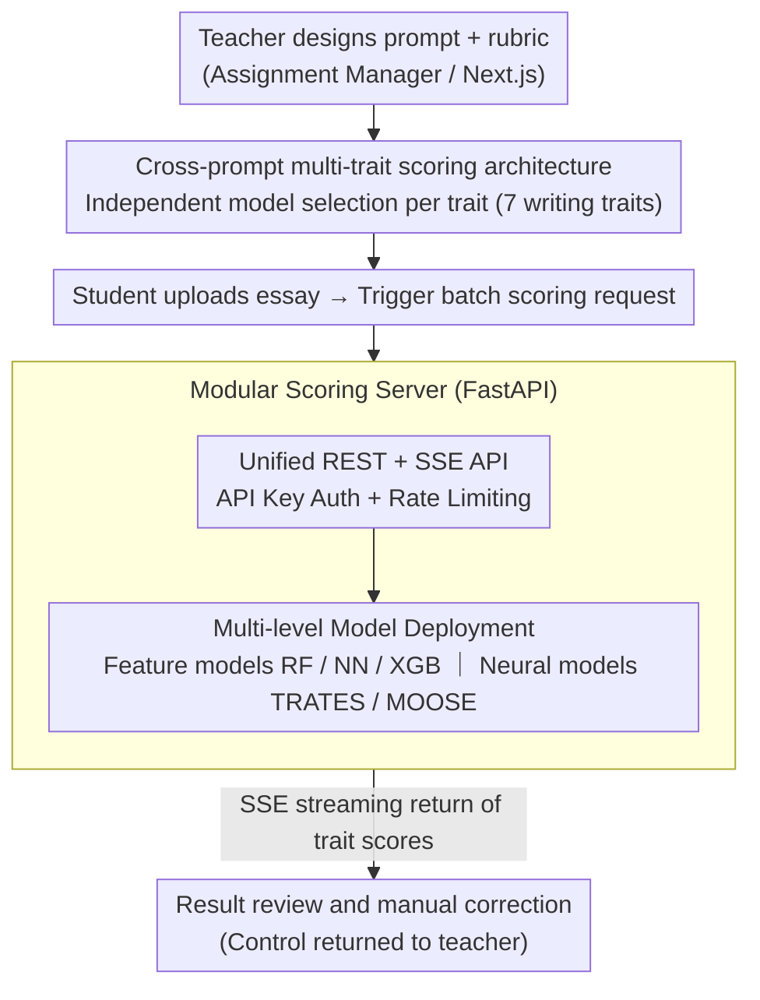

# Qayyem: A Real-time Platform for Scoring Proficiency of Arabic Essays

**Conference**: ACL 2026  
**arXiv**: [2603.01009](https://arxiv.org/abs/2603.01009)  
**Code**: [https://qayyem.qu.edu.qa/](https://qayyem.qu.edu.qa/)  
**Area**: Others  
**Keywords**: Automated Essay Scoring, Arabic NLP, Multi-trait scoring, Cross-prompt generalization, Educational Technology

## TL;DR
Qayyem is the first web platform supporting cross-prompt multi-trait automated essay scoring for Arabic. It integrates various scoring schemes ranging from feature engineering to SOTA neural models, supporting end-to-end academic writing assessment workflows.

## Background & Motivation
**Background**: Automated Essay Scoring (AES) systems have seen significant progress in English contexts, but Arabic AES lags behind significantly due to linguistic complexity and the scarcity of large-scale annotated datasets.

**Limitations of Prior Work**: Existing Arabic writing tools (e.g., Qalam) focus primarily on writing assistance rather than scoring; the only known deployed system, ARWI, only supports prompt-specific modes and lacks multi-trait scoring.

**Key Challenge**: Educational scenarios require a deployable system that can generalize to new prompts and provide separate scores for multi-dimensional writing traits (grammar, organization, vocabulary, etc.), yet existing tools cannot simultaneously satisfy cross-prompt generalization and multi-trait scoring.

**Goal**: To build the first online platform for cross-prompt multi-trait Arabic AES.

**Key Insight**: Using a web platform as a carrier, SOTA scoring models are encapsulated into unified API services, providing a complete workflow of assignment creation-upload-scoring-review.

**Core Idea**: By utilizing cross-prompt models trained on the massive LAILA dataset combined with a modular architectural design, teachers without technical backgrounds can leverage advanced AES models.

## Method

### Overall Architecture
Qayyem solves the problem of "allowing teachers without technical backgrounds to utilize SOTA Arabic essay scoring models" by encapsulating research models and teaching workflows into a deployable web platform. The system adopts a decoupled frontend-backend architecture: the Assignment Manager (a Next.js full-stack application) handles web interaction and assignment management, while the Scoring Server (FastAPI) handles model inference and API services. An essay follows a four-step process from system entry to score acquisition: prompt and rubric design, assignment configuration (selecting traits and models), batch scoring, and result review/manual correction—where the first three steps are automatically linked by the platform, and the last step returns control to the teacher.

### Key Designs

**1. Cross-prompt Multi-trait Scoring Architecture: Decomposing an essay into 7 independent traits for scoring**

Arabic instruction requires feedback on 7 specific writing traits (relevance, organization, vocabulary, style, development, mechanics, and grammar) rather than just a generic total score. Furthermore, the evaluation difficulty and optimal models vary across different traits. Qayyem allows independent model configuration for each trait. All candidate models are trained on the cross-prompt split of the LAILA dataset, enabling generalization to new prompts not seen during training. This allows teachers to select one model for "Grammar" and another for "Organization," combining them freely by trait rather than being locked into a single global model.

**2. Modular Scoring Server: Adding models via configuration files without touching core code**

To ensure long-term evolution, the platform must avoid rewriting inference code every time a new model is added. The Scoring Server uses a configuration file to centrally manage the loading, activation, and metadata of all models. All models follow a shared interface, exposing only a unified REST + SSE API. Access is protected via API Key authentication and rate limiting, while SSE (Server-Sent Events) is used to push real-time batch scoring progress back to the frontend. System administrators can thus perform hot updates—adding or disabling any model without touching the core codebase.

**3. Multi-level Model Deployment: Covering different teaching scenarios with an "Efficiency-Performance" gradient**

The requirements for speed and accuracy differ vastly between real-time classroom check-ins and final large-scale grading; a single model cannot satisfy both. Qayyem simultaneously deploys lightweight feature models (RF, NN, XGB, based on 816 handcrafted features) and two SOTA neural models: TRATES, which uses LLMs to generate trait-specific features overlaid with linguistic features, and MOOSE, which combines MoE, pairwise ranking, and relevance modeling. Teachers can choose an appropriate level based on the scenario, ranging from millisecond-level feature models to the more accurate but minute-level TRATES.

### Loss & Training
All models were trained on the LAILA dataset (7,859 Arabic essays, 8 prompts) using a cross-prompt setting. The evaluation metric is Quadratic Weighted Kappa (QWK), representing the agreement between predicted scores and human ratings. TRATES utilizes the Fanar LLM for feature generation, and MOOSE uses the AraBERT encoder.

## Key Experimental Results

### Main Results
Average QWK for each model across the 8 prompts in the LAILA dataset:

| Model | REL | ORG | VOC | STY | DEV | MEC | GRM | HOL | AVG |
|------|-----|-----|-----|-----|-----|-----|-----|-----|-----|
| RF | 0.331 | 0.609 | 0.644 | 0.637 | 0.573 | 0.559 | 0.609 | 0.682 | 0.581 |
| NN | 0.353 | 0.609 | 0.621 | 0.631 | 0.566 | 0.565 | 0.597 | 0.651 | 0.574 |
| XGB | 0.360 | 0.645 | 0.641 | 0.641 | 0.583 | 0.577 | 0.619 | 0.679 | 0.593 |
| MOOSE | 0.411 | 0.627 | 0.642 | 0.649 | 0.585 | 0.586 | 0.623 | 0.649 | 0.597 |
| **TRATES** | **0.557** | **0.696** | **0.657** | **0.664** | **0.652** | **0.608** | **0.643** | **0.744** | **0.653** |

### Efficiency-Performance Trade-off

| Model | Avg QWK | Inference Time per Essay |
|------|----------|-------------|
| NN | 0.574 | 0.2 s |
| RF | 0.581 | 0.3 s |
| XGB | 0.593 | 0.2 s |
| MOOSE | 0.597 | 1 s |
| TRATES | 0.653 | 30 s |

### Key Findings
- TRATES achieved the best performance across all traits, with an overall QWK of 0.653, which is 5.6 percentage points higher than the runner-up MOOSE.
- TRATES showed the greatest advantage in the Relevance (REL) trait, leading MOOSE by 15 percentage points.
- Differences between models were smaller for Vocabulary and Style (approx. 3.5 points), while gaps in Holistic, Development, and Organization reached up to 9 points.
- The high performance of TRATES comes with a 150× inference overhead (30s vs 0.2s), requiring high-end GPUs or LLM APIs.

## Highlights & Insights
- The first cross-prompt multi-trait Arabic AES system, filling a gap in Arabic educational technology.
- The platform design balances fully automated scoring with decision-support scenarios, supporting manual review and score correction.
- Provides public API access, allowing researchers to call models directly for secondary development.
- The efficiency-performance gradient design allows teachers to flexibly choose scoring schemes based on the scenario.

## Limitations & Future Work
- Currently supports only Arabic, though the bilingual UI design has pre-reserved interfaces for integrating English models.
- TRATES inference is slow (30s/essay); large-scale batch scoring scenarios may require asynchronous queue optimization.
- The LAILA dataset only covers persuasive and expository essays for grades 10-12; generalization to other genres and grade levels remains to be verified.
- The system relies on handcrafted features (816-dimensional). Future work could consider end-to-end multi-trait scoring models.

## Related Work & Insights
- **ARWI**: The only known deployed Arabic AES system, but it only supports prompt-specific modes and lacks multi-trait scoring.
- **CriterionSM / IFlyEA**: Mature AES systems for English/Chinese; Qayyem draws inspiration from their cross-prompt + multi-trait design philosophies.
- **LAILA Dataset**: The first large-scale multi-trait Arabic AES benchmark, serving as the foundation for this system's model training.
- Insight: NLP system engineering for low-resource languages needs to simultaneously address issues at the data, model, and deployment levels.

## Rating
- Novelty: ⭐⭐⭐ (Core contribution lies in system integration rather than model innovation, but fills the Arabic AES platform gap)
- Experimental Thoroughness: ⭐⭐⭐⭐ (Comprehensive cross-prompt evaluation on LAILA with clear efficiency-performance analysis)
- Writing Quality: ⭐⭐⭐⭐ (Detailed description of system design and clear workflow visualization)
- Value: ⭐⭐⭐⭐ (Significant practical deployment value for the field of Arabic educational technology)

## Rating
- Novelty: TBD
- Experimental Thoroughness: TBD
- Writing Quality: TBD
- Value: TBD

<!-- RELATED:START -->

## Related Papers

- [\[CVPR 2026\] PhysSkin: Real-Time and Generalizable Physics-Based Skin Simulation](../../CVPR2026/others/physskin_real-time_and_generalizable_physics-based_animation_via_self-supervised.md)
- [\[CVPR 2026\] FlashVSR: Towards Real-time Diffusion-Based Streaming Video Super Resolution](../../CVPR2026/others/flashvsr_towards_real-time_diffusion-based_streaming_video_super_resolution.md)
- [\[AAAI 2026\] I2E: Real-Time Image-to-Event Conversion for High-Performance Spiking Neural Networks](../../AAAI2026/others/i2e_real-time_image-to-event_conversion_for_high-performance_spiking_neural_netw.md)
- [\[ACL 2025\] DREsS: Dataset for Rubric-based Essay Scoring on EFL Writing](../../ACL2025/others/dress_dataset_rubric_based_essay_scoring_efl_writing.md)
- [\[ACL 2025\] Enhancing Marker Scoring Accuracy through Ordinal Confidence Modelling in Educational Assessments](../../ACL2025/others/enhancing_marker_scoring_accuracy_through_ordinal_confidence_modelling_in_educat.md)

<!-- RELATED:END -->
