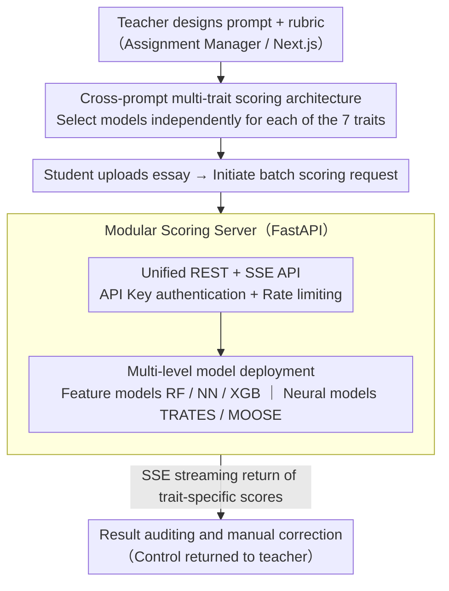

# Qayyem: A Real-time Platform for Scoring Proficiency of Arabic Essays

**Conference**: ACL 2026  
**arXiv**: [2603.01009](https://arxiv.org/abs/2603.01009)  
**Code**: [https://qayyem.qu.edu.qa/](https://qayyem.qu.edu.qa/)  
**Area**: Others  
**Keywords**: Automated Essay Scoring, Arabic NLP, Multi-trait Scoring, Cross-prompt Generalization, Educational Technology

## TL;DR
Qayyem is the first web platform supporting cross-prompt multi-trait Arabic automated essay scoring. It integrates various scoring schemes ranging from feature engineering to SOTA neural models, supporting an end-to-end academic writing evaluation workflow.

## Background & Motivation
**Background**: Automated Essay Scoring (AES) systems have seen significant progress in English contexts, but Arabic AES lags behind due to linguistic complexity and the scarcity of large-scale annotated datasets.

**Limitations of Prior Work**: Existing Arabic writing tools (e.g., Qalam) mostly focus on writing assistance rather than scoring; the only known deployed system, ARWI, only supports prompt-specific modes and lacks multi-trait scoring.

**Key Challenge**: Educational scenarios require a deployable system capable of generalizing to new prompts and providing separate scores for multi-dimensional writing features (grammar, organization, vocabulary, etc.), but existing tools cannot satisfy cross-prompt generalization and multi-trait scoring simultaneously.

**Goal**: Construct the first online platform for cross-prompt multi-trait Arabic AES.

**Key Insight**: Utilizing a web platform as a carrier, various SOTA scoring models are encapsulated into a unified API service, providing a complete workflow for assignment creation, uploading, scoring, and auditing.

**Core Idea**: By using cross-prompt models trained on the large-scale LAILA dataset and a modular architectural design, teachers can utilize advanced AES models without a technical background.

## Method

### Overall Architecture
Qayyem aims to solve the problem of "making SOTA Arabic essay scoring models accessible to teachers without technical backgrounds." Therefore, it encapsulates research models and pedagogical workflows into a deployable web platform. The system adopts a decoupled frontend-backend architecture: the Assignment Manager (a Next.js full-stack application) handles web interactions and assignment management, while the Scoring Server (FastAPI) handles model inference and API services. An essay follows a four-step process from system entry to final scoring: prompt and rubric design, assignment configuration (selecting dimensions and models), batch scoring, and result auditing/manual correction. The platform automatically links the first three steps, while the final step returns control to the teacher.

### Key Designs

**1. Cross-prompt Multi-trait Scoring Architecture: Decomposing an essay into 7 scoring dimensions**

Arabic education requires feedback on seven writing dimensions—Relevance, Organization, Vocabulary, Style, Development, Mechanics, and Grammar—rather than a single holistic score. Furthermore, the evaluation difficulty and optimal models differ across dimensions. Qayyem allows each dimension to be configured with an independent model. All candidate models are trained on the cross-prompt split of the LAILA dataset, allowing them to generalize to unseen prompts. Teachers can thus choose one model for "Grammar" and another for "Organization," combining them freely by trait rather than being restricted to a global model.

**2. Modular Scoring Server: Adding models via configuration files without changing core code**

For the platform to evolve long-term, inference code cannot be rewritten for every new model. The Scoring Server uses a central configuration file to manage the loading, activation, and metadata of all models. All models follow a shared interface and are exposed only through a unified REST + SSE API. Access is protected by API Key authentication and rate limiting, and SSE is used to stream batch scoring progress back to the frontend in real-time. System administrators can thus perform hot updates—adding or disabling any model without touching core code.

**3. Multi-level Model Deployment: Covering different teaching scenarios with an "Effectiveness-Efficiency" gradient**

The requirements for speed and accuracy differ vastly between real-time classroom grading and large-scale final exam evaluation. A single model cannot satisfy both. Qayyem simultaneously deploys lightweight feature-based models (RF, NN, XGB, based on 816 manual features) and two SOTA neural models: TRATES uses LLMs to generate trait-specific features overlaid with linguistic features, while MOOSE combines MoE (Mixture of Experts), pairwise ranking, and relevance modeling. Teachers can choose the appropriate level based on the scenario, ranging from millisecond-level feature models to the more accurate but minute-level TRATES.

### Loss & Training
All models are trained in a cross-prompt setting on the LAILA dataset (7,859 Arabic essays, 8 prompts). The evaluation metric is Quadratic Weighted Kappa (QWK), which measures the consistency between predicted and human scores. TRATES utilizes the Fanar LLM for feature generation, and MOOSE utilizes the AraBERT encoder.

## Key Experimental Results

### Main Results
Average QWK for each model across 8 prompts in the LAILA dataset:

| Model | REL | ORG | VOC | STY | DEV | MEC | GRM | HOL | AVG |
|------|-----|-----|-----|-----|-----|-----|-----|-----|-----|
| RF | 0.331 | 0.609 | 0.644 | 0.637 | 0.573 | 0.559 | 0.609 | 0.682 | 0.581 |
| NN | 0.353 | 0.609 | 0.621 | 0.631 | 0.566 | 0.565 | 0.597 | 0.651 | 0.574 |
| XGB | 0.360 | 0.645 | 0.641 | 0.641 | 0.583 | 0.577 | 0.619 | 0.679 | 0.593 |
| MOOSE | 0.411 | 0.627 | 0.642 | 0.649 | 0.585 | 0.586 | 0.623 | 0.649 | 0.597 |
| **TRATES** | **0.557** | **0.696** | **0.657** | **0.664** | **0.652** | **0.608** | **0.643** | **0.744** | **0.653** |

### Efficiency-Effectiveness Trade-off

| Model | Avg QWK | Inference Time per Essay |
|------|----------|-------------|
| NN | 0.574 | 0.2 s |
| RF | 0.581 | 0.3 s |
| XGB | 0.593 | 0.2 s |
| MOOSE | 0.597 | 1 s |
| TRATES | 0.653 | 30 s |

### Key Findings
- TRATES achieves the best performance across all dimensions, with an overall QWK of 0.653, which is 5.6 percentage points higher than the runner-up, MOOSE.
- TRATES shows the largest advantage in the Relevance (REL) dimension, leading MOOSE by 15 percentage points.
- Differences between models are smaller in Vocabulary and Style dimensions (approx. 3.5 points), whereas gaps in Holistic, Development, and Organization can reach 9 points.
- The high performance of TRATES comes with a 150× inference overhead (30s vs 0.2s), requiring high-end GPUs or LLM APIs.

## Highlights & Insights
- The first cross-prompt multi-trait Arabic AES system, filling a gap in Arabic educational technology.
- The platform design accommodates both fully automated scoring and decision-support scenarios, supporting manual auditing and score correction.
- Provides public API access, facilitating researchers to call models directly for secondary development.
- The efficiency-effectiveness gradient design allows teachers to flexibly select scoring schemes based on the scenario.

## Limitations & Future Work
- Currently supports only Arabic, though the bilingual UI design reserves interfaces for integrating English models.
- TRATES inference is slow (30s/essay); large-scale batch scoring scenarios may require asynchronous queue optimization.
- The LAILA dataset covers only persuasive and explanatory essays for grades 10-12; generalization to other genres and grade levels remains to be verified.
- The system relies on manual features (816 dimensions); future work could consider end-to-end multi-trait scoring models.

## Related Work & Insights
- **ARWI**: The only known deployed Arabic AES system, but it only supports prompt-specific modes and lacks multi-trait scoring.
- **CriterionSM / IFlyEA**: Mature AES systems for English/Chinese; Qayyem draws inspiration from their cross-prompt + multi-trait design philosophy.
- **LAILA Dataset**: The first large-scale multi-trait Arabic AES benchmark, serving as the foundation for this system's model training.
- Insight: NLP system engineering for low-resource languages needs to simultaneously address three levels: data, models, and deployment.

## Rating
- Novelty: ⭐⭐⭐ Core contribution lies in system integration rather than model innovation, but fills the Arabic AES platform gap.
- Experimental Thoroughness: ⭐⭐⭐⭐ Comprehensive cross-prompt evaluation on LAILA with clear efficiency-effectiveness analysis.
- Writing Quality: ⭐⭐⭐⭐ Detailed system design descriptions and clear workflow visualization.
- Value: ⭐⭐⭐⭐ Practical deployment value for the field of Arabic educational technology.

## Rating
- Novelty: To be rated
- Experimental Thoroughness: To be rated
- Writing Quality: To be rated
- Value: To be rated

<!-- RELATED:START -->

## Related Papers

- [\[AAAI 2026\] I2E: Real-Time Image-to-Event Conversion for High-Performance Spiking Neural Networks](../../AAAI2026/others/i2e_real-time_image-to-event_conversion_for_high-performance_spiking_neural_netw.md)
- [\[ACL 2025\] DREsS: Dataset for Rubric-based Essay Scoring on EFL Writing](../../ACL2025/others/dress_dataset_rubric_based_essay_scoring_efl_writing.md)
- [\[ACL 2025\] Guidelines for Fine-grained Sentence-level Arabic Readability Annotation](../../ACL2025/others/guidelines_for_fine-grained_sentence-level_arabic_readability_annotation.md)
- [\[ACL 2025\] Enhancing Marker Scoring Accuracy through Ordinal Confidence Modelling in Educational Assessments](../../ACL2025/others/enhancing_marker_scoring_accuracy_through_ordinal_confidence_modelling_in_educat.md)
- [\[ACL 2025\] FRACTAL: Fine-Grained Scoring from Aggregate Text Labels](../../ACL2025/others/fractal_fine-grained_scoring_from_aggregate_text_labels.md)

<!-- RELATED:END -->
