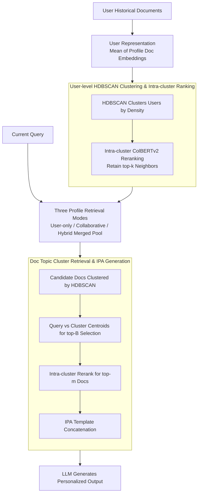

# ClusterRAG: Cluster-Based Collaborative Filtering for Personalized Retrieval-Augmented Generation

**Conference**: ACL2026  
**arXiv**: [2605.18769](https://arxiv.org/abs/2605.18769)  
**Code**: https://github.com/academicprojects44/anonymous  
**Area**: Personalized Recommendation / Personalized RAG  
**Keywords**: Personalized RAG, Collaborative Filtering, User Clustering, HDBSCAN, LaMP

## TL;DR
ClusterRAG introduces collaborative filtering into personalized RAG by constructing user representations from historical documents and clustering them with HDBSCAN. It hierarchically retrieves profile documents from both the target user and similar users to compose prompts, enabling the hybrid mode to outperform vanillaRAG, LaMP-IPA, ROPG, and CFRAG across the LaMP multi-task benchmark.

## Background & Motivation
**Background**: RAG has become the mainstream paradigm for mitigating hallucinations and enhancing factuality. Typical approaches involve retrieving external documents based on the current query and concatenating the results into the generative model's context. Personalized RAG further introduces user history to align responses with user preferences, writing styles, or long-term interests.

**Limitations of Prior Work**: Many personalized RAG systems only examine the target user's own profile, which is fragile when user history is sparse, noisy, or when the current query does not perfectly match historical records. On the other end, non-personalized RAG completely ignores long-term preferences. Existing collaborative methods attempt to find similar users but suffer from high costs when calculating pairwise similarities in large-scale user sets. Furthermore, systematic designs for selecting and mixing documents from similar users' profiles with the target user's profile are lacking.

**Key Challenge**: Personalization requires full utilization of the target user's history, yet individual histories are often incomplete. Collaborative filtering can compensate for sparsity but introduces retrieval complexity, privacy concerns, and noise from "neighbor" users. A scalable Personalized RAG needs a controllable way to mix "individual signals" with "similar group signals."

**Goal**: ClusterRAG aims to build a model-agnostic pipeline with replaceable retrievers that leverages collaborative signals without heavy reliance on model fine-tuning. It addresses three problems: user representation, efficient search for similar users, and the integration of target and similar user documents into the generation prompt.

**Key Insight**: The authors transfer cluster-based collaborative filtering from recommendation systems to the RAG retrieval frontend. Users are organized into semantically consistent cohorts; search for similar users is restricted to intra-cluster ranking. Document retrieval also employs document-level clustering to select topic clusters before fine-grained reranking.

**Core Idea**: Use HDBSCAN to construct a hierarchical retrieval space for users and documents, then apply hybrid profile retrieval to inject evidence from both the target user and similar users, resulting in more stable personalized outputs from the LLM.

## Method

### Overall Architecture
ClusterRAG consists of three stages: user representation and similar user retrieval, profile document retrieval, and personalized generation. First, the system encodes each user's historical documents into dense embeddings and averages them to obtain a user representation. HDBSCAN is then used to group users into variable-density clusters, within which ColBERTv2 calculates fine-grained similarity to retain top-$k$ neighbors. Given a query, the system can retrieve documents from the target user, similar users, or a hybrid of both. Finally, candidate documents are clustered into topic groups; relevant clusters are selected, and top-$m$ documents are reranked and formatted into an IPA prompt for the generator.

### Key Designs

**1. User-level HDBSCAN Clustering & Intra-cluster Ranking: Avoiding Global Pairwise Comparisons**

Calculating pairwise similarities in large user sets is computationally expensive and risks introducing noise by matching users with unrelated topics. ClusterRAG represents each user $u$ as the mean of their profile document embeddings $\mathbf{z}_u=\frac{1}{n_u}\sum_i f(d_i)$. HDBSCAN automatically discovers variable-sized user clusters based on density. Fine-grained similarity $R^C_{u,v}=ColBERTv2(\mathbf{z}_u,\mathbf{z}_v)$ is computed only within the same cluster to retain top-$k$ neighbors. This restricts computation to semantically consistent cohorts, reducing overhead and filtering cross-topic noise.

**2. Three Profile Retrieval Modes: Controlled Mixing of Individual and Collaborative Signals**

Relying solely on the target user's profile is risky during cold starts or with sparse history, while relying purely on similar users can dilute individual preferences. ClusterRAG provides three modes: **User-only** uses only the target profile, **Collaborative** retrieves from top-$k$ similar users' profiles, and **Hybrid** merges both into a candidate pool. Even under the constrained setting of $k=1$ and $m=2$ (using one neighbor and two total documents), the hybrid mode consistently outperforms others, proving that collaborative evidence complements rather than replaces individual context.

**3. Document Topic Cluster Retrieval & IPA Generation: Hierarchical Search for Context Efficiency**

Inserting all historical documents into a prompt wastes context length and introduces irrelevant noise. ClusterRAG encodes candidate profile documents with a dense retriever and clusters them via HDBSCAN to calculate centroids. Given a query, the query embedding is compared against centroids to select top-$B$ clusters, followed by intra-cluster reranking to select top-$m$ documents. For generation, In-Prompt Augmentation (IPA) concatenates the query and retrieved documents. The space occupied by the profile in the prompt is controlled by $|U_p|=\mathcal{G}_t(L_{max}-\min(|q|,\lfloor \gamma L_{max}\rfloor))$ (default $\gamma=0.55$). This hierarchical retrieval reduces complexity to $\mathcal{O}(K+B\cdot N/K)$ while ensuring only context-relevant evidence enters the prompt.

### Main Results Example
For a LaMP personalized headline generation task with $k=1$, $B$ topic clusters, and $m=2$: If target user Alice has sparse history, the system calculates $\mathbf{z}_{\text{Alice}}$ and locates her cluster. Inside the cluster, Bob is identified as her most similar neighbor ($k=1$). The Hybrid mode merges Alice's and Bob's profiles (e.g., 40 documents total). These are clustered into topics; the query selects the top-$B$ relevant clusters, and the top-2 documents are reranked from those clusters. These 2 documents and the query are fed into FlanT5-base via the IPA template. The pipeline contracts the search space from "40 docs → ~10 docs → 2 docs," filling Alice's history gaps without overcrowding the prompt.

### Loss & Training
ClusterRAG is a retrieval and prompt organization framework that does not require structural changes to the generator. Main experiments use fine-tuned FlanT5-base, with extensions using FlanT5-XXL and Qwen2-7B-Instruct for zero-shot testing. Training employs AdamW with a learning rate of $5\times10^{-5}$, weight decay of $10^{-4}$, and a warm-up ratio of 0.05 for up to 30 epochs. Batch size is 16, max prompt length is 512, max output length is 128, and beam size is 4. Experiments were conducted on Quadro RTX 8000 48GB GPUs, taking 10-24 hours per task.

## Key Experimental Results

### Main Results
The LaMP benchmark includes tasks like personalized citation, movie tagging, product rating, and headline generation. The table highlights representative metrics; classification metrics are better when higher, while LaMP-3 (MAE/RMSE) is better when lower.

| Method | LaMP-1 Acc/F1 | LaMP-2 Acc/F1 | LaMP-3 MAE/RMSE | LaMP-7 R-1/R-L |
|------|---------------|---------------|-----------------|----------------|
| vanillaRAG | 0.630 / 0.630 | 0.520 / 0.440 | 0.371 / 0.709 | 0.310 / 0.273 |
| LaMP-IPA | 0.674 / 0.664 | 0.570 / 0.522 | 0.289 / 0.608 | 0.508 / 0.457 |
| CFRAG | 0.633 / 0.327 | 0.534 / 0.036 | 0.354 / 0.707 | 0.375 / 0.306 |
| ClusterRAG-C | 0.674 / 0.673 | 0.644 / 0.607 | 0.284 / 0.624 | 0.507 / 0.454 |
| ClusterRAG-U | 0.645 / 0.645 | 0.649 / 0.612 | 0.271 / 0.599 | 0.514 / 0.464 |
| ClusterRAG-H | 0.690 / 0.690 | 0.661 / 0.620 | 0.270 / 0.594 | 0.521 / 0.470 |

### Ablation Study

| Variant | LaMP-3 MAE | LaMP-3 RMSE | LaMP-7 R-1 | LaMP-7 R-L | Description |
|------|-----------:|------------:|-----------:|-----------:|------|
| w/o user clustering | 0.320 | 0.637 | 0.458 | 0.371 | Random neighbors introduce noise |
| w/o intra-cluster sim | 0.329 | 0.639 | 0.501 | 0.442 | Neighbor quality drops without reranking |
| w/o doc ranking | 0.331 | 0.642 | 0.462 | 0.413 | Evidence not effectively prioritized |
| Centroids only | 0.400 | 0.643 | 0.472 | 0.438 | Loss of specific evidence |
| k-means | 0.291 | 0.610 | 0.502 | 0.453 | Inferior to HDBSCAN |
| ClusterRAG | 0.270 | 0.594 | 0.521 | 0.470 | Full methodology |

### Key Findings
- **Hybrid mode** achieves the best performance across all LaMP tasks, demonstrating strong complementarity between target and similar user profiles.
- Using only **2 profile documents** allows the model to outperform baselines using more history, indicating that selecting the "right" documents is more critical than increasing quantity.
- **ColBERTv2** is the strongest retriever, while BM25 and Random methods significantly lag.
- **Zero-shot LLMs** also benefit: pFlan improved from 0.546 to 0.648 on LaMP-1, and pQwen2 improved from 0.521 to 0.610 on LaMP-2.

## Highlights & Insights
- **Collaborative Filtering as a RAG Frontend**: By avoiding modifications to the LLM, the method is easily integrable into existing personalized generation pipelines.
- **Hierarchical Clustering**: User clustering answers "who to borrow from," while document clustering answers "what to borrow," providing a clear structural separation.
- **Hybrid Retrieval Efficacy**: The stability of the hybrid approach indicates that personalization benefits from supplementing context with similar user evidence rather than just relying on local user history.
- **Cold Start Utility**: It effectively fills history gaps for sparse-history users while retaining the ability to revert to user-only mode if collaborative signals are untrustworthy.

## Limitations & Future Work
- The framework relies on IPA prompt organization; more structured prompts or joint retrieval-generation optimization could yield further gains.
- Some LaMP tasks (1 and 5) only provide abstracts, limiting the information ceiling for citation and title tasks.
- Evaluation is limited to English text; multi-lingual and multi-modal histories remain unverified.
- Privacy concerns regarding collaborative filtering and the risk of magnifying group biases through user embeddings require more exploration.

## Related Work & Insights
- **vs vanillaRAG / Self-RAG**: Traditional RAG focuses on shared knowledge; ClusterRAG incorporates long-term user and group histories.
- **vs LaMP-IPA / ROPG**: Prior personalized methods focus on individual profiles; ClusterRAG adds explicit cross-user collaborative modeling.
- **vs CFRAG**: While CFRAG uses contrastive learning for neighbors, ClusterRAG uses HDBSCAN and intra-cluster ColBERTv2 for scalable cohort retrieval.
- **Insight**: In enterprise or educational assistants, similar user histories can serve as "collaborative memory," provided clusters are constrained by permissions.

## Rating
- **Novelty**: ⭐⭐⭐⭐☆ Systematically combines collaborative filtering with Personalized RAG; while components are known, the assembly is robust.
- **Experimental Thoroughness**: ⭐⭐⭐⭐☆ Extensive task coverage, retriever/LLM analysis, and ablation; lacks real-world latency and large-scale privacy evaluation.
- **Writing Quality**: ⭐⭐⭐⭐☆ Methodology is well-structured, though some prompt details are dense.
- **Value**: ⭐⭐⭐⭐☆ Highly insightful for personalized RAG, especially in sparse-history scenarios.

<!-- RELATED:START -->

## Related Papers

- [\[ACL 2026\] MemRec: Collaborative Memory-Augmented Agentic Recommender System](memrec_collaborative_memory-augmented_agentic_recommender_system.md)
- [\[AAAI 2026\] SlideTailor: Personalized Presentation Slide Generation for Scientific Papers](../../AAAI2026/recommender/slidetailor_personalized_presentation_slide_generation_for_scientific_papers.md)
- [\[ICML 2026\] Rethinking Contrastive Learning for Graph Collaborative Filtering: Limitations and a Simple Remedy](../../ICML2026/recommender/rethinking_contrastive_learning_for_graph_collaborative_filtering_limitations_an.md)
- [\[NeurIPS 2025\] FACE: A General Framework for Mapping Collaborative Filtering Embeddings into LLM Tokens](../../NeurIPS2025/recommender/face_a_general_framework_for_mapping_collaborative_filtering_embeddings_into_llm.md)
- [\[NeurIPS 2025\] Semantic Retrieval Augmented Contrastive Learning for Sequential Recommendation](../../NeurIPS2025/recommender/semantic_retrieval_augmented_contrastive_learning_for_sequential_recommendation.md)

<!-- RELATED:END -->
