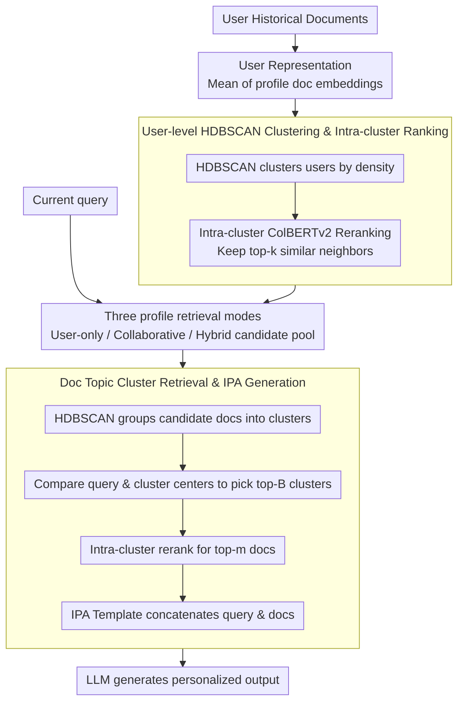

# ClusterRAG: Cluster-Based Collaborative Filtering for Personalized Retrieval-Augmented Generation

**Conference**: ACL2026  
**arXiv**: [2605.18769](https://arxiv.org/abs/2605.18769)  
**Code**: https://github.com/academicprojects44/anonymous  
**Area**: Personalized Recommendation / Personalized RAG  
**Keywords**: Personalized RAG, Collaborative Filtering, User Clustering, HDBSCAN, LaMP

## TL;DR
ClusterRAG introduces collaborative filtering into personalized RAG: it first constructs user representations from historical documents and performs clustering using HDBSCAN, then hierarchically retrieves profile documents from both the target user and similar users to form the prompt. On the LaMP multi-task benchmark, the hybrid mode consistently outperforms vanillaRAG, LaMP-IPA, ROPG, and CFRAG.

## Background & Motivation
**Background**: RAG has become a mainstream paradigm for reducing hallucinations and enhancing factuality. The typical approach involves retrieving external documents based on the current query and prepending them to the generation model's context. Personalized RAG further incorporates user history to align outputs with user preferences, writing styles, or long-term interests.

**Limitations of Prior Work**: Many personalized RAG methods focus solely on the target user's own profile, which is fragile when user history is sparse, noisy, or when the current query does not align well with historical records. Alternatively, non-personalized RAG completely ignores long-term preferences. Existing collaborative methods attempt to find similar users but face high costs from pairwise similarity calculations across large user sets. Furthermore, there is a lack of systematic design for selecting and mixing documents from similar users with the target user’s profile.

**Key Challenge**: Personalization requires full utilization of the target user's history, but individual histories are often incomplete. Collaborative filtering can compensate for sparsity but introduces retrieval complexity, privacy concerns, and noise from "dissimilar" neighbors. A scalable Personalized RAG needs a controllable way to mix "individual signals" and "similar group signals."

**Goal**: ClusterRAG aims to build a model-agnostic, retriever-replaceable RAG pipeline that leverages collaborative signals without relying heavily on model fine-tuning. It addresses three problems: user representation, efficient search for similar users, and the integration of target and similar user documents into the generation prompt.

**Key Insight**: The authors transfer clustering-based collaborative filtering from recommendation systems to the RAG retrieval front-end. Users are organized into semantically consistent cohorts, and similar users are searched only within the same cluster. Document retrieval also employs thematic clustering of profile documents to select topic clusters before performing fine-grained reranking.

**Core Idea**: Use HDBSCAN to construct a hierarchical retrieval space for users and documents, then use hybrid profile retrieval to inject evidence from both the target user and similar users, enabling LLMs to generate more stable personalized outputs.

## Method

### Overall Architecture
ClusterRAG comprises three stages: user representation and similar user retrieval, profile document retrieval, and personalized generation. First, the system encodes each user's historical documents into dense embeddings and computes the mean to obtain a user representation. HDBSCAN is then used to group users into variable-density clusters, within which ColBERTv2 calculates fine-grained user similarity to retain the top-$k$ nearest neighbors. Given a query, the system can retrieve documents from only the target user, only similar users, or a hybrid of both. Finally, candidate documents are clustered into thematic groups; the most relevant clusters are selected, and top-$m$ documents are reranked for inclusion in the IPA prompt for the generation model.

### Key Designs

**1. User-level HDBSCAN Clustering & Intra-cluster Ranking: Clustering before ranking to avoid global pairwise comparison**

Pairwise similarity calculations across massive user sets are computationally expensive and risk introducing noise from irrelevant users. ClusterRAG represents each user $u$ as the mean of their profile document embeddings $\mathbf{z}_u=\frac{1}{n_u}\sum_i f(d_i)$ and uses HDBSCAN to automatically discover variable-sized user clusters based on density. Fine-grained similarity $R^C_{u,v}=ColBERTv2(\mathbf{z}_u,\mathbf{z}_v)$ is then computed only within the same cluster to find the top-$k$ neighbors. This limits computation to consistent cohorts, reducing overhead and filtering out cross-topic noise.

**2. Three Profile Retrieval Modes: Explicitly controlling the ratio of individual and collaborative signals**

Relying solely on the target user is fragile during cold-starts or with sparse history, while relying purely on similar users can dilute personal preferences. ClusterRAG offers three modes: User-only (target user profile), Collaborative (top-$k$ similar users' profiles), and Hybrid (merging both). The paper uses a minimal setting of $k=1$ and $m=2$ to test if collaborative signals help even under extreme constraints—hybrid mode leads significantly, showing that personalization is improved by supplementing context with similar user evidence rather than simple replacement.

**3. Document Topic Cluster Retrieval & IPA Generation: Hierarchical pruning to optimize prompt length**

Feeding all historical documents of candidate users into a prompt wastes context space and introduces irrelevant noise. ClusterRAG encodes candidate profile documents with a dense retriever and clusters them via HDBSCAN. For a given query, it compares the query embedding with cluster centers to select the top-$B$ clusters, then reranks within those clusters for the top-$m$ documents. During generation, In-Prompt Augmentation (IPA) uses task-specific templates to concatenate the query and retrieved documents. Prompt length for profiles is controlled by $|U_p|=\mathcal{G}_t(L_{max}-\min(|q|,\lfloor \gamma L_{max}\rfloor))$ (default $\gamma=0.55$). This hierarchical retrieval reduces complexity to $\mathcal{O}(K+B\cdot N/K)$ while ensuring only the most relevant evidence enters the prompt.

### A Complete Example
Using the LaMP personalized headline generation task with default settings ($k=1$, $B$ topic clusters, $m=2$): Alice has a sparse profile. The system computes $\mathbf{z}_{\text{Alice}}$ and locates her cluster. Inside the cluster, ColBERTv2 identifies Bob as the most similar neighbor ($k=1$). In Hybrid mode, Alice's and Bob's profile documents are merged into a pool (e.g., 40 documents). These are clustered by topic; the query identifies the top-$B$ relevant clusters (narrowing candidates to ~10-15 docs). The top-2 documents are then reranked from these clusters. Finally, these 2 documents and the query are formatted via the IPA template and passed to FlanT5-base to generate the headline. This pipeline shrinks the search space from "40 docs → 15 docs → 2 docs," filling Alice's history gap without crowding the prompt.

### Loss & Training
ClusterRAG is a retrieval and prompt organization framework and does not require modifying the generation model architecture. Main experiments utilize fine-tuned FlanT5-base; extension experiments include FlanT5-XXL and Qwen2-7B-Instruct for zero-shot personalized testing. Training uses AdamW with a learning rate of $5\times10^{-5}$, weight decay of $10^{-4}$, warm-up ratio of 0.05, up to 30 epochs, batch size 16, max prompt length 512, max output length 128, and beam size 4. Experiments were conducted on Quadro RTX 8000 48GB GPUs, taking 10-24 hours per task.

## Key Experimental Results

### Main Results
The LaMP benchmark includes tasks like personalized citation, movie tagging, product rating, headline/title generation, and tweet paraphrasing. Representative metrics are extracted below; higher is better for classification, while lower MAE/RMSE is better for LaMP-3.

| Method | LaMP-1 Acc/F1 | LaMP-2 Acc/F1 | LaMP-3 MAE/RMSE | LaMP-7 R-1/R-L |
|------|---------------|---------------|-----------------|----------------|
| vanillaRAG | 0.630 / 0.630 | 0.520 / 0.440 | 0.371 / 0.709 | 0.310 / 0.273 |
| LaMP-IPA | 0.674 / 0.664 | 0.570 / 0.522 | 0.289 / 0.608 | 0.508 / 0.457 |
| CFRAG | 0.633 / 0.327 | 0.534 / 0.036 | 0.354 / 0.707 | 0.375 / 0.306 |
| ClusterRAG-C | 0.674 / 0.673 | 0.644 / 0.607 | 0.284 / 0.624 | 0.507 / 0.454 |
| ClusterRAG-U | 0.645 / 0.645 | 0.649 / 0.612 | 0.271 / 0.599 | 0.514 / 0.464 |
| ClusterRAG-H | 0.690 / 0.690 | 0.661 / 0.620 | 0.270 / 0.594 | 0.521 / 0.470 |

### Ablation Study
| Variant | LaMP-3 MAE | LaMP-3 RMSE | LaMP-7 R-1 | LaMP-7 R-L | Description |
|------|-----------:|------------:|-----------:|-----------:|------|
| w/o user clustering | 0.320 | 0.637 | 0.458 | 0.371 | Random neighbors make collaborative signals noisy |
| w/o intra-cluster sim | 0.329 | 0.639 | 0.501 | 0.442 | No intra-cluster ranking reduces neighbor quality |
| w/o doc ranking | 0.331 | 0.642 | 0.462 | 0.413 | Document-level evidence is not effectively ranked |
| Centroids only | 0.400 | 0.643 | 0.472 | 0.438 | Using only centroid representations loses specific evidence |
| k-means | 0.291 | 0.610 | 0.502 | 0.453 | Clustering is replaceable but weaker than HDBSCAN |
| ClusterRAG | 0.270 | 0.594 | 0.521 | 0.470 | Full method |

### Key Findings
- The Hybrid mode achieves the best results across all LaMP tasks, demonstrating strong complementarity between the target user profile and similar user profiles.
- Utilizing only 2 profile documents outperforms baselines requiring more documents, suggesting that selecting the "right" documents is more critical than quantity.
- ColBERTv2 is the strongest retriever: achieving 0.690/0.690, 0.661/0.620, and 0.521/0.470 on LaMP-1/2/7 respectively; Random, Recency, and BM25 significantly lag behind.
- Zero-shot LLMs also benefit: pFlan improved from 0.546/0.540 to 0.648/0.647 on LaMP-1, and pQwen2 improved from 0.521/0.521 to 0.610/0.606 on LaMP-2.

## Highlights & Insights
- **Collaborative Filtering as a RAG Front-end**: The method integrates into existing personalized generation systems without modifying the LLM or fine-tuning per user.
- **Hierarchical Responsibility**: User clustering solves "from whom to borrow signals," while document clustering solves "which evidence to borrow."
- **Core Benefit from Hybrid Retrieval**: Results show that while user-only and collaborative-only modes are effective, the hybrid mixture is most robust, proving personalization needs supplemental context.
- **Cold-start Significance**: When target user history is sparse, similar user documents fill the gap; if collaborative signals are unreliable, the framework reverts to user-only mode.

## Limitations & Future Work
- The generation side relies on IPA prompts; the authors acknowledge prompt formulation is not yet optimal. Structured prompts or joint retrieval-generation optimization could improve results.
- LaMP-1 and LaMP-5 contain only abstracts rather than full papers, limiting the information ceiling for citation/title tasks.
- Experiments are restricted to English and text datasets; multi-lingual, multi-modal, or cross-platform scenarios remain unverified.
- Performance depends on the underlying LLM and retriever; any bias in user or document embeddings could be amplified by collaborative filtering.
- Future work could explore incremental clustering, online user reassignment, privacy-preserving embedding aggregation, and feeding generation feedback back into retrieval ranking.

## Related Work & Insights
- **vs vanillaRAG / Self-RAG**: Traditional RAG retrieves shared knowledge based on queries; ClusterRAG incorporates long-term and similar-user histories.
- **vs LaMP-IPA / ROPG**: These methods focus primarily on the target user's profile; ClusterRAG contributes explicit modeling of cross-user collaborative signals.
- **vs CFRAG**: CFRAG uses contrastive learning for neighbor search; ClusterRAG uses HDBSCAN and intra-cluster ColBERTv2 ranking for scalable cohort retrieval and document-level reranking.
- **Insight**: In enterprise or educational assistants, historical interactions of similar users/projects can serve as "collaborative memory," provided retrieval is constrained by clustering and permission controls.

## Rating
- Novelty: ⭐⭐⭐⭐☆ Combines CF and Personalized RAG systematically; individual modules are known, but the combination is comprehensive.
- Experimental Thoroughness: ⭐⭐⭐⭐☆ Diverse LaMP tasks, multiple retrievers, and LLM analyses are provided; real-world large-scale latency and privacy assessments are still needed.
- Writing Quality: ⭐⭐⭐⭐☆ Methods are clearly decomposed; some notation and prompt details are somewhat dense.
- Value: ⭐⭐⭐⭐☆ Highly instructive for personalized RAG engineering, particularly for scenarios with sparse user history and available group behavior.

<!-- RELATED:START -->

## Related Papers

- [\[ACL 2026\] MemRec: Collaborative Memory-Augmented Agentic Recommender System](memrec_collaborative_memory-augmented_agentic_recommender_system.md)
- [\[AAAI 2026\] SlideTailor: Personalized Presentation Slide Generation for Scientific Papers](../../AAAI2026/recommender/slidetailor_personalized_presentation_slide_generation_for_scientific_papers.md)
- [\[ICML 2026\] Rethinking Contrastive Learning for Graph Collaborative Filtering: Limitations and a Simple Remedy](../../ICML2026/recommender/rethinking_contrastive_learning_for_graph_collaborative_filtering_limitations_an.md)
- [\[NeurIPS 2025\] FACE: A General Framework for Mapping Collaborative Filtering Embeddings into LLM Tokens](../../NeurIPS2025/recommender/face_a_general_framework_for_mapping_collaborative_filtering_embeddings_into_llm.md)
- [\[NeurIPS 2025\] Semantic Retrieval Augmented Contrastive Learning for Sequential Recommendation](../../NeurIPS2025/recommender/semantic_retrieval_augmented_contrastive_learning_for_sequential_recommendation.md)

<!-- RELATED:END -->
