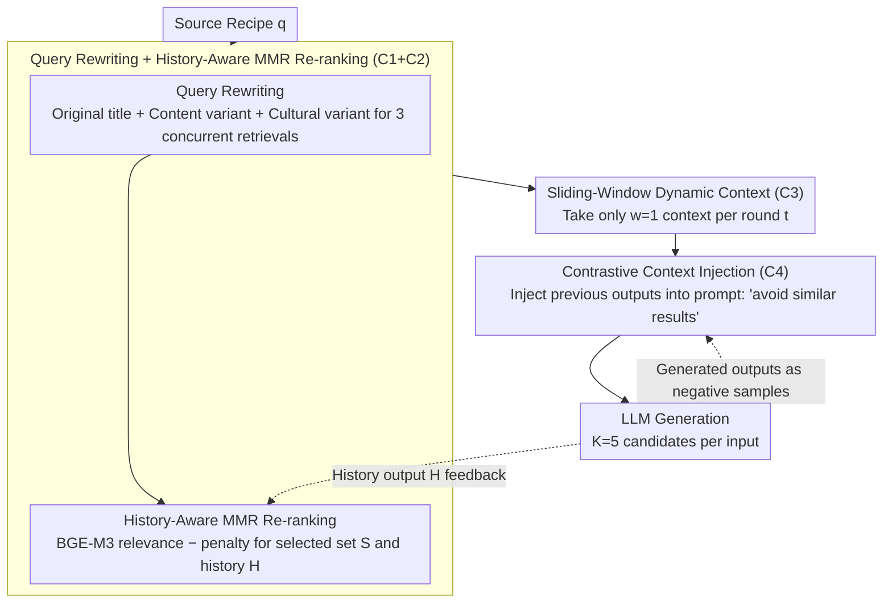

# Culinary Crossroads: A RAG Framework for Enhancing Diversity in Cross-Cultural Recipe Adaptation

**Conference**: ACL 2026  
**arXiv**: [2507.21934](https://arxiv.org/abs/2507.21934)  
**Code**: <https://github.com/TenneyHu/CARRIAGE>  
**Area**: Recommendation / RAG / Cross-cultural Generation  
**Keywords**: Cross-cultural recipe adaptation, RAG, Diversity, MMR, Contrastive context, CultureScore

## TL;DR
The authors discover that standard RAG suffers from "diversity collapse" in creative tasks—failing to produce diverse outputs even when provided with diverse contexts. They design CARRIAGE, a plug-and-play framework featuring query rewriting, diversity-aware MMR re-ranking, sliding-window dynamic context, and contrastive context injection. It effectively translates "contextual diversity" into "output diversity," improving lexical, semantic, and ingredient diversity alongside CultureScore in Spanish cross-national recipe adaptation, achieving Pareto efficiency over closed-book LLMs.

## Background & Motivation
**Background**: Cross-cultural recipe adaptation involves rewriting source culture recipes into target culture versions—preserving the "soul" of the original dish while aligning with target dietary habits. Existing works (Cao et al. 2024, Hu et al. 2024, Pandey et al. 2025) treat this as a cross-cultural translation task using prompt-based LLMs or Information Retrieval (CARROT) to fetch authentic recipes from the target culture.

**Limitations of Prior Work**: Previous work focuses almost exclusively on "quality," neglecting "diversity." In reality, adapting a Mexican Nopal dish for a Spanish kitchen allows for multiple valid substitutions (spinach, asparagus, green beans, etc.). User preferences vary significantly; a recipe adaptation system should provide multiple reasonable outputs for a single input. When applying RAG to such "multi-valid answer" creative tasks, the authors observed that RAG outputs are surprisingly less diverse than those of closed-book LLMs, even with diverse contexts.

**Key Challenge**: Classic RAG design assumes a 1-to-1 factual mapping from "context → output," whereas creative tasks require a 1-to-many mapping. LLMs tend to focus on a single segment of the context while ignoring others (lost-in-the-middle). Combined with the retriever repeatedly returning similar results for the same query, output diversity is doubly suppressed.

**Goal**: (1) Verify whether standard RAG can produce diverse outputs under diverse contexts; (2) Design automatic evaluation metrics balancing quality and diversity; (3) Propose a plug-and-play RAG framework to effectively transmit contextual diversity to output diversity.

**Key Insight**: Diversity suppression is decomposed into four independent failure points: C1 (retrieval omission due to cultural gaps), C2 (lack of diversity awareness in ranking), C3 (concentrated utilization of limited context by LLMs), and C4 (diversity-unaware generation). Each failure point is addressed by a lightweight component.

**Core Idea**: Construct CARRIAGE (Cultural-Aware Recipe Retrieval Augmented GEneration): query rewriting + history-aware MMR re-ranking + sliding-window dynamic context organization + contrastive context injection. Each step addresses one specific failure point. The framework is training-free and can be integrated into any LLM.

## Method

### Overall Architecture
CARRIAGE addresses "diversity collapse" in standard RAG for creative tasks by decomposing the problem into four failure points (C1–C4). Given a source recipe $q$, it sequentially undergoes query rewriting → history-aware MMR re-ranking → sliding-window dynamic context → contrastive context injection to produce $K=5$ adaptation candidates. Generated outputs from each round are fed back into the MMR history set and used as negative samples for contrastive injection, forming a session-level deduplication loop. The entirely inference-time, training-free pipeline is compatible with any LLM.

### Key Designs

**1. Query Rewriting + Historical-MMR Re-ranking: Broadening and De-duplicating the Retrieval Pool (C1+C2)**
Cultural gaps cause single-query retrieval to be incomplete, while pure relevance ranking repeatedly pushes the same recipes to the top. CARRIAGE uses an LLM to rewrite the source title into two variants (one content-based, one target-culture adapted), triggering 3 concurrent retrievals to broaden the recall. Relevance is scored using BGE-M3, extending classic MMR to penalize similarity with both the "currently selected set $S$" and the "historical RAG output set $H$":

$$\text{Score}(D_i) = \max_{D_i \in R \setminus S} \left[\lambda \cdot \text{Rel}(D_i) - (1-\lambda) \cdot \max_{D_j \in S \cup H} \text{Sim}(D_i, D_j)\right], \quad \lambda=0.6$$

Integrating "historical output $H$" into the similarity term is a key innovation: traditional MMR only ensures top-$k$ diversity within a single retrieval, but tends to repeat the same documents across multiple generation rounds. The history term suppresses previously used recipes, forcing the system to pull new, unconsumed cultural variations.

**2. Dynamic Context Organization: Input-side windowing to transmit contextual diversity (C3)**
Even with diverse contexts, LLMs often copy from only 1-2 segments—a "creative version" of being lost-in-the-middle. Instead of relying on the model to utilize context uniformly, CARRIAGE ensures each round sees different contexts: for $k$ contexts $\mathcal{C} = \{D_1, \ldots, D_k\}$, round $t$ uses a sliding window to select $w$ contexts $\mathcal{C}_{\text{reference}}^{(t)} = \{D_{tw+1}, \ldots, D_{(t+1)w}\}$. With $k=5, w=1$, five rounds see five distinct contexts.

This simple windowing is highly effective: probing experiments (Table 2) show Vanilla RAG relies mainly on 1-2 contexts in ~76% of cases (mean dominant context switches: 1.78). Even with CARROT-MMR diversifying the pool, this only rises to 1.90. CARRIAGE increases the average switches to 2.67 (>40% gain), proving that "forced windowing" is more reliable than "internal LLM decision-making."

**3. Contrastive Context Injection: "Negative Sample" signaling at the prompt layer (C4)**
Post-trained LLM output distributions are naturally sharp; increasing temperature alone rarely yields true diversity. CARRIAGE retrieves outputs from previous rounds for the same source recipe and injects them into the prompt with an explicit command to "avoid generating similar results." This step requires no model modifications or temperature tuning, providing a clear "push" away from existing outputs, essentially acting as a lightweight diversity-promoting decoding prompt.

### Loss & Training
Entirely training-free. Key hyperparameters: temperature=0.7, top-K/top-P/min-P have minimal impact (temperature is the primary control), $k=5$ (retrieved items), $w=1$ (window size), $\lambda=0.6$ (MMR weight), $K=5$ (generation rounds per input). JINA-ES dense vector is used for retrieval, BGE-M3 for re-ranking. Base LLMs: LLaMA-3.1-8B or Qwen-2.5-7B (open-source). 

## Key Experimental Results

### Main Results
Dataset: RecetasDeLaAbuel@ (Spanish), 500 source recipes (Mexico, Peru, Argentina, Chile, Colombia, Venezuela, Uruguay) → adapted to Spanish style, with 9,381 target recipes in the retrieval library. $K=5$ candidates per input (Table 1 excerpt):

| Category | Method | Lexical↑ | Ingredient↑ | Semantic↑ | CultureScore↑ | BERTScore↑ |
|------|------|----------|-------------|-----------|---------------|------------|
| Closed-book | Llama3.1-8B | 0.557 | 0.667 | 0.232 | 0.451 | 0.404 |
| Closed-book | Qwen2.5-7B | 0.551 | 0.531 | 0.247 | 0.404 | 0.439 |
| IR | JINA-ES | 0.742 | 0.937 | 0.459 | 0.511 | 0.295 |
| RAG | Vanilla-LLaMA RAG | 0.518 | 0.748 | 0.155 | 0.383 | 0.551 |
| **Ours** | **CARRIAGE–LLaMA** | **0.577** | 0.739 | **0.269** | **0.463** | 0.442 |
| **Ours** | **CARRIAGE–Qwen** | **0.628** | 0.676 | **0.303** | **0.590** | 0.342 |

Key Observations: (1) IR methods use retrieved results as output, showing highest diversity/CultureScore but low BERTScore (~0.30) (essentially different dishes); (2) Vanilla RAG has the lowest semantic diversity (0.155), confirming diversity collapse; (3) CARRIAGE-LLaMA is Pareto dominant over closed-book LLaMA—lexical 0.518→0.577, semantic 0.155→0.269, CultureScore 0.383→0.463, while BERTScore also increases from 0.404 to 0.442; (4) CARRIAGE-Qwen reaches the highest CultureScore (0.590) and semantic diversity (0.303).

### Ablation Study
Ablations (Table 5) show that removing any component (query rewriting, context organization, or contrastive context) breaks the Pareto frontier. Probing for "contextual diversity utilization" (Table 2) shows the distribution of dominant context switches across 5 rounds:

| Method | #1 (Same Context) | #2 | #3 | #4 | #5 (All Different) | Avg. Switches |
|------|-------------------------|-----|-----|-----|-------------------|---------------|
| Vanilla RAG | 204 | 209 | 78 | 9 | 0 | 1.78 |
| CARROT-MMR RAG | 180 | 201 | 108 | 11 | 0 | 1.90 |
| **CARRIAGE RAG** | **40** | 178 | 202 | 67 | 13 | **2.67** |

Merely providing diverse context (CARROT-MMR) only improves switches by <7%. CARRIAGE, through dynamic context organization, increases switches to 2.67 (>40% gain), with samples finally appearing in the #4 and #5 buckets, proving input-side windowing is the critical component.

### Key Findings
- **"Standard RAG Diversity Collapse" is a universal phenomenon**: Semantic diversity in Vanilla-LLaMA RAG (0.155) is lower than closed-book LLaMA (0.232). High BERTScore (0.551) suggests models simply copy retrieved segments.
- **Per-input diversity correlates positively with CultureScore, but negatively with BERTScore**: Preserving the source recipe conflicts with cultural adaptation (confirmed by Pearson matrix in Fig 5). CARRIAGE maintains a better balance.
- **Backbone models show different tendencies**: LLaMA focuses more on source preservation, while Qwen emphasizes cultural appropriateness, allowing for trade-off selection.
- **CultureScore aligns with human evaluation**: Agreement $\kappa=0.59$ (with $\kappa=0.68$ as upper bound), confirming the metric is a reliable proxy.
- **Across-input global diversity decreases**: All methods favor high-frequency ingredients. Per-input diversity does not equal global diversity; the latter remains a future work objective.

## Highlights & Insights
- **Diagnostic Decomposition (C1–C4)**: Breaking down "insufficient RAG diversity" into four independent failure points makes the framework modular and the improvements interpretable.
- **Historical-MMR as a Session-Level Upgrade**: Incorporating the historical output set $H$ into MMR is a simple yet powerful extension for any scenario requiring multi-round non-repetitive generation.
- **Revealing LLM Failure via Dynamic Context**: Even with diverse context, LLMs copy selectively. Solving this at the prompt level via windowing is cheaper and more stable than adjusting decoding parameters.
- **CultureScore for Automatic Evaluation**: Using the target country probability from a classifier bypasses linguistic cues and focuses on cultural features (ingredients, flavors); this approach is generalizable to dialect or regional adaptation.

## Limitations & Future Work
- **Limitations**: (1) Focuses only on Spanish cross-national adaptation; (2) Limited to 7-9B open-source LLMs; (3) No human evaluation of recipe "taste quality."
- **Observed Issues**: (1) Global diversity across inputs decreased, suggesting limited "breadth"; (2) $w=1$ window may lose information for complex queries; (3) Contrastive context injection consumes tokens, potentially impacting long recipes.
- **Future Work**: (1) Use prompts to avoid high-frequency ingredients; (2) Implement random sampling for windows to balance richness and diversity; (3) Test on high-difference pairs (e.g., Chinese-English).

## Related Work & Insights
- **vs. CARROT (Hu et al. 2024)**: CARROT provides raw retrieval; CARRIAGE builds on this with RAG generation and four diversity components.
- **vs. Classic MMR (Carbonell & Goldstein 1998)**: CARRIAGE extends MMR to multi-generation sessions.
- **vs. Lost-in-the-middle (Liu et al. 2023)**: While LiM focuses on position-based omission, CARRIAGE addresses the failure to utilize diverse segments uniformly in creative tasks.
- **Insights**: Historical-MMR can be migrated to any session-based recommendation or dialogue system. The CultureScore methodology provides a template for evaluating regional stylistic adaptations.

## Rating
- Novelty: ⭐⭐⭐⭐ First work to explicitly target "diversity" as a primary RAG goal with a clear diagnostic-remedy methodology.
- Experimental Thoroughness: ⭐⭐⭐⭐ Comprehensive baselines and probing experiments, though missing human taste tests.
- Writing Quality: ⭐⭐⭐⭐ Clear narrative progression from problem identification to component-based solution.
- Value: ⭐⭐⭐⭐ Provides a practical, plug-and-play enhancement for diversity in creative RAG tasks.

<!-- RELATED:START -->

## Related Papers

- [\[AAAI 2026\] From IDs to Semantics: A Generative Framework for Cross-Domain Recommendation with Adaptive Semantic Tokenization](../../AAAI2026/recommender/from_ids_to_semantics_a_generative_framework_for_cross-domain_recommendation_wit.md)
- [\[AAAI 2026\] CroPS: Improving Dense Retrieval with Cross-Perspective Positive Samples in Short-Video Search](../../AAAI2026/recommender/crops_improving_dense_retrieval_with_cross-perspective_positive_samples_in_short.md)
- [\[ACL 2026\] SenseJudge: Human-Centric Preference-Driven Judgment Framework](sensejudge_human-centric_preference-driven_judgment_framework.md)
- [\[ACL 2026\] Personalizing LLMs with Binary Feedback: A Preference-Corrected Optimization Framework](personalizing_llms_with_binary_feedback_a_preference-corrected_optimization_fram.md)
- [\[ACL 2025\] KERL: Knowledge-Enhanced Personalized Recipe Recommendation using Large Language Models](../../ACL2025/recommender/kerl_knowledge-enhanced_personalized_recipe_recommendation_using_large_language_.md)

<!-- RELATED:END -->
