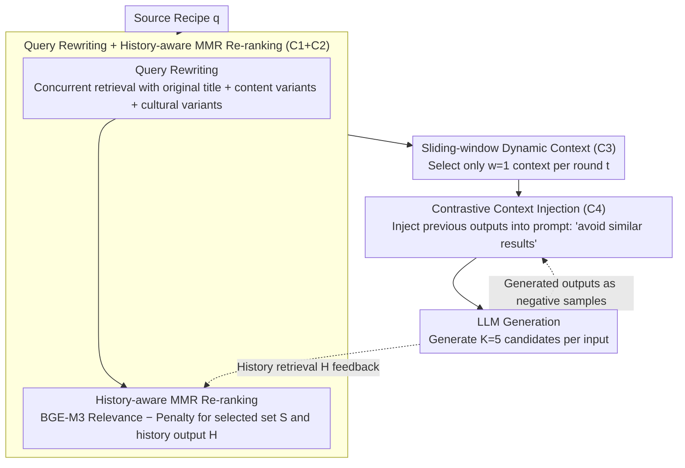

# Culinary Crossroads: A RAG Framework for Enhancing Diversity in Cross-Cultural Recipe Adaptation

**Conference**: ACL 2026  
**arXiv**: [2507.21934](https://arxiv.org/abs/2507.21934)  
**Code**: <https://github.com/TenneyHu/CARRIAGE>  
**Area**: Recommendation / RAG / Cross-cultural Generation  
**Keywords**: Cross-cultural recipe adaptation, RAG, diversity, MMR, contrastive context, CultureScore

## TL;DR
Authors observe that standard RAG "produces non-diverse outputs even when given diverse contexts" in creative tasks. They design CARRIAGE, a plug-and-play framework featuring query rewriting, diversity-aware MMR re-ranking, sliding-window dynamic context, and contrastive context injection. This framework effectively transfers "contextual diversity" to "output diversity," improving lexical/semantic/ingredient diversity and CultureScore in Spanish cross-national recipe adaptation, achieving Pareto efficiency compared to closed-book LLMs.

## Background & Motivation
**Background**: Cross-cultural recipe adaptation involves rewriting source recipes into versions suitable for a target culture—preserving the "soul" of the original dish while aligning with target dietary habits. Existing works (Cao et al. 2024, Hu et al. 2024, Pandey et al. 2025) treat this as a cross-cultural translation task using prompt-based LLMs or Information Retrieval (CARROT) to fetch authentic recipes from the target culture.

**Limitations of Prior Work**: Previous work focused solely on "quality," with little attention to "diversity." However, in reality, adapting a Mexican Nopal dish to a Spanish kitchen allows for multiple valid substitutions (spinach, asparagus, green beans, etc.), and user preferences vary significantly. A recipe adaptation system should provide multiple reasonable outputs for a single input. When applying RAG to such creative tasks with "multiple valid answers," the authors discovered that RAG outputs are actually less diverse than closed-book LLMs, even when provided with diverse contexts.

**Key Challenge**: The classic RAG design assumes a 1-to-1 factual mapping between "context → output," but creative tasks require a 1-to-many mapping. LLMs tend to focus on and copy from a single segment while ignoring others (lost-in-the-middle) in diverse contexts. Combined with the retriever repeatedly returning similar results for the same query, output diversity is doubly suppressed.

**Goal**: (1) Verify if standard RAG can produce diverse outputs under diverse contexts; (2) Design automatic evaluation metrics balancing quality and diversity; (3) Propose a plug-and-play RAG framework that effectively transfers contextual diversity to output diversity.

**Key Insight**: Diversity suppression is decomposed into four independent failure points: C1 (retrieval omission due to cultural gaps), C2 (lack of diversity awareness in ranking), C3 (concentrated utilization of limited context by LLMs), and C4 (diversity-unaware generation). Each "C" is addressed by a lightweight component.

**Core Idea**: Construct CARRIAGE (Cultural-Aware Recipe Retrieval Augmented GEneration): query rewriting + history-aware MMR re-ranking + sliding-window dynamic context organization + contrastive context injection. Each step addresses one specific failure point. The process is training-free and compatible with any LLM.

## Method

### Overall Architecture
CARRIAGE addresses the "diversity collapse of standard RAG in creative tasks" by decomposing it into four failure points (C1-C4). Given a source recipe $q$, it sequentially undergoes four stages: query rewriting, history-aware MMR re-ranking, sliding-window dynamic context, and contrastive context injection to generate $K=5$ adaptation candidates. Outputs generate in each round are fed back into the MMR history set and as negative samples for contrastive injection, forming a session-level de-duplication loop.

### Key Designs

**1. Query Rewriting + Historical-MMR Re-ranking: Expanding retrieval coverage and cross-round uniqueness (C1+C2)**

Cultural differences cause single-query retrieval to be incomplete, and pure relevance ranking repeatedly pushes the same recipes to the top. CARRIAGE uses an LLM to rewrite the source title into two variants (one content-based, one target-culture adapted), resulting in three concurrent queries to broaden retrieval. It then uses BGE-M3 for relevance scoring and extends the classic MMR to simultaneously penalize similarity with the "currently selected set $S$" and the "historical RAG output set $H$":

$$\text{Score}(D_i) = \max_{D_i \in R \setminus S} \left[\lambda \cdot \text{Rel}(D_i) - (1-\lambda) \cdot \max_{D_j \in S \cup H} \text{Sim}(D_i, D_j)\right], \quad \lambda=0.6$$

Integrating the "history set $H$" is a key innovation: while pure MMR ensures uniqueness within a single top-$k$ set, the history term prevents the system from repeatedly retrieving the same documents across multiple generation rounds, forcing the retrieval of new, unconsumed cultural variations.

**2. Dynamic Context Organization: Distributing context at the input level to transfer diversity (C3)**

Even with diverse retrieval, LLMs often copy from only 1-2 segments—a "creative version" of lost-in-the-middle. Instead of assuming the model can learn to utilize context uniformly, CARRIAGE ensures each round sees different context: for $k$ contexts $\mathcal{C} = \{D_1, \ldots, D_k\}$, the $t$-th generation round uses a sliding window to select $w$ contexts $\mathcal{C}_{\text{reference}}^{(t)} = \{D_{tw+1}, \ldots, D_{(t+1)w}\}$. With $k=5, w=1$, five rounds see entirely different single contexts.

Probing experiments (Table 2) show that in Vanilla RAG, ~76% of cases primarily rely on 1-2 contexts (average switch of 1.78). While CARROT-MMR increases this to 1.90, CARRIAGE reaches 2.67 (>40% increase), proving that "forced windowing at the input" is more reliable than "internal LLM decision-making."

**3. Contrastive Context Injection: Providing "negative-sample" signals at the prompt level (C4)**

Since post-trained LLMs naturally have sharp output distributions, increasing temperature alone is insufficient for diversity. When generating a new candidate for the same source recipe, CARRIAGE injects previously generated outputs into the prompt with an explicit instruction to "avoid generating similar results." This provides a "push" away from existing outputs without changing LLM parameters, acting as a lightweight, prompt-level diversity-promoting decoding strategy.

### Loss & Training
The framework is entirely training-free. Key hyperparameters include: temperature=0.7, $k=5$ (retrieved documents), $w=1$ (window size), $\lambda=0.6$ (MMR diversity weight), and $K=5$ (generation rounds per input). Retrieval uses JINA-ES dense vectors, and re-ranking uses BGE-M3. Base LLMs include LLaMA-3.1-8B and Qwen-2.5-7B.

## Key Experimental Results

### Main Results
Dataset: RecetasDeLaAbuel@ (Spanish recipe set), 500 source recipes (from 7 Latin American countries) adapted to Spain's style, with a retrieval corpus of 9,381 Spanish recipes. All methods generate 5 candidates per input to calculate per-input diversity (selection from Table 1):

| Category | Method | Lexical↑ | Ingredient↑ | Semantic↑ | CultureScore↑ | BERTScore↑ |
|------|------|----------|-------------|-----------|---------------|------------|
| Closed-book | Llama3.1-8B | 0.557 | 0.667 | 0.232 | 0.451 | 0.404 |
| Closed-book | Qwen2.5-7B | 0.551 | 0.531 | 0.247 | 0.404 | 0.439 |
| IR | CARROT-MMR | 0.741 | 0.941 | 0.527 | 0.503 | 0.298 |
| RAG | Vanilla-LLaMA RAG | 0.518 | 0.748 | 0.155 | 0.383 | 0.551 |
| **Ours** | **CARRIAGE–LLaMA** | **0.577** | 0.739 | **0.269** | **0.463** | 0.442 |
| **Ours** | **CARRIAGE–Qwen** | **0.628** | 0.676 | **0.303** | **0.590** | 0.342 |

Key Findings: (1) IR provides highest diversity/CultureScore but lowest BERTScore (~0.30), indicating it treats it as a different dish entirely; (2) Vanilla RAG shows the lowest semantic diversity (0.155), confirming the "diversity collapse"; (3) CARRIAGE-LLaMA is Pareto dominant over LLaMA closed-book—improving lexical (0.518→0.577), semantic (0.155→0.269), and CultureScore (0.383→0.463) while maintaining a higher BERTScore (0.442); (4) CARRIAGE-Qwen reaches the highest CultureScore (0.590).

### Ablation Study
Removing any component (query rewriting, context organization, contrastive context) degrades the Pareto frontier. Probing distribution of context switches (Table 2):

| Method | #1 (Always same context) | #2 | #3 | #4 | #5 (New context every round) | Avg. Switches |
|------|-------------------------|-----|-----|-----|-------------------|---------------|
| Vanilla RAG | 204 | 209 | 78 | 9 | 0 | 1.78 |
| CARROT-MMR RAG | 180 | 201 | 108 | 11 | 0 | 1.90 |
| **CARRIAGE RAG** | **40** | 178 | 202 | 67 | 13 | **2.67** |

Simply providing more diverse contexts (CARROT-MMR) only marginally increases switching (1.78→1.90). Dynamic context organization in CARRIAGE significantly boosts it to 2.67, with non-zero samples appearing in the #4 and #5 buckets.

### Key Findings
- **"Diversity Collapse in Standard RAG" is a widespread phenomenon**: Vanilla-LLaMA RAG's semantic diversity (0.155) is lower than closed-book Llama (0.232) because the model copies directly from retrieval.
- **Per-input diversity correlates positively with CultureScore but negatively with BERTScore**: Preserving the source dish makes cultural adaptation harder. CARRIAGE balances these effectively.
- **CultureScore aligns with human evaluation ($\kappa=0.59$)**, proving this BERT-based metric is a reliable proxy.
- **Global diversity (across-input) actually decreases**: All methods tend to use high-frequency ingredients more often; per-input diversity does not equal global diversity.

## Highlights & Insights
- **Diagnostic Decomposition**: Breaking the problem into C1-C4 allows for clear, modular solutions and interpretable ablation studies.
- **Historical-MMR**: Extending MMR to include historical output $H$ is a simple yet powerful upgrade for any session-level diversity scenario.
- **Handling Selective Consumption**: Identifying that LLMs selectively use context (LiM in creative tasks) and bypassing it with input-level windowing is more reliable and cheaper than specialized decoding.
- **CultureScore Metric**: Using a classifier's target-country probability as a score bypasses language cues and focuses on features like ingredients and flavor.

## Limitations & Future Work
- **Limitations**: Restricted to Spanish-speaking cross-national adaptation; limited to 7-9B open-source models; lack of human evaluation on recipe quality; global diversity still needs improvement.
- **Refinement Ideas**: Use prompts to penalize high-frequency ingredients for better global diversity; replace sliding windows with randomized sampling; use reservoir sampling for historical sets; test on high-variance language pairs (e.g., Chinese-English).

## Related Work & Insights
- **vs. CARROT**: CARROT focuses on retrieval results; CARRIAGE adds a RAG generation layer with four diversity components to transfer retrieval diversity to output.
- **vs. Classic MMR**: CARRIAGE extends MMR from single-query deduplication to cross-session generation by adding historical penalty terms.
- **vs. Lost-in-the-middle**: LiM focuses on position-based information loss; CARRIAGE focuses on the failure of uniform context utilization in creative tasks, offering a prompt-level mitigation.

## Rating
- Novelty: ⭐⭐⭐⭐ First to explicitly target RAG diversity; clear C1-C4 diagnostic methodology.
- Experimental Thoroughness: ⭐⭐⭐⭐ Excellent coverage of baselines, backbones, and sensitivity analysis; lacks human quality evaluation.
- Writing Quality: ⭐⭐⭐⭐ Strong narrative arc from problem identification to Pareto-efficient solution.
- Value: ⭐⭐⭐⭐ Provides a plug-and-play toolkit for creative RAG tasks with low implementation barriers.

<!-- RELATED:START -->

## Related Papers

- [\[AAAI 2026\] From IDs to Semantics: A Generative Framework for Cross-Domain Recommendation with Adaptive Semantic Tokenization](../../AAAI2026/recommender/from_ids_to_semantics_a_generative_framework_for_cross-domain_recommendation_wit.md)
- [\[ACL 2026\] GraphLoRA: Structure-Aware Low-Rank Adaptation for Large Language Model Recommendation](graphlora_structure-aware_low-rank_adaptation_for_large_language_model_recommend.md)
- [\[AAAI 2026\] CroPS: Improving Dense Retrieval with Cross-Perspective Positive Samples in Short-Video Search](../../AAAI2026/recommender/crops_improving_dense_retrieval_with_cross-perspective_positive_samples_in_short.md)
- [\[ACL 2026\] SenseJudge: Human-Centric Preference-Driven Judgment Framework](sensejudge_human-centric_preference-driven_judgment_framework.md)
- [\[ACL 2026\] Personalizing LLMs with Binary Feedback: A Preference-Corrected Optimization Framework](personalizing_llms_with_binary_feedback_a_preference-corrected_optimization_fram.md)

<!-- RELATED:END -->
